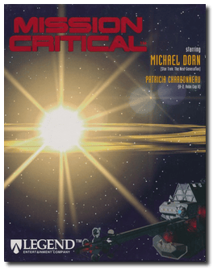
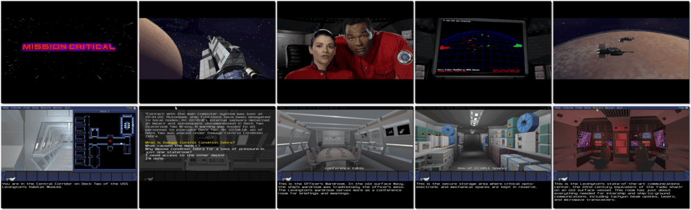

# Mission Critical

> ❝ After a savage battle in deep space, you are the only survivor aboard the USS Lexington, a badly damaged heavy cruiser. Your mission is to repair the hobbled ship and fend off the upcoming onslaught. Only then can you venture to an unexplored world 68 light years from Earth and discover the secret that could save the universe from interplanetary war. ❞
>
> ❝ This game **is not abandonware 🚫** and is still for sale on [GOG 💰](https://gog.com/en/game/mission_critical) and [Steam 💰](https://store.steampowered.com/app/1006460/Mission_Critical/). ❞
>

📌 ┃ **Year** ‣ 1995 ┃ **Genre** ‣ Adventure ┃ **Platform** ‣ DOS ┃ **License** ‣ Proprietary ┃ **Category** ‣ 1st-person • Real-time • Graphic adventure • Post-apocalyptic • Sci-fi ┃ **Media** ‣ CD-ROM 

📦 ┃ **[DOSBox](https://www.dosbox.com/) 🟩** ┃ **[DOSBox Staging](https://dosbox-staging.github.io/) 🟩** ┃ **[DOSBox-X](https://dosbox-x.com/) 🟩** 

📎 ┃ **[Wikipedia](https://en.wikipedia.org/wiki/Mission_Critical_(video_game))** ┃ **[MobyGames](https://www.mobygames.com/game/1651/mission-critical/)** ┃ **[AbandonwareDOS](https://www.abandonwaredos.com/abandonware-game.php?abandonware=Mission+Critical&gid=2457)** ┃ **[MyAbandonware](https://www.myabandonware.com/game/mission-critical-a36)** ┃ **[GOG 💰](https://gog.com/en/game/mission_critical)** ┃ **[Steam 💰](https://store.steampowered.com/app/1006460/Mission_Critical/)** 

## Installation Notes
- Installation Options: **Optimum Performance Installation**.
- Use the default **drive** and **directory** for the installation location.
  - Select and configure MIDI music driver: **Creative Labs Sound Blaster(TM) 16** (*Attempt to configure sound driver automatically*).
  - Select and configure digital audio driver: **Creative Labs Sound Blaster 16 or AWE32** (*Attempt to configure sound driver automatically*).

## Additional Notes
- Mounted CD-ROM images at launch:
  1. Mission Critical Disc #1
  2. Mission Critical Disc #2
  3. Mission Critical Disc #3

### How to swap CD-ROM images?
- [DOSBox](https://www.dosbox.com/wiki/DOSBox_FAQ#Swapping_CD_images) — Hotkey: CTRL+F4
- [DOSBox Staging](https://github.com/dosbox-staging/dosbox-staging/blob/main/README) — Hotkey: CTRL+F4 (or CMD+F4 on macOS)
- [DOSBox-X](https://dosbox-x.com/wiki/Guide%3AManaging-image-files-in-DOSBox%E2%80%90X#_mounting_multiple_cd_or_dvd_images) — Hotkey: F11+CTRL+C (or F12+D on macOS). Menu: DOS > Swap CD drive.

