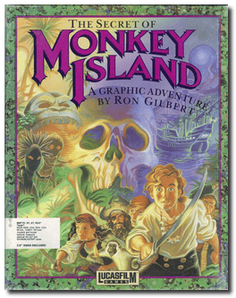
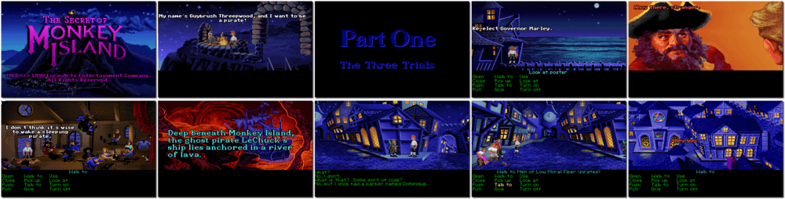

# The Secret of Monkey Island

「**Mutiny on Monkey Island**」「**Monkey Island 1**」

> ❝ Welcome to the Port of Melee, Mr Guybrush Threepwood. So you think you've got what it takes to be a swashbucklin', bloodthirsty pirate like the rest of us? Do you think a young swabby like yourself to be the first to tame mysterious Monkey Island? Well, laddy, there's more to being a buccaneer than just swinging a sword and swillin' gallons of Grog. First, you got to pass the Seadog test. Good luck! You are going to need it. ❞
>
> ❝ This version is the original/legacy release for DOS. This game **is not abandonware 🚫** and a **Special Edition** release is available on [GOG 💰](https://www.gog.com/en/game/the_secret_of_monkey_island_special_edition). ❞
>

📌 ┃ **Year** ‣ 1990 ┃ **Genre** ‣ Adventure ┃ **Platform** ‣ DOS ┃ **License** ‣ Proprietary ┃ **Category** ‣ 3rd-person • Graphic adventure • Puzzle elements • Fantasy • Sea pirates • Comedy ┃ **Media** ‣ Compressed Package 

📦 ┃ **[DOSBox](https://www.dosbox.com/) 🟩** ┃ **[DOSBox Staging](https://dosbox-staging.github.io/) 🟩** ┃ **[DOSBox-X](https://dosbox-x.com/) 🟩** 

📎 ┃ **[Wikipedia](https://en.wikipedia.org/wiki/The_Secret_of_Monkey_Island)** ┃ **[MobyGames](https://www.mobygames.com/game/141074/the-secret-of-monkey-island-enhanced-version/)** ┃ **[AbandonwareDOS](https://www.abandonwaredos.com/abandonware-game.php?abandonware=The+Secret+of+Monkey+Island&gid=1082)** ┃ **[MyAbandonware](https://www.myabandonware.com/game/the-secret-of-monkey-island-1ni)** ┃ **[Fandom](https://monkeyisland.fandom.com/wiki/The_Secret_of_Monkey_Island)** ┃ **[Series](https://en.wikipedia.org/wiki/Monkey_Island)** ┃ **Special Edition** ‣ [GOG 💰](https://www.gog.com/en/game/the_secret_of_monkey_island_special_edition) 

## Additional Notes
- Hotkey: CTRL+T to switch between Voice only, Voice + Text, and Text only.

