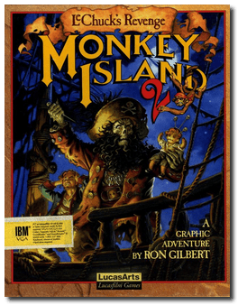
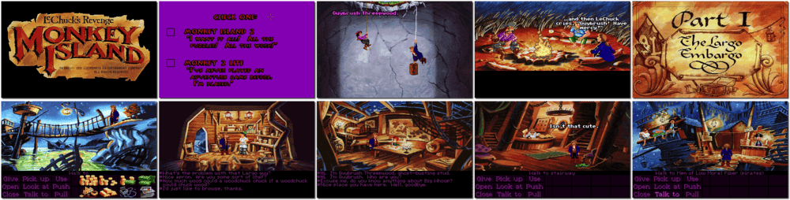

# Monkey Island 2: LeChuck's Revenge

「**The Secret of Monkey Island 2**」「**Monkey Island 2**」

> ❝ I thought I had killed the Ghost Pirate LeChuck for good. Wrong. How many times can that bloated old fool die? Other pirates tell me there's no escape. "When LeChuck wants you dead, you're dead", they say. Legend has it that the treasure of Big Whoop holds the key to great power. I must find it before LeChuck finds me. ❞
>
> ❝ This version is the original/legacy release for DOS. This game **is not abandonware 🚫**. A **Special Edition** release is available on [GOG 💰](https://www.gog.com/en/game/monkey_island_2_special_edition_lechucks_revenge). ❞
>

📌 ┃ **Year** ‣ 1991 ┃ **Genre** ‣ Adventure ┃ **Platform** ‣ DOS ┃ **License** ‣ Proprietary ┃ **Media** ‣ Compressed Package 

📦 ┃ **[DOSBox](https://www.dosbox.com/) 🟩** ┃ **[DOSBox Staging](https://dosbox-staging.github.io/) 🟩** ┃ **[DOSBox-X](https://dosbox-x.com/) 🟩** 

📎 ┃ **[Wikipedia](https://en.wikipedia.org/wiki/Monkey_Island_2:_LeChuck%27s_Revenge)** ┃ **[MobyGames](https://www.mobygames.com/game/289/monkey-island-2-lechucks-revenge/)** ┃ **[MyAbandonware](https://www.myabandonware.com/game/monkey-island-2-lechuck-s-revenge-1nh)** ┃ **[Series](https://en.wikipedia.org/wiki/Monkey_Island)** ┃ **Special Edition** ‣ [GOG 💰](https://www.gog.com/en/game/monkey_island_2_special_edition_lechucks_revenge) 

## Additional Notes
- Hotkey: CTRL+T to switch between Voice only, Voice + Text, and Text only.

---

