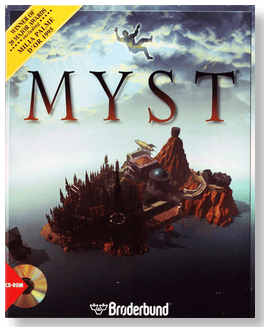
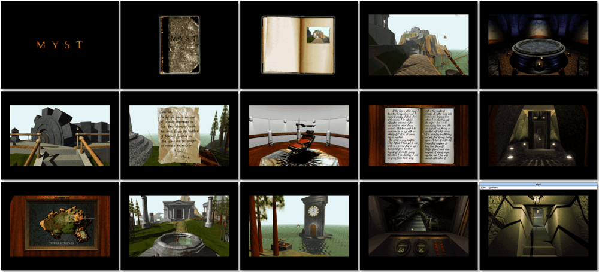

# Myst

> ❝ Journey to an island world surrealistically tinged with mystery, where every vibrant rock, a scrap of paper, and sound may hold vital clues to your unravelling a chilling tale of intrigue and injustice that defies all boundaries of time and space. Only your wits and imagination will serve to stay the course and unlock the ancient betrayal of ages past. ❞
>
> ❝ This game **is not abandonware 🚫**. A **Masterpiece Edition** release is available on [GOG 💰](https://www.gog.com/en/game/myst_masterpiece_edition) and [Steam 💰](https://store.steampowered.com/app/63660/Myst_Masterpiece_Edition/). ❞
>

📌 ┃ **Year** ‣ 1994 ┃ **Genre** ‣ Adventure ┃ **Platform** ‣ Windows 3.1x ┃ **License** ‣ Proprietary ┃ **Media** ‣ CD-ROM 

📦 ┃ **[DOSBox](https://www.dosbox.com/) 🟩** ┃ **[DOSBox Staging](https://dosbox-staging.github.io/) 🟩** ┃ **[DOSBox-X](https://dosbox-x.com/) 🟩** 

📎 ┃ **[Wikipedia](https://en.wikipedia.org/wiki/Myst)** ┃ **[MobyGames](https://www.mobygames.com/game/1223/myst/)** ┃ **[MyAbandonware](https://www.myabandonware.com/game/myst-3nm)** ┃ **[Series](https://en.wikipedia.org/wiki/Myst_(series))** ┃ **Masterpiece Edition** ‣ [GOG 💰](https://www.gog.com/en/game/myst_masterpiece_edition) ┃ **Masterpiece Edition** ‣ [Steam 💰](https://store.steampowered.com/app/63660/Myst_Masterpiece_Edition/) 

## Installation Notes
- Use the default **drive** and **directory** for the installation location.
- Do not install *QuickTime*. Click **Exit** when prompted. Your Windows 3.1x has the most recent version.
- Exit Windows and DOSBox once the installation is complete (**Program Manager > File > Exit Windows**) and rerun the `Launch` script to start the program.

---

