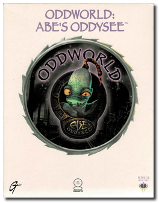
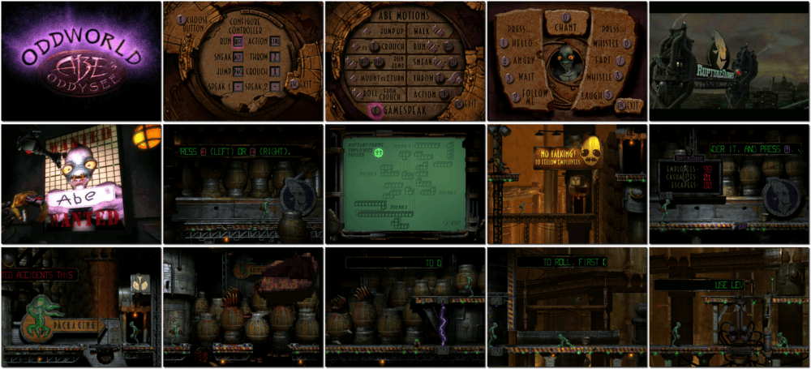

# Oddworld: Abe's Oddysee

「**SoulStorm**」

> ❝ As Abe, you can whistle, laugh, hiss, and fart. In a lush world of diabolical danger where everyone wants to eat you, you are the skinny guy with no weapons. Run, jump, hide, scramble and talk your way past the ugliest bunch of carnivorous crustaceans ever created. Unlock your special powers to figure out your foes, and you might save your race. If not, you are for dinner! Enter Oddworld, a surreal, sensory overload of pure gaming and claim your destiny. Saviour. Or salami. ❞
>

📌 ┃ Year: **1997** ┃ Genre: **Action • Puzzle** ┃ Platform: **DOS** ┃ License: **Proprietary** ┃ Category: **Side view • Platform • Cyberpunk • Sci-fi** ┃ Media: **CD-ROM** 

📦 ┃ [DOSBox](https://www.dosbox.com/): **0.74-3 🟨** ┃ **[DOSBox Staging](https://dosbox-staging.github.io/) 🟩** ┃ **[DOSBox-X](https://dosbox-x.com/) 🟩** 

📎 ┃ **[Wikipedia](https://en.wikipedia.org/wiki/Oddworld:_Abe%27s_Oddysee)** ┃ **[Wikipedia - Oddworld Series](https://en.wikipedia.org/wiki/Oddworld)** ┃ **[MobyGames](https://www.mobygames.com/game/1058/oddworld-abes-oddysee/)** ┃ **[MyAbandonware](https://www.myabandonware.com/game/oddworld-abe-s-oddysee-cqh)** ┃ **[Oddworld Fandom - Oddworld: Abe's Oddysee](https://oddworld.fandom.com/wiki/Oddworld:_Abe%27s_Oddysee)** ┃ **[GOG 💰](https://www.gog.com/en/game/oddworld_abes_oddysee)** ┃ **[Steam 💰](https://store.steampowered.com/app/15700/Oddworld_Abes_Oddysee/)** ┃ **[Zoom 💰](https://www.zoom-platform.com/product/oddworld-abes-oddysee)** 

## Installation Notes
- Sound Configuration Utility:
  - Select and configure MIDI music driver: **Creative Labs Sound Blaster(TM)** (*Attempt to configure sound driver automatically*).
  - Select and configure digital audio driver: **Creative Labs Sound Blaster 16 or AWE32** (*Attempt to configure sound driver automatically*).

## Licensing Information
- This game **is not abandonware 🚫** and is still for sale on [GOG 💰](https://www.gog.com/en/game/oddworld_abes_oddysee), [Steam 💰](https://store.steampowered.com/app/15700/Oddworld_Abes_Oddysee/), and [Zoom 💰](https://www.zoom-platform.com/product/oddworld-abes-oddysee).

## Known Issues
- DOSBox 0.74-3 🟨 — Odd vertical lines appear on the menu and during gameplay.

