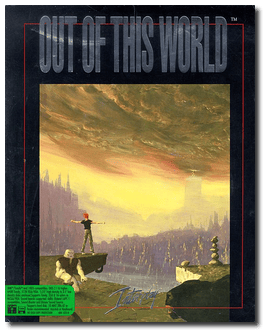
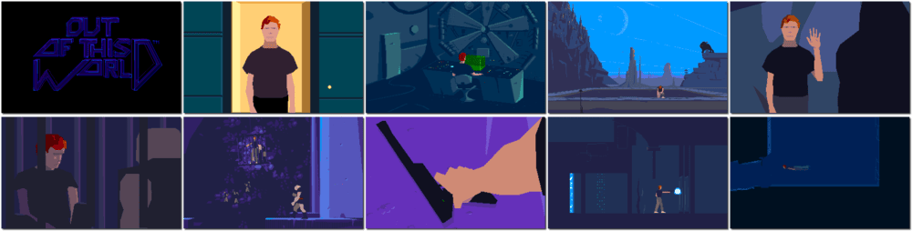

# Out of This World

「**Another World**」「**Outer World**」

> ❝ There was only one chance out of one million such an accident could happen. As for the consequences, nobody could have foreseen them. Certainly not Lester, who finds himself lost in an unknown and utterly hostile world. However, he will rediscover the genuine meaning of freedom won by fighting, the feeling that each day is a new victory. ❞
>
> ❝ This game **is not abandonware 🚫** and is still for sale on [GOG 💰](https://www.gog.com/en/game/another_world_20th_anniversary_edition). ❞
>

📌 ┃ **Year** ‣ 1991 ┃ **Genre** ‣ Action ┃ **Platform** ‣ DOS ┃ **License** ‣ Proprietary ┃ **Media** ‣ Compressed Package 

📦 ┃ **[DOSBox](https://www.dosbox.com/) 🟩** ┃ **[DOSBox Staging](https://dosbox-staging.github.io/) 🟩** ┃ **[DOSBox-X](https://dosbox-x.com/) 🟩** 

📎 ┃ **[Wikipedia](https://en.wikipedia.org/wiki/Another_World_(video_game))** ┃ **[MobyGames](https://www.mobygames.com/game/564/out-of-this-world/)** ┃ **[MyAbandonware](https://www.myabandonware.com/game/out-of-this-world-18g)** ┃ **[GOG 💰](https://www.gog.com/en/game/another_world_20th_anniversary_edition)** 

## Installation Notes
- Graphics Adapter: **VGA Card**.
- Sound Device: **Sound Blaster Card at 10 KHz ( fast machine )**.
- Moves: **Keyboard**.

## Additional Notes
- A memory manager has been detected that may impair performance: Press `1` to proceed.

---

