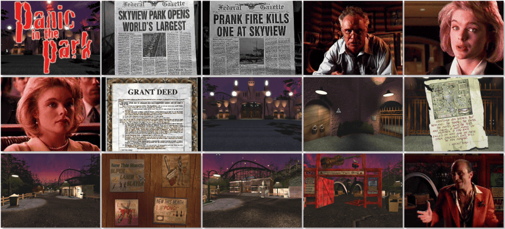

# Panic in the Park

> ❝ A set of twins - one virtuous, one diabolical, both beautiful - are fighting for the fate of the aging Skyview amusement park, operated by the twin's father until his recent death. But there's more behind the park's gates than first meets the eye. As a reporter, you must navigate a complex web of intrigue to get to the heart of the mystery. It's up to you to help the twins find the park's missing deed by morning to save it from destruction. ❞
>

📌 ┃ **Year** ‣ 1995 ┃ **Genre** ‣ Adventure ┃ **Platform** ‣ Windows 3.1x ┃ **License** ‣ Abandonware ┃ **Media** ‣ CD-ROM ┃ **No Manual** 

📦 ┃ **[DOSBox](https://www.dosbox.com/) 🟩** ┃ **[DOSBox Staging](https://dosbox-staging.github.io/) 🟩** ┃ **[DOSBox-X](https://dosbox-x.com/) 🟩** 

📎 ┃ **[Wikipedia](https://en.wikipedia.org/wiki/Panic_in_the_Park)** ┃ **[MobyGames](https://www.mobygames.com/game/14349/panic-in-the-park/)** ┃ **[MyAbandonware](https://www.myabandonware.com/game/panic-in-the-park-fga)** 

## Installation Notes
- Use the default **drive** and **directory** for the installation location.
- Install *Microsoft Video for Windows 1.1e* when prompted.
- Exit Windows and DOSBox once the installation is complete (**Program Manager ‣ File ‣ Exit Windows**) and rerun the `Launch` script to start the program.

## Additional Notes
- Mounted CD-ROM images at launch:
  1. Panic in the Park Disc #1
  2. Panic in the Park Disc #2
  3. Panic in the Park Disc #3

### How to swap CD-ROM images?
- [DOSBox](https://www.dosbox.com/wiki/DOSBox_FAQ#Swapping_CD_images) — Hotkey: CTRL+F4
- [DOSBox Staging](https://github.com/dosbox-staging/dosbox-staging/blob/main/README) — Hotkey: CTRL+F4 (or CMD+F4 on macOS)
- [DOSBox-X](https://dosbox-x.com/wiki/Guide%3AManaging-image-files-in-DOSBox%E2%80%90X#_mounting_multiple_cd_or_dvd_images) — Hotkey: F11+CTRL+C (or F12+D on macOS). Menu: DOS ‣ Swap CD drive.

---

