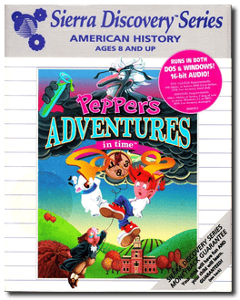

# Pepper's Adventures in Time

「**Twisty History**」

> ❝ Pepper has a big problem. Her Uncle Fred, the family's scientist, has scrambled colonial America into one big hysterical, historical omelette! The British are about to win the war this time unless you can set the facts straight! If you want help with this sticky situation, talk to Ben Franklin, but be careful! Uncle Fred's confused him, too! You'll have to help Ben out, or the world will never know Ben. You'll be amazed by his wisdom and cracked up by his sense of humour! It is too much for one kid to handle, so Pepper brought some backup - her mischievous mutt, Lockjaw. You'll get to play as a dog! Do all the doggie things you've always wanted to try. Sniff out mysteries. Dig holes. Chew things up. BITE PEOPLE! ❞
>

📌 ┃ **Year** ‣ 1993 ┃ **Genre** ‣ Adventure • Educational ┃ **Platform** ‣ DOS ┃ **License** ‣ Abandonware ┃ **Media** ‣ Compressed Package 

📦 ┃ **[DOSBox](https://www.dosbox.com/) 🟩** ┃ **[DOSBox Staging](https://dosbox-staging.github.io/) 🟩** ┃ **[DOSBox-X](https://dosbox-x.com/) 🟩** 

📎 ┃ **[Wikipedia](https://en.wikipedia.org/wiki/Pepper%27s_Adventures_in_Time)** ┃ **[MobyGames](https://www.mobygames.com/game/6312/peppers-adventures-in-time/)** ┃ **[MyAbandonware](https://www.myabandonware.com/game/pepper-s-adventures-in-time-1ws)** 

---

