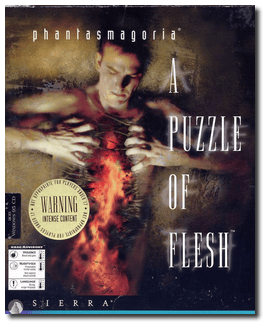
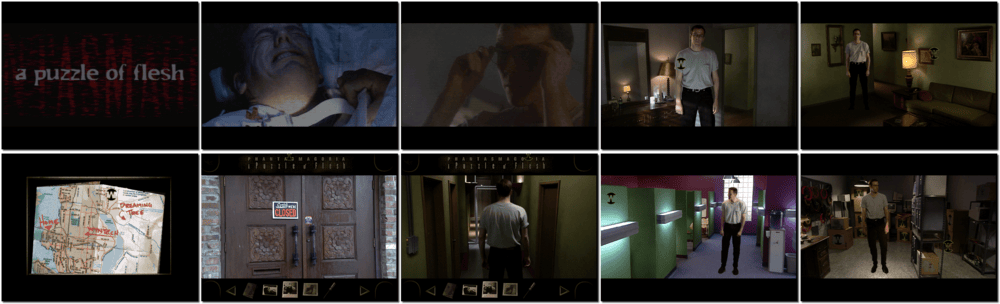

# Phantasmagoria 2: A Puzzle of Flesh

「**Phantasmagoria: A Puzzle of Flesh**」「**Phantasmagoria 2**」

> ❝ Curtis Craig is a quiet young man. He has a steady job and a lovely girlfriend. He's been out of the mental hospital for exactly one year. All Curtis wants is to live a decent life, but something seems to have other plans. Strange, inexplicable, and terrifying events start happening, making him doubt his sanity. Then, the murders start, with evidence pointing directly to Curtis. Propelled by desperation and ravening madness, he will discover a bizarre secret beyond human comprehension. ❞
>
> ❝ This game **is not abandonware 🚫** and is still for sale on [GOG 💰](https://www.gog.com/en/game/phantasmagoria_2) and [Steam 💰](https://store.steampowered.com/app/501970/Phantasmagoria_2_A_Puzzle_of_Flesh/). ❞
>

📌 ┃ **Year** ‣ 1996 ┃ **Genre** ‣ Adventure ┃ **Platform** ‣ DOS ┃ **License** ‣ Proprietary ┃ **Media** ‣ CD-ROM ┃ **Patched** ‣ Windows 95 to DOS 

📦 ┃ **[DOSBox](https://www.dosbox.com/) 🟩** ┃ **[DOSBox Staging](https://dosbox-staging.github.io/) 🟩** ┃ **[DOSBox-X](https://dosbox-x.com/) 🟩** 

📎 ┃ **[Wikipedia](https://en.wikipedia.org/wiki/Phantasmagoria:_A_Puzzle_of_Flesh)** ┃ **[MobyGames](https://www.mobygames.com/game/1216/phantasmagoria-a-puzzle-of-flesh/)** ┃ **[MyAbandonware](https://www.myabandonware.com/game/phantasmagoria-a-puzzle-of-flesh-csm)** ┃ **[GOG 💰](https://www.gog.com/en/game/phantasmagoria_2)** ┃ **[Steam 💰](https://store.steampowered.com/app/501970/Phantasmagoria_2_A_Puzzle_of_Flesh/)** 

## Installation Notes
- Installation involves converting Windows 95 version of the game to DOS.
  - Please type the drive letter of your CD-ROM. Press `D`.
  - Please type the letter of the hard drive... Press `C`.
  - Use the default **directory** for the installation location. Press `ENTER`.
  - Please select how much hard disk space you would like to use: Press `L`.
- Accept these choices and begin installation.
- Optional: Intense password lock. Enter password or press `ENTER` for none.

## Additional Notes
- Mounted CD-ROM images at launch:
  1. Phantasmagoria: A Puzzle of Flesh Disc #1
  2. Phantasmagoria: A Puzzle of Flesh Disc #2
  3. Phantasmagoria: A Puzzle of Flesh Disc #3
  4. Phantasmagoria: A Puzzle of Flesh Disc #4
  5. Phantasmagoria: A Puzzle of Flesh Disc #5

### How to swap CD-ROM images?
- [DOSBox](https://www.dosbox.com/wiki/DOSBox_FAQ#Swapping_CD_images) — Hotkey: CTRL+F4
- [DOSBox Staging](https://github.com/dosbox-staging/dosbox-staging/blob/main/README) — Hotkey: CTRL+F4 (or CMD+F4 on macOS)
- [DOSBox-X](https://dosbox-x.com/wiki/Guide%3AManaging-image-files-in-DOSBox%E2%80%90X#_mounting_multiple_cd_or_dvd_images) — Hotkey: F11+CTRL+C (or F12+D on macOS). Menu: DOS > Swap CD drive.

---

