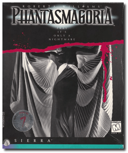
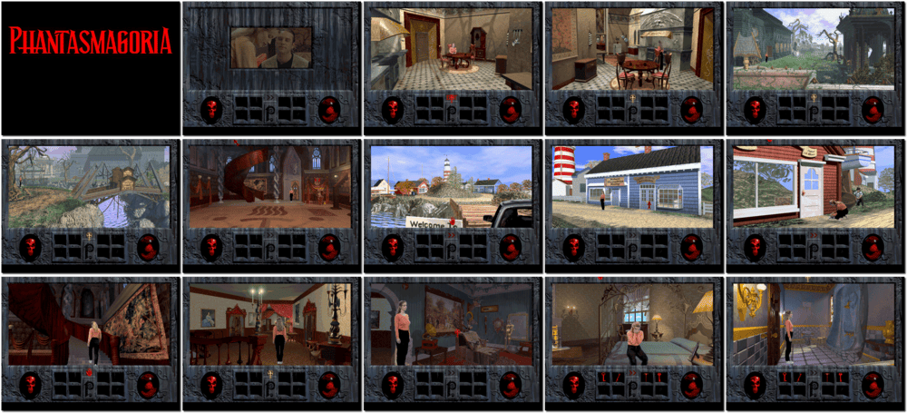

# Phantasmagoria

「**Roberta Williams' Phantasmagoria**」

> ❝ It seemed like a dream come true for Adrienne Delaney and Don Gordon. A beautiful mansion on its own private island. The perfect place to build a life together. But an ominous presence lurks within the halls, the rooms, and every passageway of this mysterious home. The previous owner, a 19th-century master illusionist, left behind a twisted trail of terror. Quickly, the blissful life Adrienne and Don hoped for begins to unravel into a terrible nightmare. With your help, Adrienne must uncover the clues and gather the objects she needs in a desperate attempt to save her husband from an insidious evil that holds him in its ever-tightening grip. Discover the mansion's hidden rooms, explore the island, and try to find the mystery man with the secret to the past. ❞
>
> ❝ This game **is not abandonware 🚫** and is still for sale on [GOG 💰](https://www.gog.com/en/game/phantasmagoria) and [Steam 💰](https://store.steampowered.com/app/501990/Phantasmagoria/). ❞
>

📌 ┃ **Year** ‣ 1995 ┃ **Genre** ‣ Adventure ┃ **Platform** ‣ DOS ┃ **License** ‣ Proprietary ┃ **Category** ‣ 1st-person • 3rd-person • Horror ┃ **Media** ‣ CD-ROM ┃ **Patched** 

📦 ┃ **[DOSBox](https://www.dosbox.com/) 🟩** ┃ **[DOSBox Staging](https://dosbox-staging.github.io/) 🟩** ┃ **[DOSBox-X](https://dosbox-x.com/) 🟩** 

📎 ┃ **[Wikipedia](https://en.wikipedia.org/wiki/Phantasmagoria_(video_game))** ┃ **[MobyGames](https://www.mobygames.com/game/1164/roberta-williams-phantasmagoria/)** ┃ **[AbandonwareDOS](https://www.abandonwaredos.com/abandonware-game.php?abandonware=Phantasmagoria&gid=3141)** ┃ **[MyAbandonware](https://www.myabandonware.com/game/roberta-williams-phantasmagoria-32t)** ┃ **[GOG 💰](https://www.gog.com/en/game/phantasmagoria)** ┃ **[Steam 💰](https://store.steampowered.com/app/501990/Phantasmagoria/)** 

## Installation Notes
- Use the default **drive** and **directory** for the installation location.
- Accept these choices and begin installation.
- Do you want to perform hardware tests? (Y/N). Press `N`.

## Additional Notes
- Mounted CD-ROM images at launch:
  1. Phantasmagoria Disc #1
  2. Phantasmagoria Disc #2
  3. Phantasmagoria Disc #3
  4. Phantasmagoria Disc #4
  5. Phantasmagoria Disc #5
  6. Phantasmagoria Disc #6
  7. Phantasmagoria Disc #7

### How to swap CD-ROM images?
- [DOSBox](https://www.dosbox.com/wiki/DOSBox_FAQ#Swapping_CD_images) — Hotkey: CTRL+F4
- [DOSBox Staging](https://github.com/dosbox-staging/dosbox-staging/blob/main/README) — Hotkey: CTRL+F4 (or CMD+F4 on macOS)
- [DOSBox-X](https://dosbox-x.com/wiki/Guide%3AManaging-image-files-in-DOSBox%E2%80%90X#_mounting_multiple_cd_or_dvd_images) — Hotkey: F11+CTRL+C (or F12+D on macOS). Menu: DOS > Swap CD drive.

