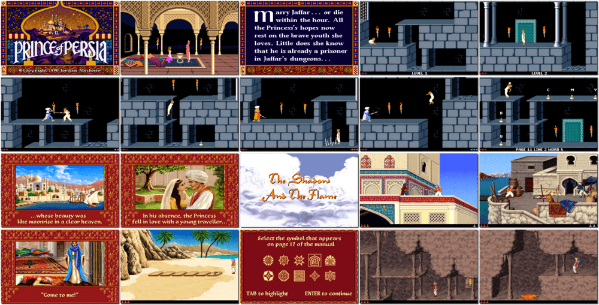

# Prince of Persia CD Collection

「**Prince of Persia 1&2**」「**Prince of Persia**」「**Prince of Persia 2: The Shadow and the Flame**」

> ❝ While the sultan is fighting a war in a foreign land, his vizier Jaffar, a wizard, seizes power. His only obstacle to the throne is Sultan's daughter. Jaffar locks her in a tower and orders her to become his wife, or she dies within 60 minutes. You are thrown prisoner into the palace dungeons. To free her, you must escape the dungeons, get to the palace tower and defeat Jaffar before time runs out. ❞ — *Prince of Persia*
>
> ❝ The evil magician Jaffar assumes your identity, steals your beloved princess, and casts you out of the palace as a beggar. With ferocious palace guards in pursuit, you flee from rooftop to rooftop, through caverns, across a desert island, passed into ruins and beyond. ❞ — *Prince of Persia 2: The Shadow and the Flame*
>

📌 ┃ **Year** ‣ 1990 ┃ **Year (The Shadow and the Flame)** ‣ 1993 ┃ **Genre** ‣ Action ┃ **Platform** ‣ DOS ┃ **License** ‣ Abandonware ┃ **Category** ‣ Side view • Platform • Puzzle elements • Middle East ┃ **Media** ‣ CD-ROM ┃ **Compilation • Copy Protection** 

📦 ┃ **[DOSBox](https://www.dosbox.com/) 🟩** ┃ **[DOSBox Staging](https://dosbox-staging.github.io/) 🟩** ┃ **[DOSBox-X](https://dosbox-x.com/) 🟩** 

📎 ┃ **Prince of Persia** ‣ [Wikipedia](https://en.wikipedia.org/wiki/Prince_of_Persia_(1989_video_game)) • [MobyGames](https://www.mobygames.com/game/196/prince-of-persia/) • [AbandonwareDOS](https://www.abandonwaredos.com/abandonware-game.php?abandonware=Prince+of+Persia&gid=551) • [MyAbandonware](https://www.myabandonware.com/game/prince-of-persia-pd) • [Prince of Persia Fandom](https://princeofpersia.fandom.com/wiki/Prince_of_Persia_(1989)) ┃ **Prince of Persia 2: The Shadow and the Flame** ‣ [Wikipedia](https://en.wikipedia.org/wiki/Prince_of_Persia_2:_The_Shadow_and_the_Flame) • [MobyGames](https://www.mobygames.com/game/78/prince-of-persia-2-the-shadow-the-flame/) • [AbandonwareDOS](https://www.abandonwaredos.com/abandonware-game.php?abandonware=Prince+of+Persia+2%3A+The+Shadow+and+the+Flame&gid=1156) • [MyAbandonware](https://www.myabandonware.com/game/prince-of-persia-2-the-shadow-the-flame-29j) • [Prince of Persia Fandom](https://princeofpersia.fandom.com/wiki/Prince_of_Persia_2:_The_Shadow_and_the_Flame) ┃ **[Wikipedia - Prince of Persia Series](https://en.wikipedia.org/wiki/Prince_of_Persia)** ┃ **[MobyGames - Prince of Persia CD Collection (1995)](https://www.mobygames.com/game/16597/prince-of-persia-cd-collection/)** 

## Installation Notes
- Installing Prince of Persia
  - Use the default **drive** and **directory** for the installation location.
  - Graphics Mode: **VGA (MCGA) 320x200 256 Color**.
  - Sound Device: **Sound Blaster / Sound Blaster Pro**; Port: **220h**.
  - Music Synthesizer: *same as above*.
- Installing Prince of Persia 2: The Shadow and the Flame
  - Use the default **drive** and **directory** for the installation location.
  - Memory Mode: **Use High Memory if available**.
  - Sound Device: **Sound Blaster**.
  - Music Synthesizer: *same as above*.

## Additional Notes
- Consult `Assets/code.jpg` for the game copy protection.

