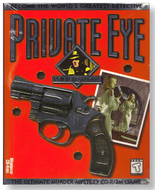
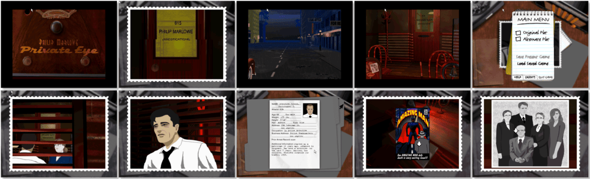

# Private Eye

「**Philip Marlowe: Private Eye**」

> ❝ Humphrey Bogart played him. Robert Mitchum played him. Now it's your turn to become Philip Marlowe, the world's most famous private eye! All other private eye games are imitations. It is the real thing, the first interactive murder mystery based on Raymond Chandler's legendary detective. Meet starlets, confront a manic mobster, and search Hollywood for clues you can take. Hundreds of interactive decisions are yours! It all starts with an innocent girl who hires you to find her missing brother, but it soon leads to a trail of greed, blackmail, revenge, deceit and murder! ❞
>

📌 ┃ **Year** ‣ 1996 ┃ **Genre** ‣ Adventure ┃ **Platform** ‣ Windows 3.1x ┃ **License** ‣ Abandonware ┃ **Media** ‣ CD-ROM 

📦 ┃ **[DOSBox](https://www.dosbox.com/)** ‣ 0.74-3 🟥 • Unplayable ┃ **[DOSBox Staging](https://dosbox-staging.github.io/)** ‣ 0.80.1 🟥 • Unplayable ┃ **[DOSBox-X](https://dosbox-x.com/) 🟩** 

📎 ┃ **[Wikipedia](https://en.wikipedia.org/wiki/Private_Eye_(1996_video_game))** ┃ **[MobyGames](https://www.mobygames.com/game/7117/private-eye/)** ┃ **Manual** ‣ [MyAbandonware 📄](https://www.myabandonware.com/game/private-eye-ddy) 

## Installation Notes
- Follow the default installation steps (Windows may require restart).
- Use the default **drive** and **directory** for the installation location.

## Additional Notes
- The `RUNEXIT.EXE` tool does not work with this program as it requires Windows 3.1x to be fully loaded.
  - Play the game by double-clicking **Private Eye** icon.

---

