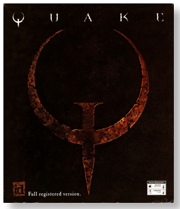
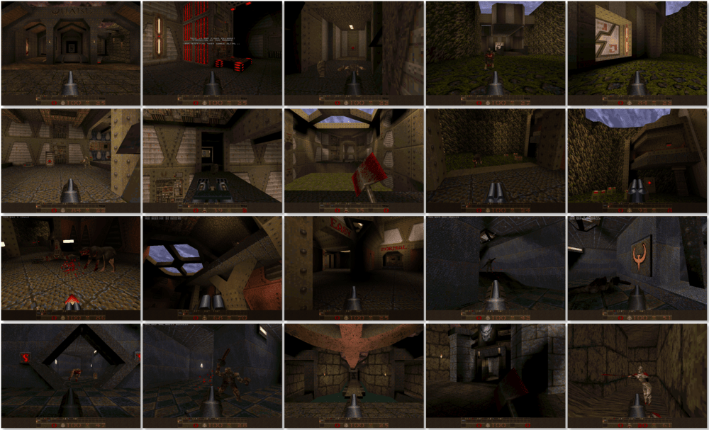

# Quake

「**Quake Mission Pack No. 1: Scourge of Armagon** (Add-on)」「**Quake Mission Pack No. 2: Dissolution of Eternity** (Add-on)」

> ❝ The government had been experimenting with teleportation technology and developed a working prototype called a Slipgate; the mysterious Quake compromised the Slipgate by connecting it with its teleportation system, using it to send death squads to our dimension to test the martial capabilities of humanity. ❞
>
> ❝ This game **is not abandonware 🚫** and is still for sale on [GOG 💰](https://www.gog.com/game/quake_the_offering) and [Steam 💰](https://store.steampowered.com/app/2310/Quake/). ❞
>

📌 ┃ **Year (Quake)** ‣ 1996 ┃ **Year (Quake Mission Pack No. 1: Scourge of Armagon)** ‣ 1997 ┃ **Year (Quake Mission Pack No. 2: Dissolution of Eternity)** ‣ 1997 ┃ **Genre** ‣ Action ┃ **Platform** ‣ DOS ┃ **License** ‣ Proprietary ┃ **Media** ‣ CD-ROM ┃ **Add-on** 

📦 ┃ **[DOSBox](https://www.dosbox.com/) 🟩** ┃ **[DOSBox Staging](https://dosbox-staging.github.io/) 🟩** ┃ **[DOSBox-X](https://dosbox-x.com/) 🟩** 

📎 ┃ **Quake** ‣ [Wikipedia](https://en.wikipedia.org/wiki/Quake_(video_game)) • [MobyGames](https://www.mobygames.com/game/374/quake/) • [MyAbandonware](https://www.myabandonware.com/game/quake-3oy) ┃ **Quake Mission Pack No. 1: Scourge of Armagon** ‣ [Wikipedia](https://en.wikipedia.org/wiki/Quake_(video_game)#Scourge_of_Armagon) • [MobyGames](https://www.mobygames.com/game/4315/quake-mission-pack-no-i-scourge-of-armagon/) • [MyAbandonware](https://www.myabandonware.com/game/quake-mission-pack-no-i-scourge-of-armagon-d4e) ┃ **Quake Mission Pack No. 2: Dissolution of Eternity** ‣ [Wikipedia](https://en.wikipedia.org/wiki/Quake_(video_game)#Dissolution_of_Eternity) • [MobyGames](https://www.mobygames.com/game/4326/quake-mission-pack-no-2-dissolution-of-eternity/) • [MyAbandonware](https://www.myabandonware.com/game/quake-mission-pack-no-2-dissolution-of-eternity-dkt) ┃ **[GOG 💰](https://www.gog.com/game/quake_the_offering)** ┃ **[Steam 💰](https://store.steampowered.com/app/2310/Quake/)** 

## Installation Notes
- Installing **Quake**
  - Which drive to install to? Press `C`.
  - Use the default **drive** and **directory** for the installation location.
- Installing **Quake Mission Pack No. 1: Scourge of Armagon**
  - Use the default **drive** and **directory** for the installation location.
  - Select **Install Now** to begin installation.
- Installing **Quake Mission Pack No. 2: Dissolution of Eternity**
  - Use the default **drive** and **directory** for the installation location.
  - Select **Install Now** to begin installation.

---

