# 🗂️ All Programs ‣ Games (190)

---

| [3 Skulls of the Toltecs](3%20Skulls%20of%20the%20Toltecs/README.md) | 📌 ┃ **Year** ‣ 1996 ┃ **Genre** ‣ Adventure ┃ **Platform** ‣ DOS ┃ **License** ‣ Proprietary ┃ **Media** ‣ CD-ROM  |
|:---:|:---|
|    &nbsp;&nbsp;&nbsp;&nbsp;&nbsp;&nbsp;&nbsp;&nbsp;&nbsp;&nbsp;&nbsp;&nbsp;&nbsp;&nbsp;&nbsp;&nbsp;&nbsp;&nbsp;&nbsp;&nbsp;&nbsp;&nbsp;&nbsp;&nbsp;&nbsp;&nbsp;&nbsp;&nbsp;&nbsp;&nbsp;&nbsp;&nbsp;&nbsp;&nbsp;&nbsp;&nbsp; |  â Saddle up and mosey on into town for one of the most challenging, hilarious and exciting adventures this side of Texas! The treasures of the Toltecs are within your reach - riches beyond your wildest dreams. But first, you must locate the three skulls. And believe me - it isn't that easy. You must travel through the Wild West and encounter multiple characters, the good, the bad and the downright ugly! â  â This game **is not abandonware 🚫** and is still for sale on [GOG 💰](https://www.gog.com/en/game/fenimore_fillmore_3_skulls_of_the_toltecs) and [Steam 💰](https://store.steampowered.com/app/977300/Fenimore_Fillmore_3_Skulls_of_the_Toltecs/). â  |

---

| [4D Boxing](4D%20Boxing/README.md) | 📌 ┃ **Year** ‣ 1991 ┃ **Genre** ‣ Sports ┃ **Platform** ‣ DOS ┃ **License** ‣ Abandonware ┃ **Media** ‣ Floppy Disk ┃ **Cracked**  |
|:---:|:---|
|    &nbsp;&nbsp;&nbsp;&nbsp;&nbsp;&nbsp;&nbsp;&nbsp;&nbsp;&nbsp;&nbsp;&nbsp;&nbsp;&nbsp;&nbsp;&nbsp;&nbsp;&nbsp;&nbsp;&nbsp;&nbsp;&nbsp;&nbsp;&nbsp;&nbsp;&nbsp;&nbsp;&nbsp;&nbsp;&nbsp;&nbsp;&nbsp;&nbsp;&nbsp;&nbsp;&nbsp; |  â Good evening, ladies and gentlemen. Welcome to the packed car park of Mindscape Palace on this beautiful summer evening for a fabulous night of Championship Boxing. The crowd are going wild as the champion and challenger step into the glare of the TV lights. We can hardly hear the announcer as he introduces the fight to the thousands who have turned up for what promises to be a night of pure sporting genius. Let's go live to our commentary team down at the ringside for a blow-by-blow account of tonight's big fight. â  |

---

| [ABC Wide World of Sports Boxing](ABC%20Wide%20World%20of%20Sports%20Boxing/README.md) | 📌 ┃ **Year** ‣ 1991 ┃ **Genre** ‣ Action • Sports • Strategy ┃ **Platform** ‣ DOS ┃ **License** ‣ Abandonware ┃ **Media** ‣ Floppy Disk ┃ **Copy Protection**  |
|:---:|:---|
|    &nbsp;&nbsp;&nbsp;&nbsp;&nbsp;&nbsp;&nbsp;&nbsp;&nbsp;&nbsp;&nbsp;&nbsp;&nbsp;&nbsp;&nbsp;&nbsp;&nbsp;&nbsp;&nbsp;&nbsp;&nbsp;&nbsp;&nbsp;&nbsp;&nbsp;&nbsp;&nbsp;&nbsp;&nbsp;&nbsp;&nbsp;&nbsp;&nbsp;&nbsp;&nbsp;&nbsp; |  â Spanning the globe for 30 years, ABC's Wide World of Sports has brought billions of sports fans up close and personal for boxing duels. But boxing is much more than just throwing punches. It's a sport that tests the core of your being. Spirit, heart, desire, strength and stamina are all stretched beyond their breaking points and then asked to go just one more round. ABC's Wide World of Sports Boxing is far more than the typical punching games. Our detailed attention to creating a premier simulation and role-playing environment delivers a knock-out gaming combination that challenges the rest. â  |

---

| [Abuse](Abuse/README.md) | 📌 ┃ **Year** ‣ 1995 ┃ **Genre** ‣ Action ┃ **Platform** ‣ DOS ┃ **License** ‣ Freeware ┃ **Media** ‣ CD-ROM  |
|:---:|:---|
|    &nbsp;&nbsp;&nbsp;&nbsp;&nbsp;&nbsp;&nbsp;&nbsp;&nbsp;&nbsp;&nbsp;&nbsp;&nbsp;&nbsp;&nbsp;&nbsp;&nbsp;&nbsp;&nbsp;&nbsp;&nbsp;&nbsp;&nbsp;&nbsp;&nbsp;&nbsp;&nbsp;&nbsp;&nbsp;&nbsp;&nbsp;&nbsp;&nbsp;&nbsp;&nbsp;&nbsp; |  â All Hell has broken loose! Military experiments have created bloodthirsty genetic mutations. You are the only hope to prevent them from reaching the outside world - if you can slaughter the grotesque monsters, solve the deadly puzzles and survive the constant assaults. â  â Approximately two years after the release of the game, Crack dot Com decided to release the game's source code. â — *Wikipedia*  |

---

| [Age of Empires: Gold Edition](Age%20of%20Empires/README.md) | 📌 ┃ **Year (Age of Empires)** ‣ 1997 ┃ **Year (Age of Empires: The Rise of Rome)** ‣ 1998 ┃ **Year (Age of Empires: Gold Edition)** ‣ 1999 ┃ **Genre** ‣ Strategy ┃ **Platform** ‣ Windows 9x ┃ **License** ‣ Proprietary ┃ **Media** ‣ CD-ROM ┃ **Patched** ‣ 1.0c (Age of Empires) ┃ **Patched** ‣ 1.0a (Age of Empires: The Rise of Rome) ┃ **Add-on**  |
|:---:|:---|
|    &nbsp;&nbsp;&nbsp;&nbsp;&nbsp;&nbsp;&nbsp;&nbsp;&nbsp;&nbsp;&nbsp;&nbsp;&nbsp;&nbsp;&nbsp;&nbsp;&nbsp;&nbsp;&nbsp;&nbsp;&nbsp;&nbsp;&nbsp;&nbsp;&nbsp;&nbsp;&nbsp;&nbsp;&nbsp;&nbsp;&nbsp;&nbsp;&nbsp;&nbsp;&nbsp;&nbsp; |  â How will you rule the world? Conquer enemy civilisations? Discover the world's secrets? Accumulate wealth? As the guiding spirit of a Stone Age tribe, follow one of these paths to build the greatest nation on earth. Age of Empires: choose your favourite form of world domination. â  â This game **is not abandonware 🚫**. The **Definitive Edition** release is available on [Steam 💰](https://store.steampowered.com/app/1017900/Age_of_Empires_Definitive_Edition/). â  |

---

| [Alien Carnage](Alien%20Carnage/README.md) | 📌 ┃ **Year** ‣ 1993 ┃ **Genre** ‣ Action ┃ **Platform** ‣ DOS ┃ **License** ‣ Freeware ┃ **Media** ‣ CD-ROM  |
|:---:|:---|
|    &nbsp;&nbsp;&nbsp;&nbsp;&nbsp;&nbsp;&nbsp;&nbsp;&nbsp;&nbsp;&nbsp;&nbsp;&nbsp;&nbsp;&nbsp;&nbsp;&nbsp;&nbsp;&nbsp;&nbsp;&nbsp;&nbsp;&nbsp;&nbsp;&nbsp;&nbsp;&nbsp;&nbsp;&nbsp;&nbsp;&nbsp;&nbsp;&nbsp;&nbsp;&nbsp;&nbsp; |  â Harry is the name. Action is the game! If Duke Nukem has a twin separated at birth, you can bet it is the hot-action hero Halloween Harry! Do not let the name fool you. This guy is no pumpkinhead! The planet is in trouble, so Harry is blasting double! Only you can help him save the earth from aliens intent on transforming humans into zombie slaves to conquer the universe. Called to Space Station Liberty, Harry stands tall and receives his orders. Join him on his high-risk mission to infiltrate the bizarre alien ship, now burrowed under a high-rise city! â  â In May 2007, John Passfield and 3D Realms released Alien Carnage as freeware. â — *Wikipedia*  |

---

| [Alone in the Dark](Alone%20in%20the%20Dark/README.md) | 📌 ┃ **Year (Alone in the Dark)** ‣ 1992 ┃ **Year (Jack in the Dark)** ‣ 1993 ┃ **Genre** ‣ Action ┃ **Platform** ‣ DOS ┃ **License** ‣ Proprietary ┃ **Media** ‣ CD-ROM ┃ **Compilation**  |
|:---:|:---|
|    &nbsp;&nbsp;&nbsp;&nbsp;&nbsp;&nbsp;&nbsp;&nbsp;&nbsp;&nbsp;&nbsp;&nbsp;&nbsp;&nbsp;&nbsp;&nbsp;&nbsp;&nbsp;&nbsp;&nbsp;&nbsp;&nbsp;&nbsp;&nbsp;&nbsp;&nbsp;&nbsp;&nbsp;&nbsp;&nbsp;&nbsp;&nbsp;&nbsp;&nbsp;&nbsp;&nbsp; |  â A suspicious suicide. A chilling curse. A malevolent power. And a wicked dark secret. You are in Derceto, a legendary Louisiana mansion - where, against your better judgement, you're drawn into a world of shadows to explore the darker side of Jeremy Hartwood's imagination. Despite a paralyzing sense of personal danger, your quest for truth drives you to investigate the old house. By entering Derceto, you are entering the daily nightmare of Jeremy Hartwood's life. You will be facing the torturous howls that resound deep within its halls. You didn't foresee the shadowy corridors that seemingly have no end. You couldn't anticipate the brooding, gloom-filled rooms, the pervasive weight of dread, and the heavy sense of evil filling the atmosphere and the house itself. â  â This game **is not abandonware 🚫**. **The Trilogy 1+2+3** release is available on [GOG 💰](https://www.gog.com/en/game/alone_in_the_dark_the_trilogy_123). â  |

---

| [Alone in the Dark 2](Alone%20in%20the%20Dark%202/README.md) | 📌 ┃ **Year** ‣ 1993 ┃ **Genre** ‣ Action ┃ **Platform** ‣ DOS ┃ **License** ‣ Proprietary ┃ **Media** ‣ CD-ROM  |
|:---:|:---|
|    &nbsp;&nbsp;&nbsp;&nbsp;&nbsp;&nbsp;&nbsp;&nbsp;&nbsp;&nbsp;&nbsp;&nbsp;&nbsp;&nbsp;&nbsp;&nbsp;&nbsp;&nbsp;&nbsp;&nbsp;&nbsp;&nbsp;&nbsp;&nbsp;&nbsp;&nbsp;&nbsp;&nbsp;&nbsp;&nbsp;&nbsp;&nbsp;&nbsp;&nbsp;&nbsp;&nbsp; |  â You are the elusive detective of the macabre, Edward Carnby. A kidnapped child depends on your super sleuthing skills and astonishing ability to outwit bands of ruthless gangsters, smugglers and pirates. One-Eyed Jack, their ruthless leader, would give his remaining eye to see you permanently retired. Are you ready for the challenge of your life? Steel nerves and quicksilver thinking are your trademarks. Without hesitation, you set out to rescue young Grace Saunders, the missing girl. Your razor-sharp instincts lead you to the place no one in their right mind would go. One Eyed Jack's infamous hideout, Hell's Kitchen, is a forbidding mansion that resonates with venomous evil. â  â This game **is not abandonware 🚫**. **The Trilogy 1+2+3** release is available on [GOG 💰](https://www.gog.com/en/game/alone_in_the_dark_the_trilogy_123). â  |

---

| [Alone in the Dark 3](Alone%20in%20the%20Dark%203/README.md) | 📌 ┃ **Year** ‣ 1994 ┃ **Genre** ‣ Action ┃ **Platform** ‣ DOS ┃ **License** ‣ Proprietary ┃ **Media** ‣ CD-ROM  |
|:---:|:---|
|    &nbsp;&nbsp;&nbsp;&nbsp;&nbsp;&nbsp;&nbsp;&nbsp;&nbsp;&nbsp;&nbsp;&nbsp;&nbsp;&nbsp;&nbsp;&nbsp;&nbsp;&nbsp;&nbsp;&nbsp;&nbsp;&nbsp;&nbsp;&nbsp;&nbsp;&nbsp;&nbsp;&nbsp;&nbsp;&nbsp;&nbsp;&nbsp;&nbsp;&nbsp;&nbsp;&nbsp; |  â Super-sleuth Edward Carnby is back in the saddle in the gritty virtual adventure! This time, the detective travels to the Wild West ghost town of Slaughter Gulch to piece together a dusty puzzle: the mysterious disappearance of Hollywood heroine Emily Hartwood and her film crew. But before Carnby can break the curse that grips the town, he must outwit and out-draw the trigger-happy sharpshooters, deranged prospectors, and bloodthirsty lost souls who lurk there. â  â This game **is not abandonware 🚫**. **The Trilogy 1+2+3** release is available on [GOG 💰](https://www.gog.com/en/game/alone_in_the_dark_the_trilogy_123). â  |

---

| [Amazon: Guardians of Eden](Amazon%20-%20Guardians%20of%20Eden/README.md) | 📌 ┃ **Year** ‣ 1992 ┃ **Genre** ‣ Adventure ┃ **Platform** ‣ DOS ┃ **License** ‣ Proprietary ┃ **Media** ‣ CD-ROM  |
|:---:|:---|
|    &nbsp;&nbsp;&nbsp;&nbsp;&nbsp;&nbsp;&nbsp;&nbsp;&nbsp;&nbsp;&nbsp;&nbsp;&nbsp;&nbsp;&nbsp;&nbsp;&nbsp;&nbsp;&nbsp;&nbsp;&nbsp;&nbsp;&nbsp;&nbsp;&nbsp;&nbsp;&nbsp;&nbsp;&nbsp;&nbsp;&nbsp;&nbsp;&nbsp;&nbsp;&nbsp;&nbsp; |  â Journey back to 1957 on an expedition to the dark heart of the Amazon Basin. A desperate, crazed message sends you on a perilous search through a land where legends come to life, danger hides behind every corner, and incredible treasures await. The plot follows the adventure of Jason Roberts. Roberts starts his expedition to help find his brother and eventually races for a lost treasure. â  â This game **is not abandonware 🚫** and is still for sale on [GOG 💰](https://www.gog.com/en/game/amazon_guardians_of_eden). â  |

---

| [An Elder Scrolls Legend: Battlespire](An%20Elder%20Scrolls%20Legend%20-%20Battlespire/README.md) | 📌 ┃ **Year** ‣ 1997 ┃ **Genre** ‣ Role-playing ┃ **Platform** ‣ DOS ┃ **License** ‣ Proprietary ┃ **Media** ‣ CD-ROM ┃ **Patched** ‣ 1.5  |
|:---:|:---|
|    &nbsp;&nbsp;&nbsp;&nbsp;&nbsp;&nbsp;&nbsp;&nbsp;&nbsp;&nbsp;&nbsp;&nbsp;&nbsp;&nbsp;&nbsp;&nbsp;&nbsp;&nbsp;&nbsp;&nbsp;&nbsp;&nbsp;&nbsp;&nbsp;&nbsp;&nbsp;&nbsp;&nbsp;&nbsp;&nbsp;&nbsp;&nbsp;&nbsp;&nbsp;&nbsp;&nbsp; |  â The Imperial Battle College has lost contact with the Battlespire, an elite training centre hidden in a pocket realm of Oblivion. An agent sent to investigate discovers the Battlespire's staff dead. The gate back to Tamriel is blocked. The facility is under siege by vile Daedra. The only way out is to go deep into the darkness of the Daedric Realms. â  â This game **is not abandonware 🚫** and is still for sale on [GOG 💰](https://www.gog.com/en/game/an_elder_scrolls_legend_battlespire). â  |

---

| [Anvil of Dawn](Anvil%20of%20Dawn/README.md) | 📌 ┃ **Year** ‣ 1995 ┃ **Genre** ‣ Role-playing ┃ **Platform** ‣ DOS ┃ **License** ‣ Proprietary ┃ **Media** ‣ CD-ROM ┃ **Patched** ‣ 1.1b95  |
|:---:|:---|
|    &nbsp;&nbsp;&nbsp;&nbsp;&nbsp;&nbsp;&nbsp;&nbsp;&nbsp;&nbsp;&nbsp;&nbsp;&nbsp;&nbsp;&nbsp;&nbsp;&nbsp;&nbsp;&nbsp;&nbsp;&nbsp;&nbsp;&nbsp;&nbsp;&nbsp;&nbsp;&nbsp;&nbsp;&nbsp;&nbsp;&nbsp;&nbsp;&nbsp;&nbsp;&nbsp;&nbsp; |  â You embark on a noble journey across the Tempest in the ultimate fantasy adventure. Your mission is to rescue humanity from an evil fate with battle, skill, magic, and wits. Explore a massive terrain in 3D while solving puzzles, overcoming traps, and enjoying the beauty and scope of the outdoor scenes. Quest through dungeons where 3D walls add realism, and creatures all but lunge out at you in the attack. You have more than 25 spells and magical objects at your disposal, each drawing upon one of the elemental forces such as fire, water, wind, and lightning. â  â This game **is not abandonware 🚫** and is still for sale on [GOG 💰](https://www.gog.com/en/game/anvil_of_dawn). â  |

---

| [Are You Afraid of the Dark? The Tale of Orpheo's Curse](Are%20You%20Afraid%20of%20the%20Dark%3F%20The%20Tale%20of%20Orpheo%27s%20Curse/README.md) | 📌 ┃ **Year** ‣ 1994 ┃ **Genre** ‣ Adventure ┃ **Platform** ‣ DOS ┃ **License** ‣ Abandonware ┃ **Media** ‣ CD-ROM  |
|:---:|:---|
|    &nbsp;&nbsp;&nbsp;&nbsp;&nbsp;&nbsp;&nbsp;&nbsp;&nbsp;&nbsp;&nbsp;&nbsp;&nbsp;&nbsp;&nbsp;&nbsp;&nbsp;&nbsp;&nbsp;&nbsp;&nbsp;&nbsp;&nbsp;&nbsp;&nbsp;&nbsp;&nbsp;&nbsp;&nbsp;&nbsp;&nbsp;&nbsp;&nbsp;&nbsp;&nbsp;&nbsp; |  â You are a brother and sister team trapped inside a haunted theatre. You discover Orpheo, the Mad Magician, has put an evil curse on it, or so you think. Dare to explore this ghoulish theatre as you search for clues to unlock the mystery. Remember, surprises await you at every turn. Watch out! You'll encounter strange and twisted characters. Listen closely to the talking ghosts. Search for clues as you solve dozens of puzzles. â  |

---

| [Ascendancy](Ascendancy/README.md) | 📌 ┃ **Year** ‣ 1995 ┃ **Genre** ‣ Strategy ┃ **Platform** ‣ DOS ┃ **License** ‣ Abandonware ┃ **Media** ‣ CD-ROM ┃ **Patched** ‣ 1.6.5 ┃ **Patched** ‣ 1.6.10 (Antagonizer)  |
|:---:|:---|
|    &nbsp;&nbsp;&nbsp;&nbsp;&nbsp;&nbsp;&nbsp;&nbsp;&nbsp;&nbsp;&nbsp;&nbsp;&nbsp;&nbsp;&nbsp;&nbsp;&nbsp;&nbsp;&nbsp;&nbsp;&nbsp;&nbsp;&nbsp;&nbsp;&nbsp;&nbsp;&nbsp;&nbsp;&nbsp;&nbsp;&nbsp;&nbsp;&nbsp;&nbsp;&nbsp;&nbsp; |  â The age of discovery is upon you. Explore the unknown using a delicate balance of courage and caution. The survival of an entire species is at stake. Will your people fade into obscurity or gain Ascendancy over a galaxy? Who is hiding in the undiscovered darkness? What lies beyond the planet of your birth? Welcome to a universe of unlimited possibilities. â  |

---

| [Bad Mojo](Bad%20Mojo/README.md) | 📌 ┃ **Year** ‣ 1996 ┃ **Genre** ‣ Adventure ┃ **Platform** ‣ Windows 3.1x ┃ **License** ‣ Proprietary ┃ **Media** ‣ CD-ROM  |
|:---:|:---|
|    &nbsp;&nbsp;&nbsp;&nbsp;&nbsp;&nbsp;&nbsp;&nbsp;&nbsp;&nbsp;&nbsp;&nbsp;&nbsp;&nbsp;&nbsp;&nbsp;&nbsp;&nbsp;&nbsp;&nbsp;&nbsp;&nbsp;&nbsp;&nbsp;&nbsp;&nbsp;&nbsp;&nbsp;&nbsp;&nbsp;&nbsp;&nbsp;&nbsp;&nbsp;&nbsp;&nbsp; |  â Inside a seedy, dilapidated bar in San Fransisco, your dreams of escape are about to be realized. But remembering one last keepsake, magic suddenly seized you, and your transformation begins. You emerge as a cockroach from within the damp walls of Eddie's bar. Enter a world of perilous puzzles and bizarre perspectives. What you discover may shock you. What you don't may kill you. Either way, you won't come out the same person. You may not even come out as a person at all. â  â This version is the original/legacy release for DOS. This game **is not abandonware 🚫**. A **Redux** release is available on [Steam 💰](https://store.steampowered.com/app/255960/Bad_Mojo_Redux/). â  |

---

| [Beneath a Steel Sky](Beneath%20a%20Steel%20Sky/README.md) | 📌 ┃ **Year** ‣ 1994 ┃ **Genre** ‣ Adventure ┃ **Platform** ‣ DOS ┃ **License** ‣ Freeware ┃ **Media** ‣ CD-ROM  |
|:---:|:---|
|    &nbsp;&nbsp;&nbsp;&nbsp;&nbsp;&nbsp;&nbsp;&nbsp;&nbsp;&nbsp;&nbsp;&nbsp;&nbsp;&nbsp;&nbsp;&nbsp;&nbsp;&nbsp;&nbsp;&nbsp;&nbsp;&nbsp;&nbsp;&nbsp;&nbsp;&nbsp;&nbsp;&nbsp;&nbsp;&nbsp;&nbsp;&nbsp;&nbsp;&nbsp;&nbsp;&nbsp; |  â Robert Foster is an innocent outsider stranded in a vast city where oppressed civilians live and work in soaring tower blocks. All while the corrupt, covetous and wealthy lie underground, shielded from all pollution. Alone with a robot circuit board, Foster must fight for survival and discover the sinister truth behind this abduction. â  â The game was made available as freeware – and with the source code released – for PC platforms in 2003. â — *Wikipedia*  |

---

| [Bermuda Syndrome](Bermuda%20Syndrome/README.md) | 📌 ┃ **Year** ‣ 1996 ┃ **Genre** ‣ Action ┃ **Platform** ‣ Windows 3.1x ┃ **License** ‣ Abandonware ┃ **Media** ‣ CD-ROM  |
|:---:|:---|
|    &nbsp;&nbsp;&nbsp;&nbsp;&nbsp;&nbsp;&nbsp;&nbsp;&nbsp;&nbsp;&nbsp;&nbsp;&nbsp;&nbsp;&nbsp;&nbsp;&nbsp;&nbsp;&nbsp;&nbsp;&nbsp;&nbsp;&nbsp;&nbsp;&nbsp;&nbsp;&nbsp;&nbsp;&nbsp;&nbsp;&nbsp;&nbsp;&nbsp;&nbsp;&nbsp;&nbsp; |  â You are Jack J. Thompson. Destiny has brought you here. It's 1942. Shot down in the region of the infamous Bermuda Triangle, our hero has crash-landed into a dense tropical jungle and a whole heap of trouble. Are you a god? It is more than divine intervention to fend off attacks from restless natives and ferocious dinosaurs, save a distressed damsel from a fate worse than death, and escape this insanity to return home. There's no time to party. Sharp reflexes and lateral thinking are essential if Jack is to escape from this land that time doesn't even know about. It is not a holiday resort. â  |

---

| [Beyond Time](Beyond%20Time/README.md) | 📌 ┃ **Year** ‣ 1997 ┃ **Genre** ‣ Adventure ┃ **Platform** ‣ Windows 3.1x ┃ **License** ‣ Abandonware ┃ **Media** ‣ CD-ROM  |
|:---:|:---|
|    &nbsp;&nbsp;&nbsp;&nbsp;&nbsp;&nbsp;&nbsp;&nbsp;&nbsp;&nbsp;&nbsp;&nbsp;&nbsp;&nbsp;&nbsp;&nbsp;&nbsp;&nbsp;&nbsp;&nbsp;&nbsp;&nbsp;&nbsp;&nbsp;&nbsp;&nbsp;&nbsp;&nbsp;&nbsp;&nbsp;&nbsp;&nbsp;&nbsp;&nbsp;&nbsp;&nbsp; |  â Step through the gateway into a 3D world of puzzles and adventure. Beyond the Mayan city, the Temple of Osiris, the Tibetan Palace, and the ruins of Atlantis. Explore every world and unlock the secrets to this fascinating mystery. The intrigue will guide you on an epic adventure. â  |

---

| [Bio Menace](Bio%20Menace/README.md) | 📌 ┃ **Year** ‣ 1993 ┃ **Genre** ‣ Action ┃ **Platform** ‣ DOS ┃ **License** ‣ Freeware ┃ **Media** ‣ Compressed Package  |
|:---:|:---|
|    &nbsp;&nbsp;&nbsp;&nbsp;&nbsp;&nbsp;&nbsp;&nbsp;&nbsp;&nbsp;&nbsp;&nbsp;&nbsp;&nbsp;&nbsp;&nbsp;&nbsp;&nbsp;&nbsp;&nbsp;&nbsp;&nbsp;&nbsp;&nbsp;&nbsp;&nbsp;&nbsp;&nbsp;&nbsp;&nbsp;&nbsp;&nbsp;&nbsp;&nbsp;&nbsp;&nbsp; |  â You are Snake Logan, a top CIA operative who likes to do things his way. Metro City has fallen under the attack of hideous mutants. Your mission is to fly recon over the city and report back. While circling over the city, you're shot down by hostile forces and forced to crash land on the streets of Metro. Grabbing any supplies you can find, you are out to discover the source of these mutants, especially the guy who shot you down! â  â Apogee released the game as freeware on December 23, 2005 as a 'Christmas present', and the full game can be downloaded from the Apogee website. â — *Wikipedia*  |

---

| [Blackthorne](Blackthorne/README.md) | 📌 ┃ **Year** ‣ 1994 ┃ **Genre** ‣ Action ┃ **Platform** ‣ DOS ┃ **License** ‣ Freeware ┃ **Media** ‣ CD-ROM  |
|:---:|:---|
|  [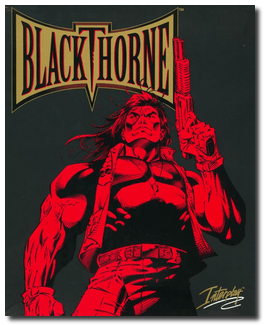](Blackthorne/README.md)  &nbsp;&nbsp;&nbsp;&nbsp;&nbsp;&nbsp;&nbsp;&nbsp;&nbsp;&nbsp;&nbsp;&nbsp;&nbsp;&nbsp;&nbsp;&nbsp;&nbsp;&nbsp;&nbsp;&nbsp;&nbsp;&nbsp;&nbsp;&nbsp;&nbsp;&nbsp;&nbsp;&nbsp;&nbsp;&nbsp;&nbsp;&nbsp;&nbsp;&nbsp;&nbsp;&nbsp; |  â Through the dark vastness of space, exiled prince Kyle Blackthorne returns to Tuul to avenge his murdered father and restore the shattered Lightstone. The conqueror Sarlac opposes his vicious troops against the enraged prince. But the evil lord will soon find out: an army is not enough against a single fierce fighter with a vengeance! â  â In 2013, Blizzard released the game for free on their Battle.net PC client. â — *Wikipedia*  |

---

| [Blockout](Blockout/README.md) | 📌 ┃ **Year** ‣ 1989 ┃ **Genre** ‣ Action • Puzzle ┃ **Platform** ‣ DOS ┃ **License** ‣ Freeware • Unlicensed ┃ **Media** ‣ Floppy Disk ┃ **Copy Protection**  |
|:---:|:---|
|  [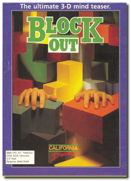](Blockout/README.md)  &nbsp;&nbsp;&nbsp;&nbsp;&nbsp;&nbsp;&nbsp;&nbsp;&nbsp;&nbsp;&nbsp;&nbsp;&nbsp;&nbsp;&nbsp;&nbsp;&nbsp;&nbsp;&nbsp;&nbsp;&nbsp;&nbsp;&nbsp;&nbsp;&nbsp;&nbsp;&nbsp;&nbsp;&nbsp;&nbsp;&nbsp;&nbsp;&nbsp;&nbsp;&nbsp;&nbsp; |  â Sit back and get comfortable before you open this box. You'll begin with the playing pit, a 3-D enclosure with length, width, and depth that you can set. During the game, various 3-D blocks will fall. Rotate and maneuver each block into the proper position to form complete layers. As each layer completes, it vanishes, giving you more points and more room to work. Blockout will challenge your reflexes and resolve in a test of coordination and quick thinking. But the greatest challenge of all will be keeping yourself from playing it again, and again, and again. â  â Blockout is an unlicensed, 3D version of Tetris. â — *Wikipedia*  |

---

| [Blood & Magic](Blood%20%26%20Magic/README.md) | 📌 ┃ **Year** ‣ 1996 ┃ **Genre** ‣ Strategy ┃ **Platform** ‣ DOS ┃ **License** ‣ Abandonware ┃ **Media** ‣ CD-ROM ┃ **Patched** ‣ 1.01  |
|:---:|:---|
|    &nbsp;&nbsp;&nbsp;&nbsp;&nbsp;&nbsp;&nbsp;&nbsp;&nbsp;&nbsp;&nbsp;&nbsp;&nbsp;&nbsp;&nbsp;&nbsp;&nbsp;&nbsp;&nbsp;&nbsp;&nbsp;&nbsp;&nbsp;&nbsp;&nbsp;&nbsp;&nbsp;&nbsp;&nbsp;&nbsp;&nbsp;&nbsp;&nbsp;&nbsp;&nbsp;&nbsp; |  â In a mysterious corner of the Forgotten Realms, powerful mages prepare for battle using magic long lost. You are one of those wizards, conjuring warriors, wyverns, sirens, wraiths and more. Armed with ancient artifacts, your troops march forward to battle goblin hordes, dark wizards, and lords of chaos. Can you defeat your foes to become the master of the realm? â  |

---

| [Boppin'](Boppin%27/README.md) | 📌 ┃ **Year** ‣ 1994 ┃ **Genre** ‣ Puzzle ┃ **Platform** ‣ DOS ┃ **License** ‣ Freeware ┃ **Media** ‣ Floppy Disk  |
|:---:|:---|
|    &nbsp;&nbsp;&nbsp;&nbsp;&nbsp;&nbsp;&nbsp;&nbsp;&nbsp;&nbsp;&nbsp;&nbsp;&nbsp;&nbsp;&nbsp;&nbsp;&nbsp;&nbsp;&nbsp;&nbsp;&nbsp;&nbsp;&nbsp;&nbsp;&nbsp;&nbsp;&nbsp;&nbsp;&nbsp;&nbsp;&nbsp;&nbsp;&nbsp;&nbsp;&nbsp;&nbsp; |  â When all the monsters and villains in popular arcade video games mysteriously disappear, it's up to Yeet and Boik to free them to make games challenging again. Defeat the nauseatingly self-righteous Sweety Hunnybunz, a singing treacle bear that has them imprisoned. â  â The final release released on August 19, 2005 was freeware simply titled Boppin', had all the features of the third release and was the very release ported to Windows. â — *Wikipedia*  |

---

| [Broken Sword: The Shadow of the Templars](Broken%20Sword%20-%20The%20Shadow%20of%20the%20Templars/README.md) | 📌 ┃ **Year** ‣ 1996 ┃ **Genre** ‣ Adventure ┃ **Platform** ‣ DOS ┃ **License** ‣ Proprietary ┃ **Media** ‣ CD-ROM ┃ **Extra Command**  |
|:---:|:---|
|    &nbsp;&nbsp;&nbsp;&nbsp;&nbsp;&nbsp;&nbsp;&nbsp;&nbsp;&nbsp;&nbsp;&nbsp;&nbsp;&nbsp;&nbsp;&nbsp;&nbsp;&nbsp;&nbsp;&nbsp;&nbsp;&nbsp;&nbsp;&nbsp;&nbsp;&nbsp;&nbsp;&nbsp;&nbsp;&nbsp;&nbsp;&nbsp;&nbsp;&nbsp;&nbsp;&nbsp; |  â Uncover the identity of a jester assassin. Unlock the legend of the Knights Templar. Unravel a plot as twisted as the catacombs you will be wandering. As an American in Paris, George Stobbart, you find it odd when an accordion-playing clown darts out of a cafe clutching a briefcase. Moments later, a force of massive explosion sent you flying right into a sinister world of intrigue. What are the coveted contents of that briefcase? A fiercely guarded manuscript penned by a clandestine medieval order - the Knights Templar. Steal it back before a group of Megalomaniacs fathoms its mysteries and overturns the very balance of life. â  â This version is the original/legacy release for DOS. This game **is not abandonware 🚫**. A **Director's Cut** release is available on [GOG 💰](https://www.gog.com/en/game/broken_sword_directors_cut). â  |

---

| [Broken Sword II: The Smoking Mirror](Broken%20Sword%20II%20-%20The%20Smoking%20Mirror/README.md) | 📌 ┃ **Year** ‣ 1997 ┃ **Genre** ‣ Adventure ┃ **Platform** ‣ Windows 9x ┃ **License** ‣ Proprietary ┃ **Media** ‣ CD-ROM  |
|:---:|:---|
|    &nbsp;&nbsp;&nbsp;&nbsp;&nbsp;&nbsp;&nbsp;&nbsp;&nbsp;&nbsp;&nbsp;&nbsp;&nbsp;&nbsp;&nbsp;&nbsp;&nbsp;&nbsp;&nbsp;&nbsp;&nbsp;&nbsp;&nbsp;&nbsp;&nbsp;&nbsp;&nbsp;&nbsp;&nbsp;&nbsp;&nbsp;&nbsp;&nbsp;&nbsp;&nbsp;&nbsp; |  â Plunge into a shadowy conspiracy world where the schemes of a mad drug kingpin and the prophesized return of an ancient Mayan god clash in what could be the end of the world. Race around the globe with George as he frantically attempts to free Nico, his investigative reporter girlfriend, from the clutches of Karzac's crime cartel. Guide Nico and George as they unravel the dark mysteries that lead them closer and closer to an ancient horror best left buried in the steamy jungles of Central America. Gather clues and make friends, but beware - a smiling face can hide a deadly obstacle in your quest to stop the return of "he who devours the sun and consumes the flesh of all mankind", the mighty Mayan God, Tezcatlipoca. â  â This game **is not abandonware 🚫**. The **Remastered** release is available on [GOG 💰](https://www.gog.com/en/game/broken_sword_2__the_smoking_mirror) and [Steam 💰](https://store.steampowered.com/app/33600/Broken_Sword_2__the_Smoking_Mirror_Remastered/). â  |

---

| [Cadaver](Cadaver/README.md) | 📌 ┃ **Year (Cadaver)** ‣ 1990 ┃ **Year (Cadaver: The Payoff)** ‣ 1991 ┃ **Genre** ‣ Action ┃ **Platform** ‣ DOS ┃ **License** ‣ Abandonware ┃ **Media** ‣ Floppy Disk ┃ **Add-on**  |
|:---:|:---|
|    &nbsp;&nbsp;&nbsp;&nbsp;&nbsp;&nbsp;&nbsp;&nbsp;&nbsp;&nbsp;&nbsp;&nbsp;&nbsp;&nbsp;&nbsp;&nbsp;&nbsp;&nbsp;&nbsp;&nbsp;&nbsp;&nbsp;&nbsp;&nbsp;&nbsp;&nbsp;&nbsp;&nbsp;&nbsp;&nbsp;&nbsp;&nbsp;&nbsp;&nbsp;&nbsp;&nbsp; |  â Karadoc, who is a gold-hungry dwarf and just hopes to find a treasure, is on a mission to seek out and kill the necromancer Dianos, the sole remaining inhabitant of Castle Wulf. â — *Cadaver*  â Dianos is dead. Karadoc has fulfilled The Cadaver contract. But collecting the reward will be more challenging than you had ever imagined. â — *Cadaver: The Payoff*  |

---

| [Call of Cthulhu: Prisoner of Ice](Call%20of%20Cthulhu%20-%20Prisoner%20of%20Ice/README.md) | 📌 ┃ **Year** ‣ 1995 ┃ **Genre** ‣ Adventure ┃ **Platform** ‣ DOS ┃ **License** ‣ Proprietary ┃ **Media** ‣ Compressed Package ┃ **Extra Command**  |
|:---:|:---|
|    &nbsp;&nbsp;&nbsp;&nbsp;&nbsp;&nbsp;&nbsp;&nbsp;&nbsp;&nbsp;&nbsp;&nbsp;&nbsp;&nbsp;&nbsp;&nbsp;&nbsp;&nbsp;&nbsp;&nbsp;&nbsp;&nbsp;&nbsp;&nbsp;&nbsp;&nbsp;&nbsp;&nbsp;&nbsp;&nbsp;&nbsp;&nbsp;&nbsp;&nbsp;&nbsp;&nbsp; |  â Board the H.M.S. Victoria for a voyage to places beyond your wildest imagination! From the icy wastelands of Antarctica to secret German military camps and espionage in Buenos Aires, this supernatural action adventure will pique your obsession with horror and intrigue. You are in charge of your destiny. But beware, the twisted events of your voyage will take you to task at every turn. Take the risk. Teleport yourself across the globe to a Socerers cave, unleash the secrets of aliens frozen in ice or solve the case of smuggled Top Secret cargo. Prepare to face the most chilling adventure on ice. Remember, you are one step ahead of capture, one step behind horror! â  â This game **is not abandonware 🚫** and is still for sale on [GOG 💰](https://gog.com/en/game/call_of_cthulhu_prisoner_of_ice) and [Steam 💰](https://store.steampowered.com/app/359620/Call_of_Cthulhu_Prisoner_of_Ice/). â  |

---

| [Call of Cthulhu: Shadow of the Comet](Call%20of%20Cthulhu%20-%20Shadow%20of%20the%20Comet/README.md) | 📌 ┃ **Year** ‣ 1993 ┃ **Genre** ‣ Adventure ┃ **Platform** ‣ DOS ┃ **License** ‣ Proprietary ┃ **Media** ‣ CD-ROM  |
|:---:|:---|
|    &nbsp;&nbsp;&nbsp;&nbsp;&nbsp;&nbsp;&nbsp;&nbsp;&nbsp;&nbsp;&nbsp;&nbsp;&nbsp;&nbsp;&nbsp;&nbsp;&nbsp;&nbsp;&nbsp;&nbsp;&nbsp;&nbsp;&nbsp;&nbsp;&nbsp;&nbsp;&nbsp;&nbsp;&nbsp;&nbsp;&nbsp;&nbsp;&nbsp;&nbsp;&nbsp;&nbsp; |  â The year is 1910. Bathed in pale Spring sunlight, the small fishing port of Illsmouth is a sleepy New England town where time seems to stand still. Appearances can be very deceiving, however. Beneath the peaceful tranquillity of this small village, a horrifying truth lingers. Whispers in a dusty, secluded library ripple with fear as questions of the past into the present. Is there a link between the return of Halley Comet and the resurgence of the Great Ancients who once dominated the land in a reign of terror? Legend tells tales of an ancient ritual ground, hidden deep in the shadows of the tangled forest, marked by an ornate and mysterious cross. Once, long ago, this site was the stage for wild and terrifying rites that no one speaks of, lest they suffer the wrath of the Ancients. â  â This game **is not abandonware 🚫** and is still for sale on [GOG 💰](https://www.gog.com/en/game/call_of_cthulhu_shadow_of_the_comet) and [Steam 💰](https://store.steampowered.com/app/389470/Call_of_Cthulhu_Shadow_of_the_Comet/). â  |

---

| [Callahan's Crosstime Saloon](Callahan%27s%20Crosstime%20Saloon/README.md) | 📌 ┃ **Year** ‣ 1997 ┃ **Genre** ‣ Adventure ┃ **Platform** ‣ DOS ┃ **License** ‣ Abandonware ┃ **Media** ‣ CD-ROM ┃ **Patched** ‣ 1.0.1  |
|:---:|:---|
|    &nbsp;&nbsp;&nbsp;&nbsp;&nbsp;&nbsp;&nbsp;&nbsp;&nbsp;&nbsp;&nbsp;&nbsp;&nbsp;&nbsp;&nbsp;&nbsp;&nbsp;&nbsp;&nbsp;&nbsp;&nbsp;&nbsp;&nbsp;&nbsp;&nbsp;&nbsp;&nbsp;&nbsp;&nbsp;&nbsp;&nbsp;&nbsp;&nbsp;&nbsp;&nbsp;&nbsp; |  â The Gods have decided that our very Universe is closing. The regulars in Callahan's Crosstime Saloon can either drink up and go home or do something about it. But Callahan's is no ordinary neighbourhood bar. Think of it as a cross between Cheers and the Star Wars Cantina. It is where every being knows your name, even if you are from another time or another universe. â  |

---

| [Sid Meier's Civilization](Civilization/README.md) | 📌 ┃ **Year** ‣ 1991 ┃ **Genre** ‣ Strategy ┃ **Platform** ‣ DOS ┃ **License** ‣ Abandonware ┃ **Media** ‣ Compressed Package ┃ **Patched** ‣ 474.05 ┃ **Copy Protection**  |
|:---:|:---|
|    &nbsp;&nbsp;&nbsp;&nbsp;&nbsp;&nbsp;&nbsp;&nbsp;&nbsp;&nbsp;&nbsp;&nbsp;&nbsp;&nbsp;&nbsp;&nbsp;&nbsp;&nbsp;&nbsp;&nbsp;&nbsp;&nbsp;&nbsp;&nbsp;&nbsp;&nbsp;&nbsp;&nbsp;&nbsp;&nbsp;&nbsp;&nbsp;&nbsp;&nbsp;&nbsp;&nbsp; |  â High in the Andes, a biting wind howls through the Incas' ruined strongholds. Half a world away, the Pharaohs' tombs lie empty. In Italy, the Roman Colosseum decays. Everywhere, you see remnants of societies that thought they would endure forever. All are dust. But yours could be different. You could be the person in history who builds an empire that never falls. â  |

---

| [Sid Meier's Civilization II](Civilization%20II/README.md) | 📌 ┃ **Year (Civilization II)** ‣ 1996 ┃ **Year (Civilization II: Conflicts in Civilization)** ‣ 1996 ┃ **Year (Civilization II: Fantastic Worlds)** ‣ 1997 ┃ **Genre** ‣ Strategy ┃ **Platform** ‣ Windows 3.1x ┃ **License** ‣ Abandonware ┃ **Media** ‣ CD-ROM ┃ **Patched** ‣ Conflicts in Civilization scenarios ┃ **Add-on**  |
|:---:|:---|
|    &nbsp;&nbsp;&nbsp;&nbsp;&nbsp;&nbsp;&nbsp;&nbsp;&nbsp;&nbsp;&nbsp;&nbsp;&nbsp;&nbsp;&nbsp;&nbsp;&nbsp;&nbsp;&nbsp;&nbsp;&nbsp;&nbsp;&nbsp;&nbsp;&nbsp;&nbsp;&nbsp;&nbsp;&nbsp;&nbsp;&nbsp;&nbsp;&nbsp;&nbsp;&nbsp;&nbsp; |  â Introducing: Sid Meier's Civilization II. Make every critical social, economic and political decision as you build an empire to stand the test of time. Compete against some of the great leaders of all time. It's discovery. It's diplomacy. It's your destiny. So plan your every move carefully. â  |

---

| [Command & Conquer](Command%20%26%20Conquer/README.md) | 📌 ┃ **Year (Tiberian Dawn)** ‣ 1995 ┃ **Year (The Covert Operations)** ‣ 1996 ┃ **Genre** ‣ Strategy ┃ **Platform** ‣ DOS ┃ **License** ‣ Freeware ┃ **Media** ‣ CD-ROM ┃ **Add-on**  |
|:---:|:---|
|    &nbsp;&nbsp;&nbsp;&nbsp;&nbsp;&nbsp;&nbsp;&nbsp;&nbsp;&nbsp;&nbsp;&nbsp;&nbsp;&nbsp;&nbsp;&nbsp;&nbsp;&nbsp;&nbsp;&nbsp;&nbsp;&nbsp;&nbsp;&nbsp;&nbsp;&nbsp;&nbsp;&nbsp;&nbsp;&nbsp;&nbsp;&nbsp;&nbsp;&nbsp;&nbsp;&nbsp; |  â Welcome to the New World Order, a world where the art of electronic intelligence and covert surveillance reign supreme. Guerrilla strategies and savage combat are the norms. In the hyper-real combat/strategy experience of Command & Conquer, you're thrust dead-on into the heat of an all-out race for global control. Will you side with the humanistic Global Defense Initiative? Or bring the world to its knees with the terroristic Brotherhood of Nod? Decide fast. Your adversaries are without mercy. Spread your web of power via electronic and physical aggression. Build bases, muster forces and lacerate your enemies to the bone. All for the love of power. â  â To mark the 12th anniversary of the franchise, Electronic Arts, the current publisher and owner of the series, released the game for free in 2007. â — *Wikipedia*  |

---

| [Command & Conquer: Red Alert](Command%20%26%20Conquer%20-%20Red%20Alert/README.md) | 📌 ┃ **Year (Red Alert)** ‣ 1996 ┃ **Year (Red Alert - Counterstrike)** ‣ 1997 ┃ **Year (Red Alert - The Aftermath)** ‣ 1997 ┃ **Genre** ‣ Strategy ┃ **Platform** ‣ DOS ┃ **License** ‣ Freeware ┃ **Media** ‣ CD-ROM ┃ **Patched** ‣ Red Alert - The Aftermath mission bugfix ┃ **Add-on**  |
|:---:|:---|
|    &nbsp;&nbsp;&nbsp;&nbsp;&nbsp;&nbsp;&nbsp;&nbsp;&nbsp;&nbsp;&nbsp;&nbsp;&nbsp;&nbsp;&nbsp;&nbsp;&nbsp;&nbsp;&nbsp;&nbsp;&nbsp;&nbsp;&nbsp;&nbsp;&nbsp;&nbsp;&nbsp;&nbsp;&nbsp;&nbsp;&nbsp;&nbsp;&nbsp;&nbsp;&nbsp;&nbsp; |  â Dark experiments have permanently altered time. Or have they? Now, Soviet tanks crush city after city while Allied cruisers shell bases. Spies lurk, land mines wait, and strange new technologies aid both sides in their struggle for ultimate control. â  â To mark the 13th anniversary of Command and Conquer and the announcement of Red Alert 3, EA released Command and Conquer: Red Alert as freeware. â — *Wikipedia*  |

---

| [Commandos: Behind Enemy Lines](Commandos%20-%20Behind%20Enemy%20Lines/README.md) | 📌 ┃ **Year** ‣ 1998 ┃ **Genre** ‣ Strategy ┃ **Platform** ‣ Windows 9x ┃ **License** ‣ Proprietary ┃ **Media** ‣ CD-ROM  |
|:---:|:---|
|    &nbsp;&nbsp;&nbsp;&nbsp;&nbsp;&nbsp;&nbsp;&nbsp;&nbsp;&nbsp;&nbsp;&nbsp;&nbsp;&nbsp;&nbsp;&nbsp;&nbsp;&nbsp;&nbsp;&nbsp;&nbsp;&nbsp;&nbsp;&nbsp;&nbsp;&nbsp;&nbsp;&nbsp;&nbsp;&nbsp;&nbsp;&nbsp;&nbsp;&nbsp;&nbsp;&nbsp; |  â Engage in the ultimate battle of wits and wills, commanding the ruthless military force in history. Set in the backdrop of WWII, Commandos is a real-time tactical wargame that puts you in command of a squad of elite Allied Commandos whose job is to complete 24 dangerous missions behind enemy lines. Intercept the German war effort using sabotage and tactical genius. â  â This game **is not abandonware 🚫** and is still for sale on [Steam 💰](https://store.steampowered.com/app/6800/Commandos_Behind_Enemy_Lines/) and [Zoom 💰](https://www.zoom-platform.com/product/commandos-behind-enemy-lines). The **Commandos Ammo Pack** release is available on [GOG 💰](https://www.gog.com/en/game/commandos_ammo_pack). â  |

---

| [Commandos: Beyond the Call of Duty](Commandos%20-%20Beyond%20the%20Call%20of%20Duty/README.md) | 📌 ┃ **Year** ‣ 1999 ┃ **Genre** ‣ Strategy ┃ **Platform** ‣ Windows 9x ┃ **License** ‣ Proprietary ┃ **Media** ‣ CD-ROM  |
|:---:|:---|
|    &nbsp;&nbsp;&nbsp;&nbsp;&nbsp;&nbsp;&nbsp;&nbsp;&nbsp;&nbsp;&nbsp;&nbsp;&nbsp;&nbsp;&nbsp;&nbsp;&nbsp;&nbsp;&nbsp;&nbsp;&nbsp;&nbsp;&nbsp;&nbsp;&nbsp;&nbsp;&nbsp;&nbsp;&nbsp;&nbsp;&nbsp;&nbsp;&nbsp;&nbsp;&nbsp;&nbsp; |  â You now mobilise in a series of eight new dangerous missions. You may come with experience of action "Behind Enemy Lines", or perhaps you are a rookie. You will have the opportunity to push your daring and tactical ability to the limit. As the leader of a small elite unit operating deep within enemy territory, you will experience new challenges and goals within these new missions. â  â This game **is not abandonware 🚫** and is still for sale on [Steam 💰](https://store.steampowered.com/app/6810/Commandos_Beyond_the_Call_of_Duty/) and [Zoom 💰](https://www.zoom-platform.com/product/commandos-beyond-the-call-of-duty). The **Commandos Ammo Pack** release is available on [GOG 💰](https://www.gog.com/en/game/commandos_ammo_pack). â  |

---

| [Crusader: No Regret](Crusader%20-%20No%20Regret/README.md) | 📌 ┃ **Year** ‣ 1996 ┃ **Genre** ‣ Action ┃ **Platform** ‣ DOS ┃ **License** ‣ Proprietary ┃ **Media** ‣ CD-ROM  |
|:---:|:---|
|    &nbsp;&nbsp;&nbsp;&nbsp;&nbsp;&nbsp;&nbsp;&nbsp;&nbsp;&nbsp;&nbsp;&nbsp;&nbsp;&nbsp;&nbsp;&nbsp;&nbsp;&nbsp;&nbsp;&nbsp;&nbsp;&nbsp;&nbsp;&nbsp;&nbsp;&nbsp;&nbsp;&nbsp;&nbsp;&nbsp;&nbsp;&nbsp;&nbsp;&nbsp;&nbsp;&nbsp; |  â You're a renegade, Silencer, out to settle a score with the powerful World Economic Consortium. Only your instincts, agility and firepower can get you through in one piece to the ultimate confrontation with your greatest enemy. â  â This game **is not abandonware 🚫** and is still for sale on [GOG 💰](https://gog.com/en/game/crusader_no_regret). â  |

---

| [Crusader: No Remorse](Crusader%20-%20No%20Remorse/README.md) | 📌 ┃ **Year** ‣ 1995 ┃ **Genre** ‣ Action ┃ **Platform** ‣ DOS ┃ **License** ‣ Proprietary ┃ **Media** ‣ CD-ROM  |
|:---:|:---|
|    &nbsp;&nbsp;&nbsp;&nbsp;&nbsp;&nbsp;&nbsp;&nbsp;&nbsp;&nbsp;&nbsp;&nbsp;&nbsp;&nbsp;&nbsp;&nbsp;&nbsp;&nbsp;&nbsp;&nbsp;&nbsp;&nbsp;&nbsp;&nbsp;&nbsp;&nbsp;&nbsp;&nbsp;&nbsp;&nbsp;&nbsp;&nbsp;&nbsp;&nbsp;&nbsp;&nbsp; |  â As a Silencer, one of the elite enforcers of the World Economic Consortium, you're supposed to be incorruptible. But if the system you serve is utterly corrupt, where does that leave you? You go to the Resistance, the same pack you used to hunt down. Your former employers better watch their backs because you're coming after them with all the firepower at your command - No pity, no mercy, no remorse. â  â This game **is not abandonware 🚫** and is still for sale on [GOG 💰](https://www.gog.com/en/game/crusader_no_remorse). â  |

---

| [Cyberia](Cyberia/README.md) | 📌 ┃ **Year** ‣ 1994 ┃ **Genre** ‣ Action ┃ **Platform** ‣ DOS ┃ **License** ‣ Proprietary ┃ **Media** ‣ CD-ROM ┃ **Patched** ‣ Save game bugfix  |
|:---:|:---|
|    &nbsp;&nbsp;&nbsp;&nbsp;&nbsp;&nbsp;&nbsp;&nbsp;&nbsp;&nbsp;&nbsp;&nbsp;&nbsp;&nbsp;&nbsp;&nbsp;&nbsp;&nbsp;&nbsp;&nbsp;&nbsp;&nbsp;&nbsp;&nbsp;&nbsp;&nbsp;&nbsp;&nbsp;&nbsp;&nbsp;&nbsp;&nbsp;&nbsp;&nbsp;&nbsp;&nbsp; |  â The world is under the dominion of two opposing superpowers, the First World Alliance (FWA) in the west and the Cartel in the east. The leader of the FWA receives word that a devastating weapon is being produced in a secret base in Siberia, referred to as the Cyberia Complex. It was designed in an era of long-forgotten peace by the most brilliant minds in nano and cybernetic technology. In an ancient world of hope, it was to be the ultimate protector of a new order. In 2027, it stands as the instrument of humanity's destruction. You are Zak Kingston, tasked to infiltrate the Complex and retrieve any intel on the weapon production. â  â This game **is not abandonware 🚫** and is still for sale on [GOG 💰](https://www.gog.com/en/game/cyberia) and [Steam 💰](https://store.steampowered.com/app/624080/Cyberia/). â  |

---

| [Cyberia 2: Resurrection](Cyberia%202%20-%20Resurrection/README.md) | 📌 ┃ **Year** ‣ 1995 ┃ **Genre** ‣ Action ┃ **Platform** ‣ DOS ┃ **License** ‣ Proprietary ┃ **Media** ‣ CD-ROM  |
|:---:|:---|
|    &nbsp;&nbsp;&nbsp;&nbsp;&nbsp;&nbsp;&nbsp;&nbsp;&nbsp;&nbsp;&nbsp;&nbsp;&nbsp;&nbsp;&nbsp;&nbsp;&nbsp;&nbsp;&nbsp;&nbsp;&nbsp;&nbsp;&nbsp;&nbsp;&nbsp;&nbsp;&nbsp;&nbsp;&nbsp;&nbsp;&nbsp;&nbsp;&nbsp;&nbsp;&nbsp;&nbsp; |  â In Cyberia 2, the player takes the role of master cyber hacker Zak Kingston. After spending three years in cryonic hibernation, Zak has been mysteriously revived by a band of rebels bent on employing his services for a series of covert missions that will bring down the Free World Alliance (FWA) once and for all. â  â This game **is not abandonware 🚫** and is still for sale on [GOG 💰](https://gog.com/en/game/cyberia_2_resurrection) and [Steam 💰](https://store.steampowered.com/app/717720/Cyberia_2_Resurrection/). â  |

---

| [D/Generation](D-Generation/README.md) | 📌 ┃ **Year** ‣ 1991 ┃ **Genre** ‣ Action ┃ **Platform** ‣ DOS ┃ **License** ‣ Abandonware ┃ **Media** ‣ CD-ROM  |
|:---:|:---|
|    &nbsp;&nbsp;&nbsp;&nbsp;&nbsp;&nbsp;&nbsp;&nbsp;&nbsp;&nbsp;&nbsp;&nbsp;&nbsp;&nbsp;&nbsp;&nbsp;&nbsp;&nbsp;&nbsp;&nbsp;&nbsp;&nbsp;&nbsp;&nbsp;&nbsp;&nbsp;&nbsp;&nbsp;&nbsp;&nbsp;&nbsp;&nbsp;&nbsp;&nbsp;&nbsp;&nbsp; |  â A French company called Genoq has developed a series of new genetically engineered bioweapons, which have run out of control and taken over Genoq's Singaporean lab. The main character is a courier making an emergency delivery by a jet pack to one of Genoq's top researchers, Jean-Paul Derrida, who is oblivious to the events inside the building until the lab's doors lock behind him after he enters. His point of delivery is ten floors away, all of them crawling with bioweapons. â  â This version is the original/legacy release for DOS. An **HD Remake** release is available on [Steam 💰](https://store.steampowered.com/app/389740/DGeneration_HD/). â  |

---

| [Dark Legions](Dark%20Legions/README.md) | 📌 ┃ **Year** ‣ 1994 ┃ **Genre** ‣ Action • Strategy ┃ **Platform** ‣ DOS ┃ **License** ‣ Proprietary ┃ **Media** ‣ Floppy Disk ┃ **Patched** ‣ 1.1 ┃ **Copy Protection**  |
|:---:|:---|
|    &nbsp;&nbsp;&nbsp;&nbsp;&nbsp;&nbsp;&nbsp;&nbsp;&nbsp;&nbsp;&nbsp;&nbsp;&nbsp;&nbsp;&nbsp;&nbsp;&nbsp;&nbsp;&nbsp;&nbsp;&nbsp;&nbsp;&nbsp;&nbsp;&nbsp;&nbsp;&nbsp;&nbsp;&nbsp;&nbsp;&nbsp;&nbsp;&nbsp;&nbsp;&nbsp;&nbsp; |  â You fight for universal power with the aid of the dark citizens from the Tahr Carog world. Similarly, your opponent uses his army of creatures to fight you. Each character type in Dark Legions has its strengths and weaknesses. Use them well - you will be victorious. If you fail, abject humiliation will be the least of your worries. â  â This game **is not abandonware 🚫** and is still for sale on [GOG 💰](https://www.gog.com/en/game/dark_legions). â  |

---

| [Dark Seed](Dark%20Seed/README.md) | 📌 ┃ **Year** ‣ 1992 ┃ **Genre** ‣ Adventure ┃ **Platform** ‣ DOS ┃ **License** ‣ Abandonware ┃ **Media** ‣ CD-ROM  |
|:---:|:---|
|    &nbsp;&nbsp;&nbsp;&nbsp;&nbsp;&nbsp;&nbsp;&nbsp;&nbsp;&nbsp;&nbsp;&nbsp;&nbsp;&nbsp;&nbsp;&nbsp;&nbsp;&nbsp;&nbsp;&nbsp;&nbsp;&nbsp;&nbsp;&nbsp;&nbsp;&nbsp;&nbsp;&nbsp;&nbsp;&nbsp;&nbsp;&nbsp;&nbsp;&nbsp;&nbsp;&nbsp; |  â You are Mike Dawson, a science fiction writer who purchased an old Victorian house. As you explore your new home, you soon discover you have bought more than you bargained for. Control the fate of two worlds: The world as we know it and the dark world of an ancient and dying civilization. Unlock the secret of a sinister plot and discover the dark passage to their world, a place more terrifying than your darkest nightmare. Time is running out. You are on a collision course with destiny, and only you can save yourself and the world from a cruel fate. All of humanity depends on you. â  |

---

| [Dark Seed II](Dark%20Seed%20II/README.md) | 📌 ┃ **Year** ‣ 1995 ┃ **Genre** ‣ Adventure ┃ **Platform** ‣ Windows 3.1x ┃ **License** ‣ Abandonware ┃ **Media** ‣ CD-ROM  |
|:---:|:---|
|    &nbsp;&nbsp;&nbsp;&nbsp;&nbsp;&nbsp;&nbsp;&nbsp;&nbsp;&nbsp;&nbsp;&nbsp;&nbsp;&nbsp;&nbsp;&nbsp;&nbsp;&nbsp;&nbsp;&nbsp;&nbsp;&nbsp;&nbsp;&nbsp;&nbsp;&nbsp;&nbsp;&nbsp;&nbsp;&nbsp;&nbsp;&nbsp;&nbsp;&nbsp;&nbsp;&nbsp; |  â In his hometown, Mike's high school sweetheart, Rita, is found murdered after the high school reunion. Unfortunately, Mike has no recollection of the events that night, even though he was with Rita. Mike becomes the prime suspect and now must work to clear his name. In digging up the dirty little secrets of his neighbours, Mike unwittingly stumbles into the Dark World, a place he thought he would never see again. The ancients have returned to exact revenge on Mike and unleash an evil entity into the Normal World. As Mike Dawson, you must clear your name and stop the ancients from carrying out their most ingenious scheme yet. â  |

---

| [Darker](Darker/README.md) | 📌 ┃ **Year** ‣ 1995 ┃ **Genre** ‣ Action • Simulation ┃ **Platform** ‣ DOS ┃ **License** ‣ Abandonware ┃ **Media** ‣ CD-ROM  |
|:---:|:---|
|  [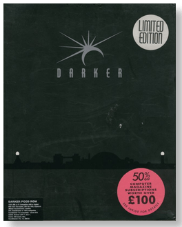](Darker/README.md)  &nbsp;&nbsp;&nbsp;&nbsp;&nbsp;&nbsp;&nbsp;&nbsp;&nbsp;&nbsp;&nbsp;&nbsp;&nbsp;&nbsp;&nbsp;&nbsp;&nbsp;&nbsp;&nbsp;&nbsp;&nbsp;&nbsp;&nbsp;&nbsp;&nbsp;&nbsp;&nbsp;&nbsp;&nbsp;&nbsp;&nbsp;&nbsp;&nbsp;&nbsp;&nbsp;&nbsp; |  â Your side of the planet is constantly in total darkness, but the Delphins have adapted to this life. The Halons used to live in the light, but recent events have caused their side of the planet to fall dark, and now they are attacking you to take over your technology. Your job as a Delphin pilot is to stop them and take down their attacking ships. â  |

---

| [Day of the Tentacle](Day%20of%20the%20Tentacle/README.md) | 📌 ┃ **Year** ‣ 1993 ┃ **Genre** ‣ Adventure ┃ **Platform** ‣ DOS ┃ **License** ‣ Proprietary ┃ **Media** ‣ CD-ROM  |
|:---:|:---|
|    &nbsp;&nbsp;&nbsp;&nbsp;&nbsp;&nbsp;&nbsp;&nbsp;&nbsp;&nbsp;&nbsp;&nbsp;&nbsp;&nbsp;&nbsp;&nbsp;&nbsp;&nbsp;&nbsp;&nbsp;&nbsp;&nbsp;&nbsp;&nbsp;&nbsp;&nbsp;&nbsp;&nbsp;&nbsp;&nbsp;&nbsp;&nbsp;&nbsp;&nbsp;&nbsp;&nbsp; |  â Dr. Fred's mutated purple tentacle is out to take over the world. And only you can stop him. Travel through time with three outrageous characters in this wacky graphic adventure featuring cartoon-style animation and over 100 zany sound effects. â  â This version is the original/legacy release for DOS. A **Remastered** release is available on [GOG 💰](https://www.gog.com/en/game/day_of_the_tentacle_remastered). â  |

---

| [Deadlock: Planetary Conquest](Deadlock%20-%20Planetary%20Conquest/README.md) | 📌 ┃ **Year** ‣ 1996 ┃ **Genre** ‣ Simulation • Strategy ┃ **Platform** ‣ Windows 3.1x ┃ **License** ‣ Proprietary ┃ **Media** ‣ CD-ROM  |
|:---:|:---|
|    &nbsp;&nbsp;&nbsp;&nbsp;&nbsp;&nbsp;&nbsp;&nbsp;&nbsp;&nbsp;&nbsp;&nbsp;&nbsp;&nbsp;&nbsp;&nbsp;&nbsp;&nbsp;&nbsp;&nbsp;&nbsp;&nbsp;&nbsp;&nbsp;&nbsp;&nbsp;&nbsp;&nbsp;&nbsp;&nbsp;&nbsp;&nbsp;&nbsp;&nbsp;&nbsp;&nbsp; |  â Time is short. Seven alien races struggle to build their empires, but only one will dominate. In Deadlock, every decision you make will determine the ultimate fate of your people, your empire, and your survival. It is an incredible strategy game of interplanetary conquest. â  â This game **is not abandonware 🚫** and is still for sale on [GOG 💰](https://www.gog.com/en/game/deadlock_planetary_conquest) and [Steam 💰](https://store.steampowered.com/app/328440/Deadlock_Planetary_Conquest/). â  |

---

| [Deadlock II: Shrine Wars](Deadlock%20II%20-%20Shrine%20Wars/README.md) | 📌 ┃ **Year** ‣ 1998 ┃ **Genre** ‣ Strategy ┃ **Platform** ‣ Windows 9x ┃ **License** ‣ Proprietary ┃ **Media** ‣ CD-ROM  |
|:---:|:---|
|    &nbsp;&nbsp;&nbsp;&nbsp;&nbsp;&nbsp;&nbsp;&nbsp;&nbsp;&nbsp;&nbsp;&nbsp;&nbsp;&nbsp;&nbsp;&nbsp;&nbsp;&nbsp;&nbsp;&nbsp;&nbsp;&nbsp;&nbsp;&nbsp;&nbsp;&nbsp;&nbsp;&nbsp;&nbsp;&nbsp;&nbsp;&nbsp;&nbsp;&nbsp;&nbsp;&nbsp; |  â Ancient and mysterious Shrines reveal the location of an extinct alien homeworld. Discovered in the aftermath of the Gallius IV war, these Shrines unlock the most powerful technology in the universe. Now, seven interstellar empires must battle to establish their colonies and attempt to piece together the ancient secrets of a lost world. â  â This game **is not abandonware 🚫** and is still for sale on [GOG 💰](https://www.gog.com/en/game/deadlock_2_shrine_wars) and [Steam 💰](https://store.steampowered.com/app/328450/Deadlock_II_Shrine_Wars/). â  |

---

| [Death Gate](Death%20Gate/README.md) | 📌 ┃ **Year** ‣ 1994 ┃ **Genre** ‣ Adventure ┃ **Platform** ‣ DOS ┃ **License** ‣ Proprietary ┃ **Media** ‣ CD-ROM  |
|:---:|:---|
|    &nbsp;&nbsp;&nbsp;&nbsp;&nbsp;&nbsp;&nbsp;&nbsp;&nbsp;&nbsp;&nbsp;&nbsp;&nbsp;&nbsp;&nbsp;&nbsp;&nbsp;&nbsp;&nbsp;&nbsp;&nbsp;&nbsp;&nbsp;&nbsp;&nbsp;&nbsp;&nbsp;&nbsp;&nbsp;&nbsp;&nbsp;&nbsp;&nbsp;&nbsp;&nbsp;&nbsp; |  â Long ago, the powerful Sartans broke the World Seal and sundered the planet into five magical realms. Since then, generations of defeated Patryns have survived bleak existence in the nightmarish prison of the Labyrinth. But now, one man discovers the Death Gate, a treacherous crossing that leads to freedom. His quest: to recover the scattered pieces of the World Seal, wreak his revenge and deliver his people into independence. â  â GOG.com released an emulated version for Microsoft Windows, macOS, and Linux in January 2018. It was removed from sale two months later. â — *Wikipedia*  â This game **is not abandonware 🚫** and used to be for sale on **GOG**. However, it is no longer available digitally anymore. [What happened to 'Death Gate'?](https://www.gog.com/forum/death_gate/what_happened_to_death_gate) â  |

---

| [Death Rally](Death%20Rally/README.md) | 📌 ┃ **Year** ‣ 1996 ┃ **Genre** ‣ Action • Racing ┃ **Platform** ‣ DOS ┃ **License** ‣ Freeware ┃ **Media** ‣ CD-ROM  |
|:---:|:---|
|    &nbsp;&nbsp;&nbsp;&nbsp;&nbsp;&nbsp;&nbsp;&nbsp;&nbsp;&nbsp;&nbsp;&nbsp;&nbsp;&nbsp;&nbsp;&nbsp;&nbsp;&nbsp;&nbsp;&nbsp;&nbsp;&nbsp;&nbsp;&nbsp;&nbsp;&nbsp;&nbsp;&nbsp;&nbsp;&nbsp;&nbsp;&nbsp;&nbsp;&nbsp;&nbsp;&nbsp; |  â Enter the corrupt racing world of Death Rally, where defensive driving means annihilating your opponents. You'll become ravenous for the power and glory of being the best at Death Rally, but first, you must pay your dues. Put the pedal to the metal and smash, blast and obliterate the competition to earn the chance to face the undefeated master, "The Adversary." Make deals with loan sharks and mob bosses to get the cash you need to build the ultimate battle racing machine. Remember, no trick is too dirty, and no spectator is too innocent - in your savage quest for the checkered flag. â  â Based on Komppa's work, Remedy released Death Rally for Windows as proprietary freeware on 20 October 2009. â — *Wikipedia*  |

---

| [Descent: Anniversary Edition](Descent/README.md) | 📌 ┃ **Year (Descent)** ‣ 1995 ┃ **Year (Descent: Levels of the World)** ‣ 1995 ┃ **Genre** ‣ Action ┃ **Platform** ‣ DOS ┃ **License** ‣ Proprietary ┃ **Media** ‣ CD-ROM ┃ **Add-on**  |
|:---:|:---|
|    &nbsp;&nbsp;&nbsp;&nbsp;&nbsp;&nbsp;&nbsp;&nbsp;&nbsp;&nbsp;&nbsp;&nbsp;&nbsp;&nbsp;&nbsp;&nbsp;&nbsp;&nbsp;&nbsp;&nbsp;&nbsp;&nbsp;&nbsp;&nbsp;&nbsp;&nbsp;&nbsp;&nbsp;&nbsp;&nbsp;&nbsp;&nbsp;&nbsp;&nbsp;&nbsp;&nbsp; |  â You begin deep below the surface of Lunar Base I, where an unknown alien race has taken over the chasm of the Post-Terran Mining Corporation. Lunge down mine shafts, twist around never-ending tunnels and fight past robotic menaces in a 360° 3D environment. Move up, move down, shoot everything everywhere. Hang onto your senses (and your lunch) as you drop down mine shafts on a ride that'll leave you spinning. â  â This game **is not abandonware 🚫** and is still for sale on [GOG 💰](https://www.gog.com/en/game/descent) and [Steam 💰](https://store.steampowered.com/app/273570/Descent/). â  |

---

| [Descent II](Descent%20II/README.md) | 📌 ┃ **Year (Descent II)** ‣ 1996 ┃ **Year (Descent II: The Infinite Abyss)** ‣ 1996 ┃ **Year (Descent II: Vertigo Series)** ‣ 1996 ┃ **Genre** ‣ Action ┃ **Platform** ‣ DOS ┃ **License** ‣ Proprietary ┃ **Media** ‣ CD-ROM ┃ **Add-on**  |
|:---:|:---|
|    &nbsp;&nbsp;&nbsp;&nbsp;&nbsp;&nbsp;&nbsp;&nbsp;&nbsp;&nbsp;&nbsp;&nbsp;&nbsp;&nbsp;&nbsp;&nbsp;&nbsp;&nbsp;&nbsp;&nbsp;&nbsp;&nbsp;&nbsp;&nbsp;&nbsp;&nbsp;&nbsp;&nbsp;&nbsp;&nbsp;&nbsp;&nbsp;&nbsp;&nbsp;&nbsp;&nbsp; |  â You're about to plunge over the edge and into the depths of Descent II. Suddenly warped into the outer reaches of the Zeta Aquilae System, your new mission sends you into the black depths of treacherous alien mines. You blast through enemy robots with powerful new tools, leaving their flaming hulks in your exhaust. Your ultimate goal is to exterminate the alien robot stronghold from the enemy Alien Base and claim total control. â  â This game **is not abandonware 🚫** and is still for sale on [GOG 💰](https://www.gog.com/en/game/descent_2) and [Steam 💰](https://store.steampowered.com/app/273580/Descent_2/). â  |

---

| [Desert Strike and Jungle Strike](Desert%20Strike%20and%20Jungle%20Strike/README.md) | 📌 ┃ **Year (Desert Strike: Return to the Gulf)** ‣ 1994 ┃ **Year (Jungle Strike)** ‣ 1995 ┃ **Genre** ‣ Action ┃ **Platform** ‣ DOS ┃ **License** ‣ Abandonware ┃ **Media** ‣ CD-ROM  |
|:---:|:---|
|    &nbsp;&nbsp;&nbsp;&nbsp;&nbsp;&nbsp;&nbsp;&nbsp;&nbsp;&nbsp;&nbsp;&nbsp;&nbsp;&nbsp;&nbsp;&nbsp;&nbsp;&nbsp;&nbsp;&nbsp;&nbsp;&nbsp;&nbsp;&nbsp;&nbsp;&nbsp;&nbsp;&nbsp;&nbsp;&nbsp;&nbsp;&nbsp;&nbsp;&nbsp;&nbsp;&nbsp; |  â A self-proclaimed general named Kilbaba is invading one of his neighbours. Installing himself as a dictator, Kilbaba quickly begins fortifying his position with military weapons and installations, including facilities for building nuclear bombs. The United States decides to send in a single helicopter, piloted by you and aided by a co-pilot, to infiltrate and destroy Kilbaba's forces in a series of swift strikes. â — *Desert Strike*  â Ibn Kilbaba, son of Kilbaba Sr., threatens to annihilate America. Kilbaba hires Carlos Ortega to help him set up his nuclear weapons program deep in South America. Carlos Ortega, the world's most notorious drug lord, also yearns to seek revenge. The United States sends you to fight them. You will fight Ibn Kilbaba and Carlos Ortega's private armies with the Comanche attack helicopter. â — *Jungle Strike*  |

---

| [Diablo + Hellfire](Diablo%20%2B%20Hellfire/README.md) | 📌 ┃ **Year (Diablo)** ‣ 1996 ┃ **Year (Hellfire)** ‣ 1997 ┃ **Genre** ‣ Role-playing ┃ **Platform** ‣ Windows 9x ┃ **License** ‣ Proprietary ┃ **Media** ‣ CD-ROM ┃ **Patched** ‣ 1.09 (Diablo) ┃ **Patched** ‣ 1.01 (Hellfire) ┃ **Add-on**  |
|:---:|:---|
|    &nbsp;&nbsp;&nbsp;&nbsp;&nbsp;&nbsp;&nbsp;&nbsp;&nbsp;&nbsp;&nbsp;&nbsp;&nbsp;&nbsp;&nbsp;&nbsp;&nbsp;&nbsp;&nbsp;&nbsp;&nbsp;&nbsp;&nbsp;&nbsp;&nbsp;&nbsp;&nbsp;&nbsp;&nbsp;&nbsp;&nbsp;&nbsp;&nbsp;&nbsp;&nbsp;&nbsp; |  â Vengeance, power, intellect and magic are the tools you will need to battle the Lord of All Evil, Diablo. Embark, if you dare, upon a dark and sinister quest that will pull you into the very depths of Hell itself and beyond. â — *Diablo*  â Hellfire introduces players to new quests revolving around a powerful demon known as Na-Krul. A creature who once served as Diablo's chief minion and ally, Na-Krul and his cohorts rebelled against Diablo and, after a failed attempt to overthrow their master, were banished to the Void. Freed by an evil sorcerer, Na-Krul has set up command in the ancient Demon Crypts and has once again started his plans to destroy Diablo and spread the evils of Hell throughout the world. Gathering together a small army of never-before-seen monsters, Na-Krul poses an even more threat than Diablo. â — *Hellfire*  â This game **is not abandonware 🚫** and is still for sale on [GOG 💰](https://www.gog.com/en/game/diablo). â  |

---

| [Discworld](Discworld/README.md) | 📌 ┃ **Year** ‣ 1995 ┃ **Genre** ‣ Adventure ┃ **Platform** ‣ DOS ┃ **License** ‣ Abandonware ┃ **Media** ‣ CD-ROM ┃ **Patched** ‣ 1.04  |
|:---:|:---|
|    &nbsp;&nbsp;&nbsp;&nbsp;&nbsp;&nbsp;&nbsp;&nbsp;&nbsp;&nbsp;&nbsp;&nbsp;&nbsp;&nbsp;&nbsp;&nbsp;&nbsp;&nbsp;&nbsp;&nbsp;&nbsp;&nbsp;&nbsp;&nbsp;&nbsp;&nbsp;&nbsp;&nbsp;&nbsp;&nbsp;&nbsp;&nbsp;&nbsp;&nbsp;&nbsp;&nbsp; |  â You will find wizards, dragons, heroes, and household hygiene specialists. There is danger here, but there is also custard around the place. Discworld is a fantasy world with a low reality threshold. The real world keeps on breaking through, but Discworld changes it. However, because it is a fantasy world, there are some things that it has to have, and one of them is a certain tendency to experience some trouble with dragons. Unfortunately, a dragon is now ravaging Ankh-Morpork, the world's leading city. Many people consider this a civic improvement, but Ankh-Morpork needs a hero. All they have, however, is Rincewind, a wizard whose only talent is that he is not, in fact, dead yet. He also has the Luggage, the nastiest piece of travelware in the universe. With that at his side, there is probably no limit to things he can fail to do. Oh, did I say he? I meant you. â  |

---

| [Discworld II: Missing presumed...!?](Discworld%20II/README.md) | 📌 ┃ **Year** ‣ 1996 ┃ **Genre** ‣ Adventure ┃ **Platform** ‣ DOS ┃ **License** ‣ Abandonware ┃ **Media** ‣ CD-ROM ┃ **Patched** ‣ #3  |
|:---:|:---|
|    &nbsp;&nbsp;&nbsp;&nbsp;&nbsp;&nbsp;&nbsp;&nbsp;&nbsp;&nbsp;&nbsp;&nbsp;&nbsp;&nbsp;&nbsp;&nbsp;&nbsp;&nbsp;&nbsp;&nbsp;&nbsp;&nbsp;&nbsp;&nbsp;&nbsp;&nbsp;&nbsp;&nbsp;&nbsp;&nbsp;&nbsp;&nbsp;&nbsp;&nbsp;&nbsp;&nbsp; |  â Death has gone missing. It means those whose time is up are faltering around in limbo. A hero is needed to bring him back. But there's only Rincewind, an incompetent wizard and highly trained coward. You won't catch Rincewind running away. He is too fast. Unfortunately, he is all standing between people and the horrible prospect of immortality. No one wants that, do they? â  |

---

| [Castle of Dr. Brain](Dr.%20Brain%20-%20Castle%20of%20Dr.%20Brain/README.md) | 📌 ┃ **Year** ‣ 1991 ┃ **Genre** ‣ Educational • Puzzle ┃ **Platform** ‣ DOS ┃ **License** ‣ Abandonware ┃ **Media** ‣ Floppy Disk ┃ **Copy Protection**  |
|:---:|:---|
|    &nbsp;&nbsp;&nbsp;&nbsp;&nbsp;&nbsp;&nbsp;&nbsp;&nbsp;&nbsp;&nbsp;&nbsp;&nbsp;&nbsp;&nbsp;&nbsp;&nbsp;&nbsp;&nbsp;&nbsp;&nbsp;&nbsp;&nbsp;&nbsp;&nbsp;&nbsp;&nbsp;&nbsp;&nbsp;&nbsp;&nbsp;&nbsp;&nbsp;&nbsp;&nbsp;&nbsp; |  â Are you the most creative person you know? Can you react quickly to new challenges? Would you like to save the world from certain destruction? Do you need a job? I need an assistant to help me explore the inner workings of time, space and reality. The successful candidate will have a thirst for knowledge, a sense of humour, and a love of pizza. Apply in person at the Castle of Dr. Brain. â  |

---

| [The Island of Dr. Brain](Dr.%20Brain%20-%20The%20Island%20of%20Dr.%20Brain/README.md) | 📌 ┃ **Year** ‣ 1992 ┃ **Genre** ‣ Educational • Puzzle ┃ **Platform** ‣ DOS ┃ **License** ‣ Abandonware ┃ **Media** ‣ Floppy Disk ┃ **Patched** ‣ Rev. A ┃ **Copy Protection**  |
|:---:|:---|
|    &nbsp;&nbsp;&nbsp;&nbsp;&nbsp;&nbsp;&nbsp;&nbsp;&nbsp;&nbsp;&nbsp;&nbsp;&nbsp;&nbsp;&nbsp;&nbsp;&nbsp;&nbsp;&nbsp;&nbsp;&nbsp;&nbsp;&nbsp;&nbsp;&nbsp;&nbsp;&nbsp;&nbsp;&nbsp;&nbsp;&nbsp;&nbsp;&nbsp;&nbsp;&nbsp;&nbsp; |  â In the sequel to Castle of Dr. Brain, you will have to assist him in retrieving a battery for one of his experiments - the plans were stolen by Dr. Brain's archrival scientist. To beat the scientist, you tour the Island of Dr. Brain to search for the elusive battery. On your way, you will have to solve puzzles with various difficulty levels - and even find a use for a bunch of pink flamingoes! â  |

---

| [The Lost Mind of Dr. Brain](Dr.%20Brain%20-%20The%20Lost%20Mind%20of%20Dr.%20Brain/README.md) | 📌 ┃ **Year** ‣ 1995 ┃ **Genre** ‣ Educational • Puzzle ┃ **Platform** ‣ Windows 3.1x ┃ **License** ‣ Abandonware ┃ **Media** ‣ CD-ROM ┃ **In-Game Manual**  |
|:---:|:---|
|    &nbsp;&nbsp;&nbsp;&nbsp;&nbsp;&nbsp;&nbsp;&nbsp;&nbsp;&nbsp;&nbsp;&nbsp;&nbsp;&nbsp;&nbsp;&nbsp;&nbsp;&nbsp;&nbsp;&nbsp;&nbsp;&nbsp;&nbsp;&nbsp;&nbsp;&nbsp;&nbsp;&nbsp;&nbsp;&nbsp;&nbsp;&nbsp;&nbsp;&nbsp;&nbsp;&nbsp; |  â What a headache! Twist It, Shake It and Wake Up Your Brain! Oops! In a bizarre laboratory accident, Dr. Brain's mind gets mixed up with his lab rat, and the results are mind-boggling! Now, Dr. Brain's destiny is in your hands. Unlock the secrets hiding deep within his eccentric mind as you puzzle over the twists and turns packed into over a thousand wild, wacky, brain-busting adventures! â  |

---

| [The Time Warp of Dr. Brain](Dr.%20Brain%20-%20The%20Time%20Warp%20of%20Dr.%20Brain/README.md) | 📌 ┃ **Year** ‣ 1996 ┃ **Genre** ‣ Educational • Puzzle ┃ **Platform** ‣ Windows 3.1x ┃ **License** ‣ Abandonware ┃ **Media** ‣ CD-ROM ┃ **In-Game Manual**  |
|:---:|:---|
|    &nbsp;&nbsp;&nbsp;&nbsp;&nbsp;&nbsp;&nbsp;&nbsp;&nbsp;&nbsp;&nbsp;&nbsp;&nbsp;&nbsp;&nbsp;&nbsp;&nbsp;&nbsp;&nbsp;&nbsp;&nbsp;&nbsp;&nbsp;&nbsp;&nbsp;&nbsp;&nbsp;&nbsp;&nbsp;&nbsp;&nbsp;&nbsp;&nbsp;&nbsp;&nbsp;&nbsp; |  â Dr. Brain gets trapped in the space-time (dis)continuum. Now, he needs your brainpower to bring him home. Travel through the ages, solve mind-warping puzzles and save Dr. Brain just in time! â  |

---

| [Dungeon Keeper: Gold Edition](Dungeon%20Keeper/README.md) | 📌 ┃ **Year (Dungeon Keeper)** ‣ 1997 ┃ **Year (Dungeon Keeper: The Deeper Dungeons)** ‣ 1997 ┃ **Year (Dungeon Keeper: Gold Edition)** ‣ 1998 ┃ **Genre** ‣ Strategy ┃ **Platform** ‣ DOS ┃ **License** ‣ Proprietary ┃ **Media** ‣ CD-ROM  |
|:---:|:---|
|    &nbsp;&nbsp;&nbsp;&nbsp;&nbsp;&nbsp;&nbsp;&nbsp;&nbsp;&nbsp;&nbsp;&nbsp;&nbsp;&nbsp;&nbsp;&nbsp;&nbsp;&nbsp;&nbsp;&nbsp;&nbsp;&nbsp;&nbsp;&nbsp;&nbsp;&nbsp;&nbsp;&nbsp;&nbsp;&nbsp;&nbsp;&nbsp;&nbsp;&nbsp;&nbsp;&nbsp; |  â Your dungeon is dark, foul, and slimy, just the way you like it. You've got a fully stocked torture room, a prison for your helpless captives, and a workshop filled with big uglies cranking out cogs for your war machine. Now you're ready to find some good guys and club the smiles off their shining faces. â  â This game **is not abandonware 🚫** and is still for sale on [GOG 💰](https://gog.com/game/dungeon_keeper). â  |

---

| [Dust: A Tale of the Wired West](Dust%20-%20A%20Tale%20of%20the%20Wired%20West/README.md) | 📌 ┃ **Year** ‣ 1995 ┃ **Genre** ‣ Adventure ┃ **Platform** ‣ Windows 3.1x ┃ **License** ‣ Abandonware ┃ **Media** ‣ CD-ROM  |
|:---:|:---|
|    &nbsp;&nbsp;&nbsp;&nbsp;&nbsp;&nbsp;&nbsp;&nbsp;&nbsp;&nbsp;&nbsp;&nbsp;&nbsp;&nbsp;&nbsp;&nbsp;&nbsp;&nbsp;&nbsp;&nbsp;&nbsp;&nbsp;&nbsp;&nbsp;&nbsp;&nbsp;&nbsp;&nbsp;&nbsp;&nbsp;&nbsp;&nbsp;&nbsp;&nbsp;&nbsp;&nbsp; |  â You are stranded somewhere on the digital frontier. On the run, without a friend, a gun, or a past. Just over the horizon is the key to your survival, in the form of Diamondback, a scruffy Old West outpost in 1882 New Mexico. Stroll down Main Street, belly up in the bar, battle gunslingers, or help Native Americans recover their stolen heritage. Whatever you do is up to you. But when rumours surface of lost Spanish silver, mayhem follows. Can you save a hardscrabble band of pioneers from themselves? Or will you succumb to temptation in a town where you are the only law? Boot up and find out. â  |

---

| [EF 2000: V2.0](EF%202000/README.md) | 📌 ┃ **Year (EF 2000)** ‣ 1995 ┃ **Year (EF 2000: TACTCOM)** ‣ 1996 ┃ **Year (EF 2000: V2.0)** ‣ 1997 ┃ **Genre** ‣ Simulation ┃ **Platform** ‣ DOS ┃ **License** ‣ Abandonware ┃ **Media** ‣ CD-ROM ┃ **Add-on**  |
|:---:|:---|
|    &nbsp;&nbsp;&nbsp;&nbsp;&nbsp;&nbsp;&nbsp;&nbsp;&nbsp;&nbsp;&nbsp;&nbsp;&nbsp;&nbsp;&nbsp;&nbsp;&nbsp;&nbsp;&nbsp;&nbsp;&nbsp;&nbsp;&nbsp;&nbsp;&nbsp;&nbsp;&nbsp;&nbsp;&nbsp;&nbsp;&nbsp;&nbsp;&nbsp;&nbsp;&nbsp;&nbsp; |  â No tactical jet fighter ever created can match the EF2000, NATO's answer to the future of air combat, slated for commission at decade's end. With the aid of the Royal Air Force and British Aerospace, Digital Image Design brings this futuristic aircraft to life right now! â  |

---

| [Earthworm Jim 1 & 2: The Whole Can 'O Worms](Earthworm%20Jim%201%2B2/README.md) | 📌 ┃ **Year (Earthworm Jim)** ‣ 1995 ┃ **Year (Earthworm Jim 2)** ‣ 1995 ┃ **Year (Earthworm Jim 1 & 2: The Whole Can 'O Worms)** ‣ 1996 ┃ **Genre** ‣ Action ┃ **Platform** ‣ DOS ┃ **License** ‣ Proprietary ┃ **Media** ‣ CD-ROM ┃ **Compilation**  |
|:---:|:---|
|    &nbsp;&nbsp;&nbsp;&nbsp;&nbsp;&nbsp;&nbsp;&nbsp;&nbsp;&nbsp;&nbsp;&nbsp;&nbsp;&nbsp;&nbsp;&nbsp;&nbsp;&nbsp;&nbsp;&nbsp;&nbsp;&nbsp;&nbsp;&nbsp;&nbsp;&nbsp;&nbsp;&nbsp;&nbsp;&nbsp;&nbsp;&nbsp;&nbsp;&nbsp;&nbsp;&nbsp; |  â Earthworm Jim, a spineless superhero, wriggles back into action as the Groovy Guardian of Goodness in an incredible journey of cheese-curdling proportions. Left unconscious by a massive cow-induced blow to the head and clad in his indestructible, high-tech super suit, Earthworm Jim continues the battle for truth, justice and well-aerated soil. He sure needs you through his 3D fun house of a brain. But beware, there is an evil lurking, a presence in his mind, a dark unseen force at work - Jim's brain is a dangerous place! Whacked-Out Environments: Enter Jim's psyche, where he comes face to face with his fears, happiness, memories and fantasies. â — *Earthworm Jim*  â From Evil the Cat's Circus of the Scars to the planet of Meat, join Jim on a madcap chase across the galaxy. Saving cows, thwarting lawyers and outsmarting Psy-Crow are all in a day's work for Jim. Are you up to the challenge? Can you handle the awesome new weapons? Excellent! Then stop reading this. Take it up to the front counter and try it at home! Trust no one, play it yourself or eat dirt! â — *Earthworm Jim 2*  â This game **is not abandonware 🚫**. **Earthworm Jim** is still for sale on [GOG 💰](https://www.gog.com/en/game/earthworm_jim) and [Steam 💰](https://store.steampowered.com/app/38480/Earthworm_Jim/). **Earthworm Jim 2** is still for sale on [GOG 💰](https://www.gog.com/en/game/earthworm_jim_2) and [Steam 💰](https://store.steampowered.com/app/38490/Earthworm_Jim_2/). â  |

---

| [Lost Secret of the Rainforest](EcoQuest%20-%20Lost%20Secret%20of%20the%20Rainforest/README.md) | 📌 ┃ **Year** ‣ 1993 ┃ **Genre** ‣ Adventure • Educational ┃ **Platform** ‣ DOS ┃ **License** ‣ Abandonware ┃ **Media** ‣ Compressed Package  |
|:---:|:---|
|    &nbsp;&nbsp;&nbsp;&nbsp;&nbsp;&nbsp;&nbsp;&nbsp;&nbsp;&nbsp;&nbsp;&nbsp;&nbsp;&nbsp;&nbsp;&nbsp;&nbsp;&nbsp;&nbsp;&nbsp;&nbsp;&nbsp;&nbsp;&nbsp;&nbsp;&nbsp;&nbsp;&nbsp;&nbsp;&nbsp;&nbsp;&nbsp;&nbsp;&nbsp;&nbsp;&nbsp; |  â Lost Secret of the Rainforest is a trek through lush jungles, mysterious caverns, and ancient ruins atop craggy, mist-covered peaks. This adventure requires that you defeat the real-life dangers threatening the rainforests of South America. As you explore this exotic ecosystem, you will encounter endangered animal species, rare flora, and remote native cultures. Your challenge is to prevent their extinction by poachers and other outlaws who would destroy the environment to satisfy their greed. If you're successful, you will learn the truth behind the enigmatic face of the rainforest. â  |

---

| [EcoQuest: The Search for Cetus](EcoQuest%20-%20The%20Search%20for%20Cetus/README.md) | 📌 ┃ **Year** ‣ 1991 ┃ **Genre** ‣ Adventure • Educational ┃ **Platform** ‣ DOS ┃ **License** ‣ Abandonware ┃ **Media** ‣ CD-ROM  |
|:---:|:---|
|    &nbsp;&nbsp;&nbsp;&nbsp;&nbsp;&nbsp;&nbsp;&nbsp;&nbsp;&nbsp;&nbsp;&nbsp;&nbsp;&nbsp;&nbsp;&nbsp;&nbsp;&nbsp;&nbsp;&nbsp;&nbsp;&nbsp;&nbsp;&nbsp;&nbsp;&nbsp;&nbsp;&nbsp;&nbsp;&nbsp;&nbsp;&nbsp;&nbsp;&nbsp;&nbsp;&nbsp; |  â Set out on a challenging undersea odyssey as you discover a delicate and miraculous balance of nature. As you unravel this perilous, sub-aquatic quest, you'll learn about the environmental issues facing each of us today. You'll also have the adventure of your life. Join an enchanting cast of animated undersea characters as you search for Cetus, the great whale king. Only you can save a mysterious underwater city. Along the way, you'll explore the ruins of ancient civilizations and rescue sea creatures that got hurt or poisoned by pollution. Join young Adam and Delphineus the dolphin as they brave the terrors of toxic waste, oil spills, deadly driftnets, and other environmental hazards. â  |

---

| [Electroman](Electroman/README.md) | 📌 ┃ **Year** ‣ 1992 ┃ **Genre** ‣ Action ┃ **Platform** ‣ DOS ┃ **License** ‣ Freeware ┃ **Media** ‣ Compressed Package  |
|:---:|:---|
|    &nbsp;&nbsp;&nbsp;&nbsp;&nbsp;&nbsp;&nbsp;&nbsp;&nbsp;&nbsp;&nbsp;&nbsp;&nbsp;&nbsp;&nbsp;&nbsp;&nbsp;&nbsp;&nbsp;&nbsp;&nbsp;&nbsp;&nbsp;&nbsp;&nbsp;&nbsp;&nbsp;&nbsp;&nbsp;&nbsp;&nbsp;&nbsp;&nbsp;&nbsp;&nbsp;&nbsp; |  â After drifting off to sleep late one night at the planetary base, Jacek woke to discover that his unit had lost all its power. Climbing the darkened stairway, he found that alien beings had invaded the HQ and killed all humans - including his wife and children! Only his friend Placek remained, and together they escaped to another planet. Now, it is time for revenge. Spending all his insurance money, Jacek underwent many costly operations, giving him superhuman strength and senses. He armed himself with weapons and set out for the conquered station. Jacek is unaware that the aliens have rebuilt the station with numerous security systems built to keep him out. Can you help our hero? â  â Though initially offered under a shareware license, the game was released as freeware by the developer on June 25, 2006, under the Creative Commons Attribution-ShareAlike 2.5 license. â — *Wikipedia*  |

---

| [Emperor of the Fading Suns](Emperor%20of%20the%20Fading%20Suns/README.md) | 📌 ┃ **Year** ‣ 1996 ┃ **Genre** ‣ Strategy ┃ **Platform** ‣ Windows 9x ┃ **License** ‣ Proprietary ┃ **Media** ‣ CD-ROM ┃ **Patched** ‣ 1.4  |
|:---:|:---|
|    &nbsp;&nbsp;&nbsp;&nbsp;&nbsp;&nbsp;&nbsp;&nbsp;&nbsp;&nbsp;&nbsp;&nbsp;&nbsp;&nbsp;&nbsp;&nbsp;&nbsp;&nbsp;&nbsp;&nbsp;&nbsp;&nbsp;&nbsp;&nbsp;&nbsp;&nbsp;&nbsp;&nbsp;&nbsp;&nbsp;&nbsp;&nbsp;&nbsp;&nbsp;&nbsp;&nbsp; |  â Enter the realm of the Fading Suns and become meshed in a bold, Gothic world where advanced technology has plunged the galaxy into a new Dark Age. Explore, expand, exploit and exterminate in your ruthless quest to unite the planets and attain the crown of Emperor. Nothing less than the future of the Known Worlds hangs in the balance! â  â This game **is not abandonware 🚫**. The **Enhanced Edition** release is available on [GOG 💰](https://www.gog.com/en/game/emperor_of_the_fading_suns) and [Zoom 💰](https://zoom-platform.com/product/emperor-of-the-fading-suns-enhanced-edition). â  |

---

| [F-22 Lightning II](F-22%20Lightning%20II/README.md) | 📌 ┃ **Year** ‣ 1996 ┃ **Genre** ‣ Action • Simulation ┃ **Platform** ‣ DOS ┃ **License** ‣ Abandonware ┃ **Media** ‣ CD-ROM  |
|:---:|:---|
|    &nbsp;&nbsp;&nbsp;&nbsp;&nbsp;&nbsp;&nbsp;&nbsp;&nbsp;&nbsp;&nbsp;&nbsp;&nbsp;&nbsp;&nbsp;&nbsp;&nbsp;&nbsp;&nbsp;&nbsp;&nbsp;&nbsp;&nbsp;&nbsp;&nbsp;&nbsp;&nbsp;&nbsp;&nbsp;&nbsp;&nbsp;&nbsp;&nbsp;&nbsp;&nbsp;&nbsp; |  â Roam through the blood-red skies over a vast terrain. Play with life and death. Preferably engage your opponent from behind. You've never experienced anything like this. You'll be amazed by the gameplay of F22 Lightning II, be speechless by the unique graphics and witness it in digital stereo sound. â  |

---

| [Fade to Black](Fade%20to%20Black/README.md) | 📌 ┃ **Year** ‣ 1995 ┃ **Genre** ‣ Action ┃ **Platform** ‣ DOS ┃ **License** ‣ Abandonware ┃ **Media** ‣ CD-ROM ┃ **Patched** ‣ Cinematic flickering bugfix  |
|:---:|:---|
|    &nbsp;&nbsp;&nbsp;&nbsp;&nbsp;&nbsp;&nbsp;&nbsp;&nbsp;&nbsp;&nbsp;&nbsp;&nbsp;&nbsp;&nbsp;&nbsp;&nbsp;&nbsp;&nbsp;&nbsp;&nbsp;&nbsp;&nbsp;&nbsp;&nbsp;&nbsp;&nbsp;&nbsp;&nbsp;&nbsp;&nbsp;&nbsp;&nbsp;&nbsp;&nbsp;&nbsp; |  â Lock and load as you jump into this adrenaline rush. Conrad, the hero from "Flashback", awakes from his cryogenic sleep to find himself in the clutches of his old enemies, the Morphs. With your heart in your throat, battle through the solar system in a three-dimensional environment. Know how to win the confidence of the Ancients, these mysterious people, and discover the powers of the Pyramid. Overcome the terror that invades you in these mazes infested with danger, and exhaust your limits to conquer the Morph invaders. â  |

---

| [Fallout](Fallout/README.md) | 📌 ┃ **Year** ‣ 1997 ┃ **Genre** ‣ Role-playing ┃ **Platform** ‣ DOS ┃ **License** ‣ Proprietary ┃ **Media** ‣ CD-ROM ┃ **Patched** ‣ 1.1  |
|:---:|:---|
|    &nbsp;&nbsp;&nbsp;&nbsp;&nbsp;&nbsp;&nbsp;&nbsp;&nbsp;&nbsp;&nbsp;&nbsp;&nbsp;&nbsp;&nbsp;&nbsp;&nbsp;&nbsp;&nbsp;&nbsp;&nbsp;&nbsp;&nbsp;&nbsp;&nbsp;&nbsp;&nbsp;&nbsp;&nbsp;&nbsp;&nbsp;&nbsp;&nbsp;&nbsp;&nbsp;&nbsp; |  â Our home is in an underground Fallout shelter modified to house 1,000 people indefinitely after a nuclear holocaust. It has been nearly 80 years. We still don't know what's out there. Sure, we've sent out volunteer scouts, but none returned. Now our water recycler has failed. Rationing has begun, but someone needs to leave the vault to get a replacement microchip for the water recycler and look for other survivors. We drew straws. You got the short one. â  â This game **is not abandonware 🚫** and is still for sale on [GOG 💰](https://www.gog.com/en/game/fallout) and [Steam 💰](https://store.steampowered.com/app/38400/Fallout_A_Post_Nuclear_Role_Playing_Game/). â  |

---

| [Flashback](Flashback/README.md) | 📌 ┃ **Year** ‣ 1993 ┃ **Genre** ‣ Action ┃ **Platform** ‣ DOS ┃ **License** ‣ Proprietary ┃ **Media** ‣ CD-ROM  |
|:---:|:---|
|  [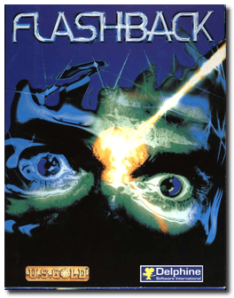](Flashback/README.md)  &nbsp;&nbsp;&nbsp;&nbsp;&nbsp;&nbsp;&nbsp;&nbsp;&nbsp;&nbsp;&nbsp;&nbsp;&nbsp;&nbsp;&nbsp;&nbsp;&nbsp;&nbsp;&nbsp;&nbsp;&nbsp;&nbsp;&nbsp;&nbsp;&nbsp;&nbsp;&nbsp;&nbsp;&nbsp;&nbsp;&nbsp;&nbsp;&nbsp;&nbsp;&nbsp;&nbsp; |  â You are Conrad B. Hart, Galaxis Bureau of Investigation Agent, stranded on a far-away planet after discovering an alien plot to overtake Earth. You must travel and find your way through four planets back to Earth and foil the aliens' sinister and deadly plans. â  â This game **is not abandonware 🚫** and is still for sale on [GOG 💰](https://www.gog.com/en/game/flashback). â  |

---

| [Flight of the Amazon Queen](Flight%20of%20the%20Amazon%20Queen/README.md) | 📌 ┃ **Year** ‣ 1995 ┃ **Genre** ‣ Adventure ┃ **Platform** ‣ DOS ┃ **License** ‣ Freeware ┃ **Media** ‣ CD-ROM  |
|:---:|:---|
|    &nbsp;&nbsp;&nbsp;&nbsp;&nbsp;&nbsp;&nbsp;&nbsp;&nbsp;&nbsp;&nbsp;&nbsp;&nbsp;&nbsp;&nbsp;&nbsp;&nbsp;&nbsp;&nbsp;&nbsp;&nbsp;&nbsp;&nbsp;&nbsp;&nbsp;&nbsp;&nbsp;&nbsp;&nbsp;&nbsp;&nbsp;&nbsp;&nbsp;&nbsp;&nbsp;&nbsp; |  â Joe King, a pilot for hire and owner of the Amazon Queen aeroplane, arrives at a hotel in Rio de Janeiro to transport his next customer, famous film actress Faye Russel, only to be ambushed by his Dutch rival Anderson. When Joe pilots the Amazon Queen towards the location of Faye's shoot, a storm causes him to crashland in the Amazon jungle. Joe begins searching the jungle, encountering an entire tribe of Amazon women who capture him and take in Faye. â  â In March 2004, the game was released as freeware, and support for it was added to ScummVM, allowing it to be played on Linux, Mac OS X, Windows, and many other operating systems and consoles. â — *Wikipedia*  |

---

| [Frankenstein: Through the Eyes of the Monster](Frankenstein%20-%20Through%20the%20Eyes%20of%20the%20Monster/README.md) | 📌 ┃ **Year** ‣ 1995 ┃ **Genre** ‣ Adventure ┃ **Platform** ‣ Windows 3.1x ┃ **License** ‣ Abandonware ┃ **Media** ‣ CD-ROM  |
|:---:|:---|
|    &nbsp;&nbsp;&nbsp;&nbsp;&nbsp;&nbsp;&nbsp;&nbsp;&nbsp;&nbsp;&nbsp;&nbsp;&nbsp;&nbsp;&nbsp;&nbsp;&nbsp;&nbsp;&nbsp;&nbsp;&nbsp;&nbsp;&nbsp;&nbsp;&nbsp;&nbsp;&nbsp;&nbsp;&nbsp;&nbsp;&nbsp;&nbsp;&nbsp;&nbsp;&nbsp;&nbsp; |  â Between life and death, man and monster, lies the test of the human heart. With a crash of lightning, you are reborn to a world of haunted memories and science pushed beyond the bounds of nature. Your thoughts come slowly like distant echoes. The mystery of your existence pulls at your mind: An ancient castle of dark secrets and hidden terrors; A strange crystal glows with life itself. The burning memory of a child long thought dead and a discovery that crosses the boundaries between life and death. â  |

---

| [Full Throttle](Full%20Throttle/README.md) | 📌 ┃ **Year** ‣ 1995 ┃ **Genre** ‣ Adventure ┃ **Platform** ‣ DOS ┃ **License** ‣ Proprietary ┃ **Media** ‣ CD-ROM  |
|:---:|:---|
|    &nbsp;&nbsp;&nbsp;&nbsp;&nbsp;&nbsp;&nbsp;&nbsp;&nbsp;&nbsp;&nbsp;&nbsp;&nbsp;&nbsp;&nbsp;&nbsp;&nbsp;&nbsp;&nbsp;&nbsp;&nbsp;&nbsp;&nbsp;&nbsp;&nbsp;&nbsp;&nbsp;&nbsp;&nbsp;&nbsp;&nbsp;&nbsp;&nbsp;&nbsp;&nbsp;&nbsp; |  â You're Ben. You're on the road. You're indestructible. You'll do whatever it takes to clear your name from a bum murder rap - Like fighting ugly gangs with futuristic bikes and Neolithic weapons, running big rigs off the road at 100 mph, making people pay. But that is what happens when you live your life at Full Throttle. â  â This game **is not abandonware 🚫** and is still for sale on [GOG 💰](https://www.gog.com/en/game/full_throttle_remastered). â  |

---

| [Future Wars: Adventures in Time](Future%20Wars%20-%20Adventures%20in%20Time/README.md) | 📌 ┃ **Year** ‣ 1990 ┃ **Genre** ‣ Adventure ┃ **Platform** ‣ DOS ┃ **License** ‣ Abandonware ┃ **Media** ‣ CD-ROM  |
|:---:|:---|
|    &nbsp;&nbsp;&nbsp;&nbsp;&nbsp;&nbsp;&nbsp;&nbsp;&nbsp;&nbsp;&nbsp;&nbsp;&nbsp;&nbsp;&nbsp;&nbsp;&nbsp;&nbsp;&nbsp;&nbsp;&nbsp;&nbsp;&nbsp;&nbsp;&nbsp;&nbsp;&nbsp;&nbsp;&nbsp;&nbsp;&nbsp;&nbsp;&nbsp;&nbsp;&nbsp;&nbsp; |  â In the 43rd century, an alien race is attacking Earth. The planet is well-protected by a formidable SDI defence that the aliens cannot penetrate. Until they hit a plan, sabotage the defences before they are built by travelling back in time to plant delayed-action bombs at strategic places! Your adventure starts in the present day when, innocently attempting to avoid your boss at work, you stumble across a secret passage that transports you ‘back in time' to the start of a quest that takes you into the Middle Ages, Prehistoric Times, and the distant future. â  |

---

| [Gabriel Knight: Sins of the Fathers](Gabriel%20Knight%20-%20Sins%20of%20the%20Fathers/README.md) | 📌 ┃ **Year** ‣ 1993 ┃ **Genre** ‣ Adventure ┃ **Platform** ‣ DOS ┃ **License** ‣ Proprietary ┃ **Media** ‣ CD-ROM ┃ **Patched** ‣ 1.0a  |
|:---:|:---|
|    &nbsp;&nbsp;&nbsp;&nbsp;&nbsp;&nbsp;&nbsp;&nbsp;&nbsp;&nbsp;&nbsp;&nbsp;&nbsp;&nbsp;&nbsp;&nbsp;&nbsp;&nbsp;&nbsp;&nbsp;&nbsp;&nbsp;&nbsp;&nbsp;&nbsp;&nbsp;&nbsp;&nbsp;&nbsp;&nbsp;&nbsp;&nbsp;&nbsp;&nbsp;&nbsp;&nbsp; |  â He started out writing a book on voodoo. Now, he's fighting for his very soul. Gabriel Knight is the last in a long line of Shadow Hunters, those fated to fight the dark forces of the supernatural. Haunted by a centuries-old curse, terrifying nightmares torment him. Now, he must spend every waking moment scouring the side streets and back alleys of New Orleans for the key to his dark past. And when he sleeps - the nightmare begins. â  â This game **is not abandonware 🚫** and is still for sale on [GOG 💰](https://www.gog.com/en/game/gabriel_knight_sins_of_the_fathers) and [Steam 💰](https://store.steampowered.com/app/495700/Gabriel_Knight_Sins_of_the_Father/). â  |

---

| [Gabriel Knight 2: The Beast Within](Gabriel%20Knight%202%20-%20The%20Beast%20Within/README.md) | 📌 ┃ **Year** ‣ 1995 ┃ **Genre** ‣ Adventure ┃ **Platform** ‣ DOS ┃ **License** ‣ Proprietary ┃ **Media** ‣ CD-ROM  |
|:---:|:---|
|    &nbsp;&nbsp;&nbsp;&nbsp;&nbsp;&nbsp;&nbsp;&nbsp;&nbsp;&nbsp;&nbsp;&nbsp;&nbsp;&nbsp;&nbsp;&nbsp;&nbsp;&nbsp;&nbsp;&nbsp;&nbsp;&nbsp;&nbsp;&nbsp;&nbsp;&nbsp;&nbsp;&nbsp;&nbsp;&nbsp;&nbsp;&nbsp;&nbsp;&nbsp;&nbsp;&nbsp; |  â Now we find Schattenjäger, or shadow hunter, Gabriel and his assistant Grace deeply embroiled in a murder mystery that unravels half a world away. Play as both Gabriel and Grace as they are dispatched to Munich to solve a series of mutilation murders thought to be the work of werewolves. Gabriel confronts his demons while Grace traces a historical mystery, that of the strange demise of Mad King Ludwig II. The hunters become the hunted, and the only hope for deliverance lies in the most desperate schemes. â  â This game **is not abandonware 🚫** and is still for sale on [GOG 💰](https://gog.com/en/game/gabriel_knight_2_the_beast_within) and [Steam 💰](https://store.steampowered.com/app/496760/The_Beast_Within_A_Gabriel_Knight_Mystery/). â  |

---

| [Gobliiins](Gobliiins/README.md) | 📌 ┃ **Year** ‣ 1991 ┃ **Genre** ‣ Puzzle ┃ **Platform** ‣ DOS ┃ **License** ‣ Proprietary ┃ **Media** ‣ CD-ROM  |
|:---:|:---|
|  [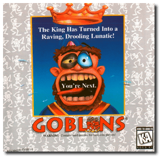](Gobliiins/README.md)  &nbsp;&nbsp;&nbsp;&nbsp;&nbsp;&nbsp;&nbsp;&nbsp;&nbsp;&nbsp;&nbsp;&nbsp;&nbsp;&nbsp;&nbsp;&nbsp;&nbsp;&nbsp;&nbsp;&nbsp;&nbsp;&nbsp;&nbsp;&nbsp;&nbsp;&nbsp;&nbsp;&nbsp;&nbsp;&nbsp;&nbsp;&nbsp;&nbsp;&nbsp;&nbsp;&nbsp; |  â Can you help the Good King regain his sanity before you lose yours forever? Your mission is to track down the dark force abusing the Good King's voodoo doll. Find them, stop them, and usher in an era of peace and prosperity. Simple, huh? Wrong! Gobliiins is a warped and wonderful quest, filled with level after level of truly twisted objects, inventory, and logic puzzles. You command Hooter, Dwayne, and BoBo, three eager imps with specific skills. Hooter casts spells. Dwayne can pick objects up and use them. BoBo has a mean right hook. Individually, they're no match for the dark force, but together, they're still no match. That's where you come in. â  â This game **is not abandonware 🚫**. A **Gobliiins Pack** release is available on [GOG 💰](https://www.gog.com/en/game/gobliiins_pack). â  |

---

| [Gobliins 2: The Prince Buffoon](Gobliins%202%20-%20The%20Prince%20Buffoon/README.md) | 📌 ┃ **Year** ‣ 1992 ┃ **Genre** ‣ Puzzle ┃ **Platform** ‣ DOS ┃ **License** ‣ Proprietary ┃ **Media** ‣ CD-ROM  |
|:---:|:---|
|    &nbsp;&nbsp;&nbsp;&nbsp;&nbsp;&nbsp;&nbsp;&nbsp;&nbsp;&nbsp;&nbsp;&nbsp;&nbsp;&nbsp;&nbsp;&nbsp;&nbsp;&nbsp;&nbsp;&nbsp;&nbsp;&nbsp;&nbsp;&nbsp;&nbsp;&nbsp;&nbsp;&nbsp;&nbsp;&nbsp;&nbsp;&nbsp;&nbsp;&nbsp;&nbsp;&nbsp; |  â Have you seen the three mischievous Gobliiins yet, those irresistibly funny and unpredictable characters? This time, there are two of them: Angus, the diplomat, and Winkle, the practical joker. They set off to find a kidnapped young Prince by the evil Demon King. This imposter is trying to make a jester out of him. How wicked! Never forget that to progress through this action-packed adventure littered with traps, Fingus and Winkle often have to work together to combine strength and deceit, resulting in a couple of cheeky characters. â  â This game **is not abandonware 🚫**. A **Gobliiins Pack** release is available on [GOG 💰](https://www.gog.com/en/game/gobliiins_pack). â  |

---

| [Goblins Quest 3](Goblins%20Quest%203/README.md) | 📌 ┃ **Year** ‣ 1993 ┃ **Genre** ‣ Puzzle ┃ **Platform** ‣ DOS ┃ **License** ‣ Proprietary ┃ **Media** ‣ CD-ROM  |
|:---:|:---|
|    &nbsp;&nbsp;&nbsp;&nbsp;&nbsp;&nbsp;&nbsp;&nbsp;&nbsp;&nbsp;&nbsp;&nbsp;&nbsp;&nbsp;&nbsp;&nbsp;&nbsp;&nbsp;&nbsp;&nbsp;&nbsp;&nbsp;&nbsp;&nbsp;&nbsp;&nbsp;&nbsp;&nbsp;&nbsp;&nbsp;&nbsp;&nbsp;&nbsp;&nbsp;&nbsp;&nbsp; |  â There is a mysterious labyrinth harbouring great secrets that might fulfil the wishes of those who discover them. Two countries ruled by Queen Xina and King Bodd have been competing over the right to explore the maze. However, strange events started happening one after the other: the labyrinth guardian died, his daughter disappeared, and King Bodd fell under some curse. A goblin reporter named Blount gets caught amid these events as he attempts to interview the queen and the king. Blount also gets bitten by a werewolf, falls in love, and must find a way to deal with both predicaments. â  â This game **is not abandonware 🚫**. A **Gobliiins Pack** release is available on [GOG 💰](https://www.gog.com/en/game/gobliiins_pack). â  |

---

| [God of Thunder](God%20of%20Thunder/README.md) | 📌 ┃ **Year** ‣ 1993 ┃ **Genre** ‣ Action ┃ **Platform** ‣ DOS ┃ **License** ‣ Freeware ┃ **Media** ‣ Compressed Package  |
|:---:|:---|
|    &nbsp;&nbsp;&nbsp;&nbsp;&nbsp;&nbsp;&nbsp;&nbsp;&nbsp;&nbsp;&nbsp;&nbsp;&nbsp;&nbsp;&nbsp;&nbsp;&nbsp;&nbsp;&nbsp;&nbsp;&nbsp;&nbsp;&nbsp;&nbsp;&nbsp;&nbsp;&nbsp;&nbsp;&nbsp;&nbsp;&nbsp;&nbsp;&nbsp;&nbsp;&nbsp;&nbsp; |  â You are Thor, The God of Thunder! Your father is Odin, the mightiest Norse God and the ruler of Asgard. Odin must fall into a deep sleep (known as the Odinsleep) every few hundred centuries to rejuvenate his power. Your half-brother is Loki, The God of Mischief. Loki has seized the opportunity of this most recent Odinsleep and obtained the help of his most powerful allies to take control of Midgard (Earth). â  â On March 27, 2020, Ron Davis released the source code, music and sound effects as public-domain software on SourceForge. â — *Wikipedia*  |

---

| [Heretic: Shadow of the Serpent Riders](Heretic/README.md) | 📌 ┃ **Year** ‣ 1996 ┃ **Genre** ‣ Action ┃ **Platform** ‣ DOS ┃ **License** ‣ Proprietary ┃ **Media** ‣ CD-ROM  |
|:---:|:---|
|  [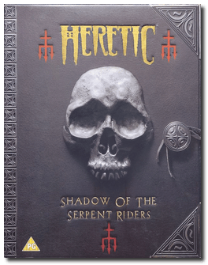](Heretic/README.md)  &nbsp;&nbsp;&nbsp;&nbsp;&nbsp;&nbsp;&nbsp;&nbsp;&nbsp;&nbsp;&nbsp;&nbsp;&nbsp;&nbsp;&nbsp;&nbsp;&nbsp;&nbsp;&nbsp;&nbsp;&nbsp;&nbsp;&nbsp;&nbsp;&nbsp;&nbsp;&nbsp;&nbsp;&nbsp;&nbsp;&nbsp;&nbsp;&nbsp;&nbsp;&nbsp;&nbsp; |  â Evil grows darkest in the shadow. This chapter comes to its evil conclusion with Heretic: Shadow of the Serpent Riders. Undead creatures and bestial horrors have done the unthinkable - callously slaughtering your entire race. But the nightmare has just begun. Wielding ungodly weapons such as the Firemace or Hellstaff and casting spells from the tomes of power, you must seek your vengeance or die trying. â  â This game **is not abandonware 🚫** and is still for sale on [Steam 💰](https://store.steampowered.com/app/2390/Heretic_Shadow_of_the_Serpent_Riders/). A **Heretic + Hexen Collection** release is available on [GOG 💰](https://www.gog.com/game/heretic_hexen_collection). â  |

---

| [Heroes of Might and Magic: A Strategic Quest](Heroes%20of%20Might%20and%20Magic%20-%20A%20Strategic%20Quest/README.md) | 📌 ┃ **Year** ‣ 1995 ┃ **Genre** ‣ Strategy ┃ **Platform** ‣ DOS ┃ **License** ‣ Proprietary ┃ **Media** ‣ CD-ROM ┃ **Patched** ‣ 1.2  |
|:---:|:---|
|    &nbsp;&nbsp;&nbsp;&nbsp;&nbsp;&nbsp;&nbsp;&nbsp;&nbsp;&nbsp;&nbsp;&nbsp;&nbsp;&nbsp;&nbsp;&nbsp;&nbsp;&nbsp;&nbsp;&nbsp;&nbsp;&nbsp;&nbsp;&nbsp;&nbsp;&nbsp;&nbsp;&nbsp;&nbsp;&nbsp;&nbsp;&nbsp;&nbsp;&nbsp;&nbsp;&nbsp; |  â The realms of might and magic are expanding. You have discovered new lands. Rise to the challenge of conquering them. Beware, for many warlords have risen to test your leadership and tactics. You must carefully manage all the resources at your disposal or be defeated. Now is the time to recruit your heroes, gather your armies, and lead them to victory. â  â This game **is not abandonware 🚫** and is still for sale on [GOG 💰](https://www.gog.com/en/game/heroes_of_might_and_magic) and [Ubisoft 💰](https://store.ubisoft.com/us/heroes-of-might-and-magic/5928435d29e12307548b456a.html?lang=en_US). â  |

---

| [Heroes of Might and Magic II: Gold](Heroes%20of%20Might%20and%20Magic%20II/README.md) | 📌 ┃ **Year (Heroes of Might and Magic II: The Succession Wars)** ‣ 1996 ┃ **Year (Heroes of Might and Magic II: The Price of Loyalty)** ‣ 1997 ┃ **Year (Heroes of Might and Magic II: Gold)** ‣ 1998 ┃ **Genre** ‣ Strategy ┃ **Platform** ‣ Windows 9x ┃ **License** ‣ Proprietary ┃ **Media** ‣ CD-ROM ┃ **Add-on**  |
|:---:|:---|
|    &nbsp;&nbsp;&nbsp;&nbsp;&nbsp;&nbsp;&nbsp;&nbsp;&nbsp;&nbsp;&nbsp;&nbsp;&nbsp;&nbsp;&nbsp;&nbsp;&nbsp;&nbsp;&nbsp;&nbsp;&nbsp;&nbsp;&nbsp;&nbsp;&nbsp;&nbsp;&nbsp;&nbsp;&nbsp;&nbsp;&nbsp;&nbsp;&nbsp;&nbsp;&nbsp;&nbsp; |  â After years of peace under the benevolent rule of Lord Ironfist, the lands of Enroth again fall into turmoil. Twin sons, one good, one evil, fight for the coveted throne. Choose which side to support in the coming wars. Will you back the villainous usurper and lead his evil hordes, or be loyal to the righteous prince and lead the armies of light? The choice is yours, the challenge is immense, and the consequence of failure is death! â  â This game **is not abandonware 🚫** and is still for sale on [GOG 💰](https://www.gog.com/en/game/heroes_of_might_and_magic_2_gold_edition) and [Ubisoft 💰](https://store.ubisoft.com/us/heroes-of-might-and-magic-2--gold/5902fdf9ef3aa527608b4567.html?lang=en_US) â  |

---

| [Hexen: Beyond Heretic](Hexen%20-%20Beyond%20Heretic/README.md) | 📌 ┃ **Year** ‣ 1995 ┃ **Genre** ‣ Action ┃ **Platform** ‣ DOS ┃ **License** ‣ Proprietary ┃ **Media** ‣ CD-ROM  |
|:---:|:---|
|    &nbsp;&nbsp;&nbsp;&nbsp;&nbsp;&nbsp;&nbsp;&nbsp;&nbsp;&nbsp;&nbsp;&nbsp;&nbsp;&nbsp;&nbsp;&nbsp;&nbsp;&nbsp;&nbsp;&nbsp;&nbsp;&nbsp;&nbsp;&nbsp;&nbsp;&nbsp;&nbsp;&nbsp;&nbsp;&nbsp;&nbsp;&nbsp;&nbsp;&nbsp;&nbsp;&nbsp; |  â While you were battling the evil forces of D'Sparil, the other Serpent Riders were busy sowing the seeds of destruction in alternate dimensions. One such dimension is the decaying world where Hexen takes place. A world littered with the mangled corpses of nonbelievers and inhabited by the undead followers that executed them. Only three humans: a warrior, a mage, and a cleric - have escaped the leaders' vicious spell. Three brave souls have the sword to crush the evil regime that threatens to destroy the world forever. â  â This game **is not abandonware 🚫** and is still for sale on [GOG 💰](https://www.gog.com/en/game/hexen_beyond_heretic) and [Steam 💰](https://store.steampowered.com/app/2360/Hexen_Beyond_Heretic/). â  |

---

| [Hi-Octane](Hi-Octane/README.md) | 📌 ┃ **Year** ‣ 1995 ┃ **Genre** ‣ Racing ┃ **Platform** ‣ DOS ┃ **License** ‣ Abandonware ┃ **Media** ‣ CD-ROM ┃ **Patched** ‣ New tracks and new game modes ┃ **No Manual**  |
|:---:|:---|
|  [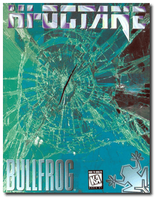](Hi-Octane/README.md)  &nbsp;&nbsp;&nbsp;&nbsp;&nbsp;&nbsp;&nbsp;&nbsp;&nbsp;&nbsp;&nbsp;&nbsp;&nbsp;&nbsp;&nbsp;&nbsp;&nbsp;&nbsp;&nbsp;&nbsp;&nbsp;&nbsp;&nbsp;&nbsp;&nbsp;&nbsp;&nbsp;&nbsp;&nbsp;&nbsp;&nbsp;&nbsp;&nbsp;&nbsp;&nbsp;&nbsp; |  â Racers drive to their death on the bleak streets of the 21st century. Hi-Octane puts you behind the wheel of an armour-plated Hov-Car capable of 400+mph. Race through city streets, open wastelands or deserts faster than a Ferrari and with accessories you'd never find on a Volvo (like a missile launcher and chain gun). If anyone gets in your way, remember your highway code: Mirror. Signal. Fire! â  |

---

| [I Have No Mouth, and I Must Scream](I%20Have%20No%20Mouth%2C%20and%20I%20Must%20Scream/README.md) | 📌 ┃ **Year** ‣ 1995 ┃ **Genre** ‣ Adventure ┃ **Platform** ‣ DOS ┃ **License** ‣ Proprietary ┃ **Media** ‣ CD-ROM  |
|:---:|:---|
|    &nbsp;&nbsp;&nbsp;&nbsp;&nbsp;&nbsp;&nbsp;&nbsp;&nbsp;&nbsp;&nbsp;&nbsp;&nbsp;&nbsp;&nbsp;&nbsp;&nbsp;&nbsp;&nbsp;&nbsp;&nbsp;&nbsp;&nbsp;&nbsp;&nbsp;&nbsp;&nbsp;&nbsp;&nbsp;&nbsp;&nbsp;&nbsp;&nbsp;&nbsp;&nbsp;&nbsp; |  â Assume the roles of five different characters, each in a unique environment. Challenging dilemma dealing with powerfully charged emotional issues. Provocative psychological and adult-oriented themes. Based on Harlan Ellison's short story "I Have No Mouth, and I Must Scream", one of the ten most reprinted stories in the English language. Buried deep within the centre of the Earth, trapped in the bowels of an insane computer for the past hundred and nine years: Gorrister the suicidal loner, Benny the mutilated brute, Ellen the hysterical phobic, Nimdok the secretive sadist, and Ted the cynical paranoid. â  â This game **is not abandonware 🚫** and is still for sale on [GOG 💰](https://www.gog.com/en/game/i_have_no_mouth_and_i_must_scream) and [Steam 💰](https://store.steampowered.com/app/245390/I_Have_No_Mouth_and_I_Must_Scream/). â  |

---

| [In the 1st Degree](In%20the%201st%20Degree/README.md) | 📌 ┃ **Year** ‣ 1995 ┃ **Genre** ‣ Adventure ┃ **Platform** ‣ Windows 3.1x ┃ **License** ‣ Abandonware ┃ **Media** ‣ CD-ROM ┃ **No Manual**  |
|:---:|:---|
|    &nbsp;&nbsp;&nbsp;&nbsp;&nbsp;&nbsp;&nbsp;&nbsp;&nbsp;&nbsp;&nbsp;&nbsp;&nbsp;&nbsp;&nbsp;&nbsp;&nbsp;&nbsp;&nbsp;&nbsp;&nbsp;&nbsp;&nbsp;&nbsp;&nbsp;&nbsp;&nbsp;&nbsp;&nbsp;&nbsp;&nbsp;&nbsp;&nbsp;&nbsp;&nbsp;&nbsp; |  â Someone is dead. Someone is lying. Can you prove Murder One? Some artists die for their art. James Tobin killed, or did he? As a D.A. in San Francisco, you must prove that he did. It has become the most sensational murder case to hit the Bay Area in years. Who will lead you to the truth? The passionate girlfriend of the accused? The socially connected wife of the victim? Perhaps his bitter apprentice? Every reluctant witness and shred of evidence may paint a homicidal portrait as chilling and surreal as one of Tobin's paintings. And as if that were not enough, everyone will be watching you on this one, especially the media. â  |

---

| [Indiana Jones and the Fate of Atlantis](Indiana%20Jones%20and%20the%20Fate%20of%20Atlantis/README.md) | 📌 ┃ **Year** ‣ 1992 ┃ **Genre** ‣ Adventure ┃ **Platform** ‣ DOS ┃ **License** ‣ Proprietary ┃ **Media** ‣ CD-ROM  |
|:---:|:---|
|    &nbsp;&nbsp;&nbsp;&nbsp;&nbsp;&nbsp;&nbsp;&nbsp;&nbsp;&nbsp;&nbsp;&nbsp;&nbsp;&nbsp;&nbsp;&nbsp;&nbsp;&nbsp;&nbsp;&nbsp;&nbsp;&nbsp;&nbsp;&nbsp;&nbsp;&nbsp;&nbsp;&nbsp;&nbsp;&nbsp;&nbsp;&nbsp;&nbsp;&nbsp;&nbsp;&nbsp; |  â Plato knew about Atlantis. In a lost dialogue, he wrote about the famed city and orichalcum, the mysterious element that powered the Atlanteans' stunning machinery. The Nazis know about Atlantis. They tracked down the lost dialogue and realized orichalcum would yield them the ultimate weapon of the age. Sophia knows about Atlantis. She unearthed a mysterious necklace and beads of orichalcum during an Icelandic archeological dig with Indy. Their magical properties made her a psychic. Everyone knows except Indy, and he has got to learn fast. The Nazis are one step ahead of him - from Iceland to North Africa and the Azores to Atlantis. â  â This game **is not abandonware 🚫** and is still for sale on [GOG 💰](https://www.gog.com/en/game/indiana_jones_and_the_fate_of_atlantis) and [Steam 💰](https://store.steampowered.com/app/6010/Indiana_Jones_and_the_Fate_of_Atlantis/). â  |

---

| [Indiana Jones and the Last Crusade: The Graphic Adventure](Indiana%20Jones%20and%20the%20Last%20Crusade%20-%20The%20Graphic%20Adventure/README.md) | 📌 ┃ **Year** ‣ 1989 ┃ **Genre** ‣ Adventure ┃ **Platform** ‣ DOS ┃ **License** ‣ Proprietary ┃ **Media** ‣ Floppy Disk  |
|:---:|:---|
|    &nbsp;&nbsp;&nbsp;&nbsp;&nbsp;&nbsp;&nbsp;&nbsp;&nbsp;&nbsp;&nbsp;&nbsp;&nbsp;&nbsp;&nbsp;&nbsp;&nbsp;&nbsp;&nbsp;&nbsp;&nbsp;&nbsp;&nbsp;&nbsp;&nbsp;&nbsp;&nbsp;&nbsp;&nbsp;&nbsp;&nbsp;&nbsp;&nbsp;&nbsp;&nbsp;&nbsp; |  â Europe, 1938. The Lost Ark was just a warm-up! Now, Adolph Hitler is after the most powerful talisman of all - the Holy Grail. A few brave men stand in his way. Fortunately, one of them is Indiana Jones, and he has his dad with him. The bad guys are in your face - mercenaries, traitors, and spies. Not to mention everything the Luftwaffe can throw at you. Can you handle the heat? If you can, you might earn a higher IQ (Indy Quotient) than the man with the whip and the hat. â  â This game **is not abandonware 🚫** and is still for sale on [GOG 💰](https://gog.com/en/game/indiana_jones_and_the_last_crusade) and [Steam 💰](https://store.steampowered.com/app/32310/Indiana_Jones_and_the_Last_Crusade/). â  |

---

| [Iron Helix](Iron%20Helix/README.md) | 📌 ┃ **Year** ‣ 1993 ┃ **Genre** ‣ Action • Strategy ┃ **Platform** ‣ Windows 3.1x ┃ **License** ‣ Abandonware ┃ **Media** ‣ CD-ROM  |
|:---:|:---|
|    &nbsp;&nbsp;&nbsp;&nbsp;&nbsp;&nbsp;&nbsp;&nbsp;&nbsp;&nbsp;&nbsp;&nbsp;&nbsp;&nbsp;&nbsp;&nbsp;&nbsp;&nbsp;&nbsp;&nbsp;&nbsp;&nbsp;&nbsp;&nbsp;&nbsp;&nbsp;&nbsp;&nbsp;&nbsp;&nbsp;&nbsp;&nbsp;&nbsp;&nbsp;&nbsp;&nbsp; |  â Iron Helix is a science fiction thriller that immerses you in a fast-paced virtual reality filled with danger and intrigue. Control a robot probe whose mission is to stop a renegade starship on an automated course of destruction. Prevent intergalactic war and the spread of a deadly virus by destroying the doomsday weapon - code name Iron Helix. Navigate through dozens of condors and rooms. Search for ways to stop the looming annihilation while eluding the ship's deadly defender robot. â  |

---

| [It Came from the Desert](It%20Came%20from%20the%20Desert/README.md) | 📌 ┃ **Year** ‣ 1990 ┃ **Genre** ‣ Action • Adventure ┃ **Platform** ‣ DOS ┃ **License** ‣ Abandonware ┃ **Media** ‣ CD-ROM  |
|:---:|:---|
|    &nbsp;&nbsp;&nbsp;&nbsp;&nbsp;&nbsp;&nbsp;&nbsp;&nbsp;&nbsp;&nbsp;&nbsp;&nbsp;&nbsp;&nbsp;&nbsp;&nbsp;&nbsp;&nbsp;&nbsp;&nbsp;&nbsp;&nbsp;&nbsp;&nbsp;&nbsp;&nbsp;&nbsp;&nbsp;&nbsp;&nbsp;&nbsp;&nbsp;&nbsp;&nbsp;&nbsp; |  â A crawling terror whose towering fury no one can escape. A new dimension in terror that will have you screaming for mercy. Ants, twenty feet tall, go marching one by one, using your hometown as a human picnic basket! Panic grips the city as these monster-sized mutations strike terror all over again. Witness science fiction become fact as the unimaginable becomes real and the impossible becomes true! You will marvel as the screen explodes with action so real you can feel the desert wind chap your parched lips. Sound effects are so eerie you can hear the distant marching of giant harvester ants on the prowl! â  â A collection of Cinemaware games is available as **Cinemaware Anthology: 1986-1991** release on [Steam 💰](https://store.steampowered.com/app/326590/Cinemaware_Anthology_19861991/). â  |

---

| [Jagged Alliance](Jagged%20Alliance/README.md) | 📌 ┃ **Year** ‣ 1995 ┃ **Genre** ‣ Role-playing • Strategy ┃ **Platform** ‣ DOS ┃ **License** ‣ Proprietary ┃ **Media** ‣ CD-ROM ┃ **Patched** ‣ 1.13b  |
|:---:|:---|
|    &nbsp;&nbsp;&nbsp;&nbsp;&nbsp;&nbsp;&nbsp;&nbsp;&nbsp;&nbsp;&nbsp;&nbsp;&nbsp;&nbsp;&nbsp;&nbsp;&nbsp;&nbsp;&nbsp;&nbsp;&nbsp;&nbsp;&nbsp;&nbsp;&nbsp;&nbsp;&nbsp;&nbsp;&nbsp;&nbsp;&nbsp;&nbsp;&nbsp;&nbsp;&nbsp;&nbsp; |  â The island of Metavira is invaluable as the only known source of the Fallow tree, whose sap is a vital ingredient in a precious medicinal sap. As the tree is seedless and cannot reproduce, the limited quantity of sap is of great concern. Jack and Brenda Richards, a father and daughter scientist team, are dedicated to researching the delicate procedure necessary to tap the trees and find a cure for infertility. Lucas Santino, a once trusted fellow researcher, now traitorous, has his agenda. Motivated by greed, Santino seeks to control the only source of the Fallow tree's sap and has nearly succeeded in taking over the island. Jack and Brenda turn to you, a person with connections to AIM (Association of International Mercenaries), their only hope of regaining control of the island. â  â This game **is not abandonware 🚫** and is still for sale on [GOG 💰](https://www.gog.com/en/game/jagged_alliance), [Zoom 💰](https://www.zoom-platform.com/product/jagged-alliance), and [Steam 💰](https://store.steampowered.com/app/283270/Jagged_Alliance_1_Gold_Edition/) (**Gold Edition** includes Deadly Games). â  |

---

| [Jagged Alliance: Deadly Games](Jagged%20Alliance%20-%20Deadly%20Games/README.md) | 📌 ┃ **Year** ‣ 1996 ┃ **Genre** ‣ Role-playing • Strategy ┃ **Platform** ‣ DOS ┃ **License** ‣ Proprietary ┃ **Media** ‣ CD-ROM ┃ **Patched** ‣ 1.13z ┃ **Extra Command**  |
|:---:|:---|
|    &nbsp;&nbsp;&nbsp;&nbsp;&nbsp;&nbsp;&nbsp;&nbsp;&nbsp;&nbsp;&nbsp;&nbsp;&nbsp;&nbsp;&nbsp;&nbsp;&nbsp;&nbsp;&nbsp;&nbsp;&nbsp;&nbsp;&nbsp;&nbsp;&nbsp;&nbsp;&nbsp;&nbsp;&nbsp;&nbsp;&nbsp;&nbsp;&nbsp;&nbsp;&nbsp;&nbsp; |  â The enemy is on the run. One more mortar shell should take them out. Still, your mission is to blow up the bridge by sundown, and Postie is starting to talk to himself again. Maybe you shouldn't let him keep that dynamite. Lock and load: it's time for Deadly Games. From the makers of Jagged Alliance, 1995's Game of the Year (Power Play magazine), comes the multiplayer strategy game with more new features than you can shake a grenade launcher at. â  â This game **is not abandonware 🚫** and is still for sale on [GOG 💰](https://www.gog.com/en/game/jagged_alliance_deadly_games), [Zoom 💰](https://www.zoom-platform.com/product/jagged-alliance-deadly-games), and [Steam 💰](https://store.steampowered.com/app/283270/Jagged_Alliance_1_Gold_Edition/) (**Gold Edition** includes Deadly Games). â  |

---

| [Jetpack](Jetpack/README.md) | 📌 ┃ **Year** ‣ 1993 ┃ **Genre** ‣ Action ┃ **Platform** ‣ DOS ┃ **License** ‣ Freeware ┃ **Media** ‣ Compressed Package  |
|:---:|:---|
|    &nbsp;&nbsp;&nbsp;&nbsp;&nbsp;&nbsp;&nbsp;&nbsp;&nbsp;&nbsp;&nbsp;&nbsp;&nbsp;&nbsp;&nbsp;&nbsp;&nbsp;&nbsp;&nbsp;&nbsp;&nbsp;&nbsp;&nbsp;&nbsp;&nbsp;&nbsp;&nbsp;&nbsp;&nbsp;&nbsp;&nbsp;&nbsp;&nbsp;&nbsp;&nbsp;&nbsp; |  â Use your Jetpack model L1069-E to explore 100 hazardous levels of dungeons! Equipped with Jet Turbines and armed with a powerful Phase Shifter, you quest for precious gems through dungeons full of treasures and peril. â  â Jetpack is a platform game available as freeware, developed by American studio Adept Software and originally published as shareware by Software Creations in 1993. â — *Wikipedia*  |

---

| [The Legend of Kyrandia - Book One](Legend%20of%20Kyrandia/README.md) | 📌 ┃ **Year** ‣ 1992 ┃ **Genre** ‣ Adventure ┃ **Platform** ‣ DOS ┃ **License** ‣ Proprietary ┃ **Media** ‣ CD-ROM  |
|:---:|:---|
|    &nbsp;&nbsp;&nbsp;&nbsp;&nbsp;&nbsp;&nbsp;&nbsp;&nbsp;&nbsp;&nbsp;&nbsp;&nbsp;&nbsp;&nbsp;&nbsp;&nbsp;&nbsp;&nbsp;&nbsp;&nbsp;&nbsp;&nbsp;&nbsp;&nbsp;&nbsp;&nbsp;&nbsp;&nbsp;&nbsp;&nbsp;&nbsp;&nbsp;&nbsp;&nbsp;&nbsp; |  â Kyrandia is a land of mysterious forests and sleeping dragons. A fantasy land where rubies grow on trees and magic abounds. Who would imagine a land so idyllic would spawn a murderer so demented? Some say that court jester Malcolm was mad, to begin with. His burning desire to possess the precious Kyragem slowly drove him to slay the peaceful King William. As the rightful prince of Kyrandia, you must pursue the elusive Malcolm to recover the powerful gemstone. Only then will you be able to reclaim the throne and restore harmony to the land of Kyrandia. The Legend of Kyrandia awaits you. â  â This game **is not abandonware 🚫** and is still for sale on [GOG 💰](https://www.gog.com/en/game/legend_of_kyrandia). â  |

---

| [The Legend of Kyrandia - Book Two: Hand of Fate](Legend%20of%20Kyrandia%202%20-%20Hand%20of%20fate/README.md) | 📌 ┃ **Year** ‣ 1993 ┃ **Genre** ‣ Adventure ┃ **Platform** ‣ DOS ┃ **License** ‣ Proprietary ┃ **Media** ‣ CD-ROM  |
|:---:|:---|
|    &nbsp;&nbsp;&nbsp;&nbsp;&nbsp;&nbsp;&nbsp;&nbsp;&nbsp;&nbsp;&nbsp;&nbsp;&nbsp;&nbsp;&nbsp;&nbsp;&nbsp;&nbsp;&nbsp;&nbsp;&nbsp;&nbsp;&nbsp;&nbsp;&nbsp;&nbsp;&nbsp;&nbsp;&nbsp;&nbsp;&nbsp;&nbsp;&nbsp;&nbsp;&nbsp;&nbsp; |  â Now you see it. Now you don't. The land of Kyrandia is disappearing piece by piece. You are the offbeat, young mystic who must voyage to the centre of the world to break the curse and save it. Your surreal journey will twist even the sharpest of minds. Travelling through a vast, weirdly beautiful terrain, you must concoct potions, cast spells, and lure the help of some very bizarre inhabitants to uncover the secrets that doom Kyrandia. â  â This game **is not abandonware 🚫** and is still for sale on [GOG 💰](https://www.gog.com/en/game/legend_of_kyrandia_hand_of_fate). â  |

---

| [The Legend of Kyrandia - Book Three: Malcolm's Revenge](Legend%20of%20Kyrandia%203%20-%20Malcolm%27s%20Revenge/README.md) | 📌 ┃ **Year** ‣ 1994 ┃ **Genre** ‣ Adventure ┃ **Platform** ‣ DOS ┃ **License** ‣ Proprietary ┃ **Media** ‣ CD-ROM  |
|:---:|:---|
|    &nbsp;&nbsp;&nbsp;&nbsp;&nbsp;&nbsp;&nbsp;&nbsp;&nbsp;&nbsp;&nbsp;&nbsp;&nbsp;&nbsp;&nbsp;&nbsp;&nbsp;&nbsp;&nbsp;&nbsp;&nbsp;&nbsp;&nbsp;&nbsp;&nbsp;&nbsp;&nbsp;&nbsp;&nbsp;&nbsp;&nbsp;&nbsp;&nbsp;&nbsp;&nbsp;&nbsp; |  â As punishment for the murder of Kyrandia's King and Queen, Malcolm, the warped court jester, was turned to stone. Years later, a freak accident has set him free to exact his sweet revenge, and you need to help him. Use magic, guile, cunning and devious disguises to explore the island of Kyrandia and beyond, from the Ends of the Earth to the Underworld. Discover the secrets of the Isle of Cats and the Cave of Wonder, and meet a cast of quirky characters: pugnacious pirates, the foolish Fish Cream Jerk, and the dead Queen Katherine. â  â This game **is not abandonware 🚫** and is still for sale on [GOG 💰](https://gog.com/en/game/legend_of_kyrandia_malcolms_revenge). â  |

---

| [Lighthouse: The Dark Being](Lighthouse%20-%20The%20Dark%20Being/README.md) | 📌 ┃ **Year** ‣ 1996 ┃ **Genre** ‣ Adventure ┃ **Platform** ‣ DOS ┃ **License** ‣ Proprietary ┃ **Media** ‣ CD-ROM ┃ **Patched** ‣ 2.0  |
|:---:|:---|
|    &nbsp;&nbsp;&nbsp;&nbsp;&nbsp;&nbsp;&nbsp;&nbsp;&nbsp;&nbsp;&nbsp;&nbsp;&nbsp;&nbsp;&nbsp;&nbsp;&nbsp;&nbsp;&nbsp;&nbsp;&nbsp;&nbsp;&nbsp;&nbsp;&nbsp;&nbsp;&nbsp;&nbsp;&nbsp;&nbsp;&nbsp;&nbsp;&nbsp;&nbsp;&nbsp;&nbsp; |  â Pass through a shimmering portal into a world teeming with invention, discovery, and evil. Dark Being terrorized a parallel universe. Alien technology, unearthly treachery, and brain-twisting danger skulk around every craggy cliff and corner. Lives and worlds hang in the balance. Dr. Jeremiah Krick summoned you on a rescue mission. Do you have the courage and the imagination to leave your world and enter the unknown? You are the beacon of hope in a strange and barren world. â  â This game **is not abandonware 🚫** and is still for sale on [GOG 💰](https://gog.com/en/game/lighthouse_the_dark_being). â  |

---

| [Little Big Adventure](Little%20Big%20Adventure/README.md) | 📌 ┃ **Year** ‣ 1994 ┃ **Genre** ‣ Action • Adventure ┃ **Platform** ‣ DOS ┃ **License** ‣ Proprietary ┃ **Media** ‣ CD-ROM  |
|:---:|:---|
|    &nbsp;&nbsp;&nbsp;&nbsp;&nbsp;&nbsp;&nbsp;&nbsp;&nbsp;&nbsp;&nbsp;&nbsp;&nbsp;&nbsp;&nbsp;&nbsp;&nbsp;&nbsp;&nbsp;&nbsp;&nbsp;&nbsp;&nbsp;&nbsp;&nbsp;&nbsp;&nbsp;&nbsp;&nbsp;&nbsp;&nbsp;&nbsp;&nbsp;&nbsp;&nbsp;&nbsp; |  â Chilling dreams of destruction and doom fill your mind. You feel compelled to warn the world. In doing so, the tyrannous Dr. Funfrock imprisoned you. Are you in prison because of a dream? You know in your soul that you must escape somehow and discover the meaning behind this mystery. As Twinsen, prophet and saviour, you embark on a surreal and suspenseful journey. You cross continents to save the world and stop your evil nemesis. Your enemies may overtake you at any moment. Relentless you must be, for only those who remain pure can overcome the peril that awaits. â  â In October 2021 both Little Big Adventure 1 and 2 engines source code were released under the GPL. â — *Wikipedia*  â The free original version is available on [GOG 🆓](https://www.gog.com/en/game/twinsens_little_big_adventure_classic_original_edition) and [Steam 🆓](https://store.steampowered.com/app/1857700/Twinsens_Little_Big_Adventure_Classic__Original_Edition/). The updated and enhanced version is available on [GOG 💰](https://www.gog.com/en/game/little_big_adventure) and [Steam 💰](https://store.steampowered.com/app/397330/Twinsens_Little_Big_Adventure_Classic/). â  |

---

| [Little Big Adventure 2](Little%20Big%20Adventure%202/README.md) | 📌 ┃ **Year** ‣ 1997 ┃ **Genre** ‣ Action • Adventure ┃ **Platform** ‣ DOS ┃ **License** ‣ Proprietary ┃ **Media** ‣ CD-ROM  |
|:---:|:---|
|    &nbsp;&nbsp;&nbsp;&nbsp;&nbsp;&nbsp;&nbsp;&nbsp;&nbsp;&nbsp;&nbsp;&nbsp;&nbsp;&nbsp;&nbsp;&nbsp;&nbsp;&nbsp;&nbsp;&nbsp;&nbsp;&nbsp;&nbsp;&nbsp;&nbsp;&nbsp;&nbsp;&nbsp;&nbsp;&nbsp;&nbsp;&nbsp;&nbsp;&nbsp;&nbsp;&nbsp; |  â Twinsen, the plucky hero of Relentless, returns to face his greatest challenge ever. When strange aliens arrive from a neighbouring planet and begin kidnapping magicians and children, Twinsen uncovers an evil plot to obliterate his homeworld. In an epic adventure that will propel him across the galaxy, Twinsen must defeat the aliens and their evil god, the Dark Monk, and save his planet. â  â In October 2021 both Little Big Adventure 1 and 2 engines source code were released under the GPL. â — *Wikipedia*  â The free original version is available on [GOG 🆓](https://www.gog.com/en/game/twinsens_little_big_adventure_2_classic_original_edition) and [Steam 🆓](https://store.steampowered.com/app/1857710/Twinsens_Little_Big_Adventure_2_Classic__Original_Edition/). The updated and enhanced version is available on [GOG 💰](https://www.gog.com/en/game/little_big_adventure_2) and [Steam 💰](https://store.steampowered.com/app/398000/Twinsens_Little_Big_Adventure_2_Classic/). â  |

---

| [Lode Runner: The Legend Returns](Lode%20Runner%20-%20The%20Legend%20Returns/README.md) | 📌 ┃ **Year** ‣ 1994 ┃ **Genre** ‣ Action • Puzzle ┃ **Platform** ‣ Windows 3.1x ┃ **License** ‣ Abandonware ┃ **Media** ‣ CD-ROM  |
|:---:|:---|
|    &nbsp;&nbsp;&nbsp;&nbsp;&nbsp;&nbsp;&nbsp;&nbsp;&nbsp;&nbsp;&nbsp;&nbsp;&nbsp;&nbsp;&nbsp;&nbsp;&nbsp;&nbsp;&nbsp;&nbsp;&nbsp;&nbsp;&nbsp;&nbsp;&nbsp;&nbsp;&nbsp;&nbsp;&nbsp;&nbsp;&nbsp;&nbsp;&nbsp;&nbsp;&nbsp;&nbsp; |  â You're Jake Peril, the ultimate bounty hunter and all-around hero type, racing underground through the Evil Empire to regain the world's stolen treasures. If you do the job right, you'll be rich and famous - if not, you'll be ripped to bits by the deadly Mad Monks. Zap traps for these masters of murder and mayhem with your trusty laser pistol, or foil them with transporters, gas, ooze, and even bombs! â  |

---

| [Loom](Loom/README.md) | 📌 ┃ **Year** ‣ 1990 ┃ **Genre** ‣ Adventure ┃ **Platform** ‣ DOS ┃ **License** ‣ Proprietary ┃ **Media** ‣ CD-ROM  |
|:---:|:---|
|    &nbsp;&nbsp;&nbsp;&nbsp;&nbsp;&nbsp;&nbsp;&nbsp;&nbsp;&nbsp;&nbsp;&nbsp;&nbsp;&nbsp;&nbsp;&nbsp;&nbsp;&nbsp;&nbsp;&nbsp;&nbsp;&nbsp;&nbsp;&nbsp;&nbsp;&nbsp;&nbsp;&nbsp;&nbsp;&nbsp;&nbsp;&nbsp;&nbsp;&nbsp;&nbsp;&nbsp; |  â Long after the passing of the Second Shadow, when dragons ruled the twilight sky and the stars were bright and numerous, came the Age of the Great Guilds. Blacksmiths, Shepherds, Clerics. Each dedicates themself to the absolute control of secret knowledge. Another such Guild was the Weavers. Over the centuries, their craft transcended the limits of physical cloth - until they wove the very fabric of reality itself. Now, a strange power has swept the Weavers into oblivion, leaving behind one Weaver boy to unravel the mystery. Help young Bobbin rescue his Guild. You might save the Universe from an unspeakable catastrophe. â  â This game **is not abandonware 🚫** and is still for sale on [GOG 💰](https://gog.com/en/game/loom) and [Steam 💰](https://store.steampowered.com/app/32340/LOOM/). â  |

---

| [Lure of the Temptress](Lure%20of%20the%20Temptress/README.md) | 📌 ┃ **Year** ‣ 1992 ┃ **Genre** ‣ Adventure ┃ **Platform** ‣ DOS ┃ **License** ‣ Freeware ┃ **Media** ‣ CD-ROM  |
|:---:|:---|
|    &nbsp;&nbsp;&nbsp;&nbsp;&nbsp;&nbsp;&nbsp;&nbsp;&nbsp;&nbsp;&nbsp;&nbsp;&nbsp;&nbsp;&nbsp;&nbsp;&nbsp;&nbsp;&nbsp;&nbsp;&nbsp;&nbsp;&nbsp;&nbsp;&nbsp;&nbsp;&nbsp;&nbsp;&nbsp;&nbsp;&nbsp;&nbsp;&nbsp;&nbsp;&nbsp;&nbsp; |  â You play Diermot, who finds himself imprisoned in a depressing cell. Meanwhile, life in the village of Turnvale goes on as ever, just an ordinary day. Well, as normal as you could hope for, considering the Skorl are in town. They're big, ugly, and not particularly pleasant! Will they overpower Diermot? Or can he escape from his cell and bring peace back to the land? It depends on you. â  â The game was well-received and re-released as freeware on April 1, 2003. â — *Wikipedia*  |

---

| [Magic Carpet Plus](Magic%20Carpet/README.md) | 📌 ┃ **Year (Magic Carpet)** ‣ 1994 ┃ **Year (Magic Carpet: Hidden Worlds)** ‣ 1995 ┃ **Year (Magic Carpet Plus)** ‣ 1995 ┃ **Genre** ‣ Action ┃ **Platform** ‣ DOS ┃ **License** ‣ Proprietary ┃ **Media** ‣ CD-ROM ┃ **Add-on**  |
|:---:|:---|
|    &nbsp;&nbsp;&nbsp;&nbsp;&nbsp;&nbsp;&nbsp;&nbsp;&nbsp;&nbsp;&nbsp;&nbsp;&nbsp;&nbsp;&nbsp;&nbsp;&nbsp;&nbsp;&nbsp;&nbsp;&nbsp;&nbsp;&nbsp;&nbsp;&nbsp;&nbsp;&nbsp;&nbsp;&nbsp;&nbsp;&nbsp;&nbsp;&nbsp;&nbsp;&nbsp;&nbsp; |  â Wizards discovered how to extract mana from nature. And though it initially had beneficial uses, the quest for it made the lands barren. Worse, many corrupt wizards began turning to mana for their nefarious purposes, eventually leading to war. The battling wizards began using more destructive spells and summoning deadly monsters, which often turned against them. One wizard hoped to end everything with an all-powerful magic spell but instead only left the worlds shattered. Only his apprentice survived. His goal is to restore the world to equilibrium. â  â This game **is not abandonware 🚫** and is still for sale on [GOG 💰](https://www.gog.com/en/game/magic_carpet). â  |

---

| [Magic Carpet 2: The Netherworlds](Magic%20Carpet%202%20-%20The%20Netherworlds/README.md) | 📌 ┃ **Year** ‣ 1995 ┃ **Genre** ‣ Action ┃ **Platform** ‣ DOS ┃ **License** ‣ Proprietary ┃ **Media** ‣ CD-ROM  |
|:---:|:---|
|    &nbsp;&nbsp;&nbsp;&nbsp;&nbsp;&nbsp;&nbsp;&nbsp;&nbsp;&nbsp;&nbsp;&nbsp;&nbsp;&nbsp;&nbsp;&nbsp;&nbsp;&nbsp;&nbsp;&nbsp;&nbsp;&nbsp;&nbsp;&nbsp;&nbsp;&nbsp;&nbsp;&nbsp;&nbsp;&nbsp;&nbsp;&nbsp;&nbsp;&nbsp;&nbsp;&nbsp; |  â Absolute Darkness enshrouds the city, revealing a gateway to indescribable evil. Through this portal, you must descend to defeat the Demon Lord and his minions. Once more, your fate is sealed by the Demon as you unfurl the magic carpet and battle hordes of vile creatures to purge the Netherworlds of evil. â  â This game **is not abandonware 🚫** and is still for sale on [GOG 💰](https://www.gog.com/en/game/magic_carpet_2_the_netherworlds). â  |

---

| [Mechanized Assault & Exploration](Mechanized%20Assault%20%26%20Exploration/README.md) | 📌 ┃ **Year** ‣ 1996 ┃ **Genre** ‣ Strategy ┃ **Platform** ‣ DOS ┃ **License** ‣ Proprietary ┃ **Media** ‣ CD-ROM ┃ **Patched** ‣ 1.04  |
|:---:|:---|
|    &nbsp;&nbsp;&nbsp;&nbsp;&nbsp;&nbsp;&nbsp;&nbsp;&nbsp;&nbsp;&nbsp;&nbsp;&nbsp;&nbsp;&nbsp;&nbsp;&nbsp;&nbsp;&nbsp;&nbsp;&nbsp;&nbsp;&nbsp;&nbsp;&nbsp;&nbsp;&nbsp;&nbsp;&nbsp;&nbsp;&nbsp;&nbsp;&nbsp;&nbsp;&nbsp;&nbsp; |  â Your mission: colonize new worlds on distant planets. As the Mission Commander of the Mechanized Assault & Exploration (M.A.X.) force, you are the first. Mining stations, power plants, tactical combat vehicle factories, habitats – it's up to you to plan and construct them. You create an entire new colony. You control the resources you find there. Enemies? Crush them! And there will be enemies. You're not the only Mission Commander trying to colonize the planets. You'll have to push yourself to the limit to survive the ultimate showdown in strategic warfare. It's espionage, heavy artillery, offensives, counter-offensives and intelligence, all with maximum consequences. â  â This game **is not abandonware 🚫** and is still for sale on [Steam 💰](https://store.steampowered.com/app/615250/MAX_Mechanized_Assault__Exploration/). A **M.A.X. + M.A.X. 2** bundle is available on [GOG 💰](https://www.gog.com/en/game/m_a_x_m_a_x_2). â  |

---

| [Mechanized Assault & Exploration 2](Mechanized%20Assault%20%26%20Exploration%202/README.md) | 📌 ┃ **Year** ‣ 1998 ┃ **Genre** ‣ Strategy ┃ **Platform** ‣ Windows 9x ┃ **License** ‣ Proprietary ┃ **Media** ‣ CD-ROM  |
|:---:|:---|
|    &nbsp;&nbsp;&nbsp;&nbsp;&nbsp;&nbsp;&nbsp;&nbsp;&nbsp;&nbsp;&nbsp;&nbsp;&nbsp;&nbsp;&nbsp;&nbsp;&nbsp;&nbsp;&nbsp;&nbsp;&nbsp;&nbsp;&nbsp;&nbsp;&nbsp;&nbsp;&nbsp;&nbsp;&nbsp;&nbsp;&nbsp;&nbsp;&nbsp;&nbsp;&nbsp;&nbsp; |  â As a Mission Commander exploring new worlds, your brain is wired directly into a sophisticated command and control centre. The mission: to colonize and defend a new world. â  â This game **is not abandonware 🚫** and is still for sale on [Steam 💰](https://store.steampowered.com/app/756810/MAX_2_Mechanized_Assault__Exploration/). A **M.A.X. + M.A.X. 2** bundle is available on [GOG 💰](https://www.gog.com/en/game/m_a_x_m_a_x_2). â  |

---

| [Mega Man X](Mega%20Man%20X/README.md) | 📌 ┃ **Year** ‣ 1995 ┃ **Genre** ‣ Action ┃ **Platform** ‣ DOS ┃ **License** ‣ Proprietary ┃ **Media** ‣ CD-ROM ┃ **No Manual**  |
|:---:|:---|
|    &nbsp;&nbsp;&nbsp;&nbsp;&nbsp;&nbsp;&nbsp;&nbsp;&nbsp;&nbsp;&nbsp;&nbsp;&nbsp;&nbsp;&nbsp;&nbsp;&nbsp;&nbsp;&nbsp;&nbsp;&nbsp;&nbsp;&nbsp;&nbsp;&nbsp;&nbsp;&nbsp;&nbsp;&nbsp;&nbsp;&nbsp;&nbsp;&nbsp;&nbsp;&nbsp;&nbsp; |  â Near the end of his life, Dr. Light succeeds in creating the first of a new series of robots that will change the world. Able to think and make decisions, this new robot holds great danger and possibilities. Fearful of the possible consequences of unleashing his creation on the World, Dr. Light decides to seal him in a capsule and test his systems until they are reliable. The future will have to choose his fate. â  â This game **is not abandonware 🚫**. The **Mega Man X Legacy Collection** release is available on [Steam 💰](https://store.steampowered.com/app/743890/Mega_Man_X_Legacy_Collection/). â  |

---

| [MegaRace](MegaRace/README.md) | 📌 ┃ **Year** ‣ 1994 ┃ **Genre** ‣ Action • Racing ┃ **Platform** ‣ DOS ┃ **License** ‣ Proprietary ┃ **Media** ‣ CD-ROM ┃ **Patched** ‣ 1.1  |
|:---:|:---|
|  [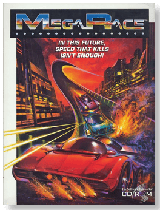](MegaRace/README.md)  &nbsp;&nbsp;&nbsp;&nbsp;&nbsp;&nbsp;&nbsp;&nbsp;&nbsp;&nbsp;&nbsp;&nbsp;&nbsp;&nbsp;&nbsp;&nbsp;&nbsp;&nbsp;&nbsp;&nbsp;&nbsp;&nbsp;&nbsp;&nbsp;&nbsp;&nbsp;&nbsp;&nbsp;&nbsp;&nbsp;&nbsp;&nbsp;&nbsp;&nbsp;&nbsp;&nbsp; |  â This race is so full of sound and fury, so graphic and realistic that you will squirm in your seat as you squeal around futuristic 3-0 cities in custom war wagons loaded with weapons. You'll have so much fun so fast it will make your head spin. Remember, your life depends on speed, cunning, and aggression. And you're going to need them all. You can't avoid tricky scum like Hammerhead and King Kool as their gangs try to take you out. But if you knock them off first, you can grab their guns and get going on the ride of your life. It's do or die. You haven't seen anything like this because there's never been anything like MegaRace. Strap yourself into this brave new world of battle racing and take it to the limit! â  â This game **is not abandonware 🚫** and is still for sale on [Steam 💰](https://store.steampowered.com/app/730580/MegaRace_1/) and [Zoom 💰](https://www.zoom-platform.com/product/megarace-1). The **MegaRace 1+2** bundle is available on [GOG 💰](https://gog.com/en/game/megarace_1_2). â  |

---

| [MegaRace 2](MegaRace%202/README.md) | 📌 ┃ **Year** ‣ 1996 ┃ **Genre** ‣ Racing ┃ **Platform** ‣ DOS ┃ **License** ‣ Proprietary ┃ **Media** ‣ CD-ROM  |
|:---:|:---|
|    &nbsp;&nbsp;&nbsp;&nbsp;&nbsp;&nbsp;&nbsp;&nbsp;&nbsp;&nbsp;&nbsp;&nbsp;&nbsp;&nbsp;&nbsp;&nbsp;&nbsp;&nbsp;&nbsp;&nbsp;&nbsp;&nbsp;&nbsp;&nbsp;&nbsp;&nbsp;&nbsp;&nbsp;&nbsp;&nbsp;&nbsp;&nbsp;&nbsp;&nbsp;&nbsp;&nbsp; |  â 3D Arcade racing game. It's faster, more furious and far superior to anything before. Lance Boyle is back with a beautiful assistant! It features improved video streaming technology, more complex multi-laned and multi-path track designs, and realistic 3D-rendered vehicles and obstacles. A new assortment of visually satisfying weaponry brings additional punch to the program. SVGA graphics, FMV and a real-time rendered 3-D environment. If you can't drive, you won't survive - Let's burn some rubber! â  â This game **is not abandonware 🚫** and is still for sale on [Steam 💰](https://store.steampowered.com/app/733760/MegaRace_2/) and [Zoom 💰](https://www.zoom-platform.com/product/megarace-2). The **MegaRace 1+2** bundle is available on [GOG 💰](https://gog.com/en/game/megarace_1_2). â  |

---

| [Milo](Milo/README.md) | 📌 ┃ **Year** ‣ 1996 ┃ **Genre** ‣ Adventure ┃ **Platform** ‣ Windows 3.1x ┃ **License** ‣ Abandonware ┃ **Media** ‣ CD-ROM  |
|:---:|:---|
|    &nbsp;&nbsp;&nbsp;&nbsp;&nbsp;&nbsp;&nbsp;&nbsp;&nbsp;&nbsp;&nbsp;&nbsp;&nbsp;&nbsp;&nbsp;&nbsp;&nbsp;&nbsp;&nbsp;&nbsp;&nbsp;&nbsp;&nbsp;&nbsp;&nbsp;&nbsp;&nbsp;&nbsp;&nbsp;&nbsp;&nbsp;&nbsp;&nbsp;&nbsp;&nbsp;&nbsp; |  â Long ago, an advanced Alien race discovered the key to the universe, a secret beyond human comprehension. What is left is a few incredible ruins and Milo, the android caretaker of the lost worlds. Milo has kept the ruins in good condition thanks to his advanced hyper-intelligent neural net. But he cannot go on forever. His artificial intelligence circuitry will fail if not challenged, and he's been left alone for too long. You have been brought to this place to challenge Milo. You must solve his tests and defeat him. Only then will he grant you the treasured keys to the universe? â  |

---

| [Mission Critical](Mission%20Critical/README.md) | 📌 ┃ **Year** ‣ 1995 ┃ **Genre** ‣ Adventure ┃ **Platform** ‣ DOS ┃ **License** ‣ Proprietary ┃ **Media** ‣ CD-ROM ┃ **Patched** ‣ 1.0.0 11-01-1995  |
|:---:|:---|
|    &nbsp;&nbsp;&nbsp;&nbsp;&nbsp;&nbsp;&nbsp;&nbsp;&nbsp;&nbsp;&nbsp;&nbsp;&nbsp;&nbsp;&nbsp;&nbsp;&nbsp;&nbsp;&nbsp;&nbsp;&nbsp;&nbsp;&nbsp;&nbsp;&nbsp;&nbsp;&nbsp;&nbsp;&nbsp;&nbsp;&nbsp;&nbsp;&nbsp;&nbsp;&nbsp;&nbsp; |  â After a savage battle in deep space, you are the only survivor aboard the USS Lexington, a badly damaged heavy cruiser. Your mission is to repair the hobbled ship and fend off the upcoming onslaught. Only then can you venture to an unexplored world 68 light years from Earth and discover the secret that could save the universe from interplanetary war. â  â This game **is not abandonware 🚫** and is still for sale on [GOG 💰](https://gog.com/en/game/mission_critical) and [Steam 💰](https://store.steampowered.com/app/1006460/Mission_Critical/). â  |

---

| [The Secret of Monkey Island](Monkey%20Island%20-%20The%20Secret%20of%20Monkey%20Island/README.md) | 📌 ┃ **Year** ‣ 1990 ┃ **Genre** ‣ Adventure ┃ **Platform** ‣ DOS ┃ **License** ‣ Proprietary ┃ **Media** ‣ Compressed Package  |
|:---:|:---|
|    &nbsp;&nbsp;&nbsp;&nbsp;&nbsp;&nbsp;&nbsp;&nbsp;&nbsp;&nbsp;&nbsp;&nbsp;&nbsp;&nbsp;&nbsp;&nbsp;&nbsp;&nbsp;&nbsp;&nbsp;&nbsp;&nbsp;&nbsp;&nbsp;&nbsp;&nbsp;&nbsp;&nbsp;&nbsp;&nbsp;&nbsp;&nbsp;&nbsp;&nbsp;&nbsp;&nbsp; |  â Welcome to the Port of Melee, Mr. Guybrush Threepwood. So you think you've got what it takes to be a swashbucklin', bloodthirsty pirate like the rest of us? Do you think a young swabby like yourself to be the first to tame mysterious Monkey Island? Well, laddy, there's more to being a buccaneer than just swinging a sword and swillin' gallons of Grog. First, you have to pass the Seadog test. Good luck! You are going to need it. â  â This version is the original/legacy release for DOS. This game **is not abandonware 🚫**. A **Special Edition** release is available on [GOG 💰](https://www.gog.com/en/game/the_secret_of_monkey_island_special_edition). â  |

---

| [Monkey Island 2: LeChuck's Revenge](Monkey%20Island%202%20-%20LeChuck%27s%20Revenge/README.md) | 📌 ┃ **Year** ‣ 1991 ┃ **Genre** ‣ Adventure ┃ **Platform** ‣ DOS ┃ **License** ‣ Proprietary ┃ **Media** ‣ Compressed Package  |
|:---:|:---|
|    &nbsp;&nbsp;&nbsp;&nbsp;&nbsp;&nbsp;&nbsp;&nbsp;&nbsp;&nbsp;&nbsp;&nbsp;&nbsp;&nbsp;&nbsp;&nbsp;&nbsp;&nbsp;&nbsp;&nbsp;&nbsp;&nbsp;&nbsp;&nbsp;&nbsp;&nbsp;&nbsp;&nbsp;&nbsp;&nbsp;&nbsp;&nbsp;&nbsp;&nbsp;&nbsp;&nbsp; |  â I thought I had killed the Ghost Pirate LeChuck for good. Wrong. How many times can that bloated old fool die? Other pirates tell me there's no escape. "When LeChuck wants you dead, you're dead", they say. Legend has it that the treasure of Big Whoop holds the key to great power. I must find it before LeChuck finds me. â  â This version is the original/legacy release for DOS. This game **is not abandonware 🚫**. A **Special Edition** release is available on [GOG 💰](https://www.gog.com/en/game/monkey_island_2_special_edition_lechucks_revenge). â  |

---

| [Myst](Myst/README.md) | 📌 ┃ **Year** ‣ 1994 ┃ **Genre** ‣ Adventure ┃ **Platform** ‣ Windows 3.1x ┃ **License** ‣ Proprietary ┃ **Media** ‣ CD-ROM  |
|:---:|:---|
|  [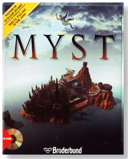](Myst/README.md)  &nbsp;&nbsp;&nbsp;&nbsp;&nbsp;&nbsp;&nbsp;&nbsp;&nbsp;&nbsp;&nbsp;&nbsp;&nbsp;&nbsp;&nbsp;&nbsp;&nbsp;&nbsp;&nbsp;&nbsp;&nbsp;&nbsp;&nbsp;&nbsp;&nbsp;&nbsp;&nbsp;&nbsp;&nbsp;&nbsp;&nbsp;&nbsp;&nbsp;&nbsp;&nbsp;&nbsp; |  â Journey to an island world surrealistically tinged with mystery, where every vibrant rock, a scrap of paper, and sound may hold vital clues to your unravelling a chilling tale of intrigue and injustice that defies all boundaries of time and space. Only your wits and imagination will serve to stay the course and unlock the ancient betrayal of ages past. â  â This game **is not abandonware 🚫**. A **Masterpiece Edition** release is available on [GOG 💰](https://www.gog.com/en/game/myst_masterpiece_edition) and [Steam 💰](https://store.steampowered.com/app/63660/Myst_Masterpiece_Edition/). â  |

---

| [Oddworld: Abe's Oddysee](Oddworld%20-%20Abe%27s%20Oddysee/README.md) | 📌 ┃ **Year** ‣ 1997 ┃ **Genre** ‣ Action • Puzzle ┃ **Platform** ‣ DOS ┃ **License** ‣ Proprietary ┃ **Media** ‣ CD-ROM  |
|:---:|:---|
|    &nbsp;&nbsp;&nbsp;&nbsp;&nbsp;&nbsp;&nbsp;&nbsp;&nbsp;&nbsp;&nbsp;&nbsp;&nbsp;&nbsp;&nbsp;&nbsp;&nbsp;&nbsp;&nbsp;&nbsp;&nbsp;&nbsp;&nbsp;&nbsp;&nbsp;&nbsp;&nbsp;&nbsp;&nbsp;&nbsp;&nbsp;&nbsp;&nbsp;&nbsp;&nbsp;&nbsp; |  â As Abe, you can whistle, laugh, hiss, and fart. In a lush world of diabolical danger where everyone wants to eat you, you are the skinny guy with no weapons. Run, jump, hide, scramble and talk your way past the ugliest bunch of carnivorous crustaceans ever created. Unlock your special powers to figure out your foes, and you might save your race. If not, you are for dinner! Enter Oddworld, a surreal, sensory overload of pure gaming and claim your destiny. Saviour. Or salami. â  â This game **is not abandonware 🚫** and is still for sale on [GOG 💰](https://www.gog.com/en/game/oddworld_abes_oddysee), [Steam 💰](https://store.steampowered.com/app/15700/Oddworld_Abes_Oddysee/), and [Zoom 💰](https://www.zoom-platform.com/product/oddworld-abes-oddysee). â  |

---

| [One Must Fall: 2097](One%20Must%20Fall%202097/README.md) | 📌 ┃ **Year** ‣ 1994 ┃ **Genre** ‣ Action ┃ **Platform** ‣ DOS ┃ **License** ‣ Freeware ┃ **Media** ‣ CD-ROM  |
|:---:|:---|
|    &nbsp;&nbsp;&nbsp;&nbsp;&nbsp;&nbsp;&nbsp;&nbsp;&nbsp;&nbsp;&nbsp;&nbsp;&nbsp;&nbsp;&nbsp;&nbsp;&nbsp;&nbsp;&nbsp;&nbsp;&nbsp;&nbsp;&nbsp;&nbsp;&nbsp;&nbsp;&nbsp;&nbsp;&nbsp;&nbsp;&nbsp;&nbsp;&nbsp;&nbsp;&nbsp;&nbsp; |  â Governments are puppets to big corporations. One of the largest corporations is "World Aeronautics and Robotics" (WAR). If you want to get ahead in the competitive corporate corridors of WAR, you need to master the use of human-assisted robots (HARs). These gigantic robots' purposes include defence and controlling far-flung planetary outposts. The next outpost up for colonization is Jupiter's moon Ganymede. The highly-paid job as pilot of the WAR representative will compete fiercely, and you must qualify for the position by proving your worth in the arena. It will be the grandest one-on-one combat since the Roman Era. â  â In February 1999, the game was declared freeware by the developers. â — *Wikipedia*  |

---

| [Out of This World](Out%20of%20This%20World/README.md) | 📌 ┃ **Year** ‣ 1991 ┃ **Genre** ‣ Action ┃ **Platform** ‣ DOS ┃ **License** ‣ Proprietary ┃ **Media** ‣ Compressed Package  |
|:---:|:---|
|    &nbsp;&nbsp;&nbsp;&nbsp;&nbsp;&nbsp;&nbsp;&nbsp;&nbsp;&nbsp;&nbsp;&nbsp;&nbsp;&nbsp;&nbsp;&nbsp;&nbsp;&nbsp;&nbsp;&nbsp;&nbsp;&nbsp;&nbsp;&nbsp;&nbsp;&nbsp;&nbsp;&nbsp;&nbsp;&nbsp;&nbsp;&nbsp;&nbsp;&nbsp;&nbsp;&nbsp; |  â There was only one chance out of one million such an accident could happen. As for the consequences, nobody could have foreseen them. Certainly not Lester, who finds himself lost in an unknown and utterly hostile world. However, he will rediscover the genuine meaning of freedom won by fighting, the feeling that each day is a new victory. â  â This game **is not abandonware 🚫** and is still for sale on [GOG 💰](https://www.gog.com/en/game/another_world_20th_anniversary_edition). â  |

---

| [Panic in the Park](Panic%20in%20the%20Park/README.md) | 📌 ┃ **Year** ‣ 1995 ┃ **Genre** ‣ Adventure ┃ **Platform** ‣ Windows 3.1x ┃ **License** ‣ Abandonware ┃ **Media** ‣ CD-ROM ┃ **No Manual**  |
|:---:|:---|
|    &nbsp;&nbsp;&nbsp;&nbsp;&nbsp;&nbsp;&nbsp;&nbsp;&nbsp;&nbsp;&nbsp;&nbsp;&nbsp;&nbsp;&nbsp;&nbsp;&nbsp;&nbsp;&nbsp;&nbsp;&nbsp;&nbsp;&nbsp;&nbsp;&nbsp;&nbsp;&nbsp;&nbsp;&nbsp;&nbsp;&nbsp;&nbsp;&nbsp;&nbsp;&nbsp;&nbsp; |  â A set of twins - one virtuous, one diabolical, both beautiful - are fighting for the fate of the aging Skyview amusement park, operated by the twin's father until his recent death. But there's more behind the park's gates than first meets the eye. As a reporter, you must navigate a complex web of intrigue to get to the heart of the mystery. It's up to you to help the twins find the park's missing deed by morning to save it from destruction. â  |

---

| [Pepper's Adventures in Time](Pepper%27s%20Adventures%20in%20Time/README.md) | 📌 ┃ **Year** ‣ 1993 ┃ **Genre** ‣ Adventure • Educational ┃ **Platform** ‣ DOS ┃ **License** ‣ Abandonware ┃ **Media** ‣ Compressed Package  |
|:---:|:---|
|    &nbsp;&nbsp;&nbsp;&nbsp;&nbsp;&nbsp;&nbsp;&nbsp;&nbsp;&nbsp;&nbsp;&nbsp;&nbsp;&nbsp;&nbsp;&nbsp;&nbsp;&nbsp;&nbsp;&nbsp;&nbsp;&nbsp;&nbsp;&nbsp;&nbsp;&nbsp;&nbsp;&nbsp;&nbsp;&nbsp;&nbsp;&nbsp;&nbsp;&nbsp;&nbsp;&nbsp; |  â Pepper has a big problem. Her Uncle Fred, the family's scientist, has scrambled colonial America into one big hysterical, historical omelette! The British are about to win the war this time unless you can set the facts straight! If you want help with this sticky situation, talk to Ben Franklin, but be careful! Uncle Fred's confused him, too! You'll have to help Ben out, or the world will never know Ben. You'll be amazed by his wisdom and cracked up by his sense of humour! It is too much for one kid to handle, so Pepper brought some backup - her mischievous mutt, Lockjaw. You'll get to play as a dog! Do all the doggie things you've always wanted to try. Sniff out mysteries. Dig holes. Chew things up. BITE PEOPLE! â  |

---

| [Phantasmagoria](Phantasmagoria/README.md) | 📌 ┃ **Year** ‣ 1995 ┃ **Genre** ‣ Adventure ┃ **Platform** ‣ DOS ┃ **License** ‣ Proprietary ┃ **Media** ‣ CD-ROM ┃ **Patched** ‣ 1.1  |
|:---:|:---|
|  [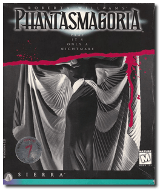](Phantasmagoria/README.md)  &nbsp;&nbsp;&nbsp;&nbsp;&nbsp;&nbsp;&nbsp;&nbsp;&nbsp;&nbsp;&nbsp;&nbsp;&nbsp;&nbsp;&nbsp;&nbsp;&nbsp;&nbsp;&nbsp;&nbsp;&nbsp;&nbsp;&nbsp;&nbsp;&nbsp;&nbsp;&nbsp;&nbsp;&nbsp;&nbsp;&nbsp;&nbsp;&nbsp;&nbsp;&nbsp;&nbsp; |  â It seemed like a dream come true for Adrienne Delaney and Don Gordon. A beautiful mansion on its private island. The perfect place to build a life together. But an ominous presence lurks within the halls, the rooms, and every passageway of this mysterious home. The previous owner, a 19th-century master illusionist, left behind a twisted trail of terror. Quickly, the blissful life Adrienne and Don hoped for begins to unravel into a terrible nightmare. With your help, Adrienne must uncover the clues and gather the objects she needs in a desperate attempt to save her husband from an insidious evil that holds him in its ever-tightening grip. Discover the mansion's hidden rooms, explore the island, and try to find the mystery man with the secret to the past. â  â This game **is not abandonware 🚫** and is still for sale on [GOG 💰](https://www.gog.com/en/game/phantasmagoria) and [Steam 💰](https://store.steampowered.com/app/501990/Phantasmagoria/). â  |

---

| [Phantasmagoria 2: A Puzzle of Flesh](Phantasmagoria%202/README.md) | 📌 ┃ **Year** ‣ 1996 ┃ **Genre** ‣ Adventure ┃ **Platform** ‣ DOS ┃ **License** ‣ Proprietary ┃ **Media** ‣ CD-ROM ┃ **Patched** ‣ Windows 95 to DOS  |
|:---:|:---|
|    &nbsp;&nbsp;&nbsp;&nbsp;&nbsp;&nbsp;&nbsp;&nbsp;&nbsp;&nbsp;&nbsp;&nbsp;&nbsp;&nbsp;&nbsp;&nbsp;&nbsp;&nbsp;&nbsp;&nbsp;&nbsp;&nbsp;&nbsp;&nbsp;&nbsp;&nbsp;&nbsp;&nbsp;&nbsp;&nbsp;&nbsp;&nbsp;&nbsp;&nbsp;&nbsp;&nbsp; |  â Curtis Craig is a quiet young man. He has a steady job and a lovely girlfriend. He's been out of the mental hospital for exactly one year. All Curtis wants is to live a decent life, but something seems to have other plans. Strange, inexplicable, and terrifying events start happening, making him doubt his sanity. Then, the murders start, with evidence pointing directly to Curtis. Propelled by desperation and ravening madness, he will discover a bizarre secret beyond human comprehension. â  â This game **is not abandonware 🚫** and is still for sale on [GOG 💰](https://www.gog.com/en/game/phantasmagoria_2) and [Steam 💰](https://store.steampowered.com/app/501970/Phantasmagoria_2_A_Puzzle_of_Flesh/). â  |

---

| [Prince of Persia CD Collection](Prince%20of%20Persia%201%2B2/README.md) | 📌 ┃ **Year (Prince of Persia)** ‣ 1990 ┃ **Year (Prince of Persia 2: The Shadow and the Flame)** ‣ 1993 ┃ **Year (Prince of Persia CD Collection)** ‣ 1995 ┃ **Genre** ‣ Action ┃ **Platform** ‣ DOS ┃ **License** ‣ Abandonware ┃ **Media** ‣ CD-ROM ┃ **Compilation • Copy Protection**  |
|:---:|:---|
|    &nbsp;&nbsp;&nbsp;&nbsp;&nbsp;&nbsp;&nbsp;&nbsp;&nbsp;&nbsp;&nbsp;&nbsp;&nbsp;&nbsp;&nbsp;&nbsp;&nbsp;&nbsp;&nbsp;&nbsp;&nbsp;&nbsp;&nbsp;&nbsp;&nbsp;&nbsp;&nbsp;&nbsp;&nbsp;&nbsp;&nbsp;&nbsp;&nbsp;&nbsp;&nbsp;&nbsp; |  â While the sultan is fighting a war in a foreign land, his vizier Jaffar, a wizard, seizes power. His only obstacle to the throne is the sultan's daughter. Jaffar locks her in a tower and orders her to become his wife, or she dies within 60 minutes. You are thrown prisoner into the palace dungeons. To free her, you must escape the dungeons, get to the palace tower and defeat Jaffar before time runs out. â — *Prince of Persia*  â The evil magician Jaffar assumes your identity, steals your beloved princess, and casts you out of the palace as a beggar. With ferocious palace guards in pursuit, you flee from rooftop to rooftop, through caverns, across a desert island, passed into ruins and beyond. â — *Prince of Persia 2: The Shadow and the Flame*  |

---

| [Private Eye](Private%20Eye/README.md) | 📌 ┃ **Year** ‣ 1996 ┃ **Genre** ‣ Adventure ┃ **Platform** ‣ Windows 3.1x ┃ **License** ‣ Abandonware ┃ **Media** ‣ CD-ROM  |
|:---:|:---|
|    &nbsp;&nbsp;&nbsp;&nbsp;&nbsp;&nbsp;&nbsp;&nbsp;&nbsp;&nbsp;&nbsp;&nbsp;&nbsp;&nbsp;&nbsp;&nbsp;&nbsp;&nbsp;&nbsp;&nbsp;&nbsp;&nbsp;&nbsp;&nbsp;&nbsp;&nbsp;&nbsp;&nbsp;&nbsp;&nbsp;&nbsp;&nbsp;&nbsp;&nbsp;&nbsp;&nbsp; |  â Humphrey Bogart played him. Robert Mitchum played him. Now it's your turn to become Philip Marlowe, the world's most famous private eye! All other private eye games are imitations. It is the real thing, the first interactive murder mystery based on Raymond Chandler's legendary detective. Meet starlets, confront a manic mobster, and search Hollywood for clues you can take. Hundreds of interactive decisions are yours! It all starts with an innocent girl who hires you to find her missing brother, but it soon leads to a trail of greed, blackmail, revenge, deceit and murder! â  |

---

| [Quake](Quake/README.md) | 📌 ┃ **Year (Quake)** ‣ 1996 ┃ **Year (Quake Mission Pack No. 1: Scourge of Armagon)** ‣ 1997 ┃ **Year (Quake Mission Pack No. 2: Dissolution of Eternity)** ‣ 1997 ┃ **Genre** ‣ Action ┃ **Platform** ‣ DOS ┃ **License** ‣ Proprietary ┃ **Media** ‣ CD-ROM ┃ **Add-on**  |
|:---:|:---|
|    &nbsp;&nbsp;&nbsp;&nbsp;&nbsp;&nbsp;&nbsp;&nbsp;&nbsp;&nbsp;&nbsp;&nbsp;&nbsp;&nbsp;&nbsp;&nbsp;&nbsp;&nbsp;&nbsp;&nbsp;&nbsp;&nbsp;&nbsp;&nbsp;&nbsp;&nbsp;&nbsp;&nbsp;&nbsp;&nbsp;&nbsp;&nbsp;&nbsp;&nbsp;&nbsp;&nbsp; |  â The government had been experimenting with teleportation technology and developed a working prototype called a Slipgate; the mysterious Quake compromised the Slipgate by connecting it with its teleportation system, using it to send death squads to our dimension to test the martial capabilities of humanity. â  â This game **is not abandonware 🚫** and is still for sale on [GOG 💰](https://www.gog.com/game/quake_the_offering) and [Steam 💰](https://store.steampowered.com/app/2310/Quake/). â  |

---

| [Railroad Tycoon Deluxe](Railroad%20Tycoon%20Deluxe/README.md) | 📌 ┃ **Year** ‣ 1993 ┃ **Genre** ‣ Strategy ┃ **Platform** ‣ DOS ┃ **License** ‣ Abandonware ┃ **Media** ‣ CD-ROM ┃ **Copy Protection**  |
|:---:|:---|
|    &nbsp;&nbsp;&nbsp;&nbsp;&nbsp;&nbsp;&nbsp;&nbsp;&nbsp;&nbsp;&nbsp;&nbsp;&nbsp;&nbsp;&nbsp;&nbsp;&nbsp;&nbsp;&nbsp;&nbsp;&nbsp;&nbsp;&nbsp;&nbsp;&nbsp;&nbsp;&nbsp;&nbsp;&nbsp;&nbsp;&nbsp;&nbsp;&nbsp;&nbsp;&nbsp;&nbsp; |  â Big business. Tough decisions. Excitement, challenge and compelling attention to detail. Railroad Tycoon re-creates the Golden Age of Railroads in any of four regions in America and Europe and gives you complete control over every aspect of your industrial empire. But be careful: the world's other tycoons - like J.P. Morgan, Vanderbilt and Carnegie - are fierce competitors, determined to crush or brush you from their path. â  |

---

| [Return of the Phantom](Return%20of%20the%20Phantom/README.md) | 📌 ┃ **Year** ‣ 1993 ┃ **Genre** ‣ Adventure ┃ **Platform** ‣ DOS ┃ **License** ‣ Proprietary ┃ **Media** ‣ CD-ROM  |
|:---:|:---|
|    &nbsp;&nbsp;&nbsp;&nbsp;&nbsp;&nbsp;&nbsp;&nbsp;&nbsp;&nbsp;&nbsp;&nbsp;&nbsp;&nbsp;&nbsp;&nbsp;&nbsp;&nbsp;&nbsp;&nbsp;&nbsp;&nbsp;&nbsp;&nbsp;&nbsp;&nbsp;&nbsp;&nbsp;&nbsp;&nbsp;&nbsp;&nbsp;&nbsp;&nbsp;&nbsp;&nbsp; |  â The story begins in the summer of 1993. You are Inspector Raoul Montand, visiting the famed Paris Opera House to attend the premiere of the legendary Don Juan Triumphant, supposedly composed by Erik, the Phantom of the Opera. But a ghastly accident stops the production before it starts, and all the evidence seems to indicate the Phantom himself is still alive! Then things take a truly bizarre twist. While investigating the crime, you are pushed from a catwalk by an unseen assailant and plunged backward in time to 1881! Suddenly, everyone believes you are Raoul de Chagny, lover of the beautiful opera singer Christine Daae, and rival to the real Phantom of the Opera. â  â This game **is not abandonware 🚫** and is still for sale on [GOG 💰](https://www.gog.com/game/return_of_the_phantom) and [Steam 💰](https://store.steampowered.com/app/1299710/Return_of_the_Phantom/). â  |

---

| [Return to Zork](Return%20to%20Zork/README.md) | 📌 ┃ **Year** ‣ 1993 ┃ **Genre** ‣ Adventure ┃ **Platform** ‣ DOS ┃ **License** ‣ Proprietary ┃ **Media** ‣ CD-ROM  |
|:---:|:---|
|    &nbsp;&nbsp;&nbsp;&nbsp;&nbsp;&nbsp;&nbsp;&nbsp;&nbsp;&nbsp;&nbsp;&nbsp;&nbsp;&nbsp;&nbsp;&nbsp;&nbsp;&nbsp;&nbsp;&nbsp;&nbsp;&nbsp;&nbsp;&nbsp;&nbsp;&nbsp;&nbsp;&nbsp;&nbsp;&nbsp;&nbsp;&nbsp;&nbsp;&nbsp;&nbsp;&nbsp; |  â Seven hundred years before the action in Return to Zork unfolds, the Great Underground Empire and all evil magic are no more. However, the mythical dark recesses beneath the Valley of the Sparrow are back. As a wayward adventurer, you must save the human race from Morphius, the evil ruler of the Great Underground Empire. You roam from the Eastlands to the Westlands, gathering clues and solving puzzles by receiving hints from quirky characters you meet. â  â This game **is not abandonware 🚫** and is still for sale on [GOG 💰](https://gog.com/en/game/return_to_zork) and [Steam 💰](https://store.steampowered.com/app/585240/Return_to_Zork/). â  |

---

| [Ringworld: Revenge of the Patriarch](Ringworld%20-%20Revenge%20of%20the%20Patriarch/README.md) | 📌 ┃ **Year** ‣ 1992 ┃ **Genre** ‣ Adventure ┃ **Platform** ‣ DOS ┃ **License** ‣ Abandonware ┃ **Media** ‣ CD-ROM  |
|:---:|:---|
|    &nbsp;&nbsp;&nbsp;&nbsp;&nbsp;&nbsp;&nbsp;&nbsp;&nbsp;&nbsp;&nbsp;&nbsp;&nbsp;&nbsp;&nbsp;&nbsp;&nbsp;&nbsp;&nbsp;&nbsp;&nbsp;&nbsp;&nbsp;&nbsp;&nbsp;&nbsp;&nbsp;&nbsp;&nbsp;&nbsp;&nbsp;&nbsp;&nbsp;&nbsp;&nbsp;&nbsp; |  â It never mentioned an insane Patriarch, Kzinti assassins, Puppeteer genocide, or the fact that a world so immense it could hold a million earths is the only hope for the future of the universe. A tangled web of intrigue brings together a vengeful Kzin, a kidnapped engineer and a mercenary - alone against a plot that could plunge all of Known Space into chaos. The Kzinti are on the warpath, the Puppeteers claim innocence, and Ringworld holds the answer. If only you can find it in time. â  |

---

| [Road Rash](Road%20Rash/README.md) | 📌 ┃ **Year** ‣ 1996 ┃ **Genre** ‣ Action • Racing ┃ **Platform** ‣ Windows 9x ┃ **License** ‣ Abandonware ┃ **Media** ‣ CD-ROM ┃ **No Manual**  |
|:---:|:---|
|    &nbsp;&nbsp;&nbsp;&nbsp;&nbsp;&nbsp;&nbsp;&nbsp;&nbsp;&nbsp;&nbsp;&nbsp;&nbsp;&nbsp;&nbsp;&nbsp;&nbsp;&nbsp;&nbsp;&nbsp;&nbsp;&nbsp;&nbsp;&nbsp;&nbsp;&nbsp;&nbsp;&nbsp;&nbsp;&nbsp;&nbsp;&nbsp;&nbsp;&nbsp;&nbsp;&nbsp; |  â Fight through the levels against other bikers, finish high and use the prize money to customise your motorbike. Sound simple? Add the hazards of oncoming traffic, suicidal pedestrians, street furniture, other road users, and crossroads - and it becomes quite a handful. â  |

---

| [Robbo](Robbo/README.md) | 📌 ┃ **Year** ‣ 1993 ┃ **Genre** ‣ Action • Puzzle ┃ **Platform** ‣ DOS ┃ **License** ‣ Freeware ┃ **Media** ‣ Compressed Package  |
|:---:|:---|
|  [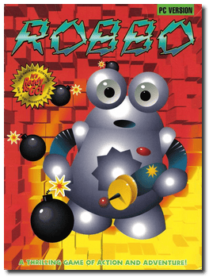](Robbo/README.md)  &nbsp;&nbsp;&nbsp;&nbsp;&nbsp;&nbsp;&nbsp;&nbsp;&nbsp;&nbsp;&nbsp;&nbsp;&nbsp;&nbsp;&nbsp;&nbsp;&nbsp;&nbsp;&nbsp;&nbsp;&nbsp;&nbsp;&nbsp;&nbsp;&nbsp;&nbsp;&nbsp;&nbsp;&nbsp;&nbsp;&nbsp;&nbsp;&nbsp;&nbsp;&nbsp;&nbsp; |  â After pulling too many mischievous pranks, Robbo found himself destined to live in a horrid maze designed to prevent the intelligent little robot from escaping. It is up to you to end Robbo's frustration and torture and find a way to freedom. Beware! Along the way, you will encounter giant spiders blocking the corridors, powerful cannons shooting missiles in random directions, and deadly electromagnets designed to destroy all metal objects, including Robbo! That is just the beginning. â  â On 25 June 2006, after obtaining approval from the rights holders, Maciej Miąsik released the three games from Epic Puzzle Pack, including The Adventures of Robbo, through the Classic DOS Games website under the Creative Commons BY-SA 2.5 license as freeware. â — *Wikipedia*  |

---

| [RollerCoaster Tycoon: Gold Edition](RollerCoaster%20Tycoon/README.md) | 📌 ┃ **Year (RollerCoaster Tycoon)** ‣ 1999 ┃ **Year (RollerCoaster Tycoon: Corkscrew Follies)** ‣ 1999 ┃ **Year (RollerCoaster Tycoon: Loopy Landscapes)** ‣ 2000 ┃ **Year (RollerCoaster Tycoon: Gold Edition)** ‣ 2000 ┃ **Genre** ‣ Simulation ┃ **Platform** ‣ Windows 9x ┃ **License** ‣ Proprietary ┃ **Media** ‣ CD-ROM ┃ **Add-on**  |
|:---:|:---|
|    &nbsp;&nbsp;&nbsp;&nbsp;&nbsp;&nbsp;&nbsp;&nbsp;&nbsp;&nbsp;&nbsp;&nbsp;&nbsp;&nbsp;&nbsp;&nbsp;&nbsp;&nbsp;&nbsp;&nbsp;&nbsp;&nbsp;&nbsp;&nbsp;&nbsp;&nbsp;&nbsp;&nbsp;&nbsp;&nbsp;&nbsp;&nbsp;&nbsp;&nbsp;&nbsp;&nbsp; |  â Do you have what it takes to create the ultimate amusement park? Well, here's your chance to find out! RollerCoaster Tycoon is the first build/management sim that's easy to use and powerful! Everyone, novice and expert, will enjoy building the parks they can dream of, complete with the most outrageous thrill rides imaginable! â  â This game **is not abandonware 🚫**. The **Deluxe** edition is available on [GOG 💰](https://gog.com/en/game/rollercoaster_tycoon_deluxe) and [Steam 💰](https://store.steampowered.com/app/285310/RollerCoaster_Tycoon_Deluxe/). â  |

---

| [SPQR: The Empire's Darkest Hour](SPQR%20-%20The%20Empire%27s%20Darkest%20Hour/README.md) | 📌 ┃ **Year** ‣ 1996 ┃ **Genre** ‣ Adventure ┃ **Platform** ‣ Windows 3.1x ┃ **License** ‣ Abandonware ┃ **Media** ‣ CD-ROM  |
|:---:|:---|
|    &nbsp;&nbsp;&nbsp;&nbsp;&nbsp;&nbsp;&nbsp;&nbsp;&nbsp;&nbsp;&nbsp;&nbsp;&nbsp;&nbsp;&nbsp;&nbsp;&nbsp;&nbsp;&nbsp;&nbsp;&nbsp;&nbsp;&nbsp;&nbsp;&nbsp;&nbsp;&nbsp;&nbsp;&nbsp;&nbsp;&nbsp;&nbsp;&nbsp;&nbsp;&nbsp;&nbsp; |  â This game challenges you to learn how the Roman Empire works: structurally, mechanically, economically, culturally, and politically. Given one year to investigate five equally suspicious suspects, you must solve the ultimate mystery: Who is plotting to destroy Rome? How will they do it? Explore the streets, temples, and secret labyrinths of the Roman Forum to save the Roman Empire. â  |

---

| [Sam & Max: Hit the Road](Sam%20%26%20Max%20Hit%20the%20Road/README.md) | 📌 ┃ **Year** ‣ 1993 ┃ **Genre** ‣ Adventure ┃ **Platform** ‣ DOS ┃ **License** ‣ Proprietary ┃ **Media** ‣ CD-ROM  |
|:---:|:---|
|    &nbsp;&nbsp;&nbsp;&nbsp;&nbsp;&nbsp;&nbsp;&nbsp;&nbsp;&nbsp;&nbsp;&nbsp;&nbsp;&nbsp;&nbsp;&nbsp;&nbsp;&nbsp;&nbsp;&nbsp;&nbsp;&nbsp;&nbsp;&nbsp;&nbsp;&nbsp;&nbsp;&nbsp;&nbsp;&nbsp;&nbsp;&nbsp;&nbsp;&nbsp;&nbsp;&nbsp; |  â Grab your nightstick, squeal like a siren, and Hit the Road with Sam & Max, Freelance Police, as they attempt to crack their case. Sam (a shamus canine) and Max (a hyperkinetic rabbity thing) are hot on the trail of a runaway carnival bigfoot across America's quirky underbelly in this deranged animated adventure. Help our frightening, furry flatfoots find the fugitive freak! â  â This game **is not abandonware 🚫** and is still for sale on [GOG 💰](https://gog.com/en/game/sam_max_hit_the_road). â  |

---

| [Sanitarium](Sanitarium/README.md) | 📌 ┃ **Year** ‣ 1998 ┃ **Genre** ‣ Adventure ┃ **Platform** ‣ Windows 9x ┃ **License** ‣ Proprietary ┃ **Media** ‣ CD-ROM ┃ **Patched** ‣ Multiple bugfixes  |
|:---:|:---|
|    &nbsp;&nbsp;&nbsp;&nbsp;&nbsp;&nbsp;&nbsp;&nbsp;&nbsp;&nbsp;&nbsp;&nbsp;&nbsp;&nbsp;&nbsp;&nbsp;&nbsp;&nbsp;&nbsp;&nbsp;&nbsp;&nbsp;&nbsp;&nbsp;&nbsp;&nbsp;&nbsp;&nbsp;&nbsp;&nbsp;&nbsp;&nbsp;&nbsp;&nbsp;&nbsp;&nbsp; |  â Spiralling upwards out of the vacuum, you open your eyes and struggle to comprehend your environment. Underneath you, the springs of an institutional cot sink almost to the floor. The mattress is roughly the thickness of a paper towel and reeks of affliction. Vague memories assault you, a hurried phone call, a message of utmost importance, and a car losing control. As you wake up with a throbbing head, you hear people screaming, sobbing, laughing manically in the background. Is it a nightmare? Are you insane? Is it a reality? Maybe this is death. â  â This game **is not abandonware 🚫** and is still for sale on [GOG 💰](https://gog.com/en/game/sanitarium) and [Steam 💰](https://store.steampowered.com/app/284050/Sanitarium/). â  |

---

| [Screamer](Screamer/README.md) | 📌 ┃ **Year** ‣ 1995 ┃ **Genre** ‣ Racing ┃ **Platform** ‣ DOS ┃ **License** ‣ Proprietary ┃ **Media** ‣ CD-ROM  |
|:---:|:---|
|  [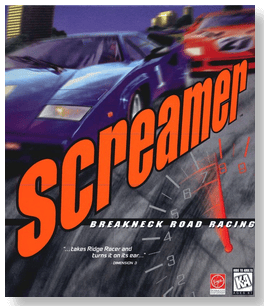](Screamer/README.md)  &nbsp;&nbsp;&nbsp;&nbsp;&nbsp;&nbsp;&nbsp;&nbsp;&nbsp;&nbsp;&nbsp;&nbsp;&nbsp;&nbsp;&nbsp;&nbsp;&nbsp;&nbsp;&nbsp;&nbsp;&nbsp;&nbsp;&nbsp;&nbsp;&nbsp;&nbsp;&nbsp;&nbsp;&nbsp;&nbsp;&nbsp;&nbsp;&nbsp;&nbsp;&nbsp;&nbsp; |  â Lights blur. The crowd whizzes past. Your helmet rattles against the roll bar. The competition switches into overdrive. Tears stream from your eyes as the race moves at extreme speed. The same stuff seeps out of your palms and onto the steering wheel. Get a grip. You are sliding into a turn at 200 miles per hour. Centrifugal force will only carry you so far. It is a velocity-driven, pedal-to-the-metal arcade auto racing. No simulation. Find out how your PC handles because you have never been allowed to go this fast. Maneuver through a twisted landscape, along six snaking tracks with other racers breathing down your neck, and post a warped time. Strapped into a personally chosen, made-for-the-autobahn racing machine, you will scream to redefine fast in this winding 3-D ride of pure rocketing fun. â  â This game **is not abandonware 🚫** and is still for sale on [GOG 💰](https://www.gog.com/en/game/screamer) and [Steam 💰](https://store.steampowered.com/app/697580/Screamer/). â  |

---

| [Screamer 2](Screamer%202/README.md) | 📌 ┃ **Year** ‣ 1996 ┃ **Genre** ‣ Racing ┃ **Platform** ‣ DOS ┃ **License** ‣ Proprietary ┃ **Media** ‣ CD-ROM  |
|:---:|:---|
|    &nbsp;&nbsp;&nbsp;&nbsp;&nbsp;&nbsp;&nbsp;&nbsp;&nbsp;&nbsp;&nbsp;&nbsp;&nbsp;&nbsp;&nbsp;&nbsp;&nbsp;&nbsp;&nbsp;&nbsp;&nbsp;&nbsp;&nbsp;&nbsp;&nbsp;&nbsp;&nbsp;&nbsp;&nbsp;&nbsp;&nbsp;&nbsp;&nbsp;&nbsp;&nbsp;&nbsp; |  â This all-new landmark in driving experiences leaves even its impressive, critically acclaimed predecessors eating dirt. For the first time, six formidable courses from around the world have been designed with variable conditions to put the best to the test. Feel every bone-shaking bump, every nerve-wracking jump, every mud- and gut-churning skid, twist and turn. But don't feel ashamed to release the tension with a scream every once in a while. â  â This game **is not abandonware 🚫** and is still for sale on [GOG 💰](https://gog.com/en/game/screamer_2) and [Steam 💰](https://store.steampowered.com/app/698620/Screamer_2/). â  |

---

| [Screamer Rally](Screamer%20Rally/README.md) | 📌 ┃ **Year** ‣ 1997 ┃ **Genre** ‣ Racing ┃ **Platform** ‣ DOS ┃ **License** ‣ Abandonware ┃ **Media** ‣ CD-ROM ┃ **No Manual**  |
|:---:|:---|
|    &nbsp;&nbsp;&nbsp;&nbsp;&nbsp;&nbsp;&nbsp;&nbsp;&nbsp;&nbsp;&nbsp;&nbsp;&nbsp;&nbsp;&nbsp;&nbsp;&nbsp;&nbsp;&nbsp;&nbsp;&nbsp;&nbsp;&nbsp;&nbsp;&nbsp;&nbsp;&nbsp;&nbsp;&nbsp;&nbsp;&nbsp;&nbsp;&nbsp;&nbsp;&nbsp;&nbsp; |  â Screamer Rally is a challenge for every racing fan. Five powerful vehicles and seven nerve-racking race tracks demand total concentration and all your skills. Because even the tiniest mistake can mean the end: sudden direction changes, merciless bumps, unexpected slides, spins, and jumps - can put even experienced drivers in a tricky situation. But with the proper technique and the necessary courage, you can master it. Well then, have a good trip! â  |

---

| [Shannara](Shannara/README.md) | 📌 ┃ **Year** ‣ 1995 ┃ **Genre** ‣ Adventure ┃ **Platform** ‣ DOS ┃ **License** ‣ Proprietary ┃ **Media** ‣ CD-ROM  |
|:---:|:---|
|    &nbsp;&nbsp;&nbsp;&nbsp;&nbsp;&nbsp;&nbsp;&nbsp;&nbsp;&nbsp;&nbsp;&nbsp;&nbsp;&nbsp;&nbsp;&nbsp;&nbsp;&nbsp;&nbsp;&nbsp;&nbsp;&nbsp;&nbsp;&nbsp;&nbsp;&nbsp;&nbsp;&nbsp;&nbsp;&nbsp;&nbsp;&nbsp;&nbsp;&nbsp;&nbsp;&nbsp; |  â Brona, the ancient Warlock King, has returned! Slain decades ago, Brona's evil spirit has returned to wreak revenge upon those who killed him. Now, only the combined magic of the races can destroy him. You are Jak Ohmsford. Only you can overcome the ancestral hatreds that divide the Four Lands. And only you can wield the magic that will defeat Brona. It is your destiny to save your homeland-but the price is far higher than you could have ever imagined. â  â This game **is not abandonware 🚫** and used to be for sale on **Ziggurat**. However, it is no longer available digitally anymore. â  |

---

| [Sid Meier's Colonization](Sid%20Meier%27s%20Colonization/README.md) | 📌 ┃ **Year** ‣ 1994 ┃ **Genre** ‣ Simulation • Strategy ┃ **Platform** ‣ Windows 3.1x ┃ **License** ‣ Proprietary ┃ **Media** ‣ CD-ROM ┃ **Patched** ‣ 3.0  |
|:---:|:---|
|    &nbsp;&nbsp;&nbsp;&nbsp;&nbsp;&nbsp;&nbsp;&nbsp;&nbsp;&nbsp;&nbsp;&nbsp;&nbsp;&nbsp;&nbsp;&nbsp;&nbsp;&nbsp;&nbsp;&nbsp;&nbsp;&nbsp;&nbsp;&nbsp;&nbsp;&nbsp;&nbsp;&nbsp;&nbsp;&nbsp;&nbsp;&nbsp;&nbsp;&nbsp;&nbsp;&nbsp; |  â Before you lie the promise that is the New World with all its peril and infinite possibility. Vast, lush green tracts of forest; freezing, crystal clear mountain rivers; plains stretching as far as the eye can see. Be its master! Colonization by Sid Meier is a story of discovery, exploration and territorial independence. Play the colonist, conquistador and diplomat facing the challenges and frustrations of building a new independent nation. Choose the European power you want to represent: French, Spanish, Dutch, or British. Use the wealth of the land to build up your position. Use deceit and force to outwit rivals. Use trade alliances to forge friendships and create new industries - all while holding back the possibility of revolt. â  â This game **is not abandonware 🚫** and is still for sale on [GOG 💰](https://gog.com/en/game/sid_meiers_colonization) and [Steam 💰](https://store.steampowered.com/app/327400/Sid_Meiers_Colonization_Classic/). â  |

---

| [Silent Hunter](Silent%20Hunter/README.md) | 📌 ┃ **Year** ‣ 1996 ┃ **Genre** ‣ Simulation ┃ **Platform** ‣ DOS ┃ **License** ‣ Abandonware ┃ **Media** ‣ CD-ROM  |
|:---:|:---|
|    &nbsp;&nbsp;&nbsp;&nbsp;&nbsp;&nbsp;&nbsp;&nbsp;&nbsp;&nbsp;&nbsp;&nbsp;&nbsp;&nbsp;&nbsp;&nbsp;&nbsp;&nbsp;&nbsp;&nbsp;&nbsp;&nbsp;&nbsp;&nbsp;&nbsp;&nbsp;&nbsp;&nbsp;&nbsp;&nbsp;&nbsp;&nbsp;&nbsp;&nbsp;&nbsp;&nbsp; |  â Silent Hunter is a full-featured and comprehensive look at World War II submarine warfare. Designed for a single-player, Silent Hunter lets you assume command of an American submarine in the Pacific. You have to sink as many enemy ships as possible. Do your job well to become a decorated naval hero and earn assignments on bigger and better class subs as your career progresses. â  â This game is no longer available digitally anymore. â  |

---

| [SimCity](SimCity/README.md) | 📌 ┃ **Year** ‣ 1989 ┃ **Genre** ‣ Simulation ┃ **Platform** ‣ DOS ┃ **License** ‣ Freeware ┃ **Media** ‣ Compressed Package  |
|:---:|:---|
|    &nbsp;&nbsp;&nbsp;&nbsp;&nbsp;&nbsp;&nbsp;&nbsp;&nbsp;&nbsp;&nbsp;&nbsp;&nbsp;&nbsp;&nbsp;&nbsp;&nbsp;&nbsp;&nbsp;&nbsp;&nbsp;&nbsp;&nbsp;&nbsp;&nbsp;&nbsp;&nbsp;&nbsp;&nbsp;&nbsp;&nbsp;&nbsp;&nbsp;&nbsp;&nbsp;&nbsp; |  â Shake hands, kiss babies and do not let monsters destroy your city! So you want to be Mayor? Well, now is your opportunity! Begin with empty land, start a town, name it after yourself, and build it into a city. See if you can sustain enough growth to expand your city into a megalopolis! As Mayor, you have the tools to overcome any challenge. Whether taxes, zoning, crime, transportation, fire control, pollution, natural disasters, or other critical issues, the duties of the Mayor are yours. For a change of pace, try saving a city burdened with problems by playing one of the eight built-in scenarios. Time is passing, and every decision you make has future consequences - so get to work! â  â In January 2008, the SimCity source code was released as free software under the GPL-3.0-or-later license, renamed to Micropolis (the original working title) for trademark reasons, and developed by Don Hopkins. â — *Wikipedia*  |

---

| [SimCity 2000: CD Collection](SimCity%202000/README.md) | 📌 ┃ **Year (SimCity 2000)** ‣ 1993 ┃ **Year (SimCity 2000 Scenarios: Volume 1 - Great Disasters)** ‣ 1994 ┃ **Year (SimCity 2000: Urban Renewal Kit)** ‣ 1994 ┃ **Year (SimCity 2000: CD Collection)** ‣ 1994 ┃ **Genre** ‣ Simulation • Strategy ┃ **Platform** ‣ Windows 3.1x ┃ **License** ‣ Proprietary ┃ **Media** ‣ CD-ROM  |
|:---:|:---|
|    &nbsp;&nbsp;&nbsp;&nbsp;&nbsp;&nbsp;&nbsp;&nbsp;&nbsp;&nbsp;&nbsp;&nbsp;&nbsp;&nbsp;&nbsp;&nbsp;&nbsp;&nbsp;&nbsp;&nbsp;&nbsp;&nbsp;&nbsp;&nbsp;&nbsp;&nbsp;&nbsp;&nbsp;&nbsp;&nbsp;&nbsp;&nbsp;&nbsp;&nbsp;&nbsp;&nbsp; |  â This morning, you approved a new solar power plant, designed an underground transportation system, and jumped five points in the polls. Then you raised taxes (and lost 10 points), read two local newspapers, built a zoo, a marina and a library, and pushed your education bill through the city council. It's time for lunch - unless there's a fire, tornado, earthquake or alien invasion. â  â This game **is not abandonware 🚫**. A **Special Edition** release is available on [GOG 💰](https://www.gog.com/en/game/simcity_2000_special_edition). â  |

---

| [SimTower](SimTower/README.md) | 📌 ┃ **Year** ‣ 1995 ┃ **Genre** ‣ Simulation ┃ **Platform** ‣ Windows 3.1x ┃ **License** ‣ Abandonware ┃ **Media** ‣ CD-ROM ┃ **Patched** ‣ 1.1b  |
|:---:|:---|
|  [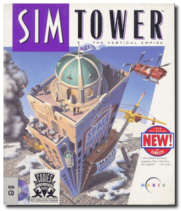](SimTower/README.md)  &nbsp;&nbsp;&nbsp;&nbsp;&nbsp;&nbsp;&nbsp;&nbsp;&nbsp;&nbsp;&nbsp;&nbsp;&nbsp;&nbsp;&nbsp;&nbsp;&nbsp;&nbsp;&nbsp;&nbsp;&nbsp;&nbsp;&nbsp;&nbsp;&nbsp;&nbsp;&nbsp;&nbsp;&nbsp;&nbsp;&nbsp;&nbsp;&nbsp;&nbsp;&nbsp;&nbsp; |  â Reach for the sky! Start by building a small office complex - a lobby, a few offices and a cafe. Expand by adding more floors, more offices and elevators. Then diversify to hotel rooms, shops, theatres, restaurants, condos and more as you build your way to the top. Success in SimTower requires design talent, management skills, business acumen and the ability to keep your customers happy. And be on the lookout for fires, insect infestations, terrorists and more (you will find out soon enough). â  |

---

| [Spycraft: The Great Game](Spycraft%20-%20The%20Great%20Game/README.md) | 📌 ┃ **Year** ‣ 1996 ┃ **Genre** ‣ Adventure ┃ **Platform** ‣ DOS ┃ **License** ‣ Proprietary  |
|:---:|:---|
|    &nbsp;&nbsp;&nbsp;&nbsp;&nbsp;&nbsp;&nbsp;&nbsp;&nbsp;&nbsp;&nbsp;&nbsp;&nbsp;&nbsp;&nbsp;&nbsp;&nbsp;&nbsp;&nbsp;&nbsp;&nbsp;&nbsp;&nbsp;&nbsp;&nbsp;&nbsp;&nbsp;&nbsp;&nbsp;&nbsp;&nbsp;&nbsp;&nbsp;&nbsp;&nbsp;&nbsp; |  â Enter the world of international intrigue. It's you against faceless enemies in a rush to unravel a high-level assassination plot. Arm yourself with authentic spy tools, high-tech weapons and professional CIA operation skills. Confront realistic global scenarios where decisions you make determine the balance of world power. â  â This game **is not abandonware 🚫** and is still for sale on [GOG 💰](https://www.gog.com/game/spycraft_the_great_game) and [Steam 💰](https://store.steampowered.com/app/569220/Spycraft_The_Great_Game/). â  |

---

| [Star Wars: TIE Fighter - Collector's CD-ROM](Star%20Wars%20-%20TIE%20Fighter/README.md) | 📌 ┃ **Year (Star Wars: TIE Fighter)** ‣ 1994 ┃ **Year (Star Wars: TIE Fighter - Defender of the Empire)** ‣ 1994 ┃ **Year (Star Wars: TIE Fighter - Collector's CD-ROM)** ‣ 1995 ┃ **Genre** ‣ Action • Simulation ┃ **Platform** ‣ DOS ┃ **License** ‣ Proprietary ┃ **Media** ‣ CD-ROM  |
|:---:|:---|
|    &nbsp;&nbsp;&nbsp;&nbsp;&nbsp;&nbsp;&nbsp;&nbsp;&nbsp;&nbsp;&nbsp;&nbsp;&nbsp;&nbsp;&nbsp;&nbsp;&nbsp;&nbsp;&nbsp;&nbsp;&nbsp;&nbsp;&nbsp;&nbsp;&nbsp;&nbsp;&nbsp;&nbsp;&nbsp;&nbsp;&nbsp;&nbsp;&nbsp;&nbsp;&nbsp;&nbsp; |  â Join the Imperial Navy and Save the Galaxy! Pirates raid interstellar traders. Terrorists threaten the galaxy. Through their treachery on Yavin, the alliance of Rebels and other criminals has threatened the very foundation of the Galactic Empire. As an Imperial Navy starfighter pilot, you will safeguard imperilled lives throughout the galaxy. Only the Emperor can save us from chaos and destruction. Join his cause in eliminating this rebel uprising. â  â This game **is not abandonware 🚫**. A **Special Edition** release is available on [GOG 💰](https://www.gog.com/en/game/star_wars_tie_fighter_special_edition) and [Steam 💰](https://store.steampowered.com/app/355250/STAR_WARS_TIE_Fighter_Special_Edition/). â  |

---

| [Star Wars: X-Wing - Collector's CD-ROM](Star%20Wars%20-%20X-Wing/README.md) | 📌 ┃ **Year (Star Wars: X-Wing)** ‣ 1993 ┃ **Year (Star Wars: X-Wing - Imperial Pursuit)** ‣ 1993 ┃ **Year (Star Wars: X-Wing - B-Wing)** ‣ 1993 ┃ **Year (Star Wars: X-Wing - Collector's CD-ROM)** ‣ 1994 ┃ **Genre** ‣ Action • Simulation ┃ **Platform** ‣ DOS ┃ **License** ‣ Proprietary ┃ **Media** ‣ CD-ROM  |
|:---:|:---|
|    &nbsp;&nbsp;&nbsp;&nbsp;&nbsp;&nbsp;&nbsp;&nbsp;&nbsp;&nbsp;&nbsp;&nbsp;&nbsp;&nbsp;&nbsp;&nbsp;&nbsp;&nbsp;&nbsp;&nbsp;&nbsp;&nbsp;&nbsp;&nbsp;&nbsp;&nbsp;&nbsp;&nbsp;&nbsp;&nbsp;&nbsp;&nbsp;&nbsp;&nbsp;&nbsp;&nbsp; |  â It is the dawn of the Rebellion. The Old Republic: gone, The Senate: abolished, The Jedi Knights: exterminated. Now, the Emperor seeks to crush the last remaining opposition. Against the overwhelming might of the Galactic Empire stands a small but growing Rebel Alliance. Scattered resistance groups are uniting, and what is needed most now are Starfighter pilots. Will you join their struggle to end this tyranny and become a hero of the Rebellion? â  â This game **is not abandonware 🚫**. A **Special Edition** release is available on [GOG 💰](https://www.gog.com/en/game/star_wars_xwing_special_edition) and [Steam 💰](https://store.steampowered.com/app/354430/STAR_WARS__XWing_Special_Edition/). â  |

---

| [StarCraft: Anthology](StarCraft/README.md) | 📌 ┃ **Year (StarCraft)** ‣ 1998 ┃ **Year (StarCraft: Brood War)** ‣ 1998 ┃ **Year (StarCraft: Anthology)** ‣ 1999 ┃ **Genre** ‣ Strategy ┃ **Platform** ‣ Windows 9x ┃ **License** ‣ Freeware ┃ **Media** ‣ CD-ROM ┃ **Add-on**  |
|:---:|:---|
|  [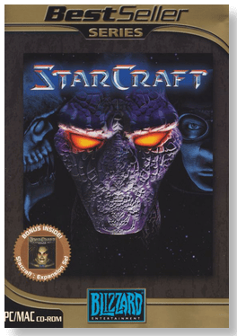](StarCraft/README.md)  &nbsp;&nbsp;&nbsp;&nbsp;&nbsp;&nbsp;&nbsp;&nbsp;&nbsp;&nbsp;&nbsp;&nbsp;&nbsp;&nbsp;&nbsp;&nbsp;&nbsp;&nbsp;&nbsp;&nbsp;&nbsp;&nbsp;&nbsp;&nbsp;&nbsp;&nbsp;&nbsp;&nbsp;&nbsp;&nbsp;&nbsp;&nbsp;&nbsp;&nbsp;&nbsp;&nbsp; |  â In the distant future, a small group of human exiles are fighting for survival on the galaxy's edge. A unified Terran government has maintained an uneasy peace through military strength, espionage, and deceit. But as resources and fuel run short, the Confederate nations are looking towards the rich worlds of their alien neighbours, the enigmatic Protoss. To further complicate matters, it seems that a previously unknown species, the Zerg, has entered Protoss space and is destroying everything in its path. The time for war has come. As the military leader for your species, you must gather the resources you need to train and expand your military and lead them to victory. â  â The original game, along with the expansion, was released for free in April 2017. â — *Wikipedia*  |

---

| [Stargunner](Stargunner/README.md) | 📌 ┃ **Year** ‣ 1996 ┃ **Genre** ‣ Action ┃ **Platform** ‣ DOS ┃ **License** ‣ Freeware ┃ **Media** ‣ Compressed Package  |
|:---:|:---|
|    &nbsp;&nbsp;&nbsp;&nbsp;&nbsp;&nbsp;&nbsp;&nbsp;&nbsp;&nbsp;&nbsp;&nbsp;&nbsp;&nbsp;&nbsp;&nbsp;&nbsp;&nbsp;&nbsp;&nbsp;&nbsp;&nbsp;&nbsp;&nbsp;&nbsp;&nbsp;&nbsp;&nbsp;&nbsp;&nbsp;&nbsp;&nbsp;&nbsp;&nbsp;&nbsp;&nbsp; |  â Deep within the Andromeda galaxy, the people of Zile grow restless and greedy. The Zilions secretly prepare for a massive strike against the nearby planet Ytima. Fearing such an attack, the Ytimians train an elite squad of "Stargunners." Their mission: To strike and wipe out the Zilions' three strongholds, where the Zilion war fleets await the launch order. Good will triumph if the Stargunners can surprise the Zilions and destroy most of their fleet. â  â On June 22, 2005, Stargunner was released as freeware. â — *Wikipedia*  |

---

| [Supaplex](Supaplex/README.md) | 📌 ┃ **Year** ‣ 1991 ┃ **Genre** ‣ Puzzle ┃ **Platform** ‣ DOS ┃ **License** ‣ Freeware ┃ **Media** ‣ CD-ROM ┃ **Patched** ‣ Sound bugfix ┃ **Copy Protection**  |
|:---:|:---|
|  [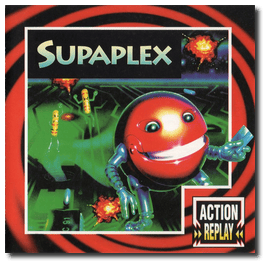](Supaplex/README.md)  &nbsp;&nbsp;&nbsp;&nbsp;&nbsp;&nbsp;&nbsp;&nbsp;&nbsp;&nbsp;&nbsp;&nbsp;&nbsp;&nbsp;&nbsp;&nbsp;&nbsp;&nbsp;&nbsp;&nbsp;&nbsp;&nbsp;&nbsp;&nbsp;&nbsp;&nbsp;&nbsp;&nbsp;&nbsp;&nbsp;&nbsp;&nbsp;&nbsp;&nbsp;&nbsp;&nbsp; |  â You are Murphy, a bug hunter extraordinaire, exploring deep inside a crazy computer. The only way out of each brain-teasing level is to collect the Infotrons. The fun begins! Avoid Snik Snaks at all costs; falling Zonks will trap the unwary, exploding discs, electrons, and ports. All add up to this awesome action game! â  â The developers of the game have declared the software to be freeware. â — *Wikipedia*  |

---

| [Superhero League of Hoboken](Superhero%20League%20of%20Hoboken/README.md) | 📌 ┃ **Year** ‣ 1994 ┃ **Genre** ‣ Adventure • Role-playing ┃ **Platform** ‣ DOS ┃ **License** ‣ Proprietary ┃ **Media** ‣ CD-ROM  |
|:---:|:---|
|    &nbsp;&nbsp;&nbsp;&nbsp;&nbsp;&nbsp;&nbsp;&nbsp;&nbsp;&nbsp;&nbsp;&nbsp;&nbsp;&nbsp;&nbsp;&nbsp;&nbsp;&nbsp;&nbsp;&nbsp;&nbsp;&nbsp;&nbsp;&nbsp;&nbsp;&nbsp;&nbsp;&nbsp;&nbsp;&nbsp;&nbsp;&nbsp;&nbsp;&nbsp;&nbsp;&nbsp; |  â The United States is a nightmare land of toxic waste, melted ice caps, and desperate shortages of oat bran. Horrible mutations roam the countryside, monsters spawned by radiation, environmental toxins, and unregulated bioengineering. But in a tiny corner of New Jersey, a small group of Superheroes has banded together. Their mission is to nurture the rebirth of a new society, to ease the suffering of the dark age, and to provide a place where Superheroes can always find a date on Saturday night. â  â This game **is not abandonware 🚫** and is still for sale on [GOG 💰](https://www.gog.com/en/game/superhero_league_of_hoboken) and [Steam 💰](https://store.steampowered.com/app/1104470/Super_Hero_League_of_Hoboken/). â  |

---

| [Syndicate Plus](Syndicate/README.md) | 📌 ┃ **Year (Syndicate)** ‣ 1993 ┃ **Year (Syndicate: American Revolt)** ‣ 1993 ┃ **Year (Syndicate Plus)** ‣ 1994 ┃ **Genre** ‣ Action • Strategy ┃ **Platform** ‣ DOS ┃ **License** ‣ Proprietary ┃ **Media** ‣ CD-ROM ┃ **Add-on**  |
|:---:|:---|
|    &nbsp;&nbsp;&nbsp;&nbsp;&nbsp;&nbsp;&nbsp;&nbsp;&nbsp;&nbsp;&nbsp;&nbsp;&nbsp;&nbsp;&nbsp;&nbsp;&nbsp;&nbsp;&nbsp;&nbsp;&nbsp;&nbsp;&nbsp;&nbsp;&nbsp;&nbsp;&nbsp;&nbsp;&nbsp;&nbsp;&nbsp;&nbsp;&nbsp;&nbsp;&nbsp;&nbsp; |  â In 2096, a massive corporation known as Megacorps divided the world into multiple regions. In Syndicate, you are a Megacorp Marketing Director, using cybernetically altered Company Agents in a race to control the New World Order. Enter the Syndicate. Step into a dark future where 'changing your mind' takes on a new meaning. â  â This game **is not abandonware 🚫** and is still for sale on [GOG 💰](https://www.gog.com/en/game/syndicate). â  |

---

| [Syndicate Wars](Syndicate%20Wars/README.md) | 📌 ┃ **Year** ‣ 1996 ┃ **Genre** ‣ Action • Strategy ┃ **Platform** ‣ DOS ┃ **License** ‣ Proprietary ┃ **Media** ‣ CD-ROM  |
|:---:|:---|
|    &nbsp;&nbsp;&nbsp;&nbsp;&nbsp;&nbsp;&nbsp;&nbsp;&nbsp;&nbsp;&nbsp;&nbsp;&nbsp;&nbsp;&nbsp;&nbsp;&nbsp;&nbsp;&nbsp;&nbsp;&nbsp;&nbsp;&nbsp;&nbsp;&nbsp;&nbsp;&nbsp;&nbsp;&nbsp;&nbsp;&nbsp;&nbsp;&nbsp;&nbsp;&nbsp;&nbsp; |  â Syndicate closed with the global domination of the World by The Corporation. Now, a hundred years later, they have become complacent. Things are going wrong. The chip controlled by the minds of the world's population has started to malfunction, and once again, the citizens are perceiving reality as it is - grim. A new religious cult has sprung up. They are gaining a large number of converts to their cause. While in the cities, marauding gangs of bikers are taking advantage of the disorganization of the Corporation and gaining control of whole city precincts. It is the dark and gloomy setting for Syndicate Wars. This time, you can be a Corporation executive determined to place The Corporation back in control and further his career. You can be a Church Elder or the leader of the biker gang. â  â This game **is not abandonware 🚫** and is still for sale on [GOG 💰](https://www.gog.com/en/game/syndicate_wars). â  |

---

| [Teen Agent](Teen%20Agent/README.md) | 📌 ┃ **Year** ‣ 1995 ┃ **Genre** ‣ Adventure ┃ **Platform** ‣ DOS ┃ **License** ‣ Freeware ┃ **Media** ‣ Compressed Package ┃ **No Manual**  |
|:---:|:---|
|    &nbsp;&nbsp;&nbsp;&nbsp;&nbsp;&nbsp;&nbsp;&nbsp;&nbsp;&nbsp;&nbsp;&nbsp;&nbsp;&nbsp;&nbsp;&nbsp;&nbsp;&nbsp;&nbsp;&nbsp;&nbsp;&nbsp;&nbsp;&nbsp;&nbsp;&nbsp;&nbsp;&nbsp;&nbsp;&nbsp;&nbsp;&nbsp;&nbsp;&nbsp;&nbsp;&nbsp; |  â One day, two men in dark glasses and long coats captured a teenager; this could be the start of a very long day! Get ready for a wonderfully humorous adventure. Teen Agent is a point-and-click animated graphic adventure that features dozens of detailed hand-painted backgrounds. â  â When the game was originally released, "The Three Tasks" was shareware, and the remaining two sections could be obtained by registering the game. However, the game was later released as freeware. â — *Wikipedia*  |

---

| [Terminal Velocity](Terminal%20Velocity/README.md) | 📌 ┃ **Year** ‣ 1995 ┃ **Genre** ‣ Action ┃ **Platform** ‣ DOS ┃ **License** ‣ Proprietary ┃ **Media** ‣ CD-ROM  |
|:---:|:---|
|    &nbsp;&nbsp;&nbsp;&nbsp;&nbsp;&nbsp;&nbsp;&nbsp;&nbsp;&nbsp;&nbsp;&nbsp;&nbsp;&nbsp;&nbsp;&nbsp;&nbsp;&nbsp;&nbsp;&nbsp;&nbsp;&nbsp;&nbsp;&nbsp;&nbsp;&nbsp;&nbsp;&nbsp;&nbsp;&nbsp;&nbsp;&nbsp;&nbsp;&nbsp;&nbsp;&nbsp; |  â In the far future, armadas from surrounding systems have suddenly waged war on Earth, destroying critical installations and major cities. Earth is now on its knees. You are a pilot from the Ares Squadron flying the fastest, most dangerous crafts ever made. Currently, you are in the TV-202, a fighter few can handle. Given that the previous model, the TV-101, has chalked up more dead pilots than any experimental craft in history, many consider you lucky to be alive. You are in a flying coffin, outgunned and outmanned. But think how good a Saved-the-Known-Galaxy title will look on your resume. â  â This version is the original/legacy release for DOS. This game **is not abandonware 🚫** and a **Boosted Edition** release is available on [GOG 💰](https://www.gog.com/en/game/terminal_velocity_boosted_edition) and [Steam 💰](https://store.steampowered.com/app/1956430/Terminal_Velocity_Boosted_Edition/). â  |

---

| [Tex Murphy: Martian Memorandum](Tex%20Murphy%20-%20Martian%20Memorandum/README.md) | 📌 ┃ **Year** ‣ 1991 ┃ **Genre** ‣ Adventure ┃ **Platform** ‣ DOS ┃ **License** ‣ Proprietary ┃ **Media** ‣ Floppy Disk  |
|:---:|:---|
|    &nbsp;&nbsp;&nbsp;&nbsp;&nbsp;&nbsp;&nbsp;&nbsp;&nbsp;&nbsp;&nbsp;&nbsp;&nbsp;&nbsp;&nbsp;&nbsp;&nbsp;&nbsp;&nbsp;&nbsp;&nbsp;&nbsp;&nbsp;&nbsp;&nbsp;&nbsp;&nbsp;&nbsp;&nbsp;&nbsp;&nbsp;&nbsp;&nbsp;&nbsp;&nbsp;&nbsp; |  â It's 2039, six years after solving the Linsky murder case. The years have been less than kind to Tex Murphy. In post-holocaust San Francisco, he has been into constant radiation, but what's put the lines in his face are the years trying to stay afloat and recapture the glory of his first big case. While working on his first case, Tex stumbled into - and foiled - a conspiracy to dominate the world. Since then, he's been high and dry, trying to keep from being broke. Understandably, he jumps at an offer by the powerful Marshall Alexander. â  â This game **is not abandonware 🚫** and is still for sale on [Steam 💰](https://store.steampowered.com/app/302340/Tex_Murphy_Martian_Memorandum/) and [GOG 💰](https://www.gog.com/en/game/tex_murphy_1_2) (**Mean Streets + Martian Memorandum**). â  |

---

| [Tex Murphy: Mean Streets](Tex%20Murphy%20-%20Mean%20Streets/README.md) | 📌 ┃ **Year** ‣ 1989 ┃ **Genre** ‣ Adventure ┃ **Platform** ‣ DOS ┃ **License** ‣ Proprietary ┃ **Media** ‣ Floppy Disk ┃ **Patched** ‣ 1.4  |
|:---:|:---|
|    &nbsp;&nbsp;&nbsp;&nbsp;&nbsp;&nbsp;&nbsp;&nbsp;&nbsp;&nbsp;&nbsp;&nbsp;&nbsp;&nbsp;&nbsp;&nbsp;&nbsp;&nbsp;&nbsp;&nbsp;&nbsp;&nbsp;&nbsp;&nbsp;&nbsp;&nbsp;&nbsp;&nbsp;&nbsp;&nbsp;&nbsp;&nbsp;&nbsp;&nbsp;&nbsp;&nbsp; |  â It's the year 2033. Your name is Tex Murphy, a private investigator in San Francisco. A beautiful daughter of a university professor hired you to uncover the facts about her father's death. As the investigation begins, you expose the deaths of several prominent scientific community members. Are these deaths coincidental? Or is there something more sinister going on? And which characters could have a motive? Could it be J. Saint Gideon, the former head of British Intelligence? Could Frank Schimming, the President of the world's largest surveillance firm, be hiding something? Or what about Sylvia, the professor's daughter? Is she as innocent as she seems? And why is an infamous Detroit hitman in town? â  â This game **is not abandonware 🚫** and is still for sale on [Steam 💰](https://store.steampowered.com/app/302330/Tex_Murphy_Mean_Streets/) and [GOG 💰](https://www.gog.com/en/game/tex_murphy_1_2) (**Mean Streets + Martian Memorandum**). â  |

---

| [Tex Murphy: The Pandora Directive](Tex%20Murphy%20-%20The%20Pandora%20Directive/README.md) | 📌 ┃ **Year** ‣ 1996 ┃ **Genre** ‣ Adventure ┃ **Platform** ‣ DOS ┃ **License** ‣ Proprietary ┃ **Media** ‣ CD-ROM  |
|:---:|:---|
|    &nbsp;&nbsp;&nbsp;&nbsp;&nbsp;&nbsp;&nbsp;&nbsp;&nbsp;&nbsp;&nbsp;&nbsp;&nbsp;&nbsp;&nbsp;&nbsp;&nbsp;&nbsp;&nbsp;&nbsp;&nbsp;&nbsp;&nbsp;&nbsp;&nbsp;&nbsp;&nbsp;&nbsp;&nbsp;&nbsp;&nbsp;&nbsp;&nbsp;&nbsp;&nbsp;&nbsp; |  â The government has covered up the greatest secret of the 20th century. Tex doesn't like secrets. It's April 2043. You, Tex Murphy, the last of the old-style gumshoes – find yourself racing against time in the most dangerous game of your life. What is the truth behind the rumoured UFO crash at Roswell, New Mexico? Why did the military suddenly shut down and seal off the Roswell complex? And why the frequent references to the lost Mayan civilization? â  â This game **is not abandonware 🚫** and is still for sale on [GOG 💰](https://gog.com/en/game/tex_murphy_the_pandora_directive) and [Steam 💰](https://store.steampowered.com/app/302360/Tex_Murphy_The_Pandora_Directive/). â  |

---

| [Tex Murphy: Under a Killing Moon](Tex%20Murphy%20-%20Under%20a%20Killing%20Moon/README.md) | 📌 ┃ **Year** ‣ 1994 ┃ **Genre** ‣ Adventure ┃ **Platform** ‣ DOS ┃ **License** ‣ Proprietary ┃ **Media** ‣ CD-ROM ┃ **Patched** ‣ 1.04  |
|:---:|:---|
|    &nbsp;&nbsp;&nbsp;&nbsp;&nbsp;&nbsp;&nbsp;&nbsp;&nbsp;&nbsp;&nbsp;&nbsp;&nbsp;&nbsp;&nbsp;&nbsp;&nbsp;&nbsp;&nbsp;&nbsp;&nbsp;&nbsp;&nbsp;&nbsp;&nbsp;&nbsp;&nbsp;&nbsp;&nbsp;&nbsp;&nbsp;&nbsp;&nbsp;&nbsp;&nbsp;&nbsp; |  â In December 2042, Tex Murphy, the last of the old-style PIs, hit rock bottom. From the shadowy back streets of post-apocalyptic San Francisco come rumours that an ancient evil, foretold by prophecy and worshipped by an ancient blood cult, has mysteriously reawakened. Hired to find the stolen statuette, he plunged into a labyrinth of deceit, manipulation, and murder. He will need his PI instincts and every ounce of his savoir-faire to resist the seduction of darkness and stop the forces of evil - before the terrifying prophecies turn into reality. â  â This game **is not abandonware 🚫** and is still for sale on [GOG 💰](https://www.gog.com/en/game/tex_murphy_under_a_killing_moon) and [Steam 💰](https://store.steampowered.com/app/302350/Tex_Murphy_Under_a_Killing_Moon/). â  |

---

| [The 11th Hour](The%2011th%20Hour/README.md) | 📌 ┃ **Year** ‣ 1995 ┃ **Genre** ‣ Puzzle ┃ **Platform** ‣ DOS ┃ **License** ‣ Proprietary ┃ **Media** ‣ CD-ROM ┃ **Patched** ‣ 2.42 Beta (Optional)  |
|:---:|:---|
|    &nbsp;&nbsp;&nbsp;&nbsp;&nbsp;&nbsp;&nbsp;&nbsp;&nbsp;&nbsp;&nbsp;&nbsp;&nbsp;&nbsp;&nbsp;&nbsp;&nbsp;&nbsp;&nbsp;&nbsp;&nbsp;&nbsp;&nbsp;&nbsp;&nbsp;&nbsp;&nbsp;&nbsp;&nbsp;&nbsp;&nbsp;&nbsp;&nbsp;&nbsp;&nbsp;&nbsp; |  â In the 70 desolate years since the horrifying murders chronicled in The 7th Guest, the town of Harley has been ominously silent. Only when journalist Robin Morales vanishes while investigating the rotting, abandoned mansion of legendary toy maker Henry Stauf, events resurrect the malignant past. As Robin's colleague and lover, Carl Denning, you come to the ravaged estate to find her. What you uncover in its decaying chambers embroils the entire town in a deadly legacy of madness. â  â This game **is not abandonware 🚫** and is still for sale on [GOG 💰](https://www.gog.com/en/game/the_11th_hour) and [Steam 💰](https://store.steampowered.com/app/255940/The_11th_Hour/). â  |

---

| [The 7th Guest](The%207th%20Guest/README.md) | 📌 ┃ **Year** ‣ 1993 ┃ **Genre** ‣ Puzzle ┃ **Platform** ‣ DOS ┃ **License** ‣ Proprietary ┃ **Media** ‣ CD-ROM ┃ **Patched** ‣ 1.30  |
|:---:|:---|
|    &nbsp;&nbsp;&nbsp;&nbsp;&nbsp;&nbsp;&nbsp;&nbsp;&nbsp;&nbsp;&nbsp;&nbsp;&nbsp;&nbsp;&nbsp;&nbsp;&nbsp;&nbsp;&nbsp;&nbsp;&nbsp;&nbsp;&nbsp;&nbsp;&nbsp;&nbsp;&nbsp;&nbsp;&nbsp;&nbsp;&nbsp;&nbsp;&nbsp;&nbsp;&nbsp;&nbsp; |  â The mansion of the master Toy Maker, Henry Stauf, has been abandoned for as long as anyone can remember, rotting ever since the children started dying, ever since the six guests came. There are only the eerie lights. The terrifying screams. The unearthly wailing. Now, there is only you. As you move from room to haunted room, scenes from that night of horror come to life. There was another guest. Stauf's game is not over. Only you can end the nightmare and discover the secret of The Seventh Guest. â  â This game **is not abandonware 🚫** and is still for sale on [GOG 💰](https://www.gog.com/en/game/the_7th_guest_25th_anniversary_edition) and [Steam 💰](https://store.steampowered.com/app/255920/The_7th_Guest/). â  |

---

| [The Amazing Spider-Man](The%20Amazing%20Spider-Man/README.md) | 📌 ┃ **Year** ‣ 1990 ┃ **Genre** ‣ Action ┃ **Platform** ‣ DOS ┃ **License** ‣ Abandonware ┃ **Media** ‣ Floppy Disk ┃ **Copy Protection**  |
|:---:|:---|
|    &nbsp;&nbsp;&nbsp;&nbsp;&nbsp;&nbsp;&nbsp;&nbsp;&nbsp;&nbsp;&nbsp;&nbsp;&nbsp;&nbsp;&nbsp;&nbsp;&nbsp;&nbsp;&nbsp;&nbsp;&nbsp;&nbsp;&nbsp;&nbsp;&nbsp;&nbsp;&nbsp;&nbsp;&nbsp;&nbsp;&nbsp;&nbsp;&nbsp;&nbsp;&nbsp;&nbsp; |  â The evil Mysterio is a master of illusions and Hollywood special effects. When he lures Spider-Man into a movie studio to rescue Mary Jane Parker, he has Spider-Man right where he wants him! Spider-Man is fighting on Mysterio's turf - six movie sets packed with robots, electrified floors, doors that aren't there and walls coated with a chemical that keeps Spidey's webs from sticking! Mysterio has even turned gravity upside-down and sideways in some of his scenes! â  |

---

| [The Dig](The%20Dig/README.md) | 📌 ┃ **Year** ‣ 1995 ┃ **Genre** ‣ Adventure ┃ **Platform** ‣ DOS ┃ **License** ‣ Proprietary ┃ **Media** ‣ CD-ROM  |
|:---:|:---|
|    &nbsp;&nbsp;&nbsp;&nbsp;&nbsp;&nbsp;&nbsp;&nbsp;&nbsp;&nbsp;&nbsp;&nbsp;&nbsp;&nbsp;&nbsp;&nbsp;&nbsp;&nbsp;&nbsp;&nbsp;&nbsp;&nbsp;&nbsp;&nbsp;&nbsp;&nbsp;&nbsp;&nbsp;&nbsp;&nbsp;&nbsp;&nbsp;&nbsp;&nbsp;&nbsp;&nbsp; |  â An asteroid the size of a small moon is on a crash course toward Earth, and only NASA veteran Boston Low has the expertise to stop it. Along for the ride are award-winning journalist Maggie Robbins and internationally renowned geologist Ludger Brink. Once the wayward asteroid is in a safe orbit, they examine the asteroid's rocky surface. What they uncover is anything but routine. Low, Brink, and Robbins unwittingly trigger a mechanism that transforms the asteroid into a crystal-like spacecraft. The spacecraft transported them across the galaxy to a desolate planet, Cocytus, after the 9th circle of Hell in Dante's Inferno. The bleak landscape was once home to a highly evolved civilization, with remnants of sophisticated architecture, advanced technology and an intricate network of underground tunnels. But no Cocytans. Who were the original inhabitants of this once rich-empire-turned-wasteland? What are those apparitions that mysteriously appear from time to time? Why have Low, Robbins and Brink been brought to this place? And how can Low keep his team from unravelling in the face of such uncertainty? To return to Earth, they must dig for answers on the planet's surface and deep within themselves. â  â This game **is not abandonware 🚫** and is still for sale on [GOG 💰](https://www.gog.com/en/game/the_dig) and [Steam 💰](https://store.steampowered.com/app/6040/The_Dig/). â  |

---

| [The Elder Scrolls: Arena](The%20Elder%20Scrolls%20-%20Arena/README.md) | 📌 ┃ **Year** ‣ 1994 ┃ **Genre** ‣ Role-playing ┃ **Platform** ‣ DOS ┃ **License** ‣ Freeware ┃ **Media** ‣ CD-ROM ([version 1.07](https://en.uesp.net/wiki/Arena:Patch#Version_1.07))  |
|:---:|:---|
|    &nbsp;&nbsp;&nbsp;&nbsp;&nbsp;&nbsp;&nbsp;&nbsp;&nbsp;&nbsp;&nbsp;&nbsp;&nbsp;&nbsp;&nbsp;&nbsp;&nbsp;&nbsp;&nbsp;&nbsp;&nbsp;&nbsp;&nbsp;&nbsp;&nbsp;&nbsp;&nbsp;&nbsp;&nbsp;&nbsp;&nbsp;&nbsp;&nbsp;&nbsp;&nbsp;&nbsp; |  â Emperor Uriel Septim VII is betrayed by Imperial Battlemage Jagar Tharn and imprisoned in another realm. You alone are left to travel the vast continent of Tamriel in search of the legendary Staff of Chaos that will allow you to rescue the true Emperor and restore peace to the Third Empire. â  â In 2004, a downloadable version of the game was made available free of charge as part of the tenth anniversary of the series. â — *Wikipedia*  |

---

| [The Elder Scrolls II: Daggerfall](The%20Elder%20Scrolls%202%20-%20Daggerfall/README.md) | 📌 ┃ **Year** ‣ 1996 ┃ **Genre** ‣ Role-playing ┃ **Platform** ‣ DOS ┃ **License** ‣ Freeware ┃ **Media** ‣ CD-ROM ┃ **Patched** ‣ 1.07.213 + Extra quests  |
|:---:|:---|
|    &nbsp;&nbsp;&nbsp;&nbsp;&nbsp;&nbsp;&nbsp;&nbsp;&nbsp;&nbsp;&nbsp;&nbsp;&nbsp;&nbsp;&nbsp;&nbsp;&nbsp;&nbsp;&nbsp;&nbsp;&nbsp;&nbsp;&nbsp;&nbsp;&nbsp;&nbsp;&nbsp;&nbsp;&nbsp;&nbsp;&nbsp;&nbsp;&nbsp;&nbsp;&nbsp;&nbsp; |  â The ancient golem Numidium, a powerful weapon once used by the great Tiber Septim to unify Tamriel, has been found in Iliac Bay. The spirit of the murdered King of Daggerfall haunts the kingdom. Emperor Uriel Septim VII sends his champion to the province of High Rock to put the King's ghost to rest and ensure the golem does not fall into the wrong hands. â  â In 2009, to commemorate the fifteenth anniversary of the Elder Scrolls franchise, Daggerfall was made free to download from the Bethesda website. â — *Wikipedia*  |

---

| [The Even More! Incredible Machine](The%20Even%20More%20Incredible%20Machine/README.md) | 📌 ┃ **Year** ‣ 1993 ┃ **Genre** ‣ Puzzle ┃ **Platform** ‣ DOS ┃ **License** ‣ Abandonware ┃ **Media** ‣ Floppy Disk ┃ **Copy Protection**  |
|:---:|:---|
|    &nbsp;&nbsp;&nbsp;&nbsp;&nbsp;&nbsp;&nbsp;&nbsp;&nbsp;&nbsp;&nbsp;&nbsp;&nbsp;&nbsp;&nbsp;&nbsp;&nbsp;&nbsp;&nbsp;&nbsp;&nbsp;&nbsp;&nbsp;&nbsp;&nbsp;&nbsp;&nbsp;&nbsp;&nbsp;&nbsp;&nbsp;&nbsp;&nbsp;&nbsp;&nbsp;&nbsp; |  â It's time to strap on your inventor's helmet, crank up your machine and hang on! Blow up brick walls with bundles of dynamite. Knock bowling bowls onto conveyor belts with spring-loaded boxing gloves. Rummage through 50+ nifty gadgets and wacky devices in the parts bin. You will do a gazillion strange and fun things as you solve the 160 puzzles. â  |

---

| [The Gene Machine](The%20Gene%20Machine/README.md) | 📌 ┃ **Year** ‣ 1996 ┃ **Genre** ‣ Adventure ┃ **Platform** ‣ DOS ┃ **License** ‣ Abandonware ┃ **Media** ‣ CD-ROM ┃ **Patched** ‣ 1.07  |
|:---:|:---|
|    &nbsp;&nbsp;&nbsp;&nbsp;&nbsp;&nbsp;&nbsp;&nbsp;&nbsp;&nbsp;&nbsp;&nbsp;&nbsp;&nbsp;&nbsp;&nbsp;&nbsp;&nbsp;&nbsp;&nbsp;&nbsp;&nbsp;&nbsp;&nbsp;&nbsp;&nbsp;&nbsp;&nbsp;&nbsp;&nbsp;&nbsp;&nbsp;&nbsp;&nbsp;&nbsp;&nbsp; |  â It is the age of England. Under the stern rule of Queen Victoria, the British Empire was expanding throughout the globe, bringing the bright light of civilization to the darkest reaches of the wild. Wherever there is poverty and heathen ritual, wherever people drop their H's or don't take afternoon tea, there is at least one garrison of Her Majesty's Army ready to shoot anyone with bare feet. It is a time of adventure and discovery. It is the most exciting of times. Those born to the correct families can look forward to working at the forefront of modern technology as the world succumbs to the power of steam. â  |

---

| [The Incredible Machine 2](The%20Incredible%20Machine%202/README.md) | 📌 ┃ **Year** ‣ 1994 ┃ **Genre** ‣ Puzzle ┃ **Platform** ‣ DOS ┃ **License** ‣ Abandonware ┃ **Media** ‣ Floppy Disk  |
|:---:|:---|
|    &nbsp;&nbsp;&nbsp;&nbsp;&nbsp;&nbsp;&nbsp;&nbsp;&nbsp;&nbsp;&nbsp;&nbsp;&nbsp;&nbsp;&nbsp;&nbsp;&nbsp;&nbsp;&nbsp;&nbsp;&nbsp;&nbsp;&nbsp;&nbsp;&nbsp;&nbsp;&nbsp;&nbsp;&nbsp;&nbsp;&nbsp;&nbsp;&nbsp;&nbsp;&nbsp;&nbsp; |  â Get ready for more insane, crazy-good fun with the sequel to the award-winning Incredible Machine! Play 150 all-new puzzles in a world where pinwheels and dynamite, cartoon characters and cheese, when manipulating gravity and air pressure to solve fiendishly fun puzzles. A world where you can create complex machines to accomplish seemingly simple tasks. So limber up your brain and prepare to be wowed, stumped and ecstatic all at once. â  |

---

| [The Incredible Toon Machine](The%20Incredible%20Toon%20Machine/README.md) | 📌 ┃ **Year** ‣ 1994 ┃ **Genre** ‣ Puzzle ┃ **Platform** ‣ Windows 3.1x ┃ **License** ‣ Abandonware ┃ **Media** ‣ CD-ROM  |
|:---:|:---|
|    &nbsp;&nbsp;&nbsp;&nbsp;&nbsp;&nbsp;&nbsp;&nbsp;&nbsp;&nbsp;&nbsp;&nbsp;&nbsp;&nbsp;&nbsp;&nbsp;&nbsp;&nbsp;&nbsp;&nbsp;&nbsp;&nbsp;&nbsp;&nbsp;&nbsp;&nbsp;&nbsp;&nbsp;&nbsp;&nbsp;&nbsp;&nbsp;&nbsp;&nbsp;&nbsp;&nbsp; |  â Don't try this stuff at home. These guys are professionals! Drop a piano on Al E. Cat's head! (Konk!) Entice Sid Mouse to sit on hat pins! (Boink!) Smash Al in the foot with a really HUMONGOUS ANVIL! (Crunch!). See the Toons All-Star Pros wince, howl, or get steamed as they chase each other through nearly 100 different slapstick puzzle plots. Plots written and directed by YOU! â  |

---

| [The Lost Adventures of Legend](The%20Lost%20Adventures%20of%20Legend/README.md) | 📌 ┃ **Year (Companions of Xanth)** ‣ 1993 ┃ **Year (Eric the Unready)** ‣ 1993 ┃ **Year (Spellcasting 101: Sorcerers get all the Girls)** ‣ 1990 ┃ **Year (Spellcasting 201: The Sorcerer's Appliance)** ‣ 1991 ┃ **Year (Spellcasting 301: Spring Break)** ‣ 1992 ┃ **Year (Gateway)** ‣ 1992 ┃ **Year (Gateway II: Homeworld)** ‣ 1993 ┃ **Year (Timequest)** ‣ 1991 ┃ **Year (The Lost Adventures of Legend)** ‣ 1996 ┃ **Genre** ‣ Adventure ┃ **Platform** ‣ DOS ┃ **License** ‣ Proprietary ┃ **License (Gateway)** ‣ Abandonware ┃ **Media** ‣ CD-ROM ┃ **Compilation**  |
|:---:|:---|
|    &nbsp;&nbsp;&nbsp;&nbsp;&nbsp;&nbsp;&nbsp;&nbsp;&nbsp;&nbsp;&nbsp;&nbsp;&nbsp;&nbsp;&nbsp;&nbsp;&nbsp;&nbsp;&nbsp;&nbsp;&nbsp;&nbsp;&nbsp;&nbsp;&nbsp;&nbsp;&nbsp;&nbsp;&nbsp;&nbsp;&nbsp;&nbsp;&nbsp;&nbsp;&nbsp;&nbsp; |  â The Lost Adventures is a compilation of eight award-winning adventures spanning the sci-fi, fantasy and comedy categories. â  â Besides **Gateway**, all the games in this compilation **are not abandonware 🚫**. Two games, **Companions of Xanth** and **Gateway II: Homeworld**, are no longer available digitally. Other games are available on *GOG 💰* and *Steam 💰*. â  |

---

| [The Lost Files of Sherlock Holmes: Case of the Rose Tattoo](The%20Lost%20Files%20of%20Sherlock%20Holmes%20-%20The%20Case%20of%20the%20Rose%20Tattoo/README.md) | 📌 ┃ **Year** ‣ 1996 ┃ **Genre** ‣ Adventure ┃ **Platform** ‣ DOS ┃ **License** ‣ Abandonware ┃ **Media** ‣ CD-ROM  |
|:---:|:---|
|    &nbsp;&nbsp;&nbsp;&nbsp;&nbsp;&nbsp;&nbsp;&nbsp;&nbsp;&nbsp;&nbsp;&nbsp;&nbsp;&nbsp;&nbsp;&nbsp;&nbsp;&nbsp;&nbsp;&nbsp;&nbsp;&nbsp;&nbsp;&nbsp;&nbsp;&nbsp;&nbsp;&nbsp;&nbsp;&nbsp;&nbsp;&nbsp;&nbsp;&nbsp;&nbsp;&nbsp; |  â Test your sleuthing skills as you assume the role of Sherlock Holmes, master detective. An explosion sets off a criminal chain of events - theft, treason, and murder. Thrill to the chase as you investigate a sensitive case, immersing yourself in the sights and sounds of Victorian England. During the investigation, you will unravel heinous crimes, maintain national security, save the government from public ridicule and impeachment, and protect the honour of the Royal family. It's all in a day's work for the world's most famous detective. â  |

---

| [The Lost Files of Sherlock Holmes: The Case of the Serrated Scalpel](The%20Lost%20Files%20of%20Sherlock%20Holmes%20-%20The%20Case%20of%20the%20Serrated%20Scalpel/README.md) | 📌 ┃ **Year** ‣ 1992 ┃ **Genre** ‣ Adventure ┃ **Platform** ‣ DOS ┃ **License** ‣ Abandonware ┃ **Media** ‣ CD-ROM  |
|:---:|:---|
|    &nbsp;&nbsp;&nbsp;&nbsp;&nbsp;&nbsp;&nbsp;&nbsp;&nbsp;&nbsp;&nbsp;&nbsp;&nbsp;&nbsp;&nbsp;&nbsp;&nbsp;&nbsp;&nbsp;&nbsp;&nbsp;&nbsp;&nbsp;&nbsp;&nbsp;&nbsp;&nbsp;&nbsp;&nbsp;&nbsp;&nbsp;&nbsp;&nbsp;&nbsp;&nbsp;&nbsp; |  â London, 1888. Scotland Yard summoned Sherlock Holmes, the world's most famous private investigator, and his faithful companion, Dr Watson, to the scene of a gruesome crime - A young actress was found dead in an alley behind her theatre. Not surprisingly, Scotland Yard's Inspector Lestrade is clueless. Was it the work of the Ripper? Sherlock Holmes is unsure, as the circumstantial evidence indicates a much more intricate crime. The shrewd detective begins the hunt. â  |

---

| [The Lost Vikings](The%20Lost%20Vikings/README.md) | 📌 ┃ **Year** ‣ 1993 ┃ **Genre** ‣ Action • Puzzle ┃ **Platform** ‣ DOS ┃ **License** ‣ Freeware ┃ **Media** ‣ Floppy Disk ┃ **Copy Protection**  |
|:---:|:---|
|    &nbsp;&nbsp;&nbsp;&nbsp;&nbsp;&nbsp;&nbsp;&nbsp;&nbsp;&nbsp;&nbsp;&nbsp;&nbsp;&nbsp;&nbsp;&nbsp;&nbsp;&nbsp;&nbsp;&nbsp;&nbsp;&nbsp;&nbsp;&nbsp;&nbsp;&nbsp;&nbsp;&nbsp;&nbsp;&nbsp;&nbsp;&nbsp;&nbsp;&nbsp;&nbsp;&nbsp; |  â Three hairy Norsemen set the stage for a decade of legendary adventure. Meet Erik the Swift, Baleog the Fierce, and Olaf the Stout - your typical, borderline-insane Vikings who happen to get abducted by aliens. Now it's up to you to slash, smash and solve their way home, an intense arcade action. Pillage and plunder your way through 35 levels of mind-bending arcade action. Combine the unique skills of three distinct Viking personalities to conquer dozens of marauding foes. â  â In 2014, the game was added to Battle.net as a free download emulated through DOSBox. â — *Wikipedia*  |

---

| [The Need for Speed: Special Edition](The%20Need%20for%20Speed/README.md) | 📌 ┃ **Year** ‣ 1996 ┃ **Genre** ‣ Racing ┃ **Platform** ‣ DOS ┃ **License** ‣ Abandonware ┃ **Media** ‣ CD-ROM ┃ **Patched** ‣ Video glitch bugfix  |
|:---:|:---|
|    &nbsp;&nbsp;&nbsp;&nbsp;&nbsp;&nbsp;&nbsp;&nbsp;&nbsp;&nbsp;&nbsp;&nbsp;&nbsp;&nbsp;&nbsp;&nbsp;&nbsp;&nbsp;&nbsp;&nbsp;&nbsp;&nbsp;&nbsp;&nbsp;&nbsp;&nbsp;&nbsp;&nbsp;&nbsp;&nbsp;&nbsp;&nbsp;&nbsp;&nbsp;&nbsp;&nbsp; |  â Road & Track presents Need for Speed Special Edition with 8 Purebred Exotics: Lamborghini Diablo VT, Chevrolet Corvette ZR-1, Porsche 911 Carrera, Ferrari 512TR, Acura NSX, Mazda RX-7, Dodge Viper RT/10, and Toyota Supra Turbo. â  |

---

| [The Settlers](The%20Settlers/README.md) | 📌 ┃ **Year** ‣ 1994 ┃ **Genre** ‣ Simulation • Strategy ┃ **Platform** ‣ DOS ┃ **License** ‣ Proprietary ┃ **Media** ‣ CD-ROM  |
|:---:|:---|
|    &nbsp;&nbsp;&nbsp;&nbsp;&nbsp;&nbsp;&nbsp;&nbsp;&nbsp;&nbsp;&nbsp;&nbsp;&nbsp;&nbsp;&nbsp;&nbsp;&nbsp;&nbsp;&nbsp;&nbsp;&nbsp;&nbsp;&nbsp;&nbsp;&nbsp;&nbsp;&nbsp;&nbsp;&nbsp;&nbsp;&nbsp;&nbsp;&nbsp;&nbsp;&nbsp;&nbsp; |  â Have you always wanted to be a boss? You should not save until you can afford a mini-state. Let yourself into the world of The Settlers. You alone decide how you shape your empire, how big your settlement will be, and whether you will calmly limit yourself to agriculture, animal husbandry, and fishing - or start the industrial revolution. Your geologists will only be able to tell you where to find ore, coal or gold. It is in your hands to place mines, steel factories and toolmakers, thus stimulating trade within your empire. Have sentry huts, towers or garrisons built to protect yourself from the enemy knights. Gain new lands. Perhaps behind the mountain pass in the north lies a fertile valley where your fishermen can lay out their nets! Listen to the chirping of birds and the rush of the wind, the pounding of the waves and the clash of steel swords. â  â This version is the original/legacy release for DOS. This game **is not abandonware 🚫**. A **History Collection** release is available on [Ubisoft 💰](https://www.ubisoft.com/en-gb/game/the-settlers/history-collection). â  |

---

| [The Settlers II: Gold Edition](The%20Settlers%20II/README.md) | 📌 ┃ **Year (The Settlers II: Veni, Vidi, Vici)** ‣ 1996 ┃ **Year (The Settlers II: Mission CD)** ‣ 1996 ┃ **Year (The Settlers II: Gold Edition)** ‣ 1997 ┃ **Genre** ‣ Simulation • Strategy ┃ **Platform** ‣ DOS ┃ **License** ‣ Proprietary ┃ **Media** ‣ CD-ROM ┃ **Add-on**  |
|:---:|:---|
|    &nbsp;&nbsp;&nbsp;&nbsp;&nbsp;&nbsp;&nbsp;&nbsp;&nbsp;&nbsp;&nbsp;&nbsp;&nbsp;&nbsp;&nbsp;&nbsp;&nbsp;&nbsp;&nbsp;&nbsp;&nbsp;&nbsp;&nbsp;&nbsp;&nbsp;&nbsp;&nbsp;&nbsp;&nbsp;&nbsp;&nbsp;&nbsp;&nbsp;&nbsp;&nbsp;&nbsp; |  â The Settler II is a strategy-laden economic simulation and the follow-up to the hugely successful Settlers. Your objective in this highly addictive game is to promote economic growth and prosperity. Your tasks include mining raw materials, farming, hunting, fishing, and expanding borders. You will also be encouraged to trade with the inhabitants of remote islands. â  â This game **is not abandonware 🚫**. A **History Collection** release is available on [Ubisoft 💰](https://www.ubisoft.com/en-gb/game/the-settlers/history-collection). The **Gold Edition** release is on [GOG 💰](https://www.gog.com/en/game/the_settlers_2_gold_edition). â  |

---

| [Time Gate: Knight's Chase](Time%20Gate%20-%20Knight%27s%20Chase/README.md) | 📌 ┃ **Year** ‣ 1995 ┃ **Genre** ‣ Action ┃ **Platform** ‣ DOS ┃ **License** ‣ Proprietary ┃ **Media** ‣ CD-ROM  |
|:---:|:---|
|    &nbsp;&nbsp;&nbsp;&nbsp;&nbsp;&nbsp;&nbsp;&nbsp;&nbsp;&nbsp;&nbsp;&nbsp;&nbsp;&nbsp;&nbsp;&nbsp;&nbsp;&nbsp;&nbsp;&nbsp;&nbsp;&nbsp;&nbsp;&nbsp;&nbsp;&nbsp;&nbsp;&nbsp;&nbsp;&nbsp;&nbsp;&nbsp;&nbsp;&nbsp;&nbsp;&nbsp; |  â Explore the eerie museum of the Middle Ages. Dodge the deadly blows of the grim Black Knights. Rescue your fiancee Juliette from the claws of the Inquisition. Back through time and clash with Wolfram, the lord of the dark forces. But take care! Only one path exists to return to 1995: the TIME GATE. Are you ready to step through the Gates of Time? Will you be able to unravel the secrets of the cursed Order? Can you solve the mystery of the Knights Templar's Treasure? And you, William Tibbs - Are you ready to take up this challenge? â  â This game **is not abandonware 🚫** and is still for sale on [GOG 💰](https://www.gog.com/game/time_gate_knights_chase) and [Steam 💰](https://store.steampowered.com/app/781280/Time_Gate_Knights_Chase/). â  |

---

| [Timelapse](Timelapse/README.md) | 📌 ┃ **Year** ‣ 1996 ┃ **Genre** ‣ Adventure ┃ **Platform** ‣ Windows 3.1x ┃ **License** ‣ Proprietary ┃ **Media** ‣ CD-ROM  |
|:---:|:---|
|    &nbsp;&nbsp;&nbsp;&nbsp;&nbsp;&nbsp;&nbsp;&nbsp;&nbsp;&nbsp;&nbsp;&nbsp;&nbsp;&nbsp;&nbsp;&nbsp;&nbsp;&nbsp;&nbsp;&nbsp;&nbsp;&nbsp;&nbsp;&nbsp;&nbsp;&nbsp;&nbsp;&nbsp;&nbsp;&nbsp;&nbsp;&nbsp;&nbsp;&nbsp;&nbsp;&nbsp; |  â Embark on an adventure through time and space to find a missing archaeologist and discover the alien secret of the fabled sunken lost city of Atlantis and its link to the ancient civilizations of the Egyptians, Maya, Anasazi, and Easter Island. Prepare yourself for the journey as the time gate has re-opened. â  â This game **is not abandonware 🚫** and is still for sale on [GOG 💰](http://gog.com/game/timelapse) and [Steam 💰](https://store.steampowered.com/app/433580/Timelapse/). â  |

---

| [Titanic: Adventure Out of Time](Titanic%20-%20Adventure%20Out%20of%20Time/README.md) | 📌 ┃ **Year** ‣ 1996 ┃ **Genre** ‣ Adventure ┃ **Platform** ‣ Windows 3.1x ┃ **License** ‣ Proprietary ┃ **Media** ‣ CD-ROM  |
|:---:|:---|
|    &nbsp;&nbsp;&nbsp;&nbsp;&nbsp;&nbsp;&nbsp;&nbsp;&nbsp;&nbsp;&nbsp;&nbsp;&nbsp;&nbsp;&nbsp;&nbsp;&nbsp;&nbsp;&nbsp;&nbsp;&nbsp;&nbsp;&nbsp;&nbsp;&nbsp;&nbsp;&nbsp;&nbsp;&nbsp;&nbsp;&nbsp;&nbsp;&nbsp;&nbsp;&nbsp;&nbsp; |  â Intrigue and adventure await you on board the Titanic, the most famous ocean liner in history. As a British secret agent on a vital mission, it is up to you to change the course of history as you explore the world's most luxurious ocean vessel in all its original splendour. Navigate the amazingly detailed 3D reconstruction of the doomed ocean liner and rub elbows with high society from the turn of the century, searching for clues and solving challenging puzzles that could alter world history. Then, on the night of April 14, 1912, you plunge into a race against time. Both spectator and participant in a multi-tiered drama, your survival and the fate of millions hinge on your actions during the last hours of the sinking ocean liner. â  â This game **is not abandonware 🚫** and is still for sale on [GOG 💰](https://www.gog.com/en/game/titanic_adventure_out_of_time) and [Steam 💰](https://store.steampowered.com/app/785480/Titanic_Adventure_Out_Of_Time/). â  |

---

| [Tomb Raider Gold](Tomb%20Raider%20Gold/README.md) | 📌 ┃ **Year (Tomb Raider)** ‣ 1996 ┃ **Year (Tomb Raider Gold)** ‣ 1998 ┃ **Genre** ‣ Action ┃ **Platform** ‣ DOS ┃ **License** ‣ Proprietary ┃ **Media** ‣ CD-ROM  |
|:---:|:---|
|    &nbsp;&nbsp;&nbsp;&nbsp;&nbsp;&nbsp;&nbsp;&nbsp;&nbsp;&nbsp;&nbsp;&nbsp;&nbsp;&nbsp;&nbsp;&nbsp;&nbsp;&nbsp;&nbsp;&nbsp;&nbsp;&nbsp;&nbsp;&nbsp;&nbsp;&nbsp;&nbsp;&nbsp;&nbsp;&nbsp;&nbsp;&nbsp;&nbsp;&nbsp;&nbsp;&nbsp; |  â Adventurer Lara Croft is on a quest to recover the pieces of an ancient artifact known as the Scion. With her fearless acrobatic style, she runs, jumps, swims and climbs her way toward the truth of its origins and powers - leaving only a trail of empty tombs and gun cartridges in her wake. Get ready to cross the globe and take on impossible odds while exploring Incan ruins, Ancient Rome, Egyptian Pyramids, and the Lost City of Atlantis in search of the fabled Scion. â  â This game **is not abandonware 🚫**. **Tomb Raider 1+2+3** release is available on [GOG 💰](https://www.gog.com/en/game/tomb_raider_123). **Tomb Raider I** is also available on [Steam 💰](https://store.steampowered.com/app/224960/Tomb_Raider_I/). â  |

---

| [UFO: Enemy Unknown](UFO%20-%20Enemy%20Unknown/README.md) | 📌 ┃ **Year** ‣ 1994 ┃ **Genre** ‣ Strategy ┃ **Platform** ‣ DOS ┃ **License** ‣ Proprietary ┃ **Media** ‣ CD-ROM ┃ **Patched** ‣ 1.4  |
|:---:|:---|
|    &nbsp;&nbsp;&nbsp;&nbsp;&nbsp;&nbsp;&nbsp;&nbsp;&nbsp;&nbsp;&nbsp;&nbsp;&nbsp;&nbsp;&nbsp;&nbsp;&nbsp;&nbsp;&nbsp;&nbsp;&nbsp;&nbsp;&nbsp;&nbsp;&nbsp;&nbsp;&nbsp;&nbsp;&nbsp;&nbsp;&nbsp;&nbsp;&nbsp;&nbsp;&nbsp;&nbsp; |  â You control XCom, an organization formed by the world's governments to fight the ever-increasing alien menace. Shooting down UFOs is just the beginning. You lead a squad of heavily armed soldiers across different terrains as they investigate the UFO crash site. Tackle the aliens with automatic rifles, rocket launchers and even tanks in the struggle to retrieve useful technology, weapons or life forms. Successful ground assault missions will allow XCom scientists to analyze alien items. Each breakthrough brings you closer to understanding the technology and culture of the alien races. When your engineers have amassed sufficient research data on their superior weapons and craft, they'll be available for your troops. â  â This game **is not abandonware 🚫** and is still for sale on [GOG 💰](https://www.gog.com/en/game/xcom_ufo_defense) and [Steam 💰](https://store.steampowered.com/app/7760/XCOM_UFO_Defense/). â  |

---

| [War Wind](War%20Wind/README.md) | 📌 ┃ **Year** ‣ 1996 ┃ **Genre** ‣ Strategy ┃ **Platform** ‣ Windows 9x ┃ **License** ‣ Freeware ┃ **Media** ‣ CD-ROM ┃ **Patched** ‣ 1.2  |
|:---:|:---|
|    &nbsp;&nbsp;&nbsp;&nbsp;&nbsp;&nbsp;&nbsp;&nbsp;&nbsp;&nbsp;&nbsp;&nbsp;&nbsp;&nbsp;&nbsp;&nbsp;&nbsp;&nbsp;&nbsp;&nbsp;&nbsp;&nbsp;&nbsp;&nbsp;&nbsp;&nbsp;&nbsp;&nbsp;&nbsp;&nbsp;&nbsp;&nbsp;&nbsp;&nbsp;&nbsp;&nbsp; |  â Centuries of oppression have plagued the ancient world of Yavaun, and the time has come to put the tyranny to an end! Four unique races inhabit this war-torn alien world, each with its strengths, weaknesses and distinctive A.I. You will experience their epic struggle first-hand. Learn about each race's plight through dozens of spell-binding 3D cinematics and pledge your allegiance to the mentally astute Tha'Roon, the combat-driven Obblinox, the industrious Eaggra, or the mystical Shama'Li. â  â War Wind went permanently free on [GOG 🆓](https://www.gog.com/game/war_wind) on June 3, 2020. War Wind was released as a free game on [Steam 🆓](https://store.steampowered.com/app/1741140/War_Wind/) on September 16, 2021. â — *Wikipedia*  |

---

| [Warcraft: Orcs & Humans](Warcraft%20-%20Orcs%20%26%20Humans/README.md) | 📌 ┃ **Year** ‣ 1994 ┃ **Genre** ‣ Strategy ┃ **Platform** ‣ DOS ┃ **License** ‣ Proprietary ┃ **Media** ‣ CD-ROM  |
|:---:|:---|
|    &nbsp;&nbsp;&nbsp;&nbsp;&nbsp;&nbsp;&nbsp;&nbsp;&nbsp;&nbsp;&nbsp;&nbsp;&nbsp;&nbsp;&nbsp;&nbsp;&nbsp;&nbsp;&nbsp;&nbsp;&nbsp;&nbsp;&nbsp;&nbsp;&nbsp;&nbsp;&nbsp;&nbsp;&nbsp;&nbsp;&nbsp;&nbsp;&nbsp;&nbsp;&nbsp;&nbsp; |  â Enter the world of WarCraft, a mystical land where evil orcs and noble humans battle for survival and domination. With weaponry and powerful magic, these two forces collide in a contest of cunning, intellect, and brute strength. Destroy the orcish hordes or crush the weakling humans. The choice is yours. â  â This game **is not abandonware 🚫** and is still for sale on [GOG 💰](https://www.gog.com/en/game/warcraft_orcs_and_humans). â  |

---

| [Warcraft II](Warcraft%20II/README.md) | 📌 ┃ **Year (Tides of Darkness)** ‣ 1995 ┃ **Year (Beyond the Dark Portal)** ‣ 1996 ┃ **Genre** ‣ Strategy ┃ **Platform** ‣ DOS ┃ **License** ‣ Proprietary ┃ **Media** ‣ CD-ROM ┃ **Patched** ‣ 1.5 (Beyond the Dark Portal) ┃ **Add-on**  |
|:---:|:---|
|    &nbsp;&nbsp;&nbsp;&nbsp;&nbsp;&nbsp;&nbsp;&nbsp;&nbsp;&nbsp;&nbsp;&nbsp;&nbsp;&nbsp;&nbsp;&nbsp;&nbsp;&nbsp;&nbsp;&nbsp;&nbsp;&nbsp;&nbsp;&nbsp;&nbsp;&nbsp;&nbsp;&nbsp;&nbsp;&nbsp;&nbsp;&nbsp;&nbsp;&nbsp;&nbsp;&nbsp; |  â Return to the World of Warcraft, where the battle between the evil Orcs and the noble Humans rages on. With powerful new allies, terrifying creatures and ingenious weaponry, the struggle for the domination of Azeroth continues. â — *Warcraft II: Tides of Darkness*  â After destroying the mystic gate into Azeroth, the Humans discover that the rift that allows the Orcs passage into their world still exists. Human forces must now venture beyond the Dark Portal into Orcish lands to end the threat of yet another invasion by the hordes. â — *Warcraft II: Beyond the Dark Portal*  â This game **is not abandonware 🚫** and **Battle.net Edition** release is available on [GOG 💰](https://www.gog.com/en/game/warcraft_2_battlenet_edition). â  |

---

| [Where's Waldo? At the Circus](Where%27s%20Waldo%3F%20At%20the%20Circus/README.md) | 📌 ┃ **Year** ‣ 1995 ┃ **Genre** ‣ Educational • Puzzle ┃ **Platform** ‣ Windows 3.1x ┃ **License** ‣ Abandonware ┃ **Media** ‣ CD-ROM ┃ **No Manual**  |
|:---:|:---|
|    &nbsp;&nbsp;&nbsp;&nbsp;&nbsp;&nbsp;&nbsp;&nbsp;&nbsp;&nbsp;&nbsp;&nbsp;&nbsp;&nbsp;&nbsp;&nbsp;&nbsp;&nbsp;&nbsp;&nbsp;&nbsp;&nbsp;&nbsp;&nbsp;&nbsp;&nbsp;&nbsp;&nbsp;&nbsp;&nbsp;&nbsp;&nbsp;&nbsp;&nbsp;&nbsp;&nbsp; |  â As the title suggests, Waldo is at the circus now. We will play several mini-games besides the most obvious one: searching for Waldo hidden in the pictures depicting crowds on the circus grounds. We have several tasks to do while helping some other characters, like a lion tamer or a clown. â  |

---

| [X-COM: Apocalypse](X-COM%20-%20Apocalypse/README.md) | 📌 ┃ **Year** ‣ 1997 ┃ **Genre** ‣ Strategy ┃ **Platform** ‣ DOS ┃ **License** ‣ Proprietary ┃ **Media** ‣ CD-ROM  |
|:---:|:---|
|    &nbsp;&nbsp;&nbsp;&nbsp;&nbsp;&nbsp;&nbsp;&nbsp;&nbsp;&nbsp;&nbsp;&nbsp;&nbsp;&nbsp;&nbsp;&nbsp;&nbsp;&nbsp;&nbsp;&nbsp;&nbsp;&nbsp;&nbsp;&nbsp;&nbsp;&nbsp;&nbsp;&nbsp;&nbsp;&nbsp;&nbsp;&nbsp;&nbsp;&nbsp;&nbsp;&nbsp; |  â Human excess, petty conflict, and alien invasion have ravaged the Earth. The world's population has merged into huge cities, the first of which was Mega Primus. In 2084, a Utopia shattered, social collapse and civil unrest reigned in Mega Primus. Fiendish aliens terrorize the city. UFOs swarm through Dimensional Gateways. The city is under siege from an unknown enemy. As an X-COM Commander, your mission is to combat alien aggression and uncover their deadly intentions. But Beware! Alien infiltration into the city and its politics could see you under fire from criminal gangs, religious sects, and even the police! â  â This game **is not abandonware 🚫** and is still for sale on [GOG 💰](https://www.gog.com/en/game/xcom_apocalypse) and [Steam 💰](https://store.steampowered.com/app/7660/XCOM_Apocalypse/). â  |

---

| [X-COM: Terror from the Deep](X-COM%20-%20Terror%20from%20the%20Deep/README.md) | 📌 ┃ **Year** ‣ 1995 ┃ **Genre** ‣ Strategy ┃ **Platform** ‣ DOS ┃ **License** ‣ Proprietary ┃ **Media** ‣ CD-ROM ┃ **Patched** ‣ Multiple bugfixes  |
|:---:|:---|
|    &nbsp;&nbsp;&nbsp;&nbsp;&nbsp;&nbsp;&nbsp;&nbsp;&nbsp;&nbsp;&nbsp;&nbsp;&nbsp;&nbsp;&nbsp;&nbsp;&nbsp;&nbsp;&nbsp;&nbsp;&nbsp;&nbsp;&nbsp;&nbsp;&nbsp;&nbsp;&nbsp;&nbsp;&nbsp;&nbsp;&nbsp;&nbsp;&nbsp;&nbsp;&nbsp;&nbsp; |  â Awakened by the cosmic emissions of their brothers, the vast chambers of innumerable species begin their re-animation cycle. XCom must face a new terror: an army of aliens in an environment more deadly than deep space. The aliens of the depths are well prepared to take on men in all the oceans, even bringing the war onto the land. Enter into combat in a strange and alien world and use new technology. Arm your troops for an encounter the likes of man has only dreamed of in his worst nightmares. A vast sleeping enemy has awoken. When the vessel T'leth crash-landed on Earth some sixty-five million years ago, the emergency systems placed the aliens in suspended animation. A distress call was sent but never received by the alien's homeworld. Over the eons, computers have awoken small groups of aliens to attempt colonization, but the strategies and devices have been imperfect. They have also been sinking ships over the centuries to plunder their cargoes and recover gold - the base metal in the hyper-alloy Zrbite. â  â This game **is not abandonware 🚫** and is still for sale on [GOG 💰](https://www.gog.com/en/game/xcom_terror_from_the_deep) and [Steam 💰](https://store.steampowered.com/app/7650/XCOM_Terror_From_the_Deep/). â  |

---

| [Xargon](Xargon/README.md) | 📌 ┃ **Year** ‣ 1993 ┃ **Genre** ‣ Action ┃ **Platform** ‣ DOS ┃ **License** ‣ Freeware ┃ **Media** ‣ Compressed Package  |
|:---:|:---|
|    &nbsp;&nbsp;&nbsp;&nbsp;&nbsp;&nbsp;&nbsp;&nbsp;&nbsp;&nbsp;&nbsp;&nbsp;&nbsp;&nbsp;&nbsp;&nbsp;&nbsp;&nbsp;&nbsp;&nbsp;&nbsp;&nbsp;&nbsp;&nbsp;&nbsp;&nbsp;&nbsp;&nbsp;&nbsp;&nbsp;&nbsp;&nbsp;&nbsp;&nbsp;&nbsp;&nbsp; |  â Trapped in a fantasy world of bizarre creatures and landscapes, guide archeologist Malvenious through dangerous lands and out of Xargon alive! Avoid spears, spikes & mechanical mashers as you fight lizards, trolls, enormous spiders and deadly purple hoppers through breathtaking 256-colour scenery & animation. Be prepared to lose touch with reality in this new magical adventure. â  â Allen Pilgrim declared the registered version freeware and released the source code on August 4, 2008. â — *Wikipedia*  |

---

| [Z](Z/README.md) | 📌 ┃ **Year** ‣ 1996 ┃ **Genre** ‣ Strategy ┃ **Platform** ‣ DOS ┃ **License** ‣ Proprietary ┃ **Media** ‣ CD-ROM  |
|:---:|:---|
|  [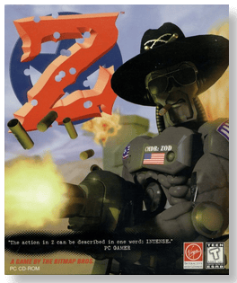](Z/README.md)  &nbsp;&nbsp;&nbsp;&nbsp;&nbsp;&nbsp;&nbsp;&nbsp;&nbsp;&nbsp;&nbsp;&nbsp;&nbsp;&nbsp;&nbsp;&nbsp;&nbsp;&nbsp;&nbsp;&nbsp;&nbsp;&nbsp;&nbsp;&nbsp;&nbsp;&nbsp;&nbsp;&nbsp;&nbsp;&nbsp;&nbsp;&nbsp;&nbsp;&nbsp;&nbsp;&nbsp; |  â Z is a riotous race for supremacy between armies of space-faring robots. Your one aim in life as the commander of your forces is to conquer planets and wipe out the enemy forces. You'll have to take charge of your robot units and direct them in battle. The action is fast and furious. Be prepared to make life-and-death decisions on the spur of the moment. Remember, in Z, if you hesitate, you've had it! â  â This game **is not abandonware 🚫** and is still for sale on [GOG 💰](https://www.gog.com/en/game/z), [Steam 💰](https://store.steampowered.com/app/275530/Z/), and [Zoom 💰](https://www.zoom-platform.com/product/z-the-game). â  |

---

