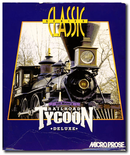
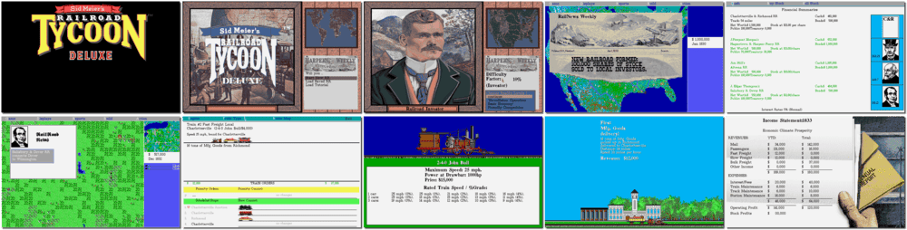

# Railroad Tycoon Deluxe

「**Sid Meier's Railroad Tycoon Deluxe**」

> ❝ Big business. Tough decisions. Excitement, challenge and compelling attention to detail. Railroad Tycoon re-creates the Golden Age of Railroads in any of four regions in America and Europe and gives you complete control over every aspect of your industrial empire. But be careful: the world's other tycoons - like J.P. Morgan, Vanderbilt and Carnegie - are fierce competitors, determined to crush or brush you from their path. ❞
>

📌 ┃ **Year** ‣ 1993 ┃ **Genre** ‣ Strategy ┃ **Platform** ‣ DOS ┃ **License** ‣ Abandonware ┃ **Media** ‣ CD-ROM ┃ **Copy Protection** 

📦 ┃ **[DOSBox](https://www.dosbox.com/) 🟩** ┃ **[DOSBox Staging](https://dosbox-staging.github.io/) 🟩** ┃ **[DOSBox-X](https://dosbox-x.com/) 🟩** 

📎 ┃ **[Wikipedia](https://en.wikipedia.org/wiki/Railroad_Tycoon_Deluxe)** ┃ **[MobyGames](https://www.mobygames.com/game/4037/sid-meiers-railroad-tycoon-deluxe/)** ┃ **[MyAbandonware](https://www.myabandonware.com/game/sid-meier-s-railroad-tycoon-deluxe-22z)** 

## Installation Notes
- Use the default **drive** and **directory** for the installation location.
- Reconfigure Hardware Options:
  - Music & Sound Effects Device: **SoundBlaster (orig.)**
  - Music Card Address: **Address 220**.
  - Digitized Speech Device: **SoundBlaster (orig.)**
  - Speech Address: **Address 220**.
  - Speech IRQ: **IRQ 7**.
  - Speech DRQ: **DRQ 1**.
- **Exit to DOS**.

## Additional Notes
- Consult `Assets/manual.pdf` for the game copy protection.

---

