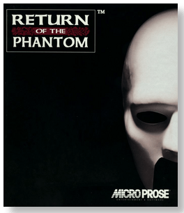
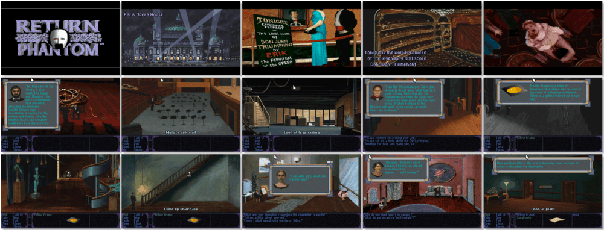

# Return of the Phantom

> ❝ The story begins in the summer of 1993. You are Inspector Raoul Montand, visiting the famed Paris Opera House to attend the premiere of the legendary Don Juan Triumphant, supposedly composed by Erik, the Phantom of the Opera. But a ghastly accident stops the production before it starts, and all the evidence seems to indicate the Phantom himself is still alive! Then things take a truly bizarre twist. While investigating the crime, you are pushed from a catwalk by an unseen assailant and plunged backward in time to 1881! Suddenly, everyone believes you are Raoul de Chagny, lover of the beautiful opera singer Christine Daae, and rival to the real Phantom of the Opera. ❞
>
> ❝ This game **is not abandonware 🚫** and is still for sale on [GOG 💰](https://www.gog.com/game/return_of_the_phantom) and [Steam 💰](https://store.steampowered.com/app/1299710/Return_of_the_Phantom/). ❞
>

📌 ┃ **Year** ‣ 1993 ┃ **Genre** ‣ Adventure ┃ **Platform** ‣ DOS ┃ **License** ‣ Proprietary ┃ **Media** ‣ CD-ROM 

📦 ┃ **[DOSBox](https://www.dosbox.com/) 🟩** ┃ **[DOSBox Staging](https://dosbox-staging.github.io/) 🟩** ┃ **[DOSBox-X](https://dosbox-x.com/) 🟩** 

📎 ┃ **[Wikipedia](https://en.wikipedia.org/wiki/Return_of_the_Phantom)** ┃ **[MobyGames](https://www.mobygames.com/game/2011/return-of-the-phantom/)** ┃ **[MyAbandonware](https://www.myabandonware.com/game/return-of-the-phantom-231)** ┃ **[GOG 💰](https://www.gog.com/game/return_of_the_phantom)** ┃ **[Steam 💰](https://store.steampowered.com/app/1299710/Return_of_the_Phantom/)** 

## Installation Notes
- Select **Install Game Files to Hard Disk**.
- CD-ROM Installation Path: Use default and confirm.
- Use the default **drive** and **directory** for the installation location.
- CD-ROM Configuration CD Drive Letter: Use default and confirm.
- Audio configuration:
  - Music & Sound Effects Device: **SoundBlaster (orig.)**; Music Card Address: **Address 220**.
  - Digitized Speech Device: **SoundBlaster (orig.)**; Speech Address: **Address 220**; Speech IRQ: **IRQ 7**; Speech DRQ: **DRQ 1**.
- Game Play Options Configuration (these settings can be changed within the game):
  - Mouse Interface: **Standard** or **Easy**.
  - Panning: **Smooth**.
  - Room Fades: **Smooth**.

---

