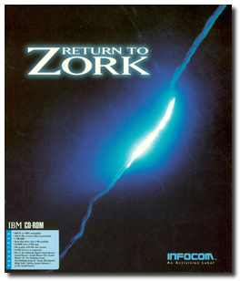
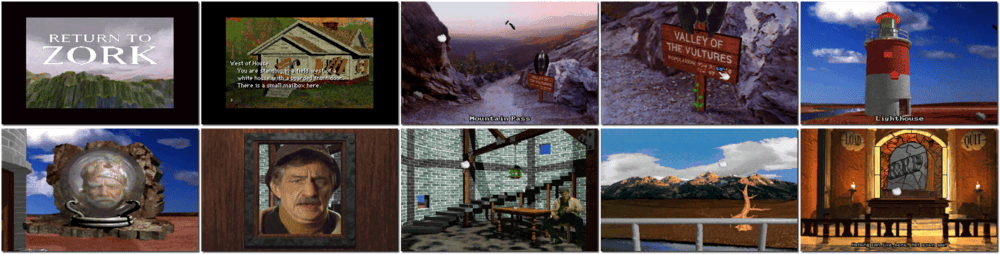

# Return to Zork

「**Return to Zork: An Epic Adventure in the Great Underground Empire**」

> ❝ Seven hundred years before the action in Return to Zork unfolds, the Great Underground Empire and all evil magic are no more. However, the mythical dark recesses beneath the Valley of the Sparrow are back. As a wayward adventurer, you must save the human race from Morphius, the evil ruler of the Great Underground Empire. You roam from the Eastlands to the Westlands, gathering clues and solving puzzles by receiving hints from quirky characters you meet. ❞
>
> ❝ This game **is not abandonware 🚫** and is still for sale on [GOG 💰](https://gog.com/en/game/return_to_zork) and [Steam 💰](https://store.steampowered.com/app/585240/Return_to_Zork/). ❞
>

📌 ┃ **Year** ‣ 1993 ┃ **Genre** ‣ Adventure ┃ **Platform** ‣ DOS ┃ **License** ‣ Proprietary ┃ **Category** ‣ 1st-person • Graphic adventure • Puzzle elements ┃ **Media** ‣ CD-ROM 

📦 ┃ **[DOSBox](https://www.dosbox.com/) 🟩** ┃ **[DOSBox Staging](https://dosbox-staging.github.io/) 🟩** ┃ **[DOSBox-X](https://dosbox-x.com/) 🟩** 

📎 ┃ **[Wikipedia](https://en.wikipedia.org/wiki/Return_to_Zork)** ┃ **[MobyGames](https://www.mobygames.com/game/1219/return-to-zork/)** ┃ **[AbandonwareDOS](https://www.abandonwaredos.com/abandonware-game.php?abandonware=Return+to+Zork&gid=1870)** ┃ **[MyAbandonware](https://www.myabandonware.com/game/return-to-zork-200)** ┃ **[GOG 💰](https://gog.com/en/game/return_to_zork)** ┃ **[Steam 💰](https://store.steampowered.com/app/585240/Return_to_Zork/)** 

## Installation Notes
- Use the default **drive** and **directory** for the installation location.
  - Do you want to copy the project file to your hard disk? Press `Y` and `ENTER`.
- Setup to launch from Windows? Press `N` and `ENTER`.
- Do you want to change the settings right now? Press `ENTER`.
- Please select a sound device: **Creative Labs Sound Blaster 16**.
  - Enter an I/O address for the sound card: **220**.
  - Enter an IRQ number for the sound card: **7**.
  - Enter an extra/DMA value for the sound card: **1**.
- Please select a music device: **Creative Labs Sound Blaster 16**.
- Please select additional system options: Press `ENTER`.
- Please select a CD-ROM drive for Return to Zork CD-ROM: **Drive D:**.
- Press `ENTER` to confirm and start the game.

