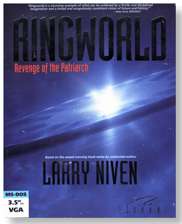
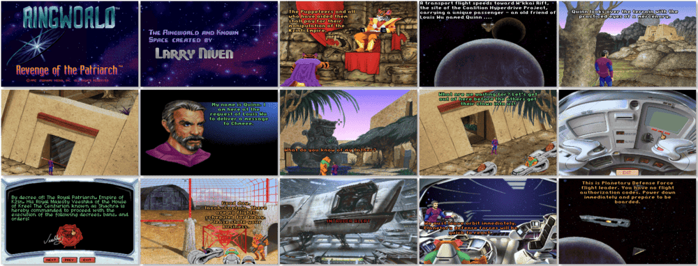

# Ringworld: Revenge of the Patriarch

> ❝ It never mentioned an insane Patriarch, Kzinti assassins, Puppeteer genocide, or the fact that a world so immense it could hold a million earths is the only hope for the future of the universe. A tangled web of intrigue brings together a vengeful Kzin, a kidnapped engineer and a mercenary - alone against a plot that could plunge all of Known Space into chaos. The Kzinti are on the warpath, the Puppeteers claim innocence, and Ringworld holds the answer. If only you can find it in time. ❞
>

📌 ┃ **Year** ‣ 1992 ┃ **Genre** ‣ Adventure ┃ **Platform** ‣ DOS ┃ **License** ‣ Abandonware ┃ **Media** ‣ CD-ROM 

📦 ┃ **[DOSBox](https://www.dosbox.com/) 🟩** ┃ **[DOSBox Staging](https://dosbox-staging.github.io/) 🟩** ┃ **[DOSBox-X](https://dosbox-x.com/) 🟩** 

📎 ┃ **[Wikipedia](https://en.wikipedia.org/wiki/Ringworld:_Revenge_of_the_Patriarch)** ┃ **[MobyGames](https://www.mobygames.com/game/2559/ringworld-revenge-of-the-patriarch/)** ┃ **[MyAbandonware](https://www.myabandonware.com/game/ringworld-revenge-of-the-patriarch-1hu)** 

## Installation Notes
- Press `2` to **Install RINGWORLD - Revenge of the Patriarch**.
- Ready to install RINGWORLD? Select **Ok**.
- Samples will play on your SoundBlaster? Select **Ok**.
- Use the default **drive** and **directory** for the installation location.

---

