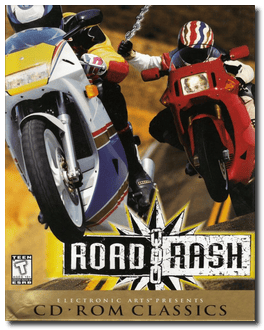
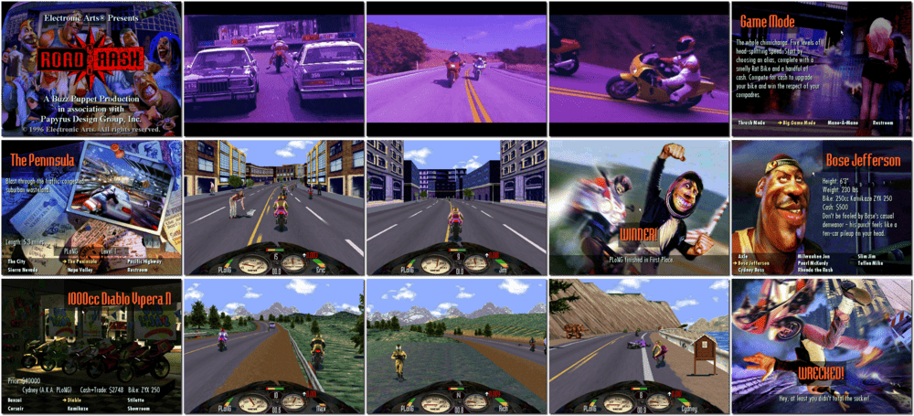

# Road Rash

> ❝ Fight through the levels against other bikers, finish high and use the prize money to customise your motorbike. Sound simple? Add the hazards of oncoming traffic, suicidal pedestrians, street furniture, other road users, and crossroads - and it becomes quite a handful. ❞
>

📌 ┃ **Year** ‣ 1996 ┃ **Genre** ‣ Action • Racing ┃ **Platform** ‣ Windows 9x ┃ **License** ‣ Abandonware ┃ **Media** ‣ CD-ROM ┃ **No Manual** 

📦 ┃ **[DOSBox](https://www.dosbox.com/) ⬜ • Untested** ┃ **[DOSBox Staging](https://dosbox-staging.github.io/) ⬜ • Untested** ┃ **[DOSBox-X](https://dosbox-x.com/) 🟩** 

📎 ┃ **[Wikipedia](https://en.wikipedia.org/wiki/Road_Rash_(1994_video_game))** ┃ **[MobyGames](https://www.mobygames.com/game/17194/road-rash/)** ┃ **[MyAbandonware](https://www.myabandonware.com/game/road-rash-bez)** 

## Installation Notes
- Open *My Computer* and double-click on the `D:` CD-ROM drive to start the installation.
- Use the default **drive** and **directory** for the installation location.
- **DO NOT** install *DirectX* or *Direct Media* when prompted.

---

