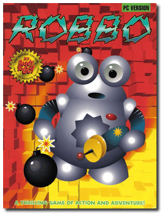

# Robbo

「**Adventures of Robbo**」

> ❝ After pulling too many mischievous pranks, Robbo found himself destined to live in a horrid maze designed to prevent the intelligent little robot from escaping. It is up to you to end Robbo's frustration and torture and find a way to freedom. Beware! Along the way, you will encounter giant spiders blocking the corridors, powerful cannons shooting missiles in random directions, and deadly electromagnets designed to destroy all metal objects, including Robbo! That is just the beginning. ❞
>
> ❝ On 25 June 2006, after obtaining approval from the rights holders, Maciej Miąsik released the three games from Epic Puzzle Pack, including The Adventures of Robbo, through the Classic DOS Games website under the Creative Commons BY-SA 2.5 license as freeware. ❞ — *Wikipedia*
>

📌 ┃ Year: **1993** ┃ Genre: **Action • Puzzle** ┃ Platform: **DOS** ┃ License: **Freeware** ┃ Category: **Top-down • Sci-fi** ┃ Media: **Compressed Package** ┃ **No Manual** 

📦 ┃ **[DOSBox](https://www.dosbox.com/) 🟩** ┃ **[DOSBox Staging](https://dosbox-staging.github.io/) 🟩** ┃ **[DOSBox-X](https://dosbox-x.com/) 🟩** 

📎 ┃ **[Wikipedia](https://en.wikipedia.org/wiki/Robbo_(video_game))** ┃ **[MobyGames](https://www.mobygames.com/game/751/robbo/)** ┃ **[AbandonwareDOS](https://www.abandonwaredos.com/abandonware-game.php?abandonware=Robbo&gid=2935)** ┃ **[MyAbandonware](https://www.myabandonware.com/game/robbo-2d6)** 

## Installation Notes
- Graphics mode: **VGA**
- Sound device: **Sound Blaster**

