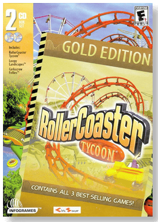
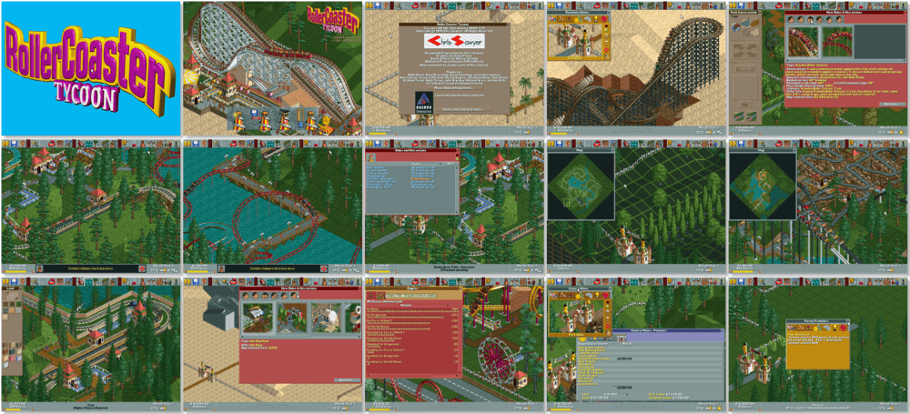

# RollerCoaster Tycoon: Gold Edition

「**RollerCoaster Tycoon** (Base)」「**RollerCoaster Tycoon: Corkscrew Follies** (Add-on)」「**RollerCoaster Tycoon: Loopy Landscapes** (Add-on)」

> ❝ Do you have what it takes to create the ultimate amusement park? Well, here's your chance to find out! RollerCoaster Tycoon is the first build/management sim that's easy to use and powerful! Everyone, novice and expert, will enjoy building the parks they can dream of, complete with the most outrageous thrill rides imaginable! ❞
>
> ❝ This game **is not abandonware 🚫**. The **Deluxe** edition is available on [GOG 💰](https://gog.com/en/game/rollercoaster_tycoon_deluxe) and [Steam 💰](https://store.steampowered.com/app/285310/RollerCoaster_Tycoon_Deluxe/). ❞
>

📌 ┃ **Year (RollerCoaster Tycoon)** ‣ 1999 ┃ **Year (RollerCoaster Tycoon: Corkscrew Follies)** ‣ 1999 ┃ **Year (RollerCoaster Tycoon: Loopy Landscapes)** ‣ 2000 ┃ **Year (RollerCoaster Tycoon: Gold Edition)** ‣ 2000 ┃ **Genre** ‣ Simulation ┃ **Platform** ‣ Windows 9x ┃ **License** ‣ Proprietary ┃ **Media** ‣ CD-ROM ┃ **Add-on** 

📦 ┃ **[DOSBox](https://www.dosbox.com/) ⬜ • Untested** ┃ **[DOSBox Staging](https://dosbox-staging.github.io/) ⬜ • Untested** ┃ **[DOSBox-X](https://dosbox-x.com/) 🟩** 

📎 ┃ **RollerCoaster Tycoon** ‣ [Wikipedia](https://en.wikipedia.org/wiki/RollerCoaster_Tycoon_(video_game)) • [MobyGames](https://www.mobygames.com/game/288/rollercoaster-tycoon/) • [MyAbandonware](https://www.myabandonware.com/game/rollercoaster-tycoon-d2k) ┃ **RollerCoaster Tycoon: Corkscrew Follies** ‣ [MobyGames](https://www.mobygames.com/game/1034/rollercoaster-tycoon-corkscrew-follies/) ┃ **RollerCoaster Tycoon: Loopy Landscapes** ‣ [MobyGames](https://www.mobygames.com/game/2599/rollercoaster-tycoon-loopy-landscapes/) ┃ **RollerCoaster Tycoon: Gold Edition** ‣ [MobyGames](https://www.mobygames.com/game/6260/rollercoaster-tycoon-gold-edition/) ┃ **[Series](https://en.wikipedia.org/wiki/RollerCoaster_Tycoon)** ┃ **Deluxe** ‣ [GOG 💰](https://gog.com/en/game/rollercoaster_tycoon_deluxe) ┃ **Deluxe** ‣ [Steam 💰](https://store.steampowered.com/app/285310/RollerCoaster_Tycoon_Deluxe/) 

## Installation Notes
- Open *My Computer* and double-click on the `D:` CD-ROM drive to start the installation.
- Use the default **drive** and **directory** for the installation location.
- Select the largest installation size when prompted.
- First install **RollerCoaster Tycoon Base** then swap CD-ROM image to **RollerCoaster Tycoon Expansion Packs** and install the add-ons.

## Additional Notes
- Mounted CD-ROM images at launch:
  1. RollerCoaster Tycoon Base
  2. RollerCoaster Tycoon Expansion Packs
- Swapping CD-ROM disc when multiple images are mounted: From DOSBox-X menu **DOS > Swap CD drive**.

---

