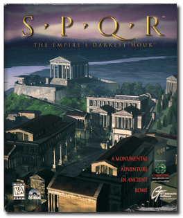
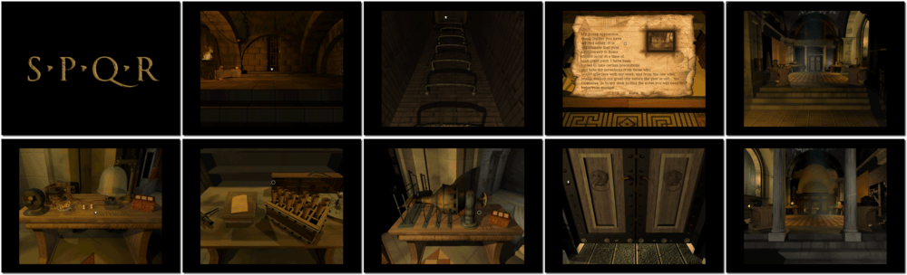

# SPQR: The Empire's Darkest Hour

「**SPQR**」

> ❝ This game challenges you to learn how the Roman Empire works: structurally, mechanically, economically, culturally, and politically. Given one year to investigate five equally suspicious suspects, you must solve the ultimate mystery: Who is plotting to destroy Rome? How will they do it? Explore the streets, temples, and secret labyrinths of the Roman Forum to save the Roman Empire. ❞
>

📌 ┃ **Year** ‣ 1996 ┃ **Genre** ‣ Adventure ┃ **Platform** ‣ Windows 3.1x ┃ **License** ‣ Abandonware ┃ **Media** ‣ CD-ROM 

📦 ┃ **[DOSBox](https://www.dosbox.com/)** ‣ 0.74-3 🟥 • Unplayable ┃ **[DOSBox Staging](https://dosbox-staging.github.io/) 🟩** ┃ **[DOSBox-X](https://dosbox-x.com/) 🟩** 

📎 ┃ **[Wikipedia](https://en.wikipedia.org/wiki/SPQR:_The_Empire%27s_Darkest_Hour)** ┃ **[MobyGames](https://www.mobygames.com/game/2664/spqr-the-empires-darkest-hour/)** ┃ **[MyAbandonware](https://www.myabandonware.com/game/spqr-the-empire-s-darkest-hour-3qe)** 

## Installation Notes
- Select **Custom Installation (Advanced)** option.
- Check only **SPQR**, your Windows 3.1x has both QuickTime and WinG installed.
- Use the default **drive** and **directory** for the installation location.
- Exit Windows and DOSBox once the installation is complete (**Program Manager ‣ File ‣ Exit Windows**) and rerun the `Launch` script to start the program.

---

