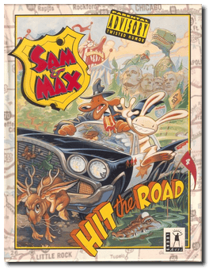
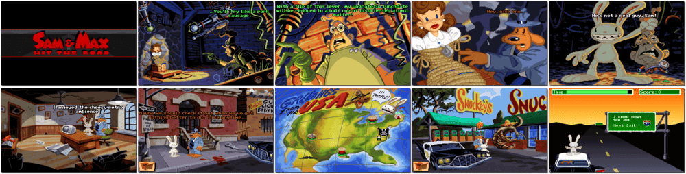

# Sam & Max: Hit the Road

> ❝ Grab your nightstick, squeal like a siren, and Hit the Road with Sam & Max, Freelance Police, as they attempt to crack their case. Sam (a shamus canine) and Max (a hyperkinetic rabbity thing) are hot on the trail of a runaway carnival bigfoot across America's quirky underbelly in this deranged animated adventure. Help our frightening, furry flatfoots find the fugitive freak! ❞
>
> ❝ This game **is not abandonware 🚫** and is still for sale on [GOG 💰](https://gog.com/en/game/sam_max_hit_the_road). ❞
>

📌 ┃ **Year** ‣ 1993 ┃ **Genre** ‣ Adventure ┃ **Platform** ‣ DOS ┃ **License** ‣ Proprietary ┃ **Media** ‣ CD-ROM 

📦 ┃ **[DOSBox](https://www.dosbox.com/) 🟩** ┃ **[DOSBox Staging](https://dosbox-staging.github.io/) 🟩** ┃ **[DOSBox-X](https://dosbox-x.com/) 🟩** 

📎 ┃ **[Wikipedia](https://en.wikipedia.org/wiki/Sam_%26_Max_Hit_the_Road)** ┃ **[MobyGames](https://www.mobygames.com/game/745/sam-max-hit-the-road/)** ┃ **[MyAbandonware](https://www.myabandonware.com/game/sam-max-hit-the-road-1vb)** ┃ **[Series](https://en.wikipedia.org/wiki/Sam_%26_Max)** ┃ **[GOG 💰](https://gog.com/en/game/sam_max_hit_the_road)** 

## Installation Notes
- Soundcard: Select **Sound Blaster 16**.
- Port: Select **220 default**.
- Test *Music* and *Digital Sound*.
- Select **Leave This Silly Program**.
- Save Current Options (y/n)? Press `Y`.

---

