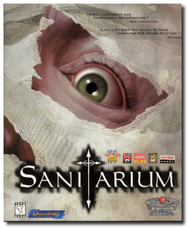
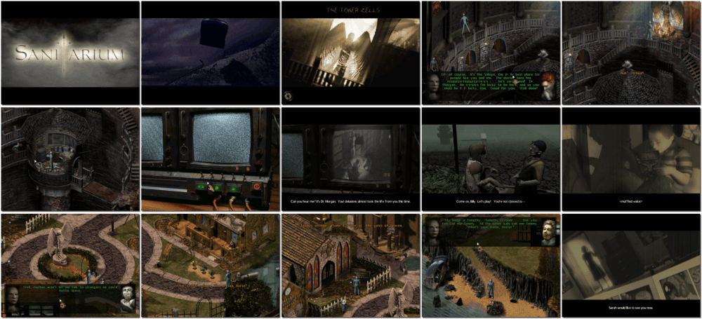

# Sanitarium

> ❝ Spiralling upwards out of the vacuum, you open your eyes and struggle to comprehend your environment. Underneath you, the springs of an institutional cot sink almost to the floor. The mattress is roughly the thickness of a paper towel and reeks of affliction. Vague memories assault you, a hurried phone call, a message of utmost importance, and a car losing control. As you wake up with a throbbing head, you hear people screaming, sobbing, laughing manically in the background. Is it a nightmare? Are you insane? Is it a reality? Maybe this is death. ❞
>
> ❝ This game **is not abandonware 🚫** and is still for sale on [GOG 💰](https://gog.com/en/game/sanitarium) and [Steam 💰](https://store.steampowered.com/app/284050/Sanitarium/). ❞
>

📌 ┃ **Year** ‣ 1998 ┃ **Genre** ‣ Adventure ┃ **Platform** ‣ Windows 98SE ┃ **License** ‣ Proprietary ┃ **Media** ‣ CD-ROM ┃ **Patched** ‣ Multiple files 

📦 ┃ **[DOSBox](https://www.dosbox.com/) ⬜ • Untested** ┃ **[DOSBox Staging](https://dosbox-staging.github.io/) ⬜ • Untested** ┃ **[DOSBox-X](https://dosbox-x.com/) 🟩** 

📎 ┃ **[Wikipedia](https://en.wikipedia.org/wiki/Sanitarium_(video_game))** ┃ **[MobyGames](https://www.mobygames.com/game/572/sanitarium/)** ┃ **[MyAbandonware](https://www.myabandonware.com/game/sanitarium-cs8)** ┃ **[GOG 💰](https://gog.com/en/game/sanitarium)** ┃ **[Steam 💰](https://store.steampowered.com/app/284050/Sanitarium/)** 

## Host Requirements
- Download an *executable* patch file manually from [MyAbandonware](https://www.myabandonware.com/game/sanitarium-cs8) labeled *"English version 292 KB (Windows)"*, rename it to `sntrm.exe`, and place it in the `Assets` directory.
- Download a *Level 2* patch file manually from [MyAbandonware](https://www.myabandonware.com/game/sanitarium-cs8) labeled *"Level 2 Fix English version 57 KB (Windows)"*, rename it to `plevel2.zip`, and place it in the `Assets` directory.
- Download a *Labyrinth* patch file manually from [MyAbandonware](https://www.myabandonware.com/game/sanitarium-cs8) labeled *"Labyrinth Fix English version 20 KB (Windows)"*, rename it to `plab.zip`, and place it in the `Assets` directory.

## Installation Notes
- Open *My Computer* and double-click on the `D:` CD-ROM drive to start the installation.
- Use the default **drive** and **directory** for the installation location.
- Select the largest installation size when prompted.
- **DO NOT** install *DirectX* or *Direct Media* when prompted.
- Applying patches:
  - A patched executable file is available on `C:\PATCH\SNTRM.EXE`. Copy this file to `C:\Program Files\ASC Games\Sanitarium`, replacing existing `SNTRM.EXE`.
  - A patch is available on `C:\PATCH\PLEVEL2.ZIP`. Extract the compressed file and copy `SCN.006` to `C:\Program Files\ASC Games\Sanitarium\Data`.
  - A patch is available on `C:\PATCH\PLAB.ZIP`. Extract the compressed file and copy `SCN.016` to `C:\Program Files\ASC Games\Sanitarium\Data`.

## Additional Notes
- Mounted CD-ROM images at launch:
  1. Sanitarium Disc #1
  2. Sanitarium Disc #2
  3. Sanitarium Disc #3
- Swapping CD-ROM disc when multiple images are mounted: From DOSBox-X menu **DOS > Swap CD drive**.

---

