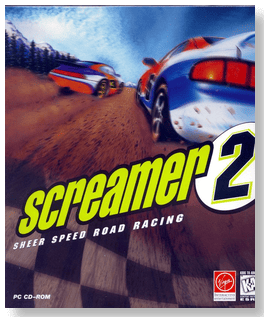

# Screamer 2

「**Screamer 2: Sheer Speed Road Racing**」「**S2**」

> ❝ This all-new landmark in driving experiences leaves even its impressive, critically acclaimed predecessors eating dirt. For the first time, six formidable courses from around the world have been designed with variable conditions to put the best to the test. Feel every bone-shaking bump, every nerve-wracking jump, every mud- and gut-churning skid, twist and turn. But don't feel ashamed to release the tension with a scream every once in a while. ❞
>
> ❝ This game **is not abandonware 🚫** and is still for sale on [GOG 💰](https://gog.com/en/game/screamer_2) and [Steam 💰](https://store.steampowered.com/app/698620/Screamer_2/). ❞
>

📌 ┃ **Year** ‣ 1996 ┃ **Genre** ‣ Racing ┃ **Platform** ‣ DOS ┃ **License** ‣ Proprietary ┃ **Media** ‣ CD-ROM 

📦 ┃ **[DOSBox](https://www.dosbox.com/) 🟩** ┃ **[DOSBox Staging](https://dosbox-staging.github.io/) 🟩** ┃ **[DOSBox-X](https://dosbox-x.com/) 🟩** 

📎 ┃ **[Wikipedia](https://en.wikipedia.org/wiki/Screamer_2)** ┃ **[MobyGames](https://www.mobygames.com/game/375/screamer-2/)** ┃ **[MyAbandonware](https://www.myabandonware.com/game/screamer-2-cvl)** ┃ **[GOG 💰](https://gog.com/en/game/screamer_2)** ┃ **[Steam 💰](https://store.steampowered.com/app/698620/Screamer_2/)** 

## Installation Notes
- Installing the game:
  - Open `Program.txt` and change the `[cpu] cycles` attribute to `16000` before starting installation.
  - Installation Type: **Normal Installation**.
  - Select video mode: **65K Colors Only**.
  - Installation Type: **Full Installation 108 Megs. required**.
  - Use the default **drive** and **directory** for the installation location.
  - Screen mode: **Hi-Res 65K Colours**.
  - Controls 1 and 2: *Calibrate game controls*.
  - Sound card: **Auto Detect**.
  - Press `ESC` and `Y` to save the settings and complete the installation. DOSBox will quit.
- Playing the game:
  - Open `Program.txt` and change the `[cpu] cycles` attribute back to `max` before starting the game.

---

