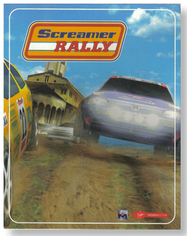

# Screamer Rally

「**Speed Rally**」

> ❝ Screamer Rally is a challenge for every racing fan. Five powerful vehicles and seven nerve-racking race tracks demand total concentration and all your skills. Because even the tiniest mistake can mean the end: sudden direction changes, merciless bumps, unexpected slides, spins, and jumps - can put even experienced drivers in a tricky situation. But with the proper technique and the necessary courage, you can master it. Well then, have a good trip! ❞
>

📌 ┃ **Year** ‣ 1997 ┃ **Genre** ‣ Racing ┃ **Platform** ‣ DOS ┃ **License** ‣ Abandonware ┃ **Media** ‣ CD-ROM ┃ **No Manual** 

📦 ┃ **[DOSBox](https://www.dosbox.com/) 🟩** ┃ **[DOSBox Staging](https://dosbox-staging.github.io/) 🟩** ┃ **[DOSBox-X](https://dosbox-x.com/) 🟩** 

📎 ┃ **[Wikipedia](https://en.wikipedia.org/wiki/Screamer_Rally)** ┃ **[MobyGames](https://www.mobygames.com/game/2973/screamer-rally/)** ┃ **[MyAbandonware](https://www.myabandonware.com/game/screamer-rally-a61)** 

## Installation Notes
- Installing the game:
  - Open `Program.txt` and change the `[cpu] cycles` attribute to `16000` before starting installation.
  - Installation Type: **Normal Installation**.
  - Select video mode: **65K Colors and 3D Cards Only**.
  - Installation Type: **Full Installation 92 Megs. required**.
  - Use the default **drive** and **directory** for the installation location.
  - Screen mode: **Hi-Res 65K Colours** (supported by all DOSBox variants).
    - **DOSBox-X** with [3dfx Voodoo](https://dosbox-x.com/wiki/Guide%3ASetting-up-3dfx-Voodoo-in-DOSBox%E2%80%90X) support enabled can choose **3DFX Card** screen mode.
  - Controls 1 and 2: *Calibrate game controls*.
  - Sound card: **Auto Detect**.
  - Press `ESC` and `Y` to save the settings and complete the installation. DOSBox will quit.
- Playing the game:
  - Open `Program.txt` and change the `[cpu] cycles` attribute back to `max` before starting the game.

---

