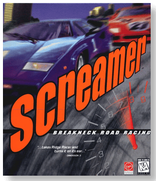
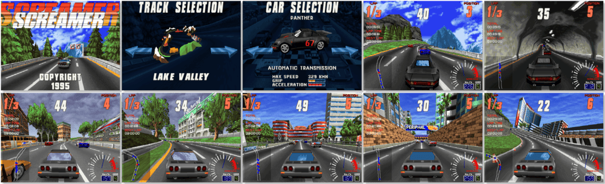

# Screamer

> ❝ Lights blur. The crowd whizzes past. Your helmet rattles against the roll bar. The competition switches into overdrive. Tears stream from your eyes as the race moves at extreme speed. The same stuff seeps out of your palms and onto the steering wheel. Get a grip. You are sliding into a turn at 200 miles per hour. Centrifugal force will only carry you so far. It is a velocity-driven, pedal-to-the-metal arcade auto racing. No simulation. Find out how your PC handles because you have never been allowed to go this fast. Maneuver through a twisted landscape, along six snaking tracks with other racers breathing down your neck, and post a warped time. Strapped into a personally chosen, made-for-the-autobahn racing machine, you will scream to redefine fast in this winding 3-D ride of pure rocketing fun. ❞
>
> ❝ This game **is not abandonware 🚫** and is still for sale on [GOG 💰](https://www.gog.com/en/game/screamer) and [Steam 💰](https://store.steampowered.com/app/697580/Screamer/). ❞
>

📌 ┃ **Year** ‣ 1995 ┃ **Genre** ‣ Racing ┃ **Platform** ‣ DOS ┃ **License** ‣ Proprietary ┃ **Media** ‣ CD-ROM 

📦 ┃ **[DOSBox](https://www.dosbox.com/) 🟩** ┃ **[DOSBox Staging](https://dosbox-staging.github.io/) 🟩** ┃ **[DOSBox-X](https://dosbox-x.com/) 🟩** 

📎 ┃ **[Wikipedia](https://en.wikipedia.org/wiki/Screamer_(video_game))** ┃ **[MobyGames](https://www.mobygames.com/game/621/screamer/)** ┃ **[MyAbandonware](https://www.myabandonware.com/game/screamer-36y)** ┃ **[GOG 💰](https://www.gog.com/en/game/screamer)** ┃ **[Steam 💰](https://store.steampowered.com/app/697580/Screamer/)** 

## Installation Notes
- Installing the game:
  - For **DOSBox** and **DOSBox Staging**: Open `Program.txt` and change the `[cpu] cycles` attribute to `16000` before starting installation.
  - Installation Type: **Normal Installation**.
  - Use the default **drive** and **directory** for the installation location.
  - Screen mode: **SVGA**.
  - Controls: *Calibrate game controls*.
  - Sound card setup: **Auto Detect**.
  - Press `ESC` and `Y` to save the settings and complete the installation. DOSBox will quit.
- Playing the game:
  - For **DOSBox** and **DOSBox Staging**: Open `Program.txt` and change the `[cpu] cycles` attribute back to `max` before starting the game.

---

