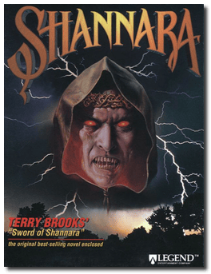
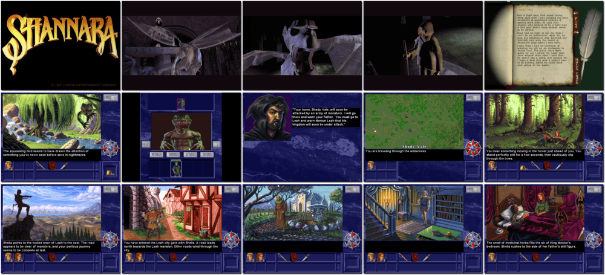

# Shannara

> ❝ Brona, the ancient Warlock King, has returned! Slain decades ago, Brona's evil spirit has returned to wreak revenge upon those who killed him. Now, only the combined magic of the races can destroy him. You are Jak Ohmsford. Only you can overcome the ancestral hatreds that divide the Four Lands. And only you can wield the magic that will defeat Brona. It is your destiny to save your homeland-but the price is far higher than you could have ever imagined. ❞
>
> ❝ This game **is not abandonware 🚫** and used to be for sale on **Ziggurat**. However, it is no longer available digitally anymore. ❞
>

📌 ┃ **Year** ‣ 1995 ┃ **Genre** ‣ Adventure ┃ **Platform** ‣ DOS ┃ **License** ‣ Proprietary ┃ **Category** ‣ 1st-person • Puzzle elements • Fantasy ┃ **Media** ‣ CD-ROM 

📦 ┃ **[DOSBox](https://www.dosbox.com/) 🟩** ┃ **[DOSBox Staging](https://dosbox-staging.github.io/) 🟩** ┃ **[DOSBox-X](https://dosbox-x.com/) 🟩** 

📎 ┃ **[Wikipedia](https://en.wikipedia.org/wiki/Shannara_(video_game))** ┃ **[MobyGames](https://www.mobygames.com/game/3208/shannara/)** ┃ **[AbandonwareDOS](https://www.abandonwaredos.com/abandonware-game.php?abandonware=Shannara&gid=2464)** ┃ **[MyAbandonware](https://www.myabandonware.com/game/shannara-2t8)** 

## Installation Notes
- Installation Options: **Optimum Performance Installation**.
- Use the default **drive** and **directory** for the installation location.
  - Select and configure MIDI music driver: **Creative Labs Sound Blaster(TM) 16** (*Attempt to configure sound driver automatically*).
  - Select and configure digital audio driver: **Creative Labs Sound Blaster 16 or AWE32** (*Attempt to configure sound driver automatically*).

