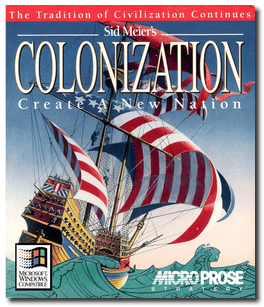
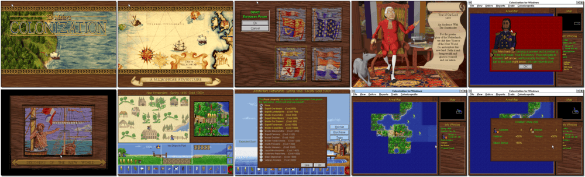

# Sid Meier's Colonization

「**Colonization**」「**Sid Meier's Colonization: Create A New Nation**」

> ❝ Before you lie the promise that is the New World with all its peril and infinite possibility. Vast, lush green tracts of forest; freezing, crystal clear mountain rivers; plains stretching as far as the eye can see. Be its master! Colonization from Sid Meier is a story of discovery, exploration and territorial independence. Play the colonist, conquistador and diplomat facing the challenges and frustrations of building a new independent nation. Choose the European power you want to represent: French, Spanish, Dutch, or British. Use the wealth of the land to build up your position. Use deceit and force to outwit rivals. Use trade alliances to forge friendships and create new industries - all while holding back the possibility of revolt. ❞
>
> ❝ This game **is not abandonware 🚫** and is still for sale on [GOG 💰](https://gog.com/en/game/sid_meiers_colonization) and [Steam 💰](https://store.steampowered.com/app/327400/Sid_Meiers_Colonization_Classic/). ❞
>

📌 ┃ **Year** ‣ 1994 ┃ **Genre** ‣ Simulation • Strategy ┃ **Platform** ‣ Windows 3.1x ┃ **License** ‣ Proprietary ┃ **Category** ‣ Top-down • Turn-based • 4X • Managerial • Turn-based strategy • Europe • North America • South America • Historical events ┃ **Media** ‣ CD-ROM ┃ **Patched** 

📦 ┃ **[DOSBox](https://www.dosbox.com/) 🟩** ┃ **[DOSBox Staging](https://dosbox-staging.github.io/) 🟩** ┃ **[DOSBox-X](https://dosbox-x.com/) 🟩** 

📎 ┃ **[Wikipedia](https://en.wikipedia.org/wiki/Sid_Meier%27s_Colonization)** ┃ **[MobyGames](https://www.mobygames.com/game/366/sid-meiers-colonization/)** ┃ **[AbandonwareDOS](https://www.abandonwaredos.com/abandonware-game.php?abandonware=Colonization&gid=1244)** ┃ **[MyAbandonware](https://www.myabandonware.com/game/sid-meier-s-colonization-28t)** ┃ **[Fandom](https://civilization.fandom.com/wiki/Sid_Meier%27s_Colonization)** ┃ **[Series](https://en.wikipedia.org/wiki/Civilization_(series))** ┃ **[GOG 💰](https://gog.com/en/game/sid_meiers_colonization)** ┃ **[Steam 💰](https://store.steampowered.com/app/327400/Sid_Meiers_Colonization_Classic/)** 

## Installation Notes
- Use the default **drive** and **directory** for the installation location.
- Exit Windows and DOSBox once the installation is complete (**Program Manager > File > Exit Windows**) and rerun the `Launch` script to start the program.

## Additional Notes
### How to play this game on a larger display resolution?
- Select **2. Run Windows Setup** at program start-up.
- Change **Display** settings to _**S3 ... [width]x[height] 256 colors SF.**_
  - Replace *[width]x[height]* with your desired screen resolution, e.g. 800x600 or 1024x768.
  - Only select a display option that ends with *256 colors SF* as it is the most widely used format in games.
- Accept the configuration shown above.
- Press `ENTER` when prompted to **Keep Driver**.

