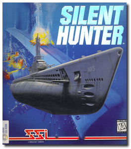
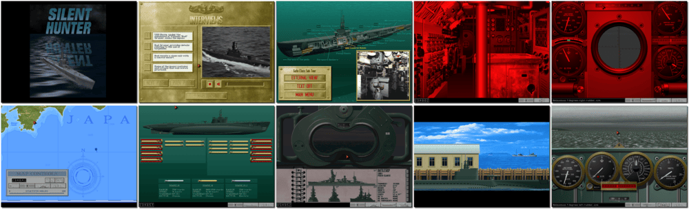

# Silent Hunter

> ❝ Silent Hunter is a full-featured and comprehensive look at World War II submarine warfare. Designed for a single-player, Silent Hunter lets you assume command of an American submarine in the Pacific. You have to sink as many enemy ships as possible. Do your job well to become a decorated naval hero and earn assignments on bigger and better class subs as your career progresses. ❞
>
> ❝ This game is no longer available digitally anymore. ❞
>

📌 ┃ **Year** ‣ 1996 ┃ **Genre** ‣ Simulation ┃ **Platform** ‣ DOS ┃ **License** ‣ Abandonware ┃ **Media** ‣ CD-ROM 

📦 ┃ **[DOSBox](https://www.dosbox.com/) 🟩** ┃ **[DOSBox Staging](https://dosbox-staging.github.io/) 🟩** ┃ **[DOSBox-X](https://dosbox-x.com/) 🟩** 

📎 ┃ **[Wikipedia](https://en.wikipedia.org/wiki/Silent_Hunter_(video_game))** ┃ **[MobyGames](https://www.mobygames.com/game/5356/silent-hunter/)** ┃ **[MyAbandonware](https://www.myabandonware.com/game/silent-hunter-2eg)** 

## Installation Notes
- Select **Maximum Install: Animations & Speech on HD 88 Megs D**.
- Press `ENTER` to confirm System Detection.
- Use the default **drive** and **directory** for the installation location.
- Select and configure digital audio driver: **Creative Labs Sound Blaster 16 or AWE32** (*Attempt to configure sound driver automatically*).

---

