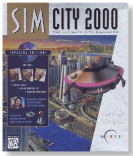
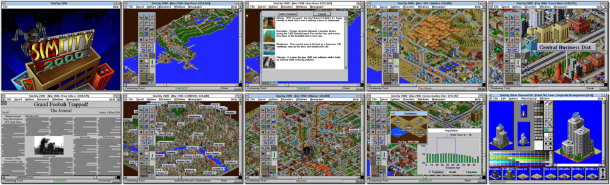

# SimCity 2000: CD Collection

「**SimCity 2000** (Base)」「**SimCity 2000 Scenarios: Volume 1 - Great Disasters** (Add-on)」「**SimCity 2000: Urban Renewal Kit** (Add-on)」「**SimCity 2K**」「**SimCity 2000: The Ultimate City Simulator**」「**SimCity 2000: Special Edition**」

> ❝ This morning, you approved a new solar power plant, designed an underground transportation system, and jumped five points in the polls. Then you raised taxes (and lost 10 points), read two local newspapers, built a zoo, a marina and a library, and pushed your education bill through the city council. It's time for lunch - unless there's a fire, tornado, earthquake or alien invasion. ❞
>
> ❝ This game **is not abandonware 🚫**. A **Special Edition** release is available on [GOG 💰](https://www.gog.com/en/game/simcity_2000_special_edition). ❞
>

📌 ┃ **Year (SimCity 2000)** ‣ 1993 ┃ **Year (SimCity 2000 Scenarios: Volume 1 - Great Disasters)** ‣ 1994 ┃ **Year (SimCity 2000: Urban Renewal Kit)** ‣ 1994 ┃ **Year (SimCity 2000: CD Collection)** ‣ 1994 ┃ **Genre** ‣ Simulation • Strategy ┃ **Platform** ‣ Windows 3.1x ┃ **License** ‣ Proprietary ┃ **Media** ‣ CD-ROM 

📦 ┃ **[DOSBox](https://www.dosbox.com/) 🟩** ┃ **[DOSBox Staging](https://dosbox-staging.github.io/) 🟩** ┃ **[DOSBox-X](https://dosbox-x.com/) 🟩** 

📎 ┃ **SimCity 2000** ‣ [Wikipedia](https://en.wikipedia.org/wiki/SimCity_2000) • [MobyGames](https://www.mobygames.com/game/657/simcity-2000/) • [MyAbandonware](https://www.myabandonware.com/game/simcity-2000-1nf) ┃ **SimCity 2000 Scenarios: Volume 1 - Great Disasters** ‣ [MobyGames](https://www.mobygames.com/game/40993/simcity-2000-scenarios-volume-1-great-disasters/) • [MyAbandonware](https://www.myabandonware.com/game/simcity-2000-scenarios-volume-1-great-disasters-39c) ┃ **SimCity 2000: Urban Renewal Kit** ‣ [MobyGames](https://www.mobygames.com/game/2422/simcity-2000-urban-renewal-kit/) • [MyAbandonware](https://www.myabandonware.com/game/simcity-2000-urban-renewal-kit-2uz) ┃ **SimCity 2000: CD Collection** ‣ [MobyGames](https://www.mobygames.com/game/2313/simcity-2000-cd-collection/) • [MyAbandonware](https://www.myabandonware.com/game/simcity-2000-cd-collection-311) ┃ **[Series](https://en.wikipedia.org/wiki/SimCity)** ┃ **Special Edition** ‣ [GOG 💰](https://www.gog.com/en/game/simcity_2000_special_edition) 

## Installation Notes
- Check all installation components: **Program Files**, **Cities**, **URK Art**, and **Scenarios**. Click **Continue**.
- Enter your name and company name.
- Use the default **drive** and **directory** for the installation location.
- Click **Continue** on the INSTANT REGISTRATION pop-up.

## Additional Notes
- `RUNEXIT.EXE` binary does not work on this program. You have to shutdown Windows manually to exit DOSBox.

### How to play this game on a larger display resolution?
- Select **3. Run Windows Setup** at program start-up.
- Change **Display** settings to _**S3 ... [width]x[height] 256 colors SF.**_
  - Replace *[width]x[height]* with your desired screen resolution, e.g. 800x600 or 1024x768.
  - Only select a display option that ends with *256 colors SF* as it is the most widely used format in games.
- Accept the configuration shown above.
- Press `ENTER` when prompted to **Keep Driver**.

---

