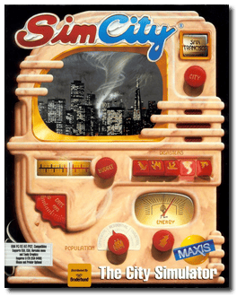
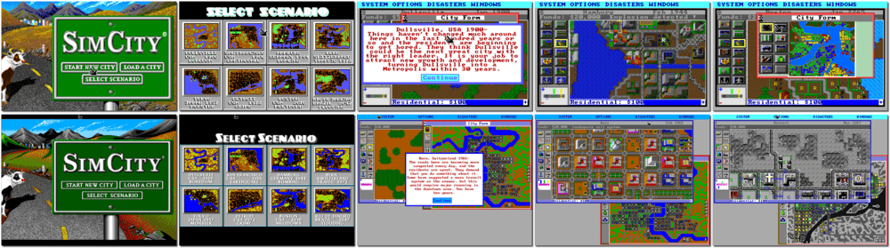

# SimCity

「**Micropolis**」「**SimCity Classic**」「**SimCity: The City Simulator**」

> ❝ Shake hands, kiss babies and do not let monsters destroy your city! So you want to be Mayor? Well, now is your opportunity! Begin with empty land, start a town, name it after yourself, and build it into a city. Then see if you can sustain enough growth to expand your city into a megalopolis! As Mayor, you have the tools to overcome any challenge. Whether taxes, zoning, crime, transportation, fire control, pollution, natural disasters, or other critical issues, the duties of the Mayor are yours. For a change of pace, try saving a city burdened with problems by playing one of the eight built-in scenarios. Time is passing, and every decision you make has future consequences — so get to work! ❞
>
> ❝ In January 2008, the SimCity source code was released as free software under the GPL-3.0-or-later license, renamed to Micropolis (the original working title) for trademark reasons, and developed by Don Hopkins. ❞ — *Wikipedia*
>

📌 ┃ **Year** ‣ 1989 ┃ **Genre** ‣ Simulation ┃ **Platform** ‣ DOS ┃ **License** ‣ Freeware ┃ **Category** ‣ Top-down • City building • Managerial • Contemporary ┃ **Media** ‣ Compressed Package 

📦 ┃ **[DOSBox](https://www.dosbox.com/) 🟩** ┃ **[DOSBox Staging](https://dosbox-staging.github.io/) 🟩** ┃ **[DOSBox-X](https://dosbox-x.com/) 🟩** 

📎 ┃ **[Wikipedia](https://en.wikipedia.org/wiki/SimCity_(1989_video_game))** ┃ **[MobyGames](https://www.mobygames.com/game/848/simcity/)** ┃ **[AbandonwareDOS](https://www.abandonwaredos.com/abandonware-game.php?abandonware=SimCity&gid=2662)** ┃ **[MyAbandonware](https://www.myabandonware.com/game/simcity-ri)** ┃ **[Fandom](https://simcity.fandom.com/wiki/SimCity_(1989))** ┃ **[Series](https://en.wikipedia.org/wiki/SimCity)** 

## Installation Notes
- Choose Video Display Mode: **VGA/MCGA 256 Color (320x200)** or **VGA 16 Color (640x480)**.
- Please choose a sound source for MUSIC: **Sound Blaster 16**, **CONTINUE**.
- Please choose a sound source for SOUND EFFECTS: **Sound Blaster 16**, **CONTINUE**.

