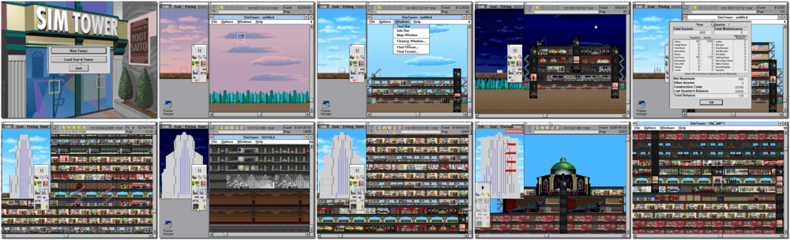

# SimTower

「**SimTower: The Vertical Empire**」「**The Tower** (Japanese)」

> ❝ Reach for the sky! Start by building a small office complex - a lobby, a few offices and a cafe. Expand by adding more floors, more offices and elevators. Then diversify to hotel rooms, shops, theatres, restaurants, condos and more as you build your way to the top. Success in SimTower requires design talent, management skills, business acumen and the ability to keep your customers happy. And be on the lookout for fires, insect infestations, terrorists and more (you will find out soon enough). ❞
>

📌 ┃ **Year** ‣ 1994 ┃ **Genre** ‣ Simulation ┃ **Platform** ‣ Windows 3.1x ┃ **License** ‣ Abandonware ┃ **Media** ‣ CD-ROM ┃ **Patched** ‣ 1.1b 

📦 ┃ **[DOSBox](https://www.dosbox.com/) 🟩** ┃ **[DOSBox Staging](https://dosbox-staging.github.io/) 🟩** ┃ **[DOSBox-X](https://dosbox-x.com/) 🟩** 

📎 ┃ **[Wikipedia](https://en.wikipedia.org/wiki/SimTower)** ┃ **[MobyGames](https://www.mobygames.com/game/312/simtower-the-vertical-empire/)** ┃ **[MyAbandonware](https://www.myabandonware.com/game/simtower-the-vertical-empire-3f2)** 

## Installation Notes
- Use the default **drive** and **directory** for the installation location.
- Exit Windows and DOSBox once the installation is complete (**Program Manager > File > Exit Windows**) and rerun the `Launch` script to start the program.

## Additional Notes
### How to play this game on a larger display resolution?
- Select **2. Run Windows Setup** at program start-up.
- Change **Display** settings to _**S3 ... [width]x[height] 256 colors SF.**_
  - Replace *[width]x[height]* with your desired screen resolution, e.g. 800x600 or 1024x768.
  - Only select a display option that ends with *256 colors SF* as it is the most widely used format in games.
- Accept the configuration shown above.
- Press `ENTER` when prompted to **Keep Driver**.

---

