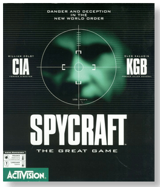
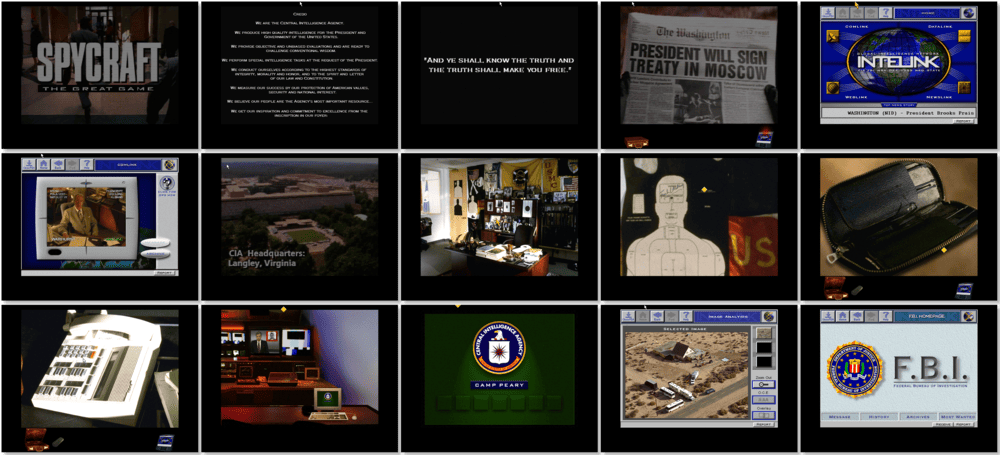

# Spycraft: The Great Game

> ❝ Enter the world of international intrigue. It's you against faceless enemies in a rush to unravel a high-level assassination plot. Arm yourself with authentic spy tools, high-tech weapons and professional CIA operation skills. Confront realistic global scenarios where decisions you make determine the balance of world power. ❞
>
> ❝ This game **is not abandonware 🚫** and is still for sale on [GOG 💰](https://www.gog.com/game/spycraft_the_great_game) and [Steam 💰](https://store.steampowered.com/app/569220/Spycraft_The_Great_Game/). ❞
>

📌 ┃ **Year** ‣ 1996 ┃ **Genre** ‣ Adventure ┃ **Platform** ‣ DOS ┃ **License** ‣ Proprietary 

📦 ┃ **[DOSBox](https://www.dosbox.com/) 🟩** ┃ **[DOSBox Staging](https://dosbox-staging.github.io/) 🟩** ┃ **[DOSBox-X](https://dosbox-x.com/) 🟩** 

📎 ┃ **[Wikipedia](https://en.wikipedia.org/wiki/Spycraft:_The_Great_Game)** ┃ **[MobyGames](https://www.mobygames.com/game/966/spycraft-the-great-game/)** ┃ **[MyAbandonware](https://www.myabandonware.com/game/spycraft-the-great-game-c9q)** ┃ **[GOG 💰](https://www.gog.com/game/spycraft_the_great_game)** ┃ **[Steam 💰](https://store.steampowered.com/app/569220/Spycraft_The_Great_Game/)** 

## Installation Notes
- Installation Setup Type: Select **Best Performance**.
- Use the default **drive** and **directory** for the installation location.
- Select **Begin installation**.
- Audio configuration:
  - Select Digital: **Sound Blaster 16**; Port: **220**; DMA: **5**; IRQ: **7**.
  - Select MIDI: **Sound Blaster 16**; Port: **388**.
- Lockout torture scenes? Select your preference.
- Press `B` to bypass registration process.
- Do you wish to make a boot disk now? Press `N` then `ENTER`.

## Additional Notes
- Mounted CD-ROM images at launch:
  1. Spycraft: The Great Game Disc #1
  2. Spycraft: The Great Game Disc #2
  3. Spycraft: The Great Game Disc #3

### How to swap CD-ROM images?
- [DOSBox](https://www.dosbox.com/wiki/DOSBox_FAQ#Swapping_CD_images) — Hotkey: CTRL+F4
- [DOSBox Staging](https://github.com/dosbox-staging/dosbox-staging/blob/main/README) — Hotkey: CTRL+F4 (or CMD+F4 on macOS)
- [DOSBox-X](https://dosbox-x.com/wiki/Guide%3AManaging-image-files-in-DOSBox%E2%80%90X#_mounting_multiple_cd_or_dvd_images) — Hotkey: F11+CTRL+C (or F12+D on macOS). Menu: DOS ‣ Swap CD drive.

---

