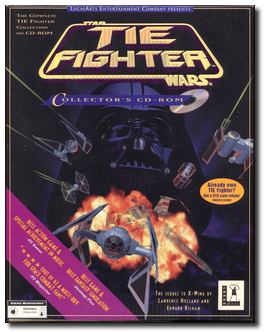
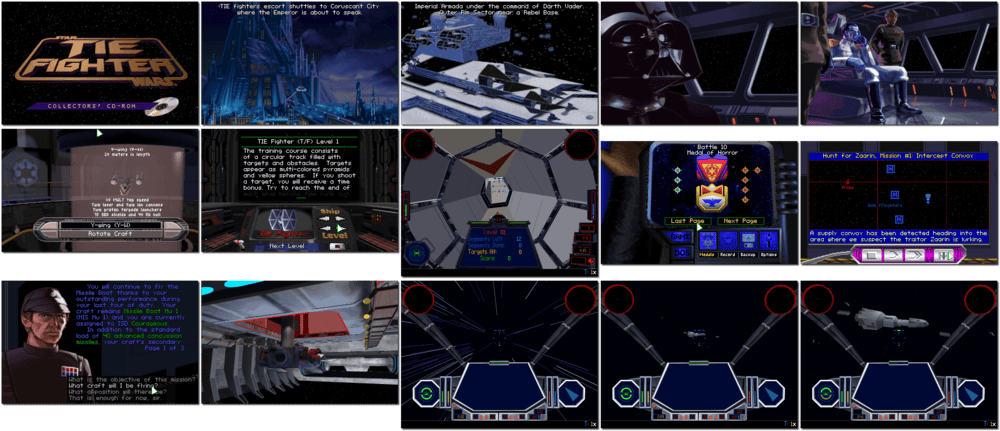

# Star Wars: TIE Fighter - Collector's CD-ROM

「**Star Wars: TIE Fighter** (Base)」「**Star Wars: TIE Fighter - Defender of the Empire** (Add-on)」「**TIE Fighter**」

> ❝ Join the Imperial Navy and Save the Galaxy! Pirates raid interstellar traders. Terrorists threaten the galaxy. Through their treachery on Yavin, the alliance of Rebels and other criminals has threatened the very foundation of the Galactic Empire. As an Imperial Navy starfighter pilot, you will safeguard imperilled lives throughout the galaxy. Only the Emperor can save us from chaos and destruction. Join his cause in eliminating this rebel uprising. ❞
>
> ❝ This game **is not abandonware 🚫**. A **Special Edition** release is available on [GOG 💰](https://www.gog.com/en/game/star_wars_tie_fighter_special_edition) and [Steam 💰](https://store.steampowered.com/app/355250/STAR_WARS_TIE_Fighter_Special_Edition/). ❞
>

📌 ┃ **Year (Star Wars: TIE Fighter)** ‣ 1994 ┃ **Year (Star Wars: TIE Fighter - Defender of the Empire)** ‣ 1994 ┃ **Year (Star Wars: TIE Fighter - Collector's CD-ROM)** ‣ 1995 ┃ **Genre** ‣ Action • Simulation ┃ **Platform** ‣ DOS ┃ **License** ‣ Proprietary ┃ **Media** ‣ CD-ROM 

📦 ┃ **[DOSBox](https://www.dosbox.com/) 🟩** ┃ **[DOSBox Staging](https://dosbox-staging.github.io/) 🟩** ┃ **[DOSBox-X](https://dosbox-x.com/) 🟩** 

📎 ┃ **Star Wars: TIE Fighter** ‣ [Wikipedia](https://en.wikipedia.org/wiki/Star_Wars:_TIE_Fighter) • [MobyGames](https://www.mobygames.com/game/240/star-wars-tie-fighter/) • [MyAbandonware](https://www.myabandonware.com/game/star-wars-tie-fighter-2ei) ┃ **Star Wars: TIE Fighter - Defender of the Empire** ‣ [MobyGames](https://www.mobygames.com/game/4634/star-wars-tie-fighter-defender-of-the-empire/) • [MyAbandonware](https://www.myabandonware.com/game/star-wars-tie-fighter-defender-of-the-empire-2uq) ┃ **Star Wars: TIE Fighter - Collector's CD-ROM** ‣ [MobyGames](https://www.mobygames.com/game/706/star-wars-tie-fighter-collectors-cd-rom/) ┃ **[Series](https://en.wikipedia.org/wiki/Star_Wars:_X-Wing_(video_game_series))** ┃ **Special Edition** ‣ [GOG 💰](https://www.gog.com/en/game/star_wars_tie_fighter_special_edition) ┃ **Special Edition** ‣ [Steam 💰](https://store.steampowered.com/app/355250/STAR_WARS_TIE_Fighter_Special_Edition/) 

## Installation Notes
- Select **Maximum Install**.
- Use the default **drive** and **directory** for the installation location.
- Express or Custom Setup (E/C)? Press `E`. Follow auto-detection configuration and tests.
- Select **PLAY** to start the game (or **EXIT** to quit DOSBox).

---

