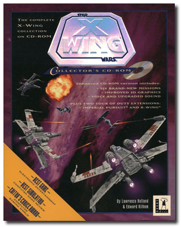

# Star Wars: X-Wing

「**X-Wing**」「**Star Wars: X-Wing - Space Combat Simulator**」「**Star Wars: X-Wing - Collector's CD-ROM**」

> ❝ It is the dawn of the Rebellion. The Old Republic: gone, The Senate: abolished, The Jedi Knights: exterminated. Now, the Emperor seeks to crush the last remaining opposition. Against the overwhelming might of the Galactic Empire stands a small but growing Rebel Alliance. Scattered resistance groups are uniting, and what is needed most now are Starfighter pilots. Will you join their struggle to end this tyranny and become a hero of the Rebellion? ❞
>
> ❝ This game **is not abandonware 🚫**. A **Special Edition** release is available on [GOG 💰](https://www.gog.com/en/game/star_wars_xwing_special_edition) and [Steam 💰](https://store.steampowered.com/app/354430/STAR_WARS__XWing_Special_Edition/). ❞
>

📌 ┃ **Year** ‣ 1994 ┃ **Genre** ‣ Action • Simulation ┃ **Platform** ‣ DOS ┃ **License** ‣ Proprietary ┃ **Category** ‣ 1st-person • Real-time • Space flight • Vehicular combat • Sci-fi ┃ **Media** ‣ CD-ROM 

📦 ┃ **[DOSBox](https://www.dosbox.com/) 🟩** ┃ **[DOSBox Staging](https://dosbox-staging.github.io/) 🟩** ┃ **[DOSBox-X](https://dosbox-x.com/) 🟩** 

📎 ┃ **[Wikipedia](https://en.wikipedia.org/wiki/Star_Wars:_X-Wing_(video_game))** ┃ **[MobyGames](https://www.mobygames.com/game/536/star-wars-x-wing/)** ┃ **[AbandonwareDOS](https://www.abandonwaredos.com/abandonware-game.php?abandonware=Star+Wars%3A+X-Wing&gid=1751)** ┃ **[MyAbandonware](https://www.myabandonware.com/game/star-wars-x-wing-1mp)** ┃ **[Series](https://en.wikipedia.org/wiki/Star_Wars:_X-Wing_(video_game_series))** ┃ **Special Edition** ‣ [GOG 💰](https://www.gog.com/en/game/star_wars_xwing_special_edition) • [Steam 💰](https://store.steampowered.com/app/354430/STAR_WARS__XWing_Special_Edition/) 

## Installation Notes
- **Install Required Files On Hard Disk**.
- Use the default **drive** and **directory** for the installation location.
- Music and sound devices: Follow auto-detection configuration and tests.

