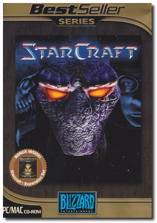
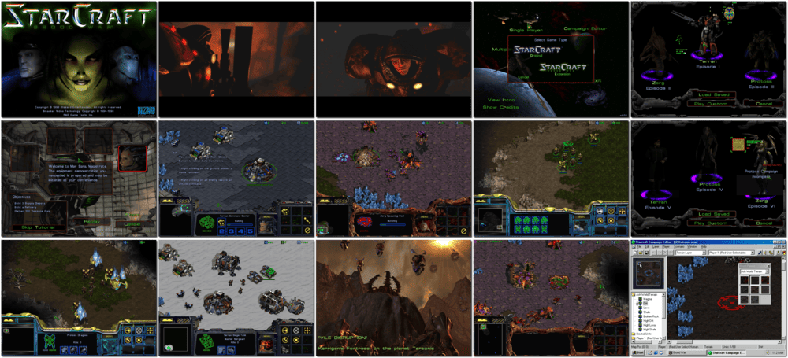

# StarCraft: Anthology

「**StarCraft: Gold**」「**StarCraft**」「**StarCraft: Brood War**」「**Add-on** (Brood War)」

> ❝ In the distant future, a small group of human exiles are fighting for survival on the galaxy's edge. A unified Terran government has maintained an uneasy peace through military strength, espionage, and deceit. But as resources and fuel run short, the Confederate nations are looking towards the rich worlds of their alien neighbours, the enigmatic Protoss. To further complicate matters, it seems that a previously unknown species, the Zerg, has entered Protoss space and is destroying everything in its path. The time for war has come. As the military leader for your species, you must gather the resources you need to train and expand your military and lead them to victory. ❞
>

📌 ┃ **Year** ‣ 1998 ┃ **Genre** ‣ Strategy ┃ **Platform** ‣ Windows 98SE ┃ **License** ‣ Freeware ┃ **Media** ‣ CD-ROM ┃ **Add-on** 

📦 ┃ **[DOSBox](https://www.dosbox.com/) ⬜ • Untested** ┃ **[DOSBox Staging](https://dosbox-staging.github.io/) ⬜ • Untested** ┃ **[DOSBox-X](https://dosbox-x.com/) 🟩** 

📎 ┃ **StarCraft** ‣ [Wikipedia](https://en.wikipedia.org/wiki/StarCraft_(video_game)) • [MobyGames](https://www.mobygames.com/game/378/starcraft/) • [MyAbandonware](https://www.myabandonware.com/game/starcraft-epy) • [Fandom](https://starcraft.fandom.com/wiki/StarCraft) ┃ **StarCraft: Brood War** ‣ [Wikipedia](https://en.wikipedia.org/wiki/StarCraft:_Brood_War) • [MobyGames](https://www.mobygames.com/game/1421/starcraft-brood-war/) • [MyAbandonware](https://www.myabandonware.com/game/starcraft-brood-war-epz) • [Fandom](https://starcraft.fandom.com/wiki/StarCraft:_Brood_War) ┃ **StarCraft: Anthology** ‣ [MobyGames](https://www.mobygames.com/game/33975/starcraft-anthology/) ┃ **[Series](https://en.wikipedia.org/wiki/StarCraft_(series))** ┃ **[Battle.net 🆓](https://us.shop.battle.net/en-us/product/starcraft)** 

## Installation Notes
- Open *My Computer* and double-click on the `D:` CD-ROM drive to start the installation.
- For StarCraft CD key, refer to this Stack Overflow article: [How are software license keys generated?](https://stackoverflow.com/questions/3002067/how-are-software-license-keys-generated)
- Use the default **drive** and **directory** for the installation location.

## Additional Notes
- Mounted CD-ROM images at launch:
  1. StarCraft
  2. StarCraft: Brood War
- Swapping CD-ROM disc when multiple images are mounted: From DOSBox-X menu **DOS > Swap CD drive**.

---

