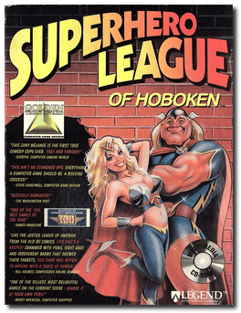
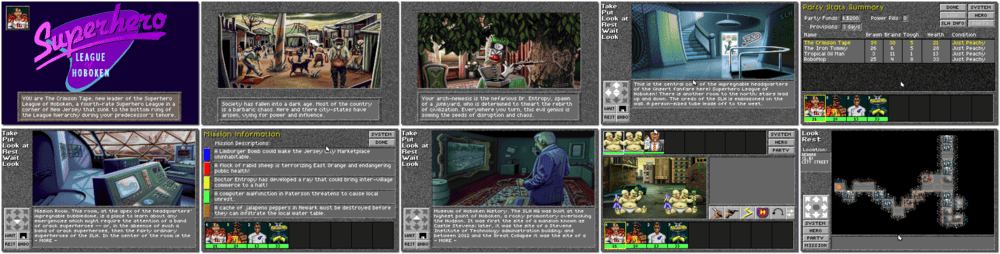

# Superhero League of Hoboken

> ❝ The United States is a nightmare land of toxic waste, melted ice caps, and desperate shortages of oat bran. Horrible mutations roam the countryside, monsters spawned by radiation, environmental toxins, and unregulated bioengineering. But in a tiny corner of New Jersey, a small group of Superheroes has banded together. Their mission is to nurture the rebirth of a new society, to ease the suffering of the dark age, and to provide a place where Superheroes can always find a date on Saturday night. ❞
>
> ❝ This game **is not abandonware 🚫** and is still for sale on [GOG 💰](https://www.gog.com/en/game/superhero_league_of_hoboken) and [Steam 💰](https://store.steampowered.com/app/1104470/Super_Hero_League_of_Hoboken/). ❞
>

📌 ┃ **Year** ‣ 1994 ┃ **Genre** ‣ Adventure • Role-playing ┃ **Platform** ‣ DOS ┃ **License** ‣ Proprietary ┃ **Media** ‣ CD-ROM 

📦 ┃ **[DOSBox](https://www.dosbox.com/) 🟩** ┃ **[DOSBox Staging](https://dosbox-staging.github.io/) 🟩** ┃ **[DOSBox-X](https://dosbox-x.com/) 🟩** 

📎 ┃ **[Wikipedia](https://en.wikipedia.org/wiki/Superhero_League_of_Hoboken)** ┃ **[MobyGames](https://www.mobygames.com/game/1559/superhero-league-of-hoboken/)** ┃ **[MyAbandonware](https://www.myabandonware.com/game/superhero-league-of-hoboken-2uv)** ┃ **[GOG 💰](https://www.gog.com/en/game/superhero_league_of_hoboken)** ┃ **[Steam 💰](https://store.steampowered.com/app/1104470/Super_Hero_League_of_Hoboken/)** 

## Installation Notes
- Use the default **drive** and **directory** for the installation location.
- Music Card: **Sound Blaster or compatible**.
- Digitized Sound: **Sound Blaster or compatible**.
- Sound Blaster IRQ: **IRQ 7**.
- Sound Blaster I/O Address: **220H**.

---

