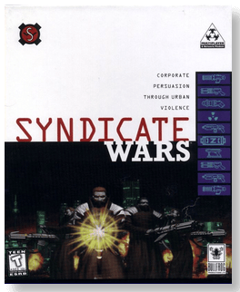
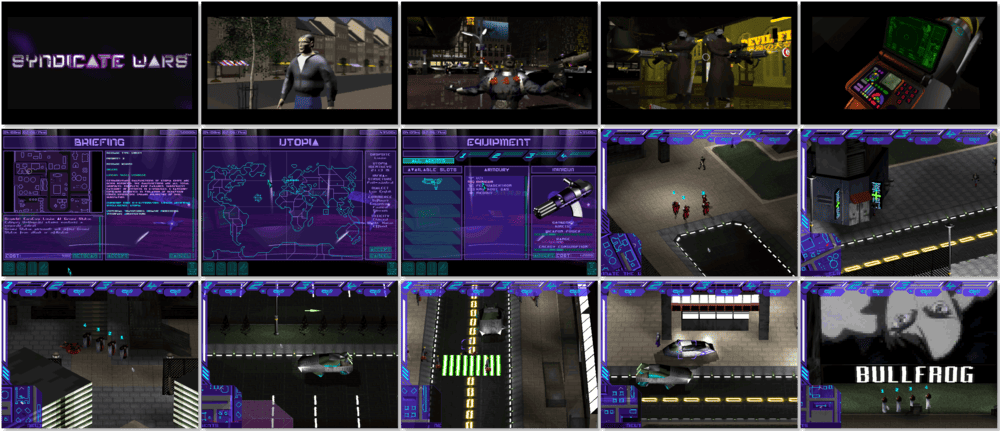

# Syndicate Wars

> ❝ Syndicate closed with the global domination of the World by The Corporation. Now, a hundred years later, they have become complacent. Things are going wrong. The chip controlled by the minds of the world's population has started to malfunction, and once again, the citizens are perceiving reality as it is - grim. A new religious cult has sprung up. They are gaining a large number of converts to their cause. While in the cities, marauding gangs of bikers are taking advantage of the disorganization of the Corporation and gaining control of whole city precincts. It is the dark and gloomy setting for Syndicate Wars. This time, you can be a Corporation executive determined to place The Corporation back in control and further his career. You can be a Church Elder or the leader of the biker gang. ❞
>
> ❝ This game **is not abandonware 🚫** and is still for sale on [GOG 💰](https://www.gog.com/en/game/syndicate_wars). ❞
>

📌 ┃ **Year** ‣ 1996 ┃ **Genre** ‣ Action • Strategy ┃ **Platform** ‣ DOS ┃ **License** ‣ Proprietary ┃ **Media** ‣ CD-ROM 

📦 ┃ **[DOSBox](https://www.dosbox.com/) 🟩** ┃ **[DOSBox Staging](https://dosbox-staging.github.io/) 🟩** ┃ **[DOSBox-X](https://dosbox-x.com/) 🟩** 

📎 ┃ **[Wikipedia](https://en.wikipedia.org/wiki/Syndicate_Wars)** ┃ **[MobyGames](https://www.mobygames.com/game/551/syndicate-wars/)** ┃ **[MyAbandonware](https://www.myabandonware.com/game/syndicate-wars-cvt)** ┃ **[Series](https://en.wikipedia.org/wiki/Syndicate_(series))** ┃ **[GOG 💰](https://www.gog.com/en/game/syndicate_wars)** 

## Installation Notes
- Click **Login**.
- Select your preferred language.
- Sound driver: **Creative Labs Sound Blaster 16 or AWE32**, select to configure automatically.
- MIDI driver: **Creative Labs Sound Blaster(TM) 16**, select to configure automatically.
- Click **Install**.
- Use the default **drive** and **directory** for the installation location.
- Click **Full Install (205MB)**.
- Click **Logout** and then **Quit**.

---

