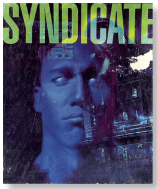
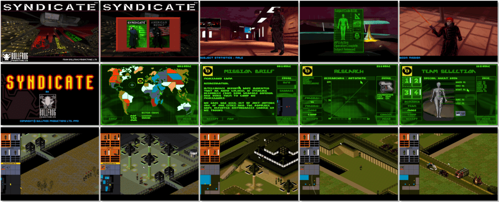

# Syndicate Plus

「**Syndicate** (Base)」「**Syndicate: American Revolt** (Add-on)」

> ❝ In 2096, a massive corporation known as Megacorps divided the world into multiple regions. In Syndicate, you are a Megacorp Marketing Director, using cybernetically altered Company Agents in a race to control the New World Order. Enter the Syndicate. Step into a dark future where 'changing your mind' takes on a new meaning. ❞
>
> ❝ This game **is not abandonware 🚫** and is still for sale on [GOG 💰](https://www.gog.com/en/game/syndicate). ❞
>

📌 ┃ **Year (Syndicate)** ‣ 1993 ┃ **Year (Syndicate: American Revolt)** ‣ 1993 ┃ **Year (Syndicate Plus)** ‣ 1994 ┃ **Genre** ‣ Action • Strategy ┃ **Platform** ‣ DOS ┃ **License** ‣ Proprietary ┃ **Media** ‣ CD-ROM ┃ **Add-on** 

📦 ┃ **[DOSBox](https://www.dosbox.com/) 🟩** ┃ **[DOSBox Staging](https://dosbox-staging.github.io/) 🟩** ┃ **[DOSBox-X](https://dosbox-x.com/) 🟩** 

📎 ┃ **Syndicate** ‣ [Wikipedia](https://en.wikipedia.org/wiki/Syndicate_(1993_video_game)) • [MobyGames](https://www.mobygames.com/game/281/syndicate/) • [MyAbandonware](https://www.myabandonware.com/game/syndicate-20t) ┃ **Syndicate: American Revolt** ‣ [Wikipedia](https://en.wikipedia.org/wiki/Syndicate:_American_Revolt) • [MobyGames](https://www.mobygames.com/game/282/syndicate-american-revolt/) • [MyAbandonware](https://www.myabandonware.com/game/syndicate-american-revolt-20s) ┃ **Syndicate Plus** ‣ [MobyGames](https://www.mobygames.com/game/6972/syndicate-plus/) • [MyAbandonware](https://www.myabandonware.com/game/syndicate-plus-310) ┃ **[Series](https://en.wikipedia.org/wiki/Syndicate_(series))** ┃ **[GOG 💰](https://www.gog.com/en/game/syndicate)** 

## Installation Notes
- Select your preferred language.
- Select **Sound On**.
- Confirm sound settings - IRQ: **7**; DMA: **1**; IO: **220**.

---

