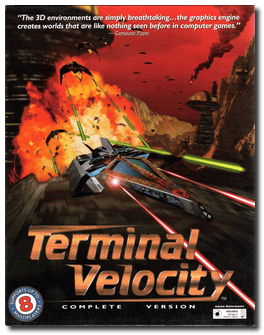
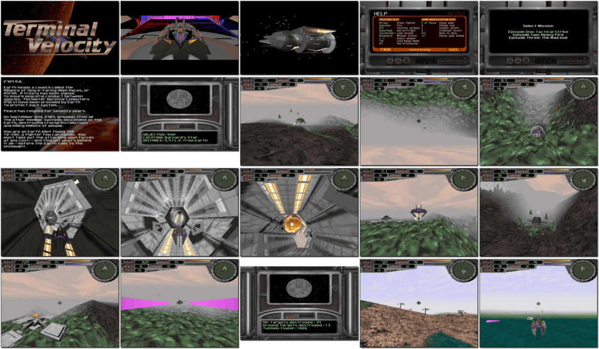

# Terminal Velocity

「**Velocity Brawl**」

> ❝ In the far future, armadas from surrounding systems have suddenly waged war on Earth, destroying critical installations and major cities. Earth is now on its knees. You are a pilot from the Ares Squadron flying the fastest, most dangerous crafts ever made. Currently, you are in the TV-202, a fighter few can handle. Given that the previous model, the TV-101, has chalked up more dead pilots than any experimental craft in history, many consider you lucky to be alive. You are in a flying coffin, outgunned and outmanned. But think how good a Saved-the-Known-Galaxy title will look on your resume. ❞
>
> ❝ This version is the original/legacy release for DOS. This game **is not abandonware 🚫** and a **Boosted Edition** release is available on [GOG 💰](https://www.gog.com/en/game/terminal_velocity_boosted_edition) and [Steam 💰](https://store.steampowered.com/app/1956430/Terminal_Velocity_Boosted_Edition/). ❞
>

📌 ┃ **Year** ‣ 1995 ┃ **Genre** ‣ Action ┃ **Platform** ‣ DOS ┃ **License** ‣ Proprietary ┃ **Media** ‣ CD-ROM 

📦 ┃ **[DOSBox](https://www.dosbox.com/) 🟩** ┃ **[DOSBox Staging](https://dosbox-staging.github.io/) 🟩** ┃ **[DOSBox-X](https://dosbox-x.com/) 🟩** 

📎 ┃ **[Wikipedia](https://en.wikipedia.org/wiki/Terminal_Velocity_(video_game))** ┃ **[MobyGames](https://www.mobygames.com/game/635/terminal-velocity/)** ┃ **[MyAbandonware](https://www.myabandonware.com/game/terminal-velocity-2s9)** ┃ **Boosted Edition** ‣ [GOG 💰](https://www.gog.com/en/game/terminal_velocity_boosted_edition) ┃ **Boosted Edition** ‣ [Steam 💰](https://store.steampowered.com/app/1956430/Terminal_Velocity_Boosted_Edition/) 

## Installation Notes
- Use the default **drive** and **directory** for the installation location.
- Main Menu ‣ **Sound Setup**.
  - Do you want to auto-detect for the presence of a SoundBlaster? (y/n). Press `Y`.
  - Sound Capabilities: **Sound Blaster 16**.
  - Are you ready to test the sound driver you have selected? (y/n). Press `Y`.
  - Did the sound play ok? (y/n). Press `Y`.
- Main Menu ‣ **Save and launch TV**.

## Additional Notes
- In-game *Sound Options* offer several adjustments to provide better-quality sound:
  - Set *Sound F/X* to **On**.
  - Set *Music* to **On**.
  - Set *Music Freq* to **22050**.
  - Set *Playback* to **Stereo**.
- In-game *Graphic Options* offer several adjustments to provide better-quality graphics:
  - Set *Sky Texture* to **On**.
  - Set *Image Quality* to **Pentium**.
  - Set *Shadows* to **Pentium**.
  - Set *Texture* to **High Detail**.
  - Set *Resolution* to **SVGA (Pentium)**.

---

