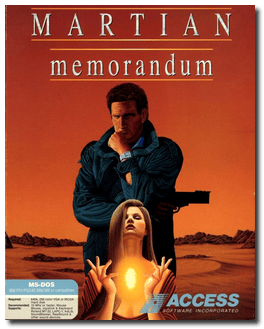
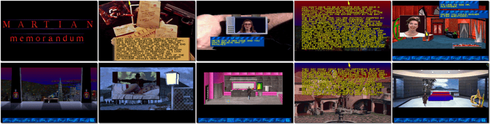

# Tex Murphy: Martian Memorandum

「**Tex Murphy 2**」「**Martian Memorandum**」

> ❝ It's 2039, six years after solving the Linsky murder case. The years have been less than kind to Tex Murphy. In post-holocaust San Francisco, he has been into constant radiation, but what's put the lines in his face are the years trying to stay afloat and recapture the glory of his first big case. While working on his first case, Tex stumbled into - and foiled - a conspiracy to dominate the world. Since then, he's been high and dry, trying to keep from being broke. Understandably, he jumps at an offer by the powerful Marshall Alexander. ❞
>
> ❝ This game **is not abandonware 🚫** and is still for sale on [Steam 💰](https://store.steampowered.com/app/302340/Tex_Murphy_Martian_Memorandum/) and [GOG 💰](https://www.gog.com/en/game/tex_murphy_1_2) (**Mean Streets + Martian Memorandum**). ❞
>

📌 ┃ **Year** ‣ 1991 ┃ **Genre** ‣ Adventure ┃ **Platform** ‣ DOS ┃ **License** ‣ Proprietary ┃ **Media** ‣ Floppy Disk 

📦 ┃ **[DOSBox](https://www.dosbox.com/) 🟩** ┃ **[DOSBox Staging](https://dosbox-staging.github.io/) 🟩** ┃ **[DOSBox-X](https://dosbox-x.com/) 🟩** 

📎 ┃ **[Wikipedia](https://en.wikipedia.org/wiki/Martian_Memorandum)** ┃ **[MobyGames](https://www.mobygames.com/game/222/martian-memorandum/)** ┃ **[MyAbandonware](https://www.myabandonware.com/game/martian-memorandum-17c)** ┃ **[Series](https://en.wikipedia.org/wiki/Tex_Murphy)** ┃ **[Steam 💰](https://store.steampowered.com/app/302340/Tex_Murphy_Martian_Memorandum/)** ┃ **Mean Streets + Martian Memorandum** ‣ [GOG 💰](https://www.gog.com/en/game/tex_murphy_1_2) 

## Additional Notes
- Select input device: Press `1` for **MOUSE**.
- Select device to play MIDI music: Press `1` for **ADLIB**.
- Select device which will play the digital sound effects and voices: Press `4` for **SOUND BLASTER**.
- Select Sound Blaster port number: Press `2` for **220H**.
- Select Sound Blaster interupt number: Press `4` for **7**.

---

