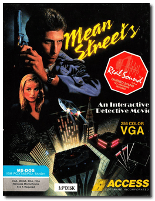
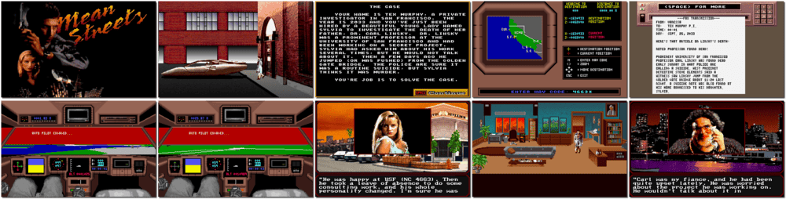

# Tex Murphy: Mean Streets

「**Tex Murphy 1**」「**Mean Streets**」

> ❝ It's the year 2033. Your name is Tex Murphy, a private investigator in San Francisco. A beautiful daughter of a university professor hired you to uncover the facts about her father's death. As the investigation begins, you expose the deaths of several prominent scientific community members. Are these deaths coincidental? Or is there something more sinister going on? And which characters could have a motive? Could it be J. Saint Gideon, the former head of British Intelligence? Could Frank Schimming, the President of the world's largest surveillance firm, be hiding something? Or what about Sylvia, the professor's daughter? Is she as innocent as she seems? And why is an infamous Detroit hitman in town? ❞
>
> ❝ This game **is not abandonware 🚫** and is still for sale on [Steam 💰](https://store.steampowered.com/app/302330/Tex_Murphy_Mean_Streets/) and [GOG 💰](https://www.gog.com/en/game/tex_murphy_1_2) (**Mean Streets + Martian Memorandum**). ❞
>

📌 ┃ **Year** ‣ 1989 ┃ **Genre** ‣ Adventure ┃ **Platform** ‣ DOS ┃ **License** ‣ Proprietary ┃ **Media** ‣ Floppy Disk ┃ **Patched** ‣ 1.4 

📦 ┃ **[DOSBox](https://www.dosbox.com/) 🟩** ┃ **[DOSBox Staging](https://dosbox-staging.github.io/) 🟩** ┃ **[DOSBox-X](https://dosbox-x.com/) 🟩** 

📎 ┃ **[Wikipedia](https://en.wikipedia.org/wiki/Mean_Streets_(video_game))** ┃ **[MobyGames](https://www.mobygames.com/game/221/mean-streets/)** ┃ **[MyAbandonware](https://www.myabandonware.com/game/mean-streets-p7)** ┃ **[Series](https://en.wikipedia.org/wiki/Tex_Murphy)** ┃ **[Steam 💰](https://store.steampowered.com/app/302330/Tex_Murphy_Mean_Streets/)** ┃ **Mean Streets + Martian Memorandum** ‣ [GOG 💰](https://www.gog.com/en/game/tex_murphy_1_2) 

## Additional Notes
- *Play MEAN STREETS*.
- Press `1` for **VGA/MCGA 320x200 256 color**.

---

