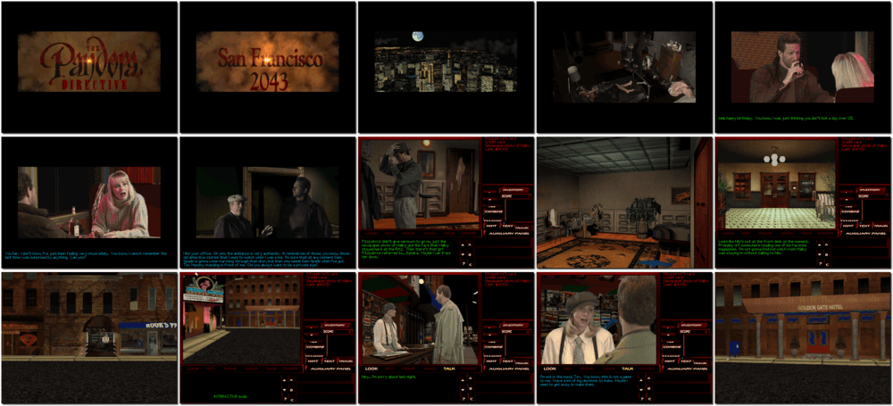

# Tex Murphy: The Pandora Directive

「**Tex Murphy 4**」「**The Pandora Directive**」「**Pandora Device**」

> ❝ The government has covered up the greatest secret of the 20th century. Tex doesn't like secrets. It's April 2043. You, Tex Murphy, the last of the old-style gumshoes – find yourself racing against time in the most dangerous game of your life. What is the truth behind the rumoured UFO crash at Roswell, New Mexico? Why did the military suddenly shut down and seal off the Roswell complex? And why the frequent references to the lost Mayan civilization? ❞
>
> ❝ This game **is not abandonware 🚫** and is still for sale on [GOG 💰](https://gog.com/en/game/tex_murphy_the_pandora_directive) and [Steam 💰](https://store.steampowered.com/app/302360/Tex_Murphy_The_Pandora_Directive/). ❞
>

📌 ┃ **Year** ‣ 1996 ┃ **Genre** ‣ Adventure ┃ **Platform** ‣ DOS ┃ **License** ‣ Proprietary ┃ **Media** ‣ CD-ROM 

📦 ┃ **[DOSBox](https://www.dosbox.com/) 🟩** ┃ **[DOSBox Staging](https://dosbox-staging.github.io/) 🟩** ┃ **[DOSBox-X](https://dosbox-x.com/) 🟩** 

📎 ┃ **[Wikipedia](https://en.wikipedia.org/wiki/The_Pandora_Directive)** ┃ **[MobyGames](https://www.mobygames.com/game/1454/the-pandora-directive/)** ┃ **[MyAbandonware](https://www.myabandonware.com/game/the-pandora-directive-crh)** ┃ **[Series](https://en.wikipedia.org/wiki/Tex_Murphy)** ┃ **[GOG 💰](https://gog.com/en/game/tex_murphy_the_pandora_directive)** ┃ **[Steam 💰](https://store.steampowered.com/app/302360/Tex_Murphy_The_Pandora_Directive/)** 

## Installation Notes
- Select **Install**.
- Use the default **drive** and **directory** for the installation location.
- Set Sound Device:
  - Digital Format: Select **Auto Detect**, and perform **Sound Test**. Select **OK**.
  - MIDI Music Format: Perform **Sound Test**. Select **OK**.
- Click **OK** to complete the installation.

## Additional Notes
- Mounted CD-ROM images at launch:
  1. The Pandora Directive #1 to Drive D:
  2. The Pandora Directive #2 to Drive E:
  3. The Pandora Directive #3 to Drive F:
  4. The Pandora Directive #4 to Drive G:
  5. The Pandora Directive #5 to Drive H:
  6. The Pandora Directive #6 to Drive I:
- The first time the game is run, select **Config**.
  - CD-ROM tab:
    - Assign Disk 1 to Drive **D:**.
    - Assign Disk 2 to Drive **E:**.
    - Assign Disk 3 to Drive **F:**.
    - Assign Disk 4 to Drive **G:**.
    - Assign Disk 5 to Drive **H:**.
    - Assign Disk 6 to Drive **I:**.
  - Preferences tab:
    - Captioning: **On**.

---

