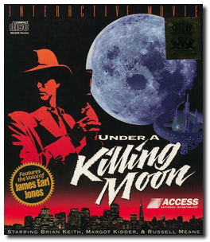
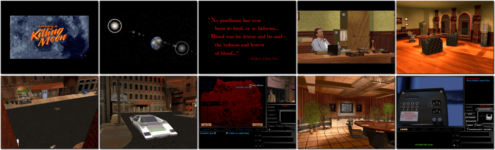

# Tex Murphy: Under a Killing Moon

「**Tex Murphy 3**」「**Under a Killing Moon**」

> ❝ As Tex Murphy, Private Investigator, you are in your seedy, 2nd-floor office in the heart of a run-down mutant part of town. You must stop the forces of evil before they destroy all mankind and rob you of your next unemployment check. ❞
>
> ❝ This game **is not abandonware 🚫** and is still for sale on [GOG 💰](https://www.gog.com/en/game/tex_murphy_under_a_killing_moon) and [Steam 💰](https://store.steampowered.com/app/302350/Tex_Murphy_Under_a_Killing_Moon/). ❞
>

📌 ┃ **Year** ‣ 1994 ┃ **Genre** ‣ Adventure ┃ **Platform** ‣ DOS ┃ **License** ‣ Proprietary ┃ **Category** ‣ 1st-person • Graphic adventure • Puzzle elements • Post-apocalyptic • Sci-fi • Detective ┃ **Media** ‣ CD-ROM ┃ **Patched** 

📦 ┃ **[DOSBox](https://www.dosbox.com/) 🟩** ┃ **[DOSBox Staging](https://dosbox-staging.github.io/) 🟩** ┃ **[DOSBox-X](https://dosbox-x.com/) 🟩** 

📎 ┃ **[Wikipedia](https://en.wikipedia.org/wiki/Under_a_Killing_Moon)** ┃ **[MobyGames](https://www.mobygames.com/game/850/under-a-killing-moon/)** ┃ **[AbandonwareDOS](https://www.abandonwaredos.com/abandonware-game.php?abandonware=Tex+Murphy%3A+Under+a+Killing+Moon&gid=2874)** ┃ **[MyAbandonware](https://www.myabandonware.com/game/under-a-killing-moon-crg)** ┃ **[Series](https://en.wikipedia.org/wiki/Tex_Murphy)** ┃ **[GOG 💰](https://www.gog.com/en/game/tex_murphy_under_a_killing_moon)** ┃ **[Steam 💰](https://store.steampowered.com/app/302350/Tex_Murphy_Under_a_Killing_Moon/)** 

## Installation Notes
- Select **Install Software**.
- Use the default **drive** and **directory** for the installation location.
- Set Sound Device:
  - Digital Format: Select **Auto Detect**, and perform **Sound Test**. Select **OK**.
  - MIDI Music Format: Perform **Sound Test**. Select **OK**.
- Configuration:
  - CD-ROM - Drive Assignment:
    - Assign Disk 1 to Drive **D:**.
    - Assign Disk 2 to Drive **E:**.
    - Assign Disk 3 to Drive **F:**.
    - Assign Disk 4 to Drive **G:**.
  - Miscellaneous - Captioning: **On**.

## Additional Notes
- Mounted CD-ROM images at launch:
  1. Under a Killing Moon Disc #1 to Drive D:
  2. Under a Killing Moon Disc #2 to Drive E:
  3. Under a Killing Moon Disc #3 to Drive F:
  4. Under a Killing Moon Disc #4 to Drive G:

