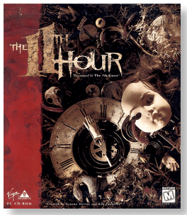
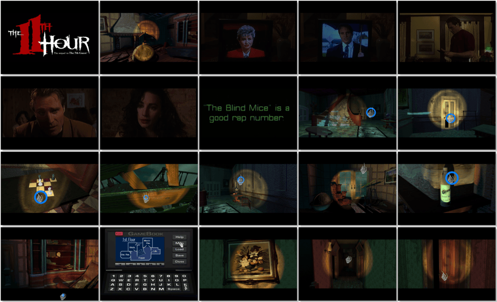

# The 11th Hour

「**The 11th Hour: The sequel to The 7th Guest**」「**11H**」

> ❝ In the 70 desolate years since the horrifying murders chronicled in The 7th Guest, the town of Harley has been ominously silent. Only when journalist Robin Morales vanishes while investigating the rotting, abandoned mansion of legendary toy maker Henry Stauf, events resurrect the malignant past. As Robin's colleague and lover, Carl Denning, you come to the ravaged estate to find her. What you uncover in its decaying chambers embroils the entire town in a deadly legacy of madness. ❞
>
> ❝ This game **is not abandonware 🚫** and is still for sale on [GOG 💰](https://www.gog.com/en/game/the_11th_hour) and [Steam 💰](https://store.steampowered.com/app/255940/The_11th_Hour/). ❞
>

📌 ┃ **Year** ‣ 1995 ┃ **Genre** ‣ Puzzle ┃ **Platform** ‣ DOS ┃ **License** ‣ Proprietary ┃ **Media** ‣ CD-ROM ┃ **Patched** ‣ 2.42 Beta (Optional) 

📦 ┃ **[DOSBox](https://www.dosbox.com/) 🟩** ┃ **[DOSBox Staging](https://dosbox-staging.github.io/) 🟩** ┃ **[DOSBox-X](https://dosbox-x.com/) 🟩** 

📎 ┃ **[Wikipedia](https://en.wikipedia.org/wiki/The_11th_Hour_(video_game))** ┃ **[MobyGames](https://www.mobygames.com/game/567/the-11th-hour/)** ┃ **[MyAbandonware](https://www.myabandonware.com/game/the-11th-hour-33f)** ┃ **[GOG 💰](https://www.gog.com/en/game/the_11th_hour)** ┃ **[Steam 💰](https://store.steampowered.com/app/255940/The_11th_Hour/)** 

## Installation Notes
- Use the default **drive** and **directory** for the installation location.
- Sound Configuration Options:
  - Select and configure MIDI music driver: **Creative Labs Sound Blaster(TM) 16** (*Attempt to configure sound driver automatically*).
  - Select and configure digital audio driver: **Creative Labs Sound Blaster 16 or AWE32** (*Attempt to configure sound driver automatically*).
- Click **Change Setup** to adjust game settings.

## Additional Notes
- Release note on the **2.42 Beta** update: *This new beta player for The 11th Hour improves performance on lower-end machines.  Because it is still beta, it is currently not supported by Virgin or Trilobyte; however, we have made this beta available because it does help to eliminate choppy audio on some systems.*
- Mounted CD-ROM images at launch:
  1. The 11th Hour Disc #1
  2. The 11th Hour Disc #2
  3. The 11th Hour Disc #3
  4. The 11th Hour Disc #4

### How to swap CD-ROM images?
- [DOSBox](https://www.dosbox.com/wiki/DOSBox_FAQ#Swapping_CD_images) — Hotkey: CTRL+F4
- [DOSBox Staging](https://github.com/dosbox-staging/dosbox-staging/blob/main/README) — Hotkey: CTRL+F4 (or CMD+F4 on macOS)
- [DOSBox-X](https://dosbox-x.com/wiki/Guide%3AManaging-image-files-in-DOSBox%E2%80%90X#_mounting_multiple_cd_or_dvd_images) — Hotkey: F11+CTRL+C (or F12+D on macOS). Menu: DOS > Swap CD drive.

---

