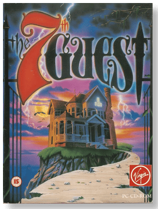
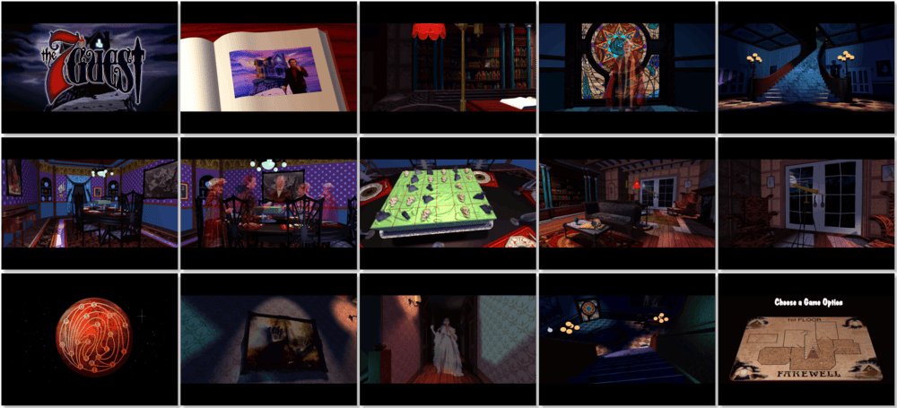

# The 7th Guest

「**T7G**」

> ❝ The mansion of the master Toy Maker, Henry Stauf, has been abandoned for as long as anyone can remember, rotting ever since the children started dying, ever since the six guests came. There are only the eerie lights. The terrifying screams. The unearthly wailing. Now, there is only you. As you move from room to haunted room, scenes from that night of horror come to life. There was another guest. Stauf's game is not over. Only you can end the nightmare and discover the secret of The Seventh Guest. ❞
>
> ❝ This game **is not abandonware 🚫** and is still for sale on [GOG 💰](https://www.gog.com/en/game/the_7th_guest_25th_anniversary_edition) and [Steam 💰](https://store.steampowered.com/app/255920/The_7th_Guest/). ❞
>

📌 ┃ **Year** ‣ 1993 ┃ **Genre** ‣ Puzzle ┃ **Platform** ‣ DOS ┃ **License** ‣ Proprietary ┃ **Media** ‣ CD-ROM ┃ **Patched** ‣ 1.30 

📦 ┃ **[DOSBox](https://www.dosbox.com/) 🟩** ┃ **[DOSBox Staging](https://dosbox-staging.github.io/) 🟩** ┃ **[DOSBox-X](https://dosbox-x.com/) 🟩** 

📎 ┃ **[Wikipedia](https://en.wikipedia.org/wiki/The_7th_Guest)** ┃ **[MobyGames](https://www.mobygames.com/game/283/the-7th-guest/)** ┃ **[MyAbandonware](https://www.myabandonware.com/game/the-7th-guest-335)** ┃ **[GOG 💰](https://www.gog.com/en/game/the_7th_guest_25th_anniversary_edition)** ┃ **[Steam 💰](https://store.steampowered.com/app/255920/The_7th_Guest/)** 

## Installation Notes
- Select **1. INSTALL**.
- Use the default **drive** and **directory** for the installation location.
- Please select Video Mode: **SVGA 486 based machines**.
- Select **Accept these settings**.

---

