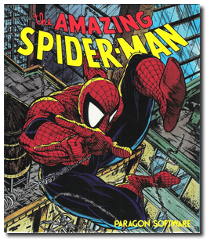
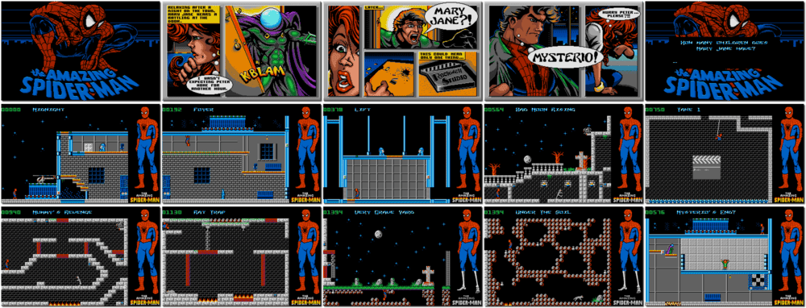

# The Amazing Spider-Man

> ❝ The evil Mysterio is a master of illusions and Hollywood special effects. When he lures Spider-Man into a movie studio to rescue Mary Jane Parker, he has Spider-Man right where he wants him! Spider-Man is fighting on Mysterio’s turf — six movie sets packed with robots, electrified floors, doors that aren’t there and walls coated with a chemical that keeps Spidey’s webs from sticking! Mysterio has even turned gravity upside-down and sideways in some of his scenes! ❞
>

📌 ┃ Year: **1990** ┃ Genre: **Action** ┃ Platform: **DOS** ┃ License: **Abandonware** ┃ Category: **Side view • Platform** ┃ Media: **Floppy Disk** ┃ **Copy Protection** 

📦 ┃ **[DOSBox](https://www.dosbox.com/) 🟩** ┃ **[DOSBox Staging](https://dosbox-staging.github.io/) 🟩** ┃ **[DOSBox-X](https://dosbox-x.com/) 🟩** 

📎 ┃ **[Wikipedia](https://en.wikipedia.org/wiki/The_Amazing_Spider-Man_(1990_video_game))** ┃ **[MobyGames](https://www.mobygames.com/game/471/the-amazing-spider-man/)** ┃ **[AbandonwareDOS](https://www.abandonwaredos.com/abandonware-game.php?abandonware=The+Amazing+Spider-Man&gid=1713)** ┃ **[MyAbandonware](https://www.myabandonware.com/game/the-amazing-spider-man-l5)** 

## Installation Notes
- Select Video Mode: **1) VGA 16 color**.

## Additional Notes
- Consult `Assets/manual.pdf` for the game copy protection.

