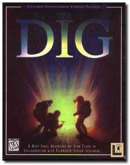
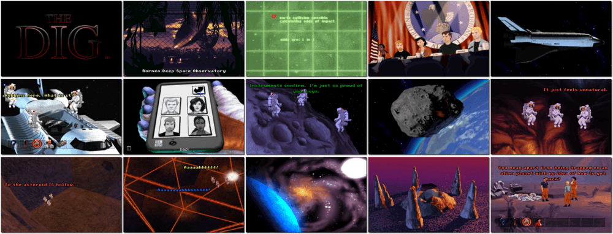

# The Dig

> ❝ An asteroid the size of a small moon is on a crash course toward Earth, and only NASA veteran Boston Low has the expertise to stop it. Along for the ride are award-winning journalist Maggie Robbins and internationally renowned geologist Ludger Brink. Once the wayward asteroid is in a safe orbit, they examine the asteroid's rocky surface. What they uncover is anything but routine. Low, Brink, and Robbins unwittingly trigger a mechanism that transforms the asteroid into a crystal-like spacecraft. The spacecraft transported them across the galaxy to a desolate planet, Cocytus, after the 9th circle of Hell in Dante's Inferno. The bleak landscape was once home to a highly evolved civilization, with remnants of sophisticated architecture, advanced technology and an intricate network of underground tunnels. But no Cocytans. Who were the original inhabitants of this once rich-empire-turned-wasteland? What are those apparitions that mysteriously appear from time to time? Why have Low, Robbins and Brink been brought to this place? And how can Low keep his team from unravelling in the face of such uncertainty? To return to Earth, they must dig for answers on the planet's surface and deep within themselves. ❞
>
> ❝ This game **is not abandonware 🚫** and is still for sale on [GOG 💰](https://www.gog.com/en/game/the_dig) and [Steam 💰](https://store.steampowered.com/app/6040/The_Dig/). ❞
>

📌 ┃ **Year** ‣ 1995 ┃ **Genre** ‣ Adventure ┃ **Platform** ‣ DOS ┃ **License** ‣ Proprietary ┃ **Media** ‣ CD-ROM 

📦 ┃ **[DOSBox](https://www.dosbox.com/) 🟩** ┃ **[DOSBox Staging](https://dosbox-staging.github.io/) 🟩** ┃ **[DOSBox-X](https://dosbox-x.com/) 🟩** 

📎 ┃ **[Wikipedia](https://en.wikipedia.org/wiki/The_Dig_(video_game))** ┃ **[MobyGames](https://www.mobygames.com/game/354/the-dig/)** ┃ **[MyAbandonware](https://www.myabandonware.com/game/the-dig-2ut)** ┃ **[GOG 💰](https://www.gog.com/en/game/the_dig)** ┃ **[Steam 💰](https://store.steampowered.com/app/6040/The_Dig/)** 

## Additional Notes
- Select **Configure Sound Card** before starting the game the first time.
- Press `E` for an Express Setup. Test the sound devices.
- Select **Play The Dig** to start the game.

---

