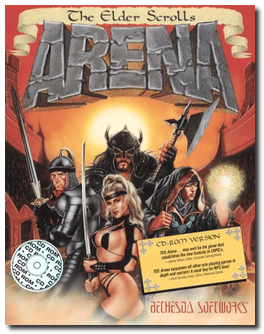
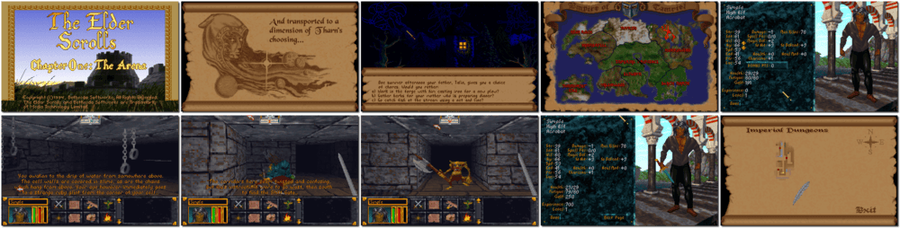

# The Elder Scrolls: Arena

「**The Elder Scrolls: Chapter One - Arena**」「**Arena** (Short Name)」

> ❝ Emperor Uriel Septim VII is betrayed by Imperial Battlemage Jagar Tharn and imprisoned in another realm. You alone are left to travel the vast continent of Tamriel in search of the legendary Staff of Chaos that will allow you to rescue the true Emperor and restore peace to the Third Empire. ❞
>
> ❝ In 2004, a downloadable version of the game was made available free of charge as part of the tenth anniversary of the series. ❞ — *Wikipedia*
>

📌 ┃ **Year** ‣ 1994 ┃ **Genre** ‣ Role-playing ┃ **Platform** ‣ DOS ┃ **License** ‣ Freeware ┃ **Media** ‣ CD-ROM ([version 1.07](https://en.uesp.net/wiki/Arena:Patch#Version_1.07)) 

📦 ┃ **[DOSBox](https://www.dosbox.com/) 🟩** ┃ **[DOSBox Staging](https://dosbox-staging.github.io/) 🟩** ┃ **[DOSBox-X](https://dosbox-x.com/) 🟩** 

📎 ┃ **[Wikipedia](https://en.wikipedia.org/wiki/The_Elder_Scrolls:_Arena)** ┃ **[MobyGames](https://www.mobygames.com/game/803/the-elder-scrolls-arena/)** ┃ **[MyAbandonware](https://www.myabandonware.com/game/the-elder-scrolls-arena-1tn)** ┃ **[Series](https://en.wikipedia.org/wiki/The_Elder_Scrolls)** ┃ **[Steam 🆓](https://store.steampowered.com/app/1812290/The_Elder_Scrolls_Arena/)** ┃ **[Bethesda](https://elderscrolls.bethesda.net/en/arena)** ┃ **[Unofficial Elder Scrolls Pages](https://en.uesp.net/wiki/Arena:Arena)** 

## Installation Notes
- Use the default **drive** and **directory** for the installation location.
- Configure game:
  - Select Sound Card: **Sound Blaster Pro or 16**.
  - Select Music Card: **General MIDI or MPU-401**.

---

